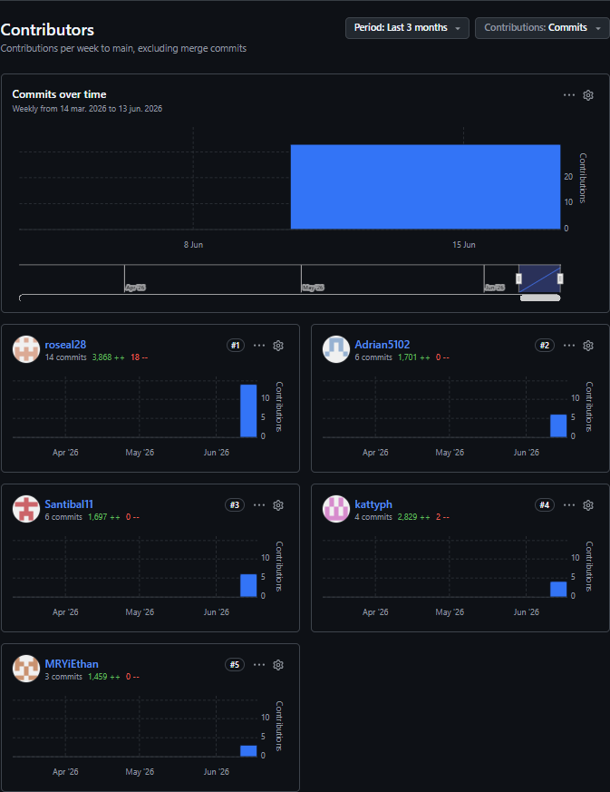

# UNIVERSIDAD PERUANA DE CIENCIAS APLICADAS

***Ingeniería de Software***

**Curso:** 1ASI0729 | Desarrollo de Aplicaciones en Open Source  
**NRC:** 11863  
**Ciclo:** 5  
**Docente:** Ivan Robles Fernández  

## **"Informe de trabajo: TB1"**

### ***Startup:*** Minex

### ***Producto:*** OpalTrace

***Relación de integrantes:***

| INTEGRANTES | CÓDIGO |
| :---: | :---: |
| Armestar Felipa, Adiran Andres | U202410084 |
| Baldeon Vivar, Santiago Armando | U202319881 |
| Philco Mota, Katty Yolanda | U202416107 |
| Vergaray Calderon, Rose Almendra | U20241D159 |
| Yi Torrejon, Ethan Raul | U202313434 |

Junio, 2026

## REGISTRO DE VERSIONES DEL INFORME

| Versión | Fecha | Autor | Descripción de modificación |
| :---: | :---: | :---: | :--- |
| 0.1.0 | 23/04/2026 | Rose Vergaray| Commit inicial del informe; estructura base del repositorio, organización de carpetas y capítulos principales (`develop`) |
| 0.2.0 | 23/04/2026 | Ethan Yi | Creación de la rama `feature/chapter-3-requirements-specification` e incorporación del Capítulo III: Requirements Specification, User Stories e Impact Mapping |
| 0.3.0 | 23/04/2026 | Santiago Baldeon | Desarrollo del análisis de competidores, Big Picture EventStorming y contextualización del dominio (`feature/chapter-ii-competitors`, `feature/chapter-ii-big-picture-event-storming`) |
| 0.4.0 | 23/04/2026 | Rose Vergaray | Integración de avances de Product Design, Information Architecture  (`feature/chapter-iv-product-desing`) |
| 0.5.0 | 23/04/2026 | Adrián Armestar | Creación de la rama `feature/chapter-iv-class-diagrams` e incorporación de diagramas de clase y modelado orientado a objetos |
| 0.6.0 | 23/04/2026 | Ethan Yi | Inserción de datos en la base de datos (`feature/chapter-iv-diagrams`) |
| 0.7.0 | 23/04/2026 | Santiago Baldeon | Incorporación de anexos y consolidación de capítulos para la entrega del AV1 (`develop`) |
| 1.0.0 | 23/04/2026 | Armestar Felipa, Adrian Andres Baldeon Vivar, Santiago Armando Philco Mota, Katty Yolanda Vergaray Calderon, Rose Almendra Yi Torrejon, Ethan Raul | Se agregó:  Capitulo I Capitulo II Capitulo III Capitulo IV Capitulo V 5.2.1. Sprint 1 |
| 1.8.0 | 10/05/2026 | Katty Philco | Actualización de diagramas C4 aplicando bounded contexts y mejoras en la arquitectura del sistema (`feature/chapter-iv-diagrams`) y la incorporación de insights y mejoras en el Capítulo II (`develop`) |
| 1.9.0 | 12/05/2026 | Armestar Felipa, Adrian Andres Philco Mota, Katty Yolanda | Actualización de diagramas de clases y base de datos para el refinamiento del modelo orientado al dominio (`feature/chapter-iv-diagrams`) |
| 2.0.0 | 12/05/2026 | Armestar Felipa, Adrian Andres Baldeon Vivar, Santiago Armando Philco Mota, Katty Yolanda Vergaray Calderon, Rose Almendra Yi Torrejon, Ethan Raul | Capitulo V 5.2.2. Sprint 2 5.2.2. Sprint 2  5.2.2.1. Sprint Planning 2.  5.2.2.2. Aspect Leaders and Collaborators.  5.2.2.3. Sprint Backlog 2.  5.2.2.4. Development Evidence for Sprint Review.  5.2.2.5. Execution Evidence for Sprint Review.  5.2.2.6. Services Documentation Evidence for Sprint Review.  5.2.2.7. Software Deployment Evidence for Sprint Review.  5.2.2.8. Team Collaboration Insights during Sprint. |
| 3.0.0 | 18/06/2026 | Armestar Felipa, Adrian Andres Baldeon Vivar, Santiago Armando Philco Mota, Katty Yolanda Vergaray Calderon, Rose Almendra Yi Torrejon, Ethan Raul | Capitulo V 5.2.3. Sprint 3 5.2.3.1. Sprint Planning 3.  5.2.3.2. Aspect Leaders and Collaborators.  5.2.3.3. Sprint Backlog 3.  5.2.3.4. Development Evidence for Sprint Review.  5.2.3.5. Execution Evidence for Sprint Review.  5.2.3.6. Services Documentation Evidence for Sprint Review.  5.2.3.7. Software Deployment Evidence for Sprint Review.  5.2.3.8. Team Collaboration Insights during Sprint. 5.3. Validation Interviews 5.3.1. Diseño de Entrevistas 5.3.2. Registro de Entrevistas 5.3.3. Evaluaciones según heurísticas 5.4. Video About-the-Product |

## PROJECT REPORT COLLABORATION INSIGHTS

El repositorio del Project Report se encuentra disponible en la organización de GitHub del equipo en la siguiente URL: 

[Repositorio Reporte](https://github.com/upc-pre-202610-1asi0729-11863-minex/OpalTrace-report)

[Repositorio WebApp](https://github.com/upc-pre-202610-1asi0729-11863-minex/OpalTrace-webapp)

[Repositorio Platform](https://github.com/upc-pre-202610-1asi0729-11863-minex/OpalTrace-platform)

Durante el Sprint, la redacción del informe se realizó de manera conjunta por todo el equipo. La organización del trabajo consistió en asignar capítulos y secciones a cada integrante, quienes incorporaron sus contribuciones mediante commits en subramas que luego se integraron en la rama develop del repositorio. Este enfoque permitió conservar un registro ordenado de las modificaciones y asegurar la trazabilidad de cada aporte.

## CONTENIDO

[REGISTRO DE VERSIONES DEL INFORME](#registro-de-versiones-del-informe)

[PROJECT REPORT COLLABORATION INSIGHTS](#project-report-collaboration-insights)

[STUDENT OUTCOME](./report/01-student-outcome.md#student-outcome)

[CAPÍTULO I: INTRODUCCIÓN](./report/11-chapter1-introduction.md#capítulo-i-introducción)

- [1.1. Startup Profile](./report/11-chapter1-introduction.md#11-startup-profile)

  - [1.1.1. Descripción del Startup](./report/11-chapter1-introduction.md#111-descripción-del-startup)

  - [1.1.2. Perfiles de integrantes del equipo](./report/11-chapter1-introduction.md#112-perfiles-de-integrantes-del-equipo)

- [1.2. Solution Profile](./report/11-chapter1-introduction.md#12-solution-profile)

  - [1.2.1.  Antecedentes y problemática](./report/11-chapter1-introduction.md#121-antecedentes-y-problemática)

  - [1.2.2. Lean UX Process](./report/11-chapter1-introduction.md#122-lean-ux-process)

    - [1.2.2.1. Lean UX Problem Statements](./report/11-chapter1-introduction.md#1221-lean-ux-problem-statements)

    - [1.2.2.2. Lean UX Assumptions](./report/11-chapter1-introduction.md#1222-lean-ux-assumptions)

    - [1.2.2.3. Lean UX Hypothesis Statements](./report/11-chapter1-introduction.md#1223-lean-ux-hypothesis-statements)

    - [1.2.2.4. Lean UX Canvas](./report/11-chapter1-introduction.md#1224-lean-ux-canvas)

- [1.3. Segmentos Objetivo](./report/11-chapter1-introduction.md#13-segmentos-objetivo)

[CAPÍTULO II: REQUIREMENTS ELICITATION & ANALYSIS](./report/12-chapter2-requirements-elicitation.md#capítulo-ii-requirements-elicitation--analysis)

- [2.1. Competidores](./report/12-chapter2-requirements-elicitation.md#21-competidores)

  - [2.1.1. Análisis competitivo](./report/12-chapter2-requirements-elicitation.md#211-análisis-competitivo)

  - [2.1.2. Estrategias y tácticas frente a competidores](./report/12-chapter2-requirements-elicitation.md#212-estrategias-y-tácticas-frente-a-competidores)

- [2.2. Entrevistas](./report/12-chapter2-requirements-elicitation.md#22-entrevistas)

  - [2.2.1. Diseño de entrevistas](./report/12-chapter2-requirements-elicitation.md#221-diseño-de-entrevistas)

  - [2.2.2. Registro de entrevistas](./report/12-chapter2-requirements-elicitation.md#222-registro-de-entrevistas)

  - [2.2.3. Análisis de entrevistas](./report/12-chapter2-requirements-elicitation.md#223-análisis-de-entrevistas)

- [2.3. Needfinding](./report/12-chapter2-requirements-elicitation.md#23-needfinding)

  - [2.3.1. User Personas](./report/12-chapter2-requirements-elicitation.md#231-user-personas)

  - [2.3.2. User Task Matrix](./report/12-chapter2-requirements-elicitation.md#232-user-task-matrix)

  - [2.3.3. User Journey Mapping](./report/12-chapter2-requirements-elicitation.md#233-user-journey-mapping)

  - [2.3.4. Empathy Mapping](./report/12-chapter2-requirements-elicitation.md#234-empathy-mapping)

- [2.4. Big Picture EventStorming](./report/12-chapter2-requirements-elicitation.md#24-big-picture-eventstorming)

- [2.5. Ubiquitous Language](./report/12-chapter2-requirements-elicitation.md#25-ubiquitous-language)

[CAPÍTULO III: REQUIREMENTS SPECIFICATION](./report/13-chapter3-requirements-specification.md#capítulo-iii-requirements-specification)

- [3.1. User Stories](./report/13-chapter3-requirements-specification.md#31-user-stories)

- [3.2. Impact Mapping](./report/13-chapter3-requirements-specification.md#32-impact-mapping)

- [3.3. Product Backlog](./report/13-chapter3-requirements-specification.md#33-product-backlog)

[CAPÍTULO IV: PRODUCT DESIGN](./report/14-chapter4-product-design.md#capítulo-iv-product-design)

- [4.1. Style Guidelines](./report/14-chapter4-product-design.md#41-style-guidelines)

  - [4.1.1. General Style Guidelines](./report/14-chapter4-product-design.md#411-general-style-guidelines)

  - [4.1.2. Web Style Guidelines](./report/14-chapter4-product-design.md#412-web-style-guidelines)

- [4.2. Information Architecture](./report/14-chapter4-product-design.md#42-information-architecture)

  - [4.2.1. Organization Systems](./report/14-chapter4-product-design.md#421-organization-systems)

  - [4.2.2. Labeling Systems](./report/14-chapter4-product-design.md#422-labeling-systems)

  - [4.2.3. SEO Tags and Meta Tags](./report/14-chapter4-product-design.md#423-seo-tags-and-meta-tags)

  - [4.2.4. Searching Systems](./report/14-chapter4-product-design.md#424-searching-systems)

  - [4.2.5. Navigation Systems](./report/14-chapter4-product-design.md#425-navigation-systems)

- [4.3. Landing Page UI Design](./report/14-chapter4-product-design.md#43-landing-page-ui-design)

  - [4.3.1. Landing Page Wireframe](./report/14-chapter4-product-design.md#431-landing-page-wireframe)

  - [4.3.2. Landing Page Mock-up](./report/14-chapter4-product-design.md#432-landing-page-mock-up)

- [4.4. Web Applications UX/UI Design](./report/14-chapter4-product-design.md#44-web-applications-uxui-design)

  - [4.4.1. Web Applications Wireframes](./report/14-chapter4-product-design.md#441-web-applications-wireframes)

  - [4.4.2. Web Applications Wireflow Diagrams](./report/14-chapter4-product-design.md#442-web-applications-wireflow-diagrams)

  - [4.4.2. Web Applications Mock-ups](./report/14-chapter4-product-design.md#442-web-applications-mock-ups)

  - [4.4.3. Web Applications User Flow Diagrams](./report/14-chapter4-product-design.md#443-web-applications-user-flow-diagrams)

- [4.5. Web Applications Prototyping](./report/14-chapter4-product-design.md#45-web-applications-prototyping)

- [4.6. Domain-Driven Software Architecture](./report/14-chapter4-product-design.md#46-domain-driven-software-architecture)

  - [4.6.1. Design-Level EventStorming](./report/14-chapter4-product-design.md#461-design-level-eventstorming)

  - [4.6.2. Software Architecture Context Diagram](./report/14-chapter4-product-design.md#462-software-architecture-context-diagram)

  - [4.6.3. Software Architecture Container Diagrams](./report/14-chapter4-product-design.md#463-software-architecture-container-diagrams)

  - [4.6.4. Software Architecture Components Diagrams](./report/14-chapter4-product-design.md#464-software-architecture-components-diagrams)

- [4.7. Software Object-Oriented Design](./report/14-chapter4-product-design.md#47-software-object-oriented-design)

  - [4.7.1. Class Diagrams](./report/14-chapter4-product-design.md#471-class-diagrams)

- [4.8. Database Design](./report/14-chapter4-product-design.md#48-database-design)
  
  - [4.8.1. Database Diagrams](./report/14-chapter4-product-design.md#481-database-diagrams)

[CAPÍTULO V: PRODUCT IMPLEMENTATION, VALIDATION & DEPLOYMENT](./report/15-chapter5-product-implementation.md#capítulo-v-product-implementation-validation--deployment)

- [5.1. Software Configuration Management](./report/15-chapter5-product-implementation.md#51-software-configuration-management)

  - [5.1.1. Software Development Environment Configuration](./report/15-chapter5-product-implementation.md#511-software-development-environment-configuration)

  - [5.1.2. Source Code Management](./report/15-chapter5-product-implementation.md#512-source-code-management)

  - [5.1.3. Source Code Style Guide & Conventions](./report/15-chapter5-product-implementation.md#513-source-code-style-guide--conventions)

  - [5.1.4. Software Deployment Configuration](./report/15-chapter5-product-implementation.md#514-software-deployment-configuration)

- [5.2. Landing Page, Services & Applications Implementation](./report/15-chapter5-product-implementation.md#52-landing-page-services--applications-implementation)

  - [5.2.1. Sprint 1](./report/15-chapter5-product-implementation.md#521-sprint-1)

    - [5.2.1.1. Sprint Planning 1](./report/15-chapter5-product-implementation.md#5211-sprint-planning-1)

    - [5.2.1.2. Aspect Leaders and Collaborators](./report/15-chapter5-product-implementation.md#5212-aspect-leaders-and-collaborators)

    - [5.2.1.3. Sprint Backlog 1](./report/15-chapter5-product-implementation.md#5213-sprint-backlog-1)

    - [5.2.1.4. Development Evidence for Sprint Review](./report/15-chapter5-product-implementation.md#5214-development-evidence-for-sprint-review)

    - [5.2.1.5. Execution Evidence for Sprint Review](./report/15-chapter5-product-implementation.md#5215-execution-evidence-for-sprint-review)

    - [5.2.1.6. Services Documentation Evidence for Sprint Review](./report/15-chapter5-product-implementation.md#5216-services-documentation-evidence-for-sprint-review)

    - [5.2.1.7. Software Deployment Evidence for Sprint Review](./report/15-chapter5-product-implementation.md#5217-software-deployment-evidence-for-sprint-review)

    - [5.2.1.8. Team Collaboration Insights during Sprint](./report/15-chapter5-product-implementation.md#5218-team-collaboration-insights-during-sprint)

  - [5.2.2. Sprint 2](./report/15-chapter5-product-implementation.md#522-sprint-2)

    - [5.2.2.1. Sprint Planning 2](./report/15-chapter5-product-implementation.md#5221-sprint-planning-2)

    - [5.2.2.2. Aspect Leaders and Collaborators](./report/15-chapter5-product-implementation.md#5222-aspect-leaders-and-collaborators)

    - [5.2.2.3. Sprint Backlog 1](./report/15-chapter5-product-implementation.md#5223-sprint-backlog-2)

    - [5.2.2.4. Development Evidence for Sprint Review](./report/15-chapter5-product-implementation.md#5214-development-evidence-for-sprint-review)

    - [5.2.2.5. Execution Evidence for Sprint Review](./report/15-chapter5-product-implementation.md#5225-execution-evidence-for-sprint-review)

    - [5.2.2.6. Services Documentation Evidence for Sprint Review](./report/15-chapter5-product-implementation.md#5226-services-documentation-evidence-for-sprint-review)

    - [5.2.2.7. Software Deployment Evidence for Sprint Review](./report/15-chapter5-product-implementation.md#5227-software-deployment-evidence-for-sprint-review)

    - [5.2.2.8. Team Collaboration Insights during Sprint](./report/15-chapter5-product-implementation.md#5228-team-collaboration-insights-during-sprint)

  - [5.2.3. Sprint 3](./report/15-chapter5-product-implementation.md#523-sprint-3)

    - [5.2.3.1. Sprint Planning 3](./report/15-chapter5-product-implementation.md#5231-sprint-planning-3)

    - [5.2.3.2. Aspect Leaders and Collaborators](./report/15-chapter5-product-implementation.md#5232-aspect-leaders-and-collaborators)

    - [5.2.3.3. Sprint Backlog 1](./report/15-chapter5-product-implementation.md#5233-sprint-backlog-3)

    - [5.2.3.4. Development Evidence for Sprint Review](./report/15-chapter5-product-implementation.md#5234-development-evidence-for-sprint-review)

    - [5.2.3.5. Execution Evidence for Sprint Review](./report/15-chapter5-product-implementation.md#5235-execution-evidence-for-sprint-review)

    - [5.2.3.6. Services Documentation Evidence for Sprint Review](./report/15-chapter5-product-implementation.md#5236-services-documentation-evidence-for-sprint-review)

    - [5.2.3.7. Software Deployment Evidence for Sprint Review](./report/15-chapter5-product-implementation.md#5237-software-deployment-evidence-for-sprint-review)

    - [5.2.3.8. Team Collaboration Insights during Sprint](./report/15-chapter5-product-implementation.md#5238-team-collaboration-insights-during-sprint)

- [5.3. Validation Interviews](./report/15-chapter5-product-implementation.md#53-validation-interviews)

  - [5.3.1. Diseño de Entrevistas](./report/15-chapter5-product-implementation.md#531-diseño-de-entrevistas)

  - [5.3.2. Registro de Entrevistas](./report/15-chapter5-product-implementation.md#532-registro-de-entrevistas)

  - [5.3.3. Evaluaciones según heurísticas](./report/15-chapter5-product-implementation.md#533-evaluaciones-según-heurísticas)

- [5.4. Video About-the-Product](./report/15-chapter5-product-implementation.md#54-video-about-the-product)

[CONCLUSIONES](./report/18-conclusiones)

[BIBLOGRAFÍA](./report/19-biblografia)

[ANEXOS](./report/20-anexos)

