# CAPÍTULO II: REQUIREMENTS ELICITATION & ANALYSIS

## 2.1. Competidores

### 2.1.1. Análisis competitivo

A continuación, se realiza un análisis competitivo para identificar las fortalezas, debilidades, oportunidades y amenazas de la solución propuesta frente a plataformas existentes en el mercado de trazabilidad, logística e IoT aplicado a supply chain y minería. Este análisis permitirá validar la propuesta de valor, detectar espacios de diferenciación y definir estrategias sostenibles de posicionamiento.

<table>
  <thead>
    <tr>
      <th colspan="7"><b>Competitive Analysis Landscape</b></th>
    </tr>
  </thead>
  <tbody>
    <tr>
      <td colspan="2" align="center">¿Por qué llevar a cabo este análisis?</td>
      <td colspan="5" align="center">
        Identificar las fortalezas, debilidades, oportunidades y amenazas de nuestra plataforma de trazabilidad de minerales basada en IoT + Web + IA frente a competidores del sector, con el fin de validar nuestra propuesta de valor, optimizar el posicionamiento y construir una ventaja competitiva sostenible en el mercado.
      </td>
    </tr>
    <tr>
      <td colspan="2">PERFIL</td>
      <td align="center"><b>MineHub</b></td>
      <td align="center"><b>Everledger</b></td>
      <td align="center"><b>IBM Blockchain</b></td>
      <td align="center"><b>SAP Logistics</b></td>
      <td align="center"><b>Nuestra solución: OpalTrace</b></td>
    </tr>
    <tr>
      <td rowspan="2">Perfil</td>
      <td>Overview</td>
      <td>Plataforma blockchain para trazabilidad en supply chain minera.</td>
      <td>Plataforma de trazabilidad para activos de alto valor basada en blockchain.</td>
      <td>Soluciones empresariales de trazabilidad con blockchain.</td>
      <td>Software de gestión logística empresarial integrado.</td>
      <td>Plataforma Web para trazabilidad minera end-to-end.</td>
    </tr>
    <tr>
      <td>Ventaja Competitiva</td>
      <td>Transparencia en transacciones mineras.</td>
      <td>Alta confianza en certificación de autenticidad.</td>
      <td>Infraestructura robusta y escalable.</td>
      <td>Integración con sistemas ERP empresariales.</td>
      <td>Integración IoT y QR para trazabilidad en tiempo real con enfoque social.</td>
    </tr>
    <tr>
      <td rowspan="2">Perfil de Marketing</td>
      <td>Mercado objetivo</td>
      <td>Empresas mineras globales.</td>
      <td>Industria de lujo y metales preciosos.</td>
      <td>Grandes corporaciones.</td>
      <td>Empresas logísticas y manufactureras.</td>
      <td>Mineras, joyerías, empresas y consumidores finales.</td>
    </tr>
    <tr>
      <td>Estrategias de Marketing</td>
      <td>Alianzas industriales.</td>
      <td>Branding en sostenibilidad.</td>
      <td>Ventas enterprise B2B.</td>
      <td>Canales corporativos.</td>
      <td>Educación en consumo responsable, pilotos y alianzas.</td>
    </tr>
    <tr>
      <td rowspan="3">Perfil del Producto</td>
      <td>Productos & Servicios</td>
      <td>Plataforma blockchain para minería.</td>
      <td>Certificación digital de activos.</td>
      <td>Soluciones blockchain + cloud.</td>
      <td>Software logístico integrado.</td>
      <td>Tracking IoT, dashboards web, validación con IA y QR.</td>
    </tr>
    <tr>
      <td>Precios & Costos</td>
      <td>No público.</td>
      <td>Licencias empresariales.</td>
      <td>Alto costo enterprise.</td>
      <td>Licencias y suscripción.</td>
      <td>Modelo SaaS escalable.</td>
    </tr>
    <tr>
      <td>Canales de Distribución</td>
      <td>Web, API.</td>
      <td>Web.</td>
      <td>Cloud, API.</td>
      <td>Software empresarial.</td>
      <td>Web.</td>
    </tr>
    <tr>
      <td rowspan="4">Análisis SWOT</td>
      <td>Fortalezas</td>
      <td>Especialización en minería, transparencia en transacciones.</td>
      <td>Fuerte posicionamiento en autenticidad y certificación.</td>
      <td>Alta escalabilidad, respaldo corporativo.</td>
      <td>Integración empresarial robusta.</td>
      <td>Integración IoT + IA + Web, trazabilidad completa, enfoque en triple impacto.</td>
    </tr>
    <tr>
      <td>Debilidades</td>
      <td>Dependencia de blockchain, poca integración IoT.</td>
      <td>Limitado a nichos específicos.</td>
      <td>Costoso y complejo de implementar.</td>
      <td>No especializado en trazabilidad ética.</td>
      <td>Requiere infraestructura IoT y capacitación inicial.</td>
    </tr>
    <tr>
      <td>Oportunidades</td>
      <td>Crecimiento de regulación minera.</td>
      <td>Expansión a nuevos mercados.</td>
      <td>Expansión en grandes empresas.</td>
      <td>Integración con nuevas tecnologías.</td>
      <td>Demanda de consumo responsable y expansión en LATAM.</td>
    </tr>
    <tr>
      <td>Amenazas</td>
      <td>Soluciones más integradas tecnológicamente.</td>
      <td>Competidores más completos.</td>
      <td>Startups más ágiles.</td>
      <td>Soluciones nicho innovadoras.</td>
      <td>Resistencia al cambio, limitaciones tecnológicas, competencia con mayor capital.</td>
    </tr>

  </tbody>
</table>

### 2.1.2. Estrategias y tácticas frente a competidores

Para diferenciar nuestra solución en el mercado de trazabilidad minera, consideramos las siguientes estrategias:

- Integración de Tecnologías Emergentes: Incorporar tecnologías como IoT, Inteligencia Artificial y códigos QR para ofrecer una trazabilidad completa y en tiempo real desde la extracción hasta el consumidor final, superando a competidores que operan con soluciones parciales o no integradas.

- Enfoque B2B2C: Desarrollar una solución que no solo atienda a empresas, sino que también incluya al consumidor final, permitiéndole verificar el origen y autenticidad del producto, generando así mayor confianza y valor diferencial frente a plataformas exclusivamente B2B.

- Modelo de Precios Escalable y Accesible: Implementar un esquema SaaS con planes flexibles según el tamaño de la empresa o volumen de operación, facilitando la adopción por parte de pequeñas y medianas empresas frente a soluciones costosas del mercado.

- Posicionamiento en Sostenibilidad y Minería Ética: Enfocar la propuesta de valor en la transparencia, responsabilidad social y cumplimiento de estándares ESG, aprovechando la creciente demanda de productos con origen certificado y prácticas sostenibles.

- Interfaz Intuitiva y Adaptada al Usuario: Diseñar una plataforma con una experiencia de usuario simple y accesible tanto para operarios en campo como para usuarios empresariales, reduciendo la curva de aprendizaje y la resistencia al cambio tecnológico.

- Alianzas Estratégicas en Latinoamérica: Establecer colaboraciones con gobiernos, cooperativas mineras y empresas del sector para facilitar la adopción de la solución, permitiendo una expansión más rápida y adaptada a las condiciones del mercado regional.

## 2.2. Entrevistas

### 2.2.1. Diseño de entrevistas

  **Primer Segmento:** A continuación, se presentan las preguntas dirigidas al segmento de empresas mineras, conformado por profesionales y organizaciones responsables de la extracción, transporte y gestión de minerales. Este segmento se encarga de la obtención y movilización de los recursos, enfrentando desafíos relacionados con el control y la trazabilidad.

  - **Preguntas principales:**
1.	¿Cómo registran actualmente el traslado de minerales?
2.	¿Existen problemas de pérdida o falta de control?
3.	¿Cuál es tu principal objetivo en la gestión de materiales o minerales?
4.	¿Qué herramientas usan para monitoreo?
5.	¿Qué tan común es la falta de trazabilidad?
6.	¿Qué impacto tiene en costos o producción?
7.	¿Crees útil un sistema que rastree minerales desde la extracción?
8.	¿Qué información sería clave para ustedes?
9.	¿Qué tan frecuente es la ocurrencia de fallas durante la obtención de minerales?
10.	¿Cómo identifican actualmente los errores o fallas en la extracción de minerales?

- **Preguntas complementarias**
1.	¿Cuál es tu edad?
2.	¿En qué distrito o zona vives?
3.	¿Cuál es tu estado civil?
4.	¿Qué dispositivos utilizas con mayor frecuencia en tu trabajo?
5.	¿Utilizas aplicaciones o sistemas digitales en tus labores diarias? ¿Cuáles?
6.	¿Qué rol desempeñas dentro del sector minero?
7.	¿Qué es lo que más te frustra del proceso actual de control o traslado de minerales?

 **Segundo Segmento:** A continuación, se presentan las preguntas dirigidas al segmento de joyerías, integrado por personas que trabajan en la fabricación y comercialización de productos elaborados con minerales. Estas empresas pueden operar tanto con materiales provenientes de proveedores como con insumos proporcionados directamente por los clientes.

  - **Preguntas principales:**
1.	¿Cómo verificas la autenticidad de las joyas que vendes?
2.	¿Has tenido problemas con proveedores o materiales falsos?
3.	¿Qué tan importante es para tus clientes saber el origen de una joya?
4.	¿Llevas algún registro del origen de tus productos?
5.	¿Tus clientes te piden certificación o pruebas de autenticidad?
6.	¿Cómo generas confianza al vender?
7.	¿Qué problemas has tenido con la trazabilidad o calidad del material?
8.	¿Has perdido ventas por falta de confianza del cliente?
9.	¿Qué haces cuando un cliente trae su propio material (oro u otros minerales)?
10.	¿Cómo manejas o comunicas la autenticidad cuando el material es proporcionado por el cliente?

- **Preguntas complementarias**
1.	¿Cuál es tu edad?
2.	¿En qué distrito o zona vives?
3.	¿Cuál es tu estado civil?
4.	¿Qué rol desempeñas dentro de la joyería?
5.	¿Usas sistemas digitales para gestionar ventas o inventario?
6.	¿Qué es lo más difícil al trabajar con materiales proporcionados por proveedores o clientes?

**Tercer Segmento:** A continuación, se presentan las preguntas dirigidas al segmento de usuarios consumidor, es decir, personas que adquieren productos fabricados con minerales, como joyas. Este segmento se caracteriza por su creciente interés en la autenticidad, la transparencia y el origen ético de los productos que consume.

  - **Preguntas principales:**
1.	¿Con qué frecuencia compras joyas?
2.	¿Qué factores consideras al comprar (precio, marca, material, etc.)?
3.	¿Te preocupa si una joya es auténtica?
4.	¿Cómo sabes si una joya es real?
5.	¿Te importa el origen del producto (si es ético o no)?
6.	¿Pagarías más por una joya certificada como ética?
7.	¿Qué tanta confianza tienes en la información que brindan las marcas sobre sus productos?
8.	¿Te gustaría poder verificar por ti mismo el origen de un producto mediante una app o código QR?
9.	¿Qué tipo de información te gustaría conocer antes de comprar una joya o producto mineral?
10.	 ¿Dejarías de comprar una marca si supieras que sus productos provienen de explotación laboral o prácticas poco éticas?

- **Preguntas complementarias**
1.	¿Cuál es tu edad?
2.	¿En qué distrito o zona vives?
3.	¿Cuál es tu estado civil?
4.	¿Qué dispositivos utilizas con mayor frecuencia (celular, laptop, etc.)?
5.	¿Qué opinas de productos con certificaciones como “cruelty-free” o “eco-friendly”?
6.	¿Qué buscas principalmente al comprar una joya o producto (ej. calidad, estatus, significado, inversión)?

### 2.2.2. Registro de entrevistas

| Segmento: Empresas Mineras | Entrevista #1 |
| --- | --- |
| Nombres y Apellidos | Efraín Zelaya |
| Edad | 42 años |
| Distrito | Huaura |
| Ocupación | Ingeniero metalurgista |
| Timming inicio |00:00:00 - 00:16:39 |
| Duración | 17 minutos y 08 segundos |
| URL | https://upcedupe-my.sharepoint.com/:v:/g/personal/u202416107_upc_edu_pe/IQALz-3qssjESZ1UptetozBUAcUGFsXLHQVL7K6GY0CA4uo?e=iBTSVT |
| Screenshot |  |
| Resumen |El entrevistado es un ingeniero metalurgista de 42 años residente en Huacho (Huaura), con 10 años de experiencia en el sector minero, el cual se desempeña en la planta concentradora, enfocado en la recuperación de metales valiosos. Utiliza principalmente el celular y aplicaciones como WhatsApp para reportes, debido a las limitaciones de conectividad en zonas mineras, lo que evidencia un uso restringido de herramientas digitales. Su objetivo principal es maximizar la recuperación de recursos valiosos mediante análisis químicos de laboratorio que permiten evaluar las leyes del mineral y asegurar la rentabilidad del proceso. Uno de los principales problemas identificados es la falta de trazabilidad, especialmente en la minería informal, donde se trabaja sin información precisa ni planificación, ello genera pérdidas económicas significativas y un alto índice de fracaso en proyectos. Además, menciona como frustración la excesiva carga burocrática del Estado, que dificulta la formalización y operación eficiente. Finalmente, considera que la implementación de sistemas digitales de rastreo sería altamente beneficiosa, ya que permitiría monitorear en tiempo real información clave como las leyes del mineral. Esto facilitaría una mejor toma de decisiones por parte de ingenieros, geólogos y mineros, reduciendo errores y optimizando los procesos productivos. |

| Segmento: Empresas Mineras | Entrevista #2 |
| --- | --- |
| Nombres y Apellidos | Max Alonso Yapo Figueroa|
| Edad | 31 años|
| Distrito | Arequipa (Cercado)|
| Ocupación | Ingeniero metalurgista |
| Timming inicio |00:16:39 - 00:23:09|
| Duración | 6 minutos y 27 segundos|
| URL | https://upcedupe-my.sharepoint.com/:v:/g/personal/u202416107_upc_edu_pe/IQALz-3qssjESZ1UptetozBUAcUGFsXLHQVL7K6GY0CA4uo?e=iBTSVT |
| Screenshot | |
| Resumen | El entrevistado es un profesional de 31 años, residente en Arequipa, que se desempeña como jefe de metalurgia y operaciones. En su trabajo utiliza principalmente el celular y la laptop, además de herramientas especializadas como Molycop. Actualmente, el registro del traslado de minerales se realiza mediante plantillas de Excel, complementadas con personal encargado del seguimiento desde la mina hasta la planta. Sin embargo, este proceso presenta limitaciones, ya que el control es en gran parte empírico, lo que genera errores en el pesaje de los volquetes y en las balanzas. Estos errores, aunque inicialmente pequeños, se acumulan con el tiempo y generan cuellos de botella operativos, afectando la precisión de los datos. Si bien existe un monitoreo constante mediante personal distribuido en la ruta, la trazabilidad no siempre es completamente precisa. Respecto a las fallas, suelen ser de nivel leve a moderado y están relacionadas con factores operativos. Además, el registro de incidentes se realiza de forma manual (en papel), utilizando dispositivos digitales solo para comunicación, lo que limita la eficiencia del proceso. Finalmente, el entrevistado considera que la implementación de un sistema digital de rastreo desde la extracción sería altamente beneficiosa, destaca la importancia de contar con información precisa sobre la ubicación del mineral y el tonelaje exacto, ya que los errores en estos datos afectan directamente el control del concentrado y la toma de decisiones en la planta.|

| Segmento: Empresas Mineras | Entrevista #3 |
| --- | --- |
| Nombres y Apellidos | Rick Boris Guill Ortiz |
| Edad | 34 años |
| Distrito | Ate - Lima |
| Ocupación | Ingeniero de minas (Analista de control de proyectos mineros) |
| Timming inicio |00:23:09 - 00:32:02  |
| Duración | 8 minutos y 52 segundos |
| URL | https://upcedupe-my.sharepoint.com/:v:/g/personal/u202416107_upc_edu_pe/IQALz-3qssjESZ1UptetozBUAcUGFsXLHQVL7K6GY0CA4uo?e=iBTSVT |
| Screenshot |  |
| Resumen | El entrevistado es Rick Boris Guill Ortiz, ingeniero de minas con más de 8 años de experiencia quien se desempeña como analista de control de proyectos. El se centra en el seguimiento de costos, volúmenes de producción e indicadores, utilizando herramientas como Excel, Power BI y Teams, lo que refleja un uso moderado de tecnología en la gestión. Respecto al traslado y monitoreo del mineral, el registro se realiza principalmente de forma manual mediante partes diarios completados por los operadores. El seguimiento se apoya en supervisión directa y comunicación por WhatsApp con evidencias fotográficas, lo que evidencia una baja digitalización en estos procesos. Esta metodología genera limitaciones en la precisión de los datos especialmente en cálculos topográficos y en la detección oportuna de fallas. Por otro lado, uno de los principales problemas identificados es la falta de trazabilidad y comunicación eficiente, por ejemplo, incidentes como averías o ausencia de personal pueden tardar hasta una semana en reportarse, afectando directamente la producción. Dichas fallas generan impactos económicos significativos, como el incumplimiento de metas de volumen lo que repercute en los ingresos de la operación. Finalmente, el entrevistado muestra una alta apertura hacia la implementación de tecnologías avanzadas, como sensores, inteligencia artificial o sistemas integrados que permitan monitorear el mineral en tiempo real y mejorar la valorización automática. |

| Segmento: Joyerías | Entrevista #1 |
| --- | --- |
| Nombres y Apellidos | Yesiliany Canchica Muñoz |
| Edad | 21 años |
| Distrito | Surquillo |
| Ocupación | Secretaria de Joyería |
| Timming inicio |00:32:02 - 00:36:51 |
| Duración | 4 minutos y 50 segundos|
| URL |https://upcedupe-my.sharepoint.com/:v:/g/personal/u202416107_upc_edu_pe/IQALz-3qssjESZ1UptetozBUAcUGFsXLHQVL7K6GY0CA4uo?e=iBTSVT |
| Screenshot | |
| Resumen | La entrevistada es una joven de 21 años que reside en Surquillo, ella trabaja como secretaria en una joyería desempeñando funciones operativas dentro del negocio. La gestión de inventarios se realiza de manera manual, ellos no realizan digitalización para los procesos internos del negocio. Respecto al control de calidad, la empresa utiliza tanto métodos tradicionales como tecnológicos para verificar la autenticidad del oro, como la prueba del ácido nítrico y máquinas de medición de quilataje. Sin embargo, uno de los principales desafíos identificados es el trabajo con materiales proporcionados por los clientes, puesto que si el oro no posee la calidad adecuada, el proceso de refinamiento implica una merma significativa pudiendo perderse hasta 1.5 gramos por cada 5 gramos iniciales. Respecto a la trazabilidad, la joyería mantiene relaciones de confianza con proveedores desde hace más de 10 años lo que garantiza la autenticidad del material adquirido. Por otro lado, los clientes valoran altamente el origen de las joyas y suelen exigir certificaciones especialmente en piezas con piedras preciosas. Finalmente, ella menciona que la confianza del cliente se construye a través de la transparencia, informando sobre la calidad real de las piezas y sus posibles riesgos. En síntesis, se observa un entorno de trabajo tradicional, enfocado en la experiencia y la calidad con oportunidades de mejora en la incorporación de herramientas digitales para la gestión. |

| Segmento: Joyerías | Entrevista #2 |
| --- | --- |
| Nombres y Apellidos | Dante Jhosué Javier Reyes |
| Edad |23 años |
| Distrito | Santiago de Surco |
| Ocupación | Gestiona negocio de joyería |
| Timming inicio |00:36:51 - 00:40:24 |
| Duración | 03 minutos y 03 segundos |
| URL | https://upcedupe-my.sharepoint.com/:v:/g/personal/u202416107_upc_edu_pe/IQALz-3qssjESZ1UptetozBUAcUGFsXLHQVL7K6GY0CA4uo?e=iBTSVT |
| Screenshot | |
| Resumen | El entrevistado es Dante un joven de 23 años que trabaja en una joyería familiar participando activamente en la gestión del negocio. La verificación de autenticidad se basa principalmente en la confianza hacia proveedores de larga trayectoria y en pruebas físicas básicas, como la revisión de sellos y características del material, lo que refleja un enfoque tradicional. A lo largo de su experiencia, su negocio ha enfrentado problemas con materiales falsos, especialmente en etapas iniciales del negocio lo que los llevó a ser más rigurosos en la selección de proveedores. El menciona que la confianza con los clientes se construye mediante el trato directo, la transparencia y la reputación del negocio y que las certificaciones formales solo se solicitan en joyas de mayor valor. En cuanto a la trazabilidad, la joyería maneja registros básicos de forma manual y no cuenta con sistemas digitales que permitan un seguimiento detallado del origen de los materiales. Esta limitación ha generado dudas en algunos clientes, ocasionando incluso la pérdida de ventas por falta de confianza en la autenticidad del producto. Finalmente, cuando los clientes aportan sus propios materiales se sigue un protocolo que incluye la evaluación previa de calidad y una comunicación clara sobre los límites de responsabilidad del negocio, esto permite reducir riesgos y evitar conflictos. |

| Segmento: Joyerías | Entrevista #3 |
| --- | --- |
| Nombres y Apellidos | Mauricio Julio Perez Lopez|
| Edad | 23 años |
| Distrito | San Borja |
| Ocupación | Especialista en comercialización de joyas |
| Timming inicio | 00:40:24 - 00:44:39 |
| Duración | 04 minutos y 15 segundos |
| URL |https://upcedupe-my.sharepoint.com/:v:/g/personal/u202416107_upc_edu_pe/IQALz-3qssjESZ1UptetozBUAcUGFsXLHQVL7K6GY0CA4uo?e=iBTSVT |
| Screenshot | |
| Resumen |El entrevistado es Mauricio Olera un especialista en comercialización y validación de autenticidad en una empresa de joyería. La organización cuenta con procesos estandarizados y un equipo especializado encargado de verificar la calidad y veracidad de los materiales antes de su venta, lo que refleja un mayor nivel de control en comparación con otros negocios del sector. Sin embargo, a pesar de estos procesos el entrevistado relata un incidente crítico con un proveedor que entregó material falso lo que generó la devolución del dinero a un cliente y la ruptura de la relación comercial. Este caso evidenció que la falta de trazabilidad clara puede derivar en errores graves, afectando así la reputación del negocio y la confianza del consumidor. Respecto al comportamiento del cliente, se observa que existe una creciente demanda por certificaciones y pruebas de autenticidad especialmente en compras de alto valor. La ausencia de estos documentos puede generar desconfianza e incluso la pérdida de ventas. Por ello, la empresa busca reforzar la confianza a través de explicaciones detalladas sobre el origen y características de las joyas durante el proceso de venta.Finalmente, aunque la empresa lleva registros sobre el origen de los productos estos no están completamente estructurados lo que representa una debilidad en la gestión de la trazabilidad. Asimismo, cuando los clientes aportan sus propios materiales, estos pasan por procesos de verificación, aunque se reconoce que dichas pruebas no siempre son del todo precisas. |

| Segmento: Usuario consumidor | Entrevista #1 |
| --- | --- |
| Nombres y Apellidos | Carla Gallardo Morales |
| Edad | 19 años |
| Distrito | La Molina |
| Ocupación | Estudiante universitaria |
| Timming inicio | 00:44:39 - 00:49:24|
| Duración | 4 minutos y 44 segundos |
| URL | https://upcedupe-my.sharepoint.com/:v:/g/personal/u202416107_upc_edu_pe/IQALz-3qssjESZ1UptetozBUAcUGFsXLHQVL7K6GY0CA4uo?e=iBTSVT |
| Screenshot |  |
| Resumen | Carla Gallardo es una joven de 19 años que reside en La Molina, soltera y estudiante universitaria. Ella usa principalmente el celular y la computadora para sus actividades académicas, lo que evidencia un perfil digital activo. Su frecuencia de compra de joyas es baja, adquiriendo principalmente accesorios de acero y comprando oro o plata  cada tres años aproximadamente. Al comprar una joya, sus principales criterios son la autenticidad del material, el diseño, la marca y el precio, muestra una alta preocupación por la autenticidad, aunque reconoce tener poco conocimiento técnico, lo que genera desconfianza hacia mecanismos tradicionales como los sellos de quilataje, ya que pueden ser falsificados. Asimismo, ella también valora el origen ético de los productos, tiene una postura positiva hacia certificaciones como “cruelty-free” y afirma que estaría dispuesta a pagar más por una joya que garantice tanto autenticidad como condiciones laborales justas. Además, señala que dejaría de consumir una marca si descubre prácticas de explotación laboral. Antes de realizar una compra le gustaría tener información clara sobre la autenticidad del material, el precio y la procedencia del producto. Finalmente, considera que herramientas tecnológicas como la verificación mediante QR o aplicaciones serían una solución efectiva para aumentar la confianza del consumidor. |

| Segmento: Usuario consumidor | Entrevista #2 |
| --- | --- |
| Nombres y Apellidos | Mauricio Moquillaza |
| Edad | 19 años |
| Distrito | Jesús María |
| Ocupación | Estudiante|
| Timming inicio |00:49:24 - 01:00:58 |
| Duración |11 minutos y 35 segundos |
| URL |https://upcedupe-my.sharepoint.com/:v:/g/personal/u202416107_upc_edu_pe/IQALz-3qssjESZ1UptetozBUAcUGFsXLHQVL7K6GY0CA4uo?e=iBTSVT  |
| Screenshot | |
| Resumen | El entrevistado es Mauricio Moquillaza, un joven de 19 años, residente en Jesús María, Lima, soltero. Utiliza con frecuencia el celular y la laptop, mostrando un perfil digital activo. Su frecuencia de compra de joyas es baja, aproximadamente una vez al año, priorizando productos duraderos y de larga vida útil. Al momento de comprar, se enfoca principalmente en la apariencia visual, la durabilidad y que el precio sea acorde al producto, restando importancia a la marca. Sin embargo, muestra una alta preocupación por la autenticidad, debido a la existencia de falsificaciones. Aunque posee conocimientos básicos de verificación (como pruebas caseras), su nivel de confianza en las marcas es bajo ya que considera que muchas utilizan el marketing como estrategia más que como garantía real. En cuanto al aspecto ético, considera importante el origen de las joyas, especialmente para evitar contribuir a la minería ilegal o explotación laboral. Afirma que estaría dispuesto a pagar un poco más por productos certificados y que dejaría de comprar una marca si se comprobara que incurre en prácticas poco éticas. Finalmente, destaca el valor de herramientas tecnológicas como aplicaciones o códigos QR para verificar la autenticidad y trazabilidad del producto. Le gustaría acceder a información clara sobre la pureza del material y su procedencia, lo que refleja una necesidad de mayor transparencia y confianza en el mercado de joyería. |

| Segmento: Usuario consumidor | Entrevista #3 |
| --- | --- |
| Nombres y Apellidos | Oliver Galindo |
| Edad | 20 años |
| Distrito | Comas |
| Ocupación | Estudiante |
| Timming inicio | 01:00:58 - 01:10:42|
| Duración | 09 minutos y 43 segundos|
| URL | https://upcedupe-my.sharepoint.com/:v:/g/personal/u202416107_upc_edu_pe/IQALz-3qssjESZ1UptetozBUAcUGFsXLHQVL7K6GY0CA4uo?e=iBTSVT |
| Screenshot | |
| Resumen |El entrevistado es Oliver Galindo, un joven de 20 años, residente en Comas, soltero. Utiliza principalmente el celular y la computadora, lo que refleja un perfil digital activo. Su frecuencia de compra de joyas es baja y está orientada principalmente a la adquisición de obsequios solo ocasiones especiales. Al comprar, prioriza la calidad y la durabilidad del producto, seguido de la relación calidad-precio. Aunque inicialmente el diseño puede ser más relevante que la autenticidad técnica, menciona que sí muestra interés en verificar la veracidad del producto consultando al vendedor o revisando sellos de autenticidad, especialmente en materiales como oro o perlas. Respecto al origen ético, considera importante consumir productos legales y responsables, aunque reconoce que es difícil acceder a esta información. Por ello, opta por comprar en lugares formales para reducir riesgos. Además, estaría dispuesto a pagar más por productos con certificación ética y afirma que dejaría de comprar marcas vinculadas a la explotación laboral. Finalmente, percibe un bajo nivel de confianza en las marcas, ya que considera que muchas veces la información es solo marketing. En este contexto, valora positivamente el uso de herramientas tecnológicas como códigos QR o aplicaciones que permitan verificar la autenticidad y procedencia del producto, evidenciando una necesidad de mayor transparencia en el mercado. |

### 2.2.3. Análisis de entrevistas

**Análisis Primer Segmento Empresas Mineras:** Tras el análisis de las entrevistas realizadas a tres profesionales del sector minero se evidencia un entorno operativo caracterizado por una alta dependencia de procesos manuales y una limitada integración tecnológica en el seguimiento del mineral. A pesar de pertenecer a distintos roles dentro del segmento, los tres coinciden en problemáticas relacionadas con la trazabilidad y el control de información.

En términos de herramientas, el 100% de los entrevistados utiliza dispositivos móviles y aplicaciones como WhatsApp para la coordinación diaria lo que refleja una digitalización básica centrada en la comunicación, mas no en la automatización de procesos. Asimismo, el 100% depende de métodos manuales o digitales básicos, como escritos o plantillas de Excel, evidenciando la ausencia de sistemas integrados que permitan un monitoreo en tiempo real del traslado y procesamiento del mineral.

Respecto a la percepción de fallas, se identifican problemas recurrentes en la precisión de datos y en la comunicación interna. Un entrevistado estima que aproximadamente el 40% de los proyectos puede fracasar debido a la falta de información adecuada, mientras que otros señalan que la falta de trazabilidad es común, llegando a generar retrasos de hasta una semana en el reporte de incidentes. Ellos consideran que estas deficiencias impactan directamente en la productividad afectando los ingresos de las operaciones.

A pesar de estas limitaciones, el 100% de los entrevistados muestra una alta aceptación hacia soluciones tecnológicas, considerando que un sistema de rastreo desde la extracción sería altamente útil o incluso esencial.

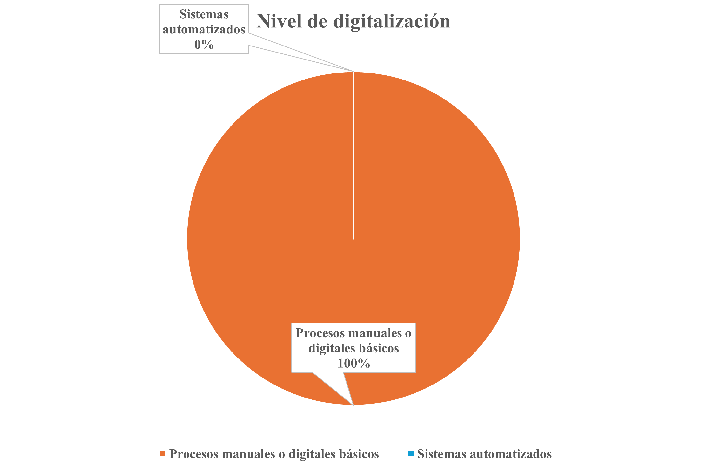

**Análisis Segundo Segmento Joyerías:** Tras el análisis de las entrevistas realizadas a tres actores del sector joyería  se evidencia que el sector se sostiene principalmente en la confianza empírica, la experiencia y las relaciones con proveedores, más que en sistemas formales de trazabilidad o digitalización.

En cuanto a la verificación de autenticidad, el 100% de los entrevistados depende de proveedores de confianza, complementando este proceso con distintos métodos técnicos. Mientras Yesiliany utiliza procedimientos más rigurosos como pruebas químicas con ácido nítrico o maquinaria especializada, Dante aplica verificaciones básicas visuales y Mauricio cuenta con un flujo estandarizado con apoyo de especialistas. Sin embargo, el 66% ha experimentado problemas con materiales falsos, ello que evidencia vulnerabilidades en la cadena de suministro.

Respecto a la gestión de información, ninguno utiliza sistemas digitales avanzados para el registro de inventario o trazabilidad predominando el uso de registros manuales. Esta limitación impacta directamente en la confianza del cliente, ya que el 100% de los entrevistados reconoce que el interés por conocer el origen de las joyas es alto y la falta de información clara puede derivar en pérdida de ventas.

Adicionalmente, el 100% realiza pruebas de autenticidad cuando el cliente aporta su propio material, lo que introduce complejidades técnicas como la merma del material durante la purificación. En general, se observa que la confianza no se basa únicamente en certificaciones, sino también en la transparencia, sinceridad y trato directo con el cliente, especialmente en decisiones de compra de alto valor.

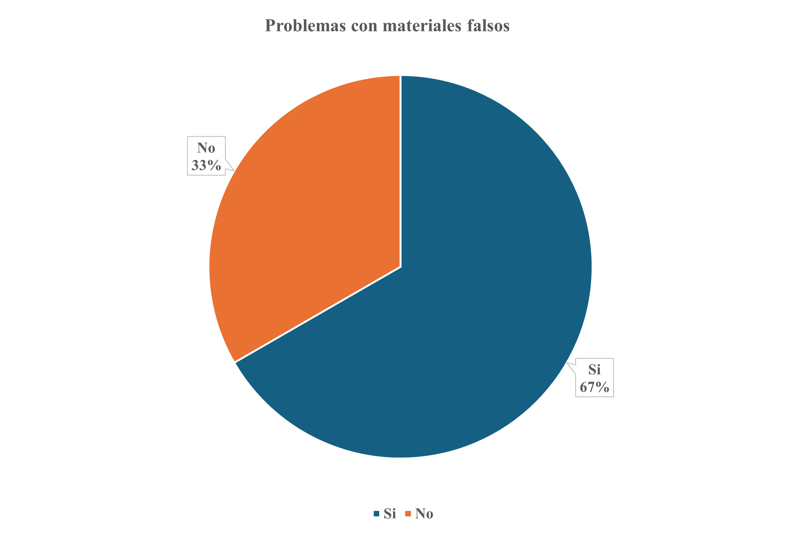

**Análisis Tercer Segmento Consumidor Final :** En conjunto, los consumidores entrevistados presentan un comportamiento de compra poco frecuente, orientado principalmente a ocasiones específicas. El 100% prioriza factores como la calidad, durabilidad y precio, mientras que la marca tiene una relevancia baja en la decisión de compra.

Respecto a la confianza y autenticidad, el 100% de los entrevistados manifiesta preocupación por la veracidad del producto, aunque reconoce tener un bajo conocimiento técnico para verificarlo. Como consecuencia, recurren a métodos como consultar al vendedor o usar pruebas básicas, lo que incrementa la incertidumbre durante la compra.

En cuanto a la confianza en las marcas, el 67% presenta un nivel de confianza bajo o moderado, percibiendo que muchas empresas utilizan el marketing sin garantizar realmente la autenticidad o el origen del producto.

Por otro lado, el 100% de los entrevistados valora el origen ético de los productos y estaría dispuesto a pagar un costo adicional (moderado) por garantizar autenticidad y condiciones laborales justas. Asimismo, el 100% muestra interés en herramientas tecnológicas como códigos QR o aplicaciones, que permitan verificar la procedencia, pureza y legalidad del producto antes de la compra.

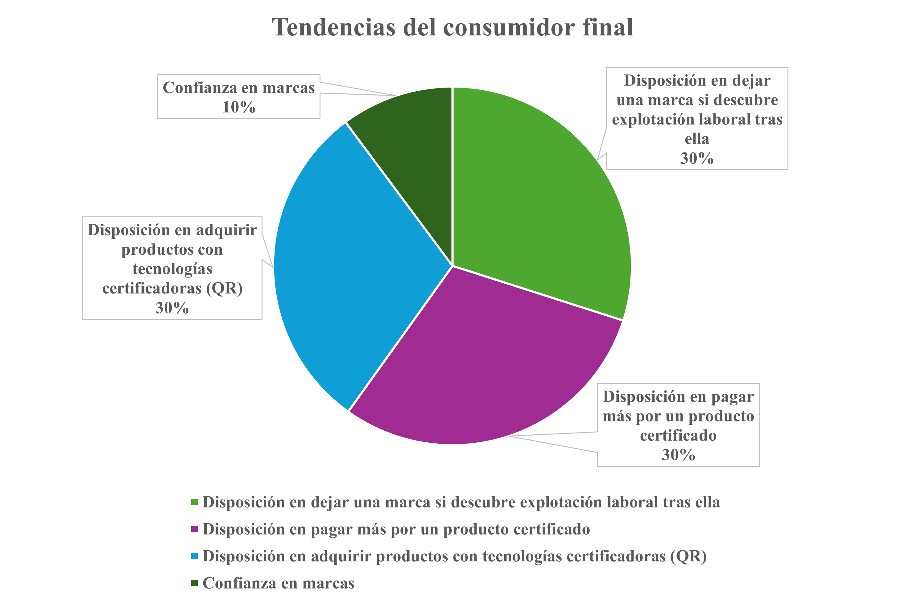

**Del análisis de los 3 segmentos se obtuvieron los siguientes insights:**
## Segmento 1: Empresas Mineras
 
| # | Insight | Observación empírica | Implicancia para el sistema |
|---|---------|----------------------|----------------------------|
| 1 | **La confianza reemplaza al control, y eso es el problema** | Los tres entrevistados coordinan el traslado de información del mineral vía WhatsApp entre turnos. El flujo operativo depende de que una persona específica recuerde y reenvíe datos críticos. | OpalTrace debe eliminar la dependencia de la memoria humana en la cadena de custodia. El registro de cada etapa debe ser automático, persistente y no delegable a una conversación de mensajería. |
| 2 | **El "40% de fracasos" no es un dato estadístico, es una regla de dominio oculta** | Un entrevistado estima que el 40% de proyectos falla por información incompleta; otros reportan retrasos de hasta una semana en el reporte de incidentes. | El sistema debe implementar una invariante de dominio: un lote no puede avanzar a la siguiente etapa si la información de la etapa anterior está incompleta. Esto no es un reporte, es una restricción de flujo. |
| 3 | **La conectividad define los límites del sistema, no solo la tecnología** | Los operarios trabajan en zonas sin internet estable y usan WhatsApp como herramienta principal por su resiliencia ante conectividad intermitente. | La trazabilidad debe poder operar en modo offline y sincronizarse al recuperar señal. Este es un requisito de arquitectura no negociable desde el primer sprint, no una mejora futura. |
 
---
 
## Segmento 2: Joyerías
 
| # | Insight | Observación empírica | Implicancia para el sistema |
|---|---------|----------------------|----------------------------|
| 1 | **La confianza con proveedores enmascara la ausencia de trazabilidad real** | Las tres joyerías basan su control de calidad en relaciones de 10+ años con proveedores. Sin embargo, el 66% ha experimentado fraude con materiales falsos, incluyendo un incidente que obligó a devolver dinero a un cliente y romper la relación comercial. | OpalTrace debe ofrecer verificación objetiva e independiente de la relación comercial. La trazabilidad certificada debe funcionar incluso con proveedores nuevos o desconocidos, sin depender de historial de confianza. |
| 2 | **La merma es un problema de comunicación, no de proceso técnico** | Yesiliany reporta pérdidas de hasta 1.5g por cada 5g en el proceso de purificación cuando el cliente aporta su propio material. El conflicto ocurre porque el cliente desconoce la calidad del material antes de entregarlo. | El momento más crítico para la trazabilidad en joyería es *antes* de que el orfebre trabaje el material. Un módulo de evaluación previa de pureza, con resultado documentado y firmado digitalmente por ambas partes, elimina este conflicto en origen. |
| 3 | **La desconfianza del cliente existe en todas las ventas, no solo en las de alto valor** | Dante señala que los clientes dudan de la autenticidad incluso en ventas cotidianas, aunque las certificaciones formales solo se solicitan en piezas de mayor valor. | No se necesita un certificado formal para cada venta. Un mecanismo de verificación de bajo costo y baja fricción — como un código QR escaneable en el punto de venta — cubre la demanda latente sin añadir burocracia al proceso habitual. |
 
---
 
## Segmento 3: Consumidor Final
 
| # | Insight | Observación empírica | Implicancia para el sistema |
|---|---------|----------------------|----------------------------|
| 1 | **El consumidor delega la verificación porque no tiene herramientas, no porque no le importe** | El 100% de los entrevistados "pregunta al vendedor" como único método de verificación. Reconocen que les importa el origen pero no saben cómo comprobarlo por cuenta propia. | La interfaz del consumidor final debe dar una respuesta binaria, visual y comprensible en menos de 10 segundos. Una experiencia técnica o compleja reproducirá el mismo comportamiento de delegación que existe hoy. |
| 2 | **El 67% desconfía del marketing, pero el 100% pagaría más por autenticidad certificada** | Los consumidores no son escépticos del producto; son escépticos de las marcas que hablan sobre el producto sin evidencia verificable. Perciben que las certificaciones actuales son parte del discurso de marketing. | OpalTrace no debe posicionarse como marketing de sostenibilidad. Su valor diferencial es la evidencia verificable e independiente: "aquí está el registro de dónde vino este mineral" en lugar de "somos una marca ética". |
| 3 | **La intención de abandono de marca es real pero no se activa sin información accesible** | El 100% afirma que dejaría de comprar a una marca vinculada a explotación laboral, pero ninguno sabe actualmente cómo identificarlo. La intención existe; el mecanismo de activación no. | OpalTrace no solo genera valor positivo (confirmar que un producto es ético) sino valor protector: da al consumidor la agencia para tomar decisiones que ya quiere tomar pero no puede por falta de datos accesibles. |
 

## 2.3. Needfinding

Para llevar a cabo el proceso de needfinding en OpalTrace, se realizaron entrevistas en profundidad con usuarios pertenecientes a los segmentos objetivo, incluyendo consumidores finales, joyeros y profesionales del sector minero. Estas conversaciones se centraron en comprender sus hábitos, objetivos y principales frustraciones relacionadas con la autenticidad, trazabilidad y confianza en la comercialización de joyas y minerales.

Gracias a esta exploración, se identificaron áreas críticas de mejora, como la falta de transparencia en el origen de los materiales, la baja confianza en los productos adquiridos y la limitada adopción de herramientas digitales en los procesos del sector minero. Asimismo, se evidenció la existencia de brechas tanto tecnológicas como informativas que afectan la toma de decisiones de los usuarios. Durante las entrevistas, surgieron patrones y necesidades recurrentes, como la importancia de contar con un sistema confiable que permita verificar la autenticidad, procedencia y valor real de los productos. De esta manera, se logra identificar una oportunidad clara para desarrollar una solución como OpalTrace, que facilite el acceso a información validada y mejore la confianza en la cadena de valor.

### 2.3.1. User Personas

**Segmento Objetivo: Empresas mineras:**
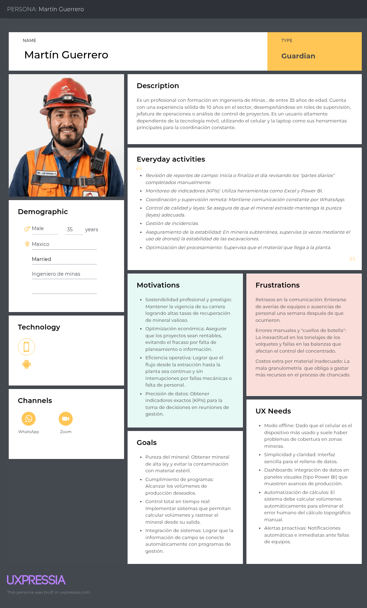

**Segmento Objetivo: Joyerías:**
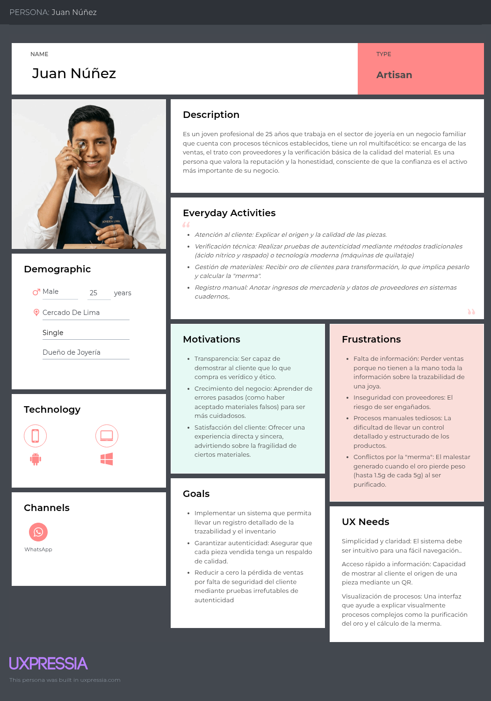

**Segmento Objetivo: Consumidor final:**
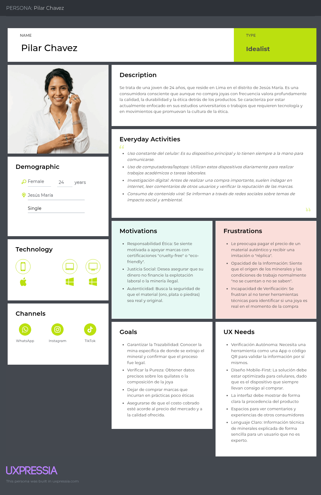

### 2.3.2. User Task Matrix

<table border="1" cellpadding="8" cellspacing="0" style="border-collapse: collapse; text-align: center;">
  
  <!-- Encabezado principal -->
  <tr style="background-color:#f2f2f2;">
    <th rowspan="2">Task</th>
    <th colspan="2">Martin Guerrero (Ingeniero de minas)</th>
    <th colspan="2">Juan Nuñez (Joyero)</th>
    <th colspan="2">Pilar Chavez (Consumidora final)</th>
  </tr>

  <!-- Sub encabezado -->
  <tr style="background-color:#f2f2f2;">
    <th>Frecuencia</th>
    <th>Importancia</th>
    <th>Frecuencia</th>
    <th>Importancia</th>
    <th>Frecuencia</th>
    <th>Importancia</th>
  </tr>

  <!-- Filas -->
  <tr>
    <td>Verificar autenticidad del material</td>
    <td>Media</td>
    <td>Alta</td>
    <td>Alta</td>
    <td>Alta</td>
    <td>Alta</td>
    <td>Alta</td>
  </tr>

  <tr>
    <td>Evaluar calidad/pureza del material</td>
    <td>Alta</td>
    <td>Alta</td>
    <td>Alta</td>
    <td>Alta</td>
    <td>Media</td>
    <td>Alta</td>
  </tr>

  <tr>
    <td>Registrar información del material (origen, cantidad)</td>
    <td>Alta</td>
    <td>Alta</td>
    <td>Media</td>
    <td>Alta</td>
    <td>Baja</td>
    <td>Media</td>
  </tr>

  <tr>
    <td>Supervisar traslado del material</td>
    <td>Alta</td>
    <td>Alta</td>
    <td>Baja</td>
    <td>Media</td>
    <td>Baja</td>
    <td>Baja</td>
  </tr>

  <tr>
    <td>Consultar información antes de comprar</td>
    <td>Baja</td>
    <td>Media</td>
    <td>Media</td>
    <td>Alta</td>
    <td>Alta</td>
    <td>Alta</td>
  </tr>

  <tr>
    <td>Confiar en proveedores / vendedores</td>
    <td>Alta</td>
    <td>Alta</td>
    <td>Alta</td>
    <td>Alta</td>
    <td>Alta</td>
    <td>Alta</td>
  </tr>

  <tr>
    <td>Gestionar inventario o stock</td>
    <td>Media</td>
    <td>Media</td>
    <td>Alta</td>
    <td>Media</td>
    <td>Baja</td>
    <td>Baja</td>
  </tr>

  <tr>
    <td>Detectar errores o fallas</td>
    <td>Alta</td>
    <td>Alta</td>
    <td>Media</td>
    <td>Alta</td>
    <td>Baja</td>
    <td>Media</td>
  </tr>

  <tr>
    <td>Comunicar información</td>
    <td>Alta</td>
    <td>Alta</td>
    <td>Alta</td>
    <td>Alta</td>
    <td>Media</td>
    <td>Media</td>
  </tr>

  <tr>
    <td>Evaluar precio vs calidad</td>
    <td>Media</td>
    <td>Alta</td>
    <td>Alta</td>
    <td>Alta</td>
    <td>Alta</td>
    <td>Alta</td>
  </tr>

  <tr>
    <td>Verificar origen ético</td>
    <td>Baja</td>
    <td>Media</td>
    <td>Baja</td>
    <td>Media</td>
    <td>Alta</td>
    <td>Alta</td>
  </tr>
</table>

### 2.3.3. User Journey Mapping

**Segmento Objetivo Empresas mineras:**
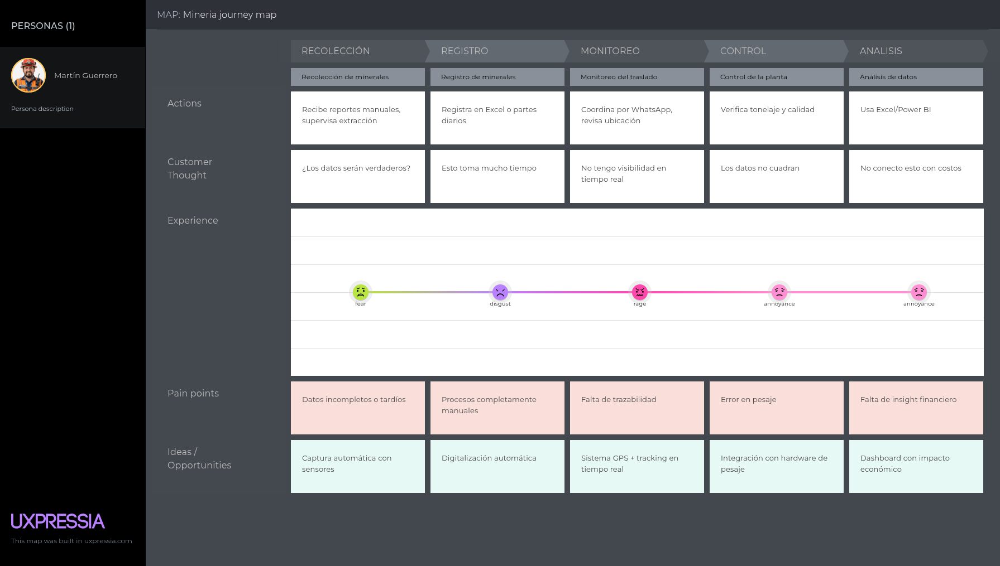

**Segmento Objetivo Joyerías:**
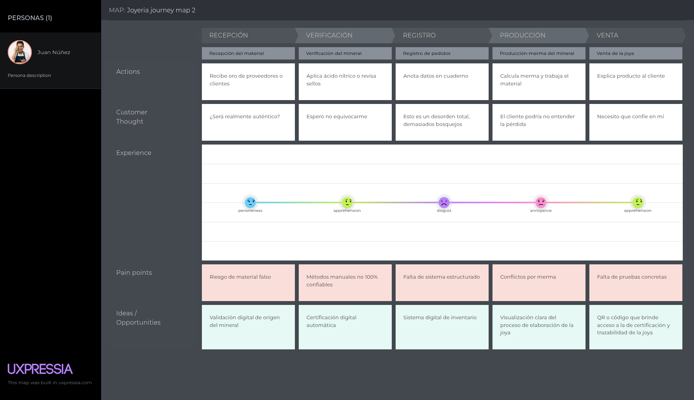

**Segmento Objetivo Consumidor final:**
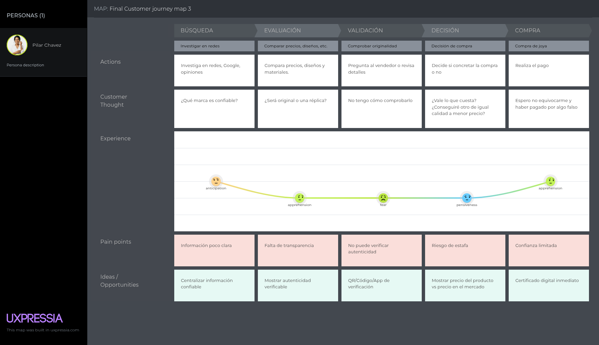

### 2.3.4. Empathy Mapping

**Segmento Objetivo Empresas mineras:**
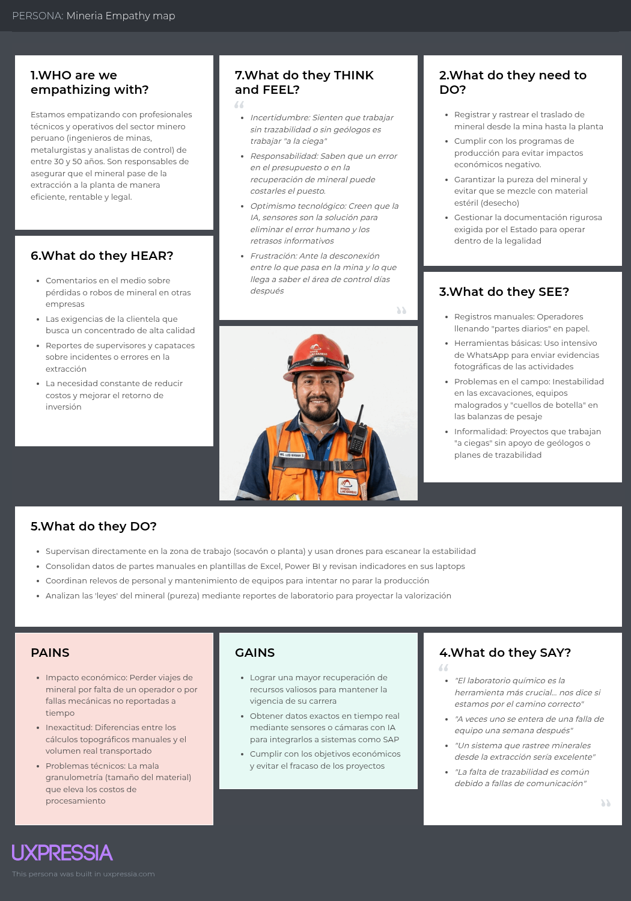

**Segmento Objetivo Joyerías:**
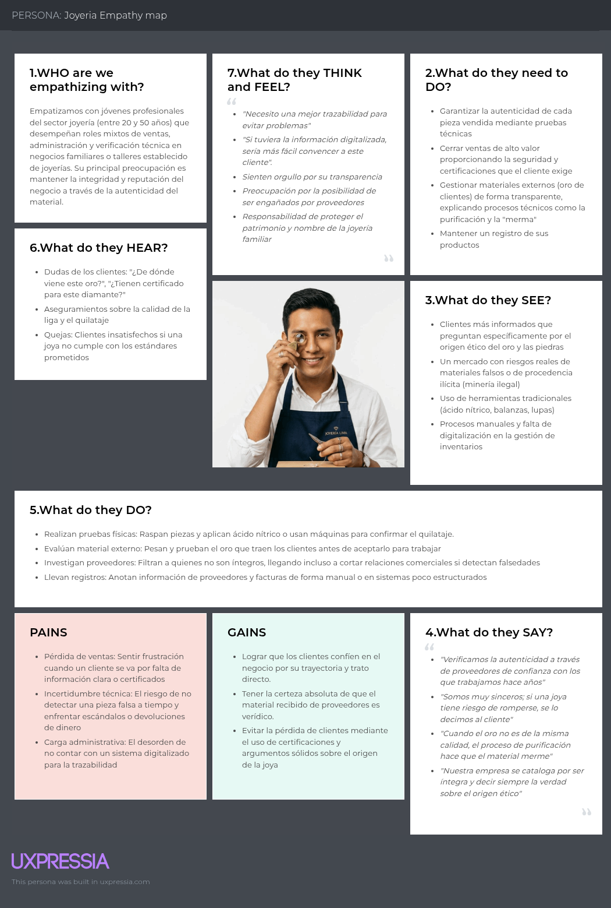

**Segmento Objetivo Consumidor final:**
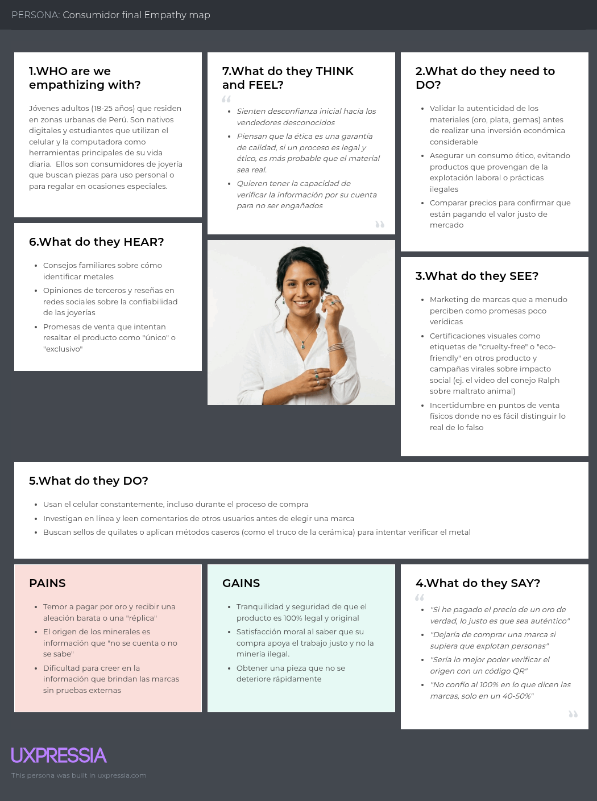

## 2.4. Big Picture Event Storming

Con el objetivo de comprender el funcionamiento global del sistema de trazabilidad minera, se aplicó la técnica de Big Picture Event Storming. Esta permitió identificar los eventos clave del dominio, los actores involucrados y la secuencia lógica de la operación desde la extracción del mineral hasta su validación por el consumidor final.

### 2.4.1. Generación de Domain Events

Se identificaron los principales eventos del dominio, expresados en tiempo pasado, que representan hechos relevantes dentro del sistema:

- Mineral extraído  
- Lote creado  
- Registro de extracción generado  
- Dispositivo IoT asignado  
- Ubicación registrada  
- Transporte iniciado  
- Ubicación actualizada  
- Transporte finalizado  
- Mineral recibido en planta  
- Mineral procesado  
- Producto creado  
- Código QR generado  
- Producto registrado en el sistema  
- Certificación generada  
- Anomalía detectada  
- Alerta generada  
- Producto verificado por cliente  

### 2.4.2. Ordenamiento de Eventos (Flujo del Dominio)

Los eventos fueron organizados cronológicamente para representar el flujo principal del sistema:

1. Mineral extraído  
2. Lote creado  
3. Registro de extracción generado  
4. Dispositivo IoT asignado  
5. Transporte iniciado  
6. Ubicación registrada / actualizada (eventos concurrentes)  
7. Transporte finalizado  
8. Mineral recibido en planta  
9. Mineral procesado  
10. Producto creado  
11. Código QR generado  
12. Producto registrado en el sistema  
13. Certificación generada  
14. Producto verificado por cliente  

Adicionalmente, se identificaron eventos alternos como:

- Anomalía detectada  
- Alerta generada  

### 2.4.3. Identificación de Actores

Se determinaron los actores que interactúan con el sistema y que desencadenan los eventos:

- **Operario Minero:** Responsable de la extracción y registro inicial del mineral  
- **Empresa Minera:** Gestiona la información de los lotes  
- **Sistema IoT:** Registra automáticamente datos de ubicación y estado  
- **Transportista:** Responsable del traslado del mineral  
- **Planta Procesadora:** Encargada de transformar el mineral en producto  
- **Cliente Final:** Verifica la autenticidad del producto mediante QR  

### 2.4.4. Sistemas Externos

Se identificaron sistemas externos que interactúan con la solución:

- Sistemas de geolocalización (GPS)  
- Servicios de validación o certificación externa  
- APIs de integración con sistemas empresariales (ERP/CRM)  

### 2.4.5. Storytelling del Dominio

El flujo del sistema puede describirse de la siguiente manera:

El proceso inicia cuando el operario minero realiza la extracción del mineral, generando un registro inicial dentro del sistema. Posteriormente, se crea un lote y se le asigna un dispositivo IoT que permite capturar datos en tiempo real durante su transporte.

A lo largo del traslado, el sistema registra continuamente la ubicación del mineral hasta su llegada a la planta procesadora, donde es transformado en un producto final. Una vez procesado, se genera un código QR que permite asociar el producto con su historial de trazabilidad.

Finalmente, el cliente puede escanear el código QR para verificar la autenticidad del producto, su origen y las condiciones en las que fue procesado, asegurando transparencia y confianza en la cadena de suministro.

### 2.4.6. Reverse Storytelling

Partiendo del evento final **“Producto verificado por cliente”**, se identificaron los eventos previos necesarios:

- Código QR generado  
- Producto creado  
- Mineral procesado  
- Transporte finalizado  
- Ubicación registrada  
- Dispositivo IoT asignado  
- Lote creado  
- Mineral extraído  

Este análisis permitió validar la coherencia del flujo y detectar posibles mejoras en la trazabilidad del sistema.

### 2.4.7. Resultados del Event Storming

Como resultado de la dinámica, se obtuvo:

- Una visión compartida del dominio del sistema  
- Identificación de eventos clave del negocio  
- Claridad en la interacción entre actores  
- Base para la definición del lenguaje ubicuo  
- Insumos para el diseño de la arquitectura del sistema  

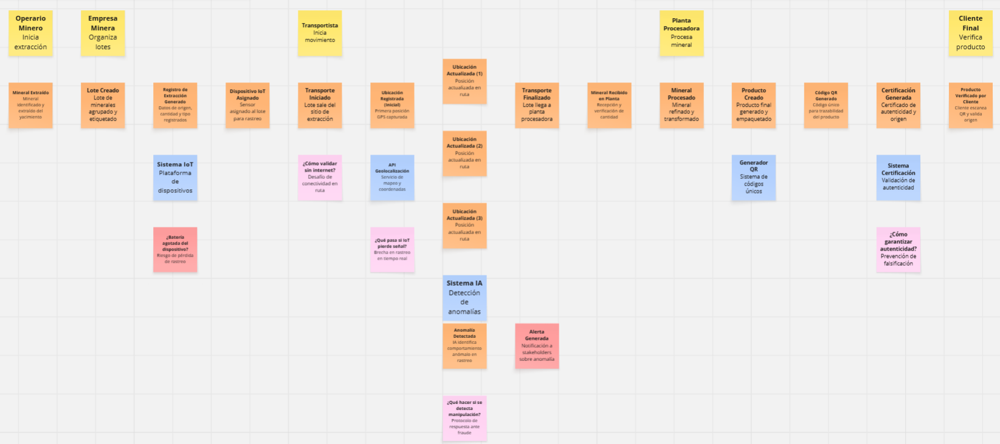

## 2.5. Ubiquitous Language

### Glosario de Términos del Dominio

- **Mineral (Mineral):** Recurso extraído desde una operación minera que será registrado, trazado y validado a lo largo de toda la cadena de suministro.

- **Batch (Lote):** Conjunto de minerales agrupados bajo un mismo identificador para facilitar su seguimiento, transporte y transformación dentro del sistema.

- **Extraction Record (Registro de Extracción):** Registro inicial que documenta la extracción de un mineral o lote, incluyendo ubicación, fecha, tipo de mineral y condiciones de origen.

- **Tracking Event (Evento de Trazabilidad):** Registro de cualquier cambio de estado, ubicación o condición del mineral durante su recorrido en la cadena de suministro.

- **IoT Device (Dispositivo IoT):** Sensor o dispositivo físico encargado de capturar datos en tiempo real (ubicación, temperatura, movimiento) asociados a un lote de mineral.

- **QR Code (Código QR):** Identificador único asociado a un lote o producto que permite acceder a su información de trazabilidad mediante escaneo.

- **Traceability Record (Registro de Trazabilidad):** Historial completo de eventos asociados a un lote de mineral, desde su extracción hasta su consumo final.

- **Transport Operation (Operación de Transporte):** Proceso logístico en el cual un lote de mineral es trasladado entre distintas locaciones, generando eventos de trazabilidad.

- **Location (Ubicación):** Punto geográfico registrado dentro del sistema donde ocurre un evento relevante (extracción, almacenamiento, transporte o transformación).

- **Processing (Procesamiento):** Etapa en la cual el mineral es transformado en un producto intermedio o final, manteniendo su vínculo con el lote original.

- **Product (Producto Final):** Bien resultante del procesamiento del mineral (por ejemplo, una joya), que conserva la trazabilidad de su origen.

- **Certification (Certificación):** Validación digital que garantiza la autenticidad, origen y cumplimiento de estándares (éticos o legales) de un mineral o producto.

- **Anomaly Detection (Detección de Anomalías):** Proceso basado en inteligencia artificial que identifica comportamientos inusuales o inconsistencias en la trazabilidad.

- **User (Usuario):** Actor que interactúa con el sistema, pudiendo ser un operador minero, transportista, empresa o consumidor final.

- **Organization (Organización):** Entidad registrada en el sistema (empresa minera, logística o comercial) que gestiona minerales dentro de la plataforma.

- **Dashboard (Panel de Control):** Interfaz visual que permite monitorear en tiempo real la trazabilidad, estado y métricas de los minerales.

- **Alert (Alerta):** Notificación generada automáticamente ante eventos críticos como desviaciones, anomalías o incumplimientos en la cadena.

- **Traceability Verification (Verificación de Trazabilidad):** Proceso mediante el cual un usuario consulta y valida el historial completo de un producto a través de un código QR u otro identificador.

- **Sustainability Record (Registro de Sostenibilidad):** Información asociada al cumplimiento de estándares ambientales, sociales y éticos del mineral.

