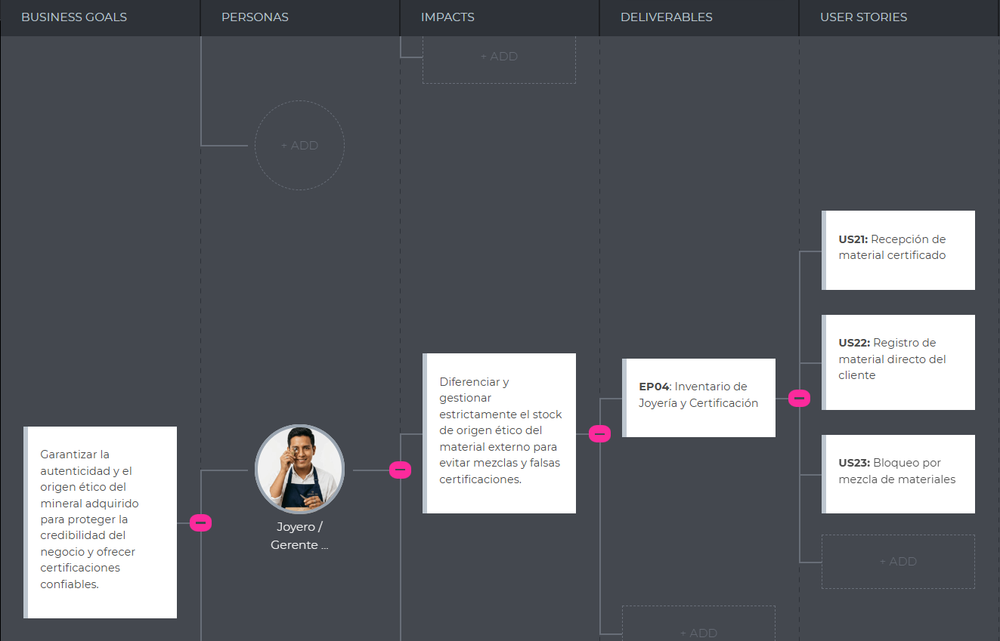
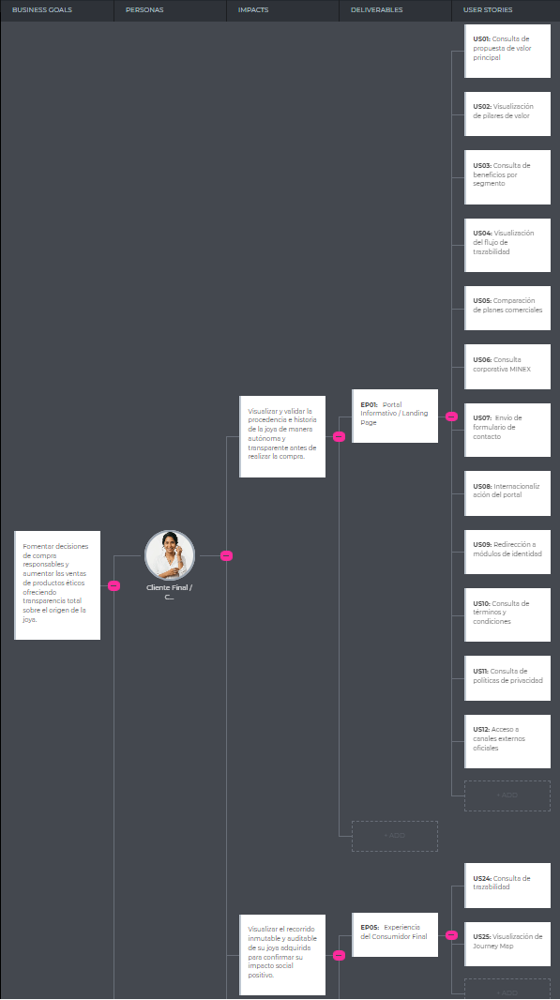

# CAPÍTULO III: REQUIREMENTS SPECIFICATION

## 3.1. User Stories

Las user stories expresan los requerimientos del producto a nivel funcional, desde la perspectiva del valor que recibe cada actor de la cadena de trazabilidad. Los criterios de aceptación siguen el formato Gherkin (Dado/Cuando/Entonces) y describen el comportamiento observable del sistema, sin incluir decisiones de implementación. El detalle técnico —protocolos, códigos de respuesta, estructuras de datos e integraciones— se especifica por separado en las Technical Stories (TS01–TS08) de la épica EP_TS, dirigidas al equipo de desarrollo.

| ID | Título | Descripción | Criterios de Aceptación | Épica |
| :--- | :--- | :--- | :--- | :--- |
| **EP01** | Extracción Minera y Trazabilidad IoT | Como empresa del sector minería, quiero gestionar el registro inicial de lotes de mineral en origen, soportando la captura de datos con validación geográfica y sincronización en zonas con conectividad limitada. | | |
| **US01** | Registro de lote con validación de origen | Como supervisor minero, quiero registrar un lote de extracción con validación automática de su origen geográfico, para garantizar que solo ingresen al sistema lotes con procedencia verificable. | *Escenario 1: Registro exitoso con origen verificado.*   **Dado que** el supervisor minero accede al formulario de registro de lote,  **Cuando** ingresa el peso y el tipo de mineral, y la ubicación capturada automáticamente corresponde a una zona de extracción autorizada,  **Entonces** el sistema crea el lote con un identificador único, lo establece en estado "En Origen" y entrega un comprobante verificable del registro.   *Escenario 2: Rechazo por origen no autorizado.*   **Dado que** el supervisor minero intenta registrar un lote,  **Cuando** la ubicación capturada no corresponde a ninguna zona de extracción autorizada,  **Entonces** el sistema bloquea el registro e informa el motivo, sin crear el lote.   *Escenario 3: Rechazo por datos inválidos.*   **Dado que** el supervisor minero ingresa los datos del lote,  **Cuando** el peso declarado está fuera del rango permitido para el tipo de mineral,  **Entonces** el sistema rechaza el registro e indica el rango esperado. | EP01 |
| **US02** | Ingreso de datos offline con integridad garantizada | Como supervisor minero en zonas sin conectividad, quiero registrar lotes y operaciones localmente sin pérdida ni alteración de datos, para mantener la cadena de trazabilidad íntegra independientemente de la conexión. | *Escenario 1: Persistencia local sin pérdida de datos.*   **Dado que** el supervisor minero no tiene conexión a internet,  **Cuando** registra un lote u operación de trazabilidad,  **Entonces** el sistema guarda el registro de forma segura en el dispositivo, protegido contra modificaciones, y lo marca como "Pendiente de sincronización".   *Escenario 2: Preservación ante cierre de sesión o de la aplicación.*   **Dado que** existen registros pendientes de sincronización,  **Cuando** el supervisor cierra la sesión o la aplicación se detiene inesperadamente,  **Entonces** el sistema conserva los registros pendientes y los restaura al próximo inicio de sesión del mismo usuario.   *Escenario 3: Indicador de estado offline.*   **Dado que** el supervisor trabaja sin conexión,  **Cuando** accede al módulo de registro de lotes,  **Entonces** el sistema muestra un indicador de "Modo Offline" y la cantidad de registros pendientes de sincronización. | EP01 |
| **US03** | Sincronización automática con resolución de conflictos | Como supervisor minero, quiero que los registros generados offline se sincronicen automáticamente al recuperar conexión, para que la trazabilidad central refleje fielmente las operaciones de campo. | *Escenario 1: Sincronización automática al recuperar conexión.*   **Dado que** existen registros pendientes y se recupera la conectividad,  **Cuando** el sistema detecta la conexión disponible,  **Entonces** transfiere automáticamente todos los registros pendientes respetando su orden cronológico y notifica la sincronización exitosa.   *Escenario 2: Descarte de duplicados.*   **Dado que** los registros pendientes se envían al servidor,  **Cuando** el sistema detecta registros ya existentes,  **Entonces** descarta los duplicados sin afectar la trazabilidad y muestra al supervisor solo los registros sincronizados exitosamente.   *Escenario 3: Recuperación ante fallo parcial.*   **Dado que** la sincronización está en curso,  **Cuando** se pierde la conexión antes de completarla,  **Entonces** el sistema conserva pendientes únicamente los registros no confirmados y retoma la sincronización desde el punto de interrupción al recuperar señal. | EP01 |
| **US04** | Reporte de anomalías con bloqueo automático de lote | Como supervisor minero, quiero reportar una anomalía en un lote para que el sistema bloquee automáticamente su avance en la cadena de trazabilidad, evitando que material comprometido continúe en la cadena de suministro. | *Escenario 1: Bloqueo automático al reportar anomalía.*   **Dado que** el supervisor minero detecta una discrepancia física en un lote (peso incorrecto, contaminación, sellado violado),  **Cuando** emite el reporte de anomalía con descripción, categoría y evidencia fotográfica,  **Entonces** el sistema bloquea inmediatamente el lote impidiendo cualquier cambio de estado y lo marca visualmente como "Bloqueado por Anomalía".   *Escenario 2: Notificación a los actores involucrados.*   **Dado que** un lote queda bloqueado por una anomalía,  **Cuando** el sistema registra el reporte,  **Entonces** notifica automáticamente a los actores que han participado en la trazabilidad de ese lote. | EP01 |
| **US05** | Detección automática de anomalías en trazabilidad | Como supervisor minero, quiero que el sistema detecte automáticamente inconsistencias en la trazabilidad de los lotes bajo mi responsabilidad, para ser alertado antes de que material comprometido avance en la cadena de suministro. | *Escenario 1: Detección de discrepancia de peso entre etapas.*   **Dado que** un lote fue registrado con un peso determinado en origen,  **Cuando** en una etapa posterior se declara un peso que difiere más allá de la tolerancia definida para minerales preciosos,  **Entonces** el sistema genera una alerta de discrepancia de peso, bloquea el lote y notifica a los responsables.   *Escenario 2: Detección de salto de etapa.*   **Dado que** los lotes deben seguir la secuencia de estados "En Origen" → "En Tránsito" → "En Planta" → "Certificado",  **Cuando** un lote intenta omitir una etapa de la secuencia,  **Entonces** el sistema bloquea la transición, señala las etapas faltantes y notifica a los responsables.   *Escenario 3: Alerta por demora en tránsito.*   **Dado que** un lote se encuentra en tránsito hacia su destino,  **Cuando** supera el tiempo máximo estimado para la ruta sin reportar una nueva ubicación,  **Entonces** el sistema genera una alerta de transporte demorado y notifica al supervisor y al transportista con la última ubicación conocida. | EP01 |
| **US06** | Generación de QR vinculado a trazabilidad completa | Como supervisor minero, quiero generar un código QR que garantice la autenticidad del lote, de modo que cualquier escaneo posterior permita verificar su cadena de trazabilidad completa. | *Escenario 1: QR generado solo para lotes con trazabilidad íntegra.*   **Dado que** el supervisor minero solicita el código QR de un lote,  **Cuando** el lote tiene su información de origen completa y no presenta bloqueos ni anomalías activas,  **Entonces** el sistema genera un código QR único vinculado al historial del lote y lo entrega como imagen descargable.   *Escenario 2: Rechazo para lotes bloqueados o incompletos.*   **Dado que** el supervisor minero solicita el código QR de un lote,  **Cuando** el lote está bloqueado por una anomalía o tiene información de trazabilidad incompleta,  **Entonces** el sistema rechaza la generación e indica específicamente los requisitos faltantes. | EP01 |
| **EP02** | Cadena de Custodia y Logística | Como empresa del sector minería, quiero controlar la cadena de custodia durante el transporte de lotes para que la responsabilidad quede registrada con exactitud en cada transferencia y los lotes no puedan avanzar si tienen anomalías activas. | | |
| **US07** | Transferencia de custodia con registro de estado | Como supervisor minero, quiero asumir formalmente la custodia de un lote verificando su estado e integridad, para que la cadena de responsabilidad quede registrada desde el momento de la transferencia. | *Escenario 1: Aceptación de custodia con validación previa.*   **Dado que** el supervisor minero escanea el código QR de un lote en estado "En Origen" y sin bloqueos,  **Cuando** confirma la aceptación de custodia,  **Entonces** el sistema actualiza el lote a "En Tránsito", registra al supervisor como responsable de la custodia y captura la ubicación del punto de recepción.   *Escenario 2: Rechazo de lote bloqueado o en estado incorrecto.*   **Dado que** el supervisor minero intenta asumir la custodia de un lote,  **Cuando** el lote está bloqueado por una anomalía o no se encuentra en estado "En Origen",  **Entonces** el sistema rechaza la transferencia indicando claramente el motivo.   *Escenario 3: Alternativa de ingreso manual.*   **Dado que** la cámara del dispositivo no está disponible,  **Cuando** el supervisor ingresa manualmente el identificador del lote,  **Entonces** el sistema valida el identificador y permite completar la transferencia con las mismas validaciones del flujo de escaneo. | EP02 |
| **US08** | Actualización de ubicación en tránsito | Como supervisor minero, quiero registrar actualizaciones de ubicación durante el transporte de un lote, para que el sistema pueda verificar la continuidad de la custodia y detectar desvíos o demoras. | *Escenario 1: Registro exitoso de ubicación en tránsito.*   **Dado que** el supervisor minero tiene un lote bajo su custodia en estado "En Tránsito",  **Cuando** registra una actualización de ubicación,  **Entonces** el sistema agrega el nuevo punto al recorrido del lote con su fecha y hora.   *Escenario 2: Alerta por ausencia de actualización.*   **Dado que** un lote está en tránsito con una ruta definida,  **Cuando** transcurre el tiempo máximo estimado para la ruta sin una nueva actualización,  **Entonces** el sistema genera una alerta de demora y notifica al responsable con la última ubicación conocida.   *Escenario 3: Rechazo de actualización no autorizada.*   **Dado que** un usuario intenta registrar una ubicación,  **Cuando** el lote no está bajo su custodia o no se encuentra en tránsito,  **Entonces** el sistema rechaza la actualización indicando el motivo. | EP02 |
| **EP03** | Procesamiento en Refinería | Como empresa del sector minería, quiero controlar la recepción y procesamiento de lotes en refinería, incluyendo la división de lotes con herencia completa de trazabilidad, para garantizar que ningún sublote pierda su cadena de autenticidad durante el procesamiento. | | |
| **US09** | Recepción en refinería con habilitación de procesamiento | Como supervisor minero con plan Platinum, quiero confirmar la recepción de un lote verificando que su trazabilidad esté íntegra, para que el procesamiento se habilite solo cuando la cadena de custodia es válida. | *Escenario 1: Recepción exitosa y habilitación de procesamiento.*   **Dado que** el supervisor escanea el código QR de un lote en estado "En Tránsito",  **Cuando** confirma la recepción y la cadena de custodia está completa y sin inconsistencias,  **Entonces** el sistema actualiza el lote a "En Planta", transfiere la custodia al receptor y habilita las operaciones de procesamiento y división.   *Escenario 2: Bloqueo por inconsistencias o anomalías.*   **Dado que** el supervisor intenta confirmar una recepción,  **Cuando** el lote está bloqueado por una anomalía o su cadena de custodia presenta inconsistencias (etapas faltantes o discrepancia de peso),  **Entonces** el sistema bloquea la recepción, indica el motivo específico y notifica al responsable del lote en origen.   *Escenario 3: Preservación del historial heredable.*   **Dado que** la recepción se confirma exitosamente,  **Cuando** el lote queda en estado "En Planta",  **Entonces** el sistema conserva de forma inalterable toda la trazabilidad previa del lote como parte de su historial. | EP03 |
| **US10** | División de lotes con herencia de trazabilidad | Como supervisor minero con plan Platinum, quiero dividir un lote en sublotes asegurando que la trazabilidad completa del lote origen se transfiera a cada sublote, para que el rastro de autenticidad nunca se pierda durante el procesamiento. | *Escenario 1: Herencia completa de trazabilidad.*   **Dado que** el supervisor procesa un lote en planta sin bloqueos activos,  **Cuando** solicita la división indicando el número de sublotes y sus pesos,  **Entonces** el sistema crea los sublotes con identificadores propios, hereda en cada uno el historial completo del lote padre y mantiene el vínculo padre-hijo de forma permanente.   *Escenario 2: Validación de conservación de masa.*   **Dado que** el supervisor ingresa los pesos de los sublotes,  **Cuando** la suma de los pesos declarados supera el peso del lote padre,  **Entonces** el sistema bloquea la división e indica la discrepancia, sin crear ningún sublote.   *Escenario 3: Trazabilidad verificable en cada sublote.*   **Dado que** un sublote fue generado por división,  **Cuando** cualquier actor consulta su historial,  **Entonces** el sistema presenta la cadena completa desde la extracción del lote origen hasta el punto de división, señalando claramente el lote padre y el peso heredado. | EP03 |
| **US11** | Finalización de procesamiento de lote en refinería | Como supervisor minero con plan Platinum, quiero marcar un lote como completamente procesado para indicar que finalizó las operaciones de refinamiento y está listo para su despacho a joyería. | *Escenario 1: Marcado exitoso de procesamiento completado.*   **Dado que** el supervisor finalizó las operaciones de un lote en planta,  **Cuando** lo marca como procesado y no existen operaciones pendientes,  **Entonces** el sistema actualiza el estado del lote a "Procesado" y lo habilita para despacho hacia joyería.   *Escenario 2: Bloqueo si existen sublotes sin procesar.*   **Dado que** un lote fue dividido en sublotes,  **Cuando** el supervisor intenta marcar el lote padre como procesado con sublotes aún pendientes,  **Entonces** el sistema rechaza la operación y lista los sublotes que deben completarse primero.   *Escenario 3: Registro de métricas de procesamiento.*   **Dado que** un lote se marca como procesado,  **Cuando** el sistema confirma la operación,  **Entonces** calcula y conserva las métricas del procesamiento (tiempo total en planta, merma de peso, sublotes generados y responsable) para los reportes de eficiencia operativa. | EP03 |
| **EP04** | Inventario de Joyería y Certificación | Como joyería, quiero administrar mi inventario asegurando la separación estricta entre material certificado OpalTrace y material de origen externo, y certificar únicamente productos con trazabilidad íntegra verificable. | | |
| **US12** | Recepción de material con verificación de certificación OpalTrace | Como administrador de joyería, quiero registrar únicamente material cuya trazabilidad pueda verificarse en OpalTrace, para garantizar que mi stock certificado proviene exclusivamente de la cadena de suministro auditada. | *Escenario 1: Registro de material con trazabilidad verificable.*   **Dado que** el administrador recibe un despacho con código QR OpalTrace,  **Cuando** escanea el código y el lote asociado tiene trazabilidad íntegra, estado válido y sin bloqueos,  **Entonces** el sistema registra el material en el "Stock Certificado OpalTrace" y actualiza el inventario ético por tipo de mineral.   *Escenario 2: Rechazo de material sin trazabilidad verificable.*   **Dado que** el administrador intenta registrar un ingreso de material,  **Cuando** el código QR no está registrado en OpalTrace, el lote está bloqueado o su trazabilidad está incompleta,  **Entonces** el sistema rechaza el ingreso, informa el motivo específico y no modifica el inventario certificado.   *Escenario 3: Separación estricta del inventario.*   **Dado que** el material es aceptado con trazabilidad verificada,  **Cuando** se registra en el inventario,  **Entonces** el sistema lo clasifica como certificado, lo mantiene completamente separado del stock externo e impide su reclasificación posterior. | EP04 |
| **US13** | Registro de material externo con restricción de sellado ético | Como administrador de joyería, quiero registrar material de origen externo de forma que el sistema garantice que nunca pueda recibir sellos de autenticidad OpalTrace ni mezclarse con material certificado. | *Escenario 1: Alta de material externo con restricción automática.*   **Dado que** el administrador recibe material de un proveedor sin certificación OpalTrace,  **Cuando** lo registra declarando su origen externo y el proveedor,  **Entonces** el sistema lo clasifica en el "Stock Externo" e inhabilita permanentemente la generación de certificados OpalTrace para ese material.   *Escenario 2: Identificación clara en el inventario.*   **Dado que** el inventario contiene material certificado y externo,  **Cuando** el administrador consulta su inventario,  **Entonces** el sistema presenta ambos stocks en secciones completamente separadas, con etiquetas e indicadores visuales diferenciados y sin vistas combinadas que generen confusión sobre el origen.   *Escenario 3: Proveedor externo obligatorio.*   **Dado que** el administrador registra material externo,  **Cuando** intenta completar el alta sin identificar al proveedor,  **Entonces** el sistema bloquea el registro hasta que se declare el proveedor de origen. | EP04 |
| **US14** | Validación de integridad de trazabilidad antes de certificar | Como administrador de joyería, quiero que el sistema valide automáticamente la integridad de la trazabilidad de un producto antes de permitir su certificación, para garantizar que ningún producto con historial incompleto o comprometido reciba un sello OpalTrace. | *Escenario 1: Certificación habilitada solo con trazabilidad íntegra.*   **Dado que** el administrador solicita certificar un producto fabricado con material OpalTrace,  **Cuando** el historial de todos los lotes asociados está completo, sin bloqueos ni anomalías activas,  **Entonces** el sistema otorga la certificación y habilita la generación del certificado digital con código QR verificable.   *Escenario 2: Rechazo ante trazabilidad incompleta o anomalía.*   **Dado que** el administrador solicita certificar un producto,  **Cuando** algún lote asociado tiene etapas faltantes, anomalías sin resolver o bloqueos activos,  **Entonces** el sistema rechaza la certificación e indica con precisión qué lote y qué condición impide certificar.   *Escenario 3: Validación de herencia en sublotes.*   **Dado que** el producto contiene material proveniente de sublotes,  **Cuando** el sistema valida la integridad,  **Entonces** verifica también la trazabilidad completa del lote padre y la consistencia de la división, rechazando la certificación si algún eslabón de la cadena presenta fallas.   *Escenario 4: Rechazo por material externo en la composición.*   **Dado que** el administrador solicita certificar un producto,  **Cuando** el sistema detecta que algún componente proviene de origen externo,  **Entonces** rechaza automáticamente la certificación indicando el material no elegible. | EP04 |
| **US15** | Generación y descarga de certificado digital | Como administrador de joyería, quiero generar y descargar el certificado digital de autenticidad OpalTrace de un producto para entregarlo como evidencia física o digital al consumidor final en el punto de venta. | *Escenario 1: Generación exitosa del certificado.*   **Dado que** el administrador solicita el certificado de un producto certificado,  **Cuando** envía la solicitud,  **Entonces** el sistema genera un documento PDF con el historial de trazabilidad completo, un código QR de verificación, los datos del producto y de la joyería certificadora, y un número de certificado único.   *Escenario 2: Bloqueo para productos no certificados.*   **Dado que** el administrador intenta generar un certificado,  **Cuando** el producto no cuenta con certificación vigente,  **Entonces** el sistema rechaza la generación, informa el estado actual del producto y sugiere las acciones correctivas.   *Escenario 3: Descarga directa.*   **Dado que** el certificado fue generado correctamente,  **Cuando** el administrador confirma la generación,  **Entonces** el sistema provee la descarga inmediata del documento sin pasos adicionales. | EP04 |
| **EP05** | Experiencia del Consumidor Final | Como consumidor final, quiero consultar la trazabilidad inmutable y el recorrido completo de mi joya mediante su código QR para confirmar que el producto proviene de una cadena de suministro ética auditada por OpalTrace. | | |
| **US16** | Verificación de autenticidad del producto mediante QR | Como consumidor final, quiero verificar la autenticidad de mi joya escaneando su código QR para obtener una confirmación inequívoca de que el producto proviene de una cadena de suministro ética auditada por OpalTrace. | *Escenario 1: Verificación exitosa de producto certificado.*   **Dado que** el consumidor escanea el código QR de una joya,  **Cuando** el código corresponde a un producto con certificación vigente y trazabilidad íntegra,  **Entonces** el sistema confirma la autenticidad con un indicador verde, muestra el número de certificado y presenta el recorrido completo del mineral desde la extracción hasta el producto final.   *Escenario 2: Alerta ante producto no verificable.*   **Dado que** el consumidor escanea un código QR,  **Cuando** el código no está registrado, el certificado fue revocado o existe una anomalía sin resolver en la cadena,  **Entonces** el sistema muestra una alerta clara de "Autenticidad No Verificable" con el motivo específico y recomienda contactar al vendedor.   *Escenario 3: Acceso público sin registro.*   **Dado que** el consumidor desea verificar su joya,  **Cuando** accede mediante el escaneo del código QR,  **Entonces** el sistema muestra toda la información de verificación sin requerir registro ni autenticación previa.   *Escenario 4: Detección de posibles falsificaciones.*   **Dado que** un mismo certificado es escaneado repetidamente,  **Cuando** el sistema detecta verificaciones desde ubicaciones muy distantes en un período corto,  **Entonces** genera una alerta de seguridad por posible duplicación fraudulenta del código. | EP05 |
| **US17** | Visualización del recorrido geográfico del mineral | Como consumidor final, quiero ver el recorrido geográfico completo de mi joya para confirmar que el mineral nunca abandonó la cadena de custodia auditada en ningún punto de su trayecto. | *Escenario 1: Visualización del recorrido en mapa interactivo.*   **Dado que** el consumidor accede a la trazabilidad de su joya certificada,  **Cuando** solicita ver el recorrido geográfico,  **Entonces** el sistema presenta un mapa interactivo con cada punto del trayecto en orden cronológico (extracción, transporte, refinería, joyería), mostrando al seleccionar cada punto la fecha, el actor responsable y la etapa correspondiente.   *Escenario 2: Transparencia ante tramos sin datos.*   **Dado que** el consumidor examina el recorrido,  **Cuando** existe un tramo sin ubicaciones intermedias registradas (por ejemplo, zonas sin cobertura),  **Entonces** el sistema lo señala claramente en el mapa indicando el motivo y el período del vacío, sin ocultar información.   *Escenario 3: Verificabilidad independiente del recorrido.*   **Dado que** el consumidor consulta los detalles de cada punto,  **Cuando** accede a la información de un evento del recorrido,  **Entonces** el sistema presenta un comprobante que permite verificar de forma independiente que los datos no han sido modificados desde su registro original. | EP05 |
| **EP06** | Reporting & Analytics | Como empresa del sector minería o joyería, quiero generar reportes de trazabilidad y analíticas de rendimiento operativo para tomar decisiones informadas sobre mis procesos y demostrar cumplimiento de estándares ESG. | | |
| **US18** | Generación de dashboard de trazabilidad por segmento | Como empresa minera, quiero visualizar un dashboard consolidado de mis operaciones de trazabilidad para monitorear el estado de mis lotes activos, identificar cuellos de botella y detectar tendencias operativas. | *Escenario 1: Métricas en tiempo real.*   **Dado que** el supervisor minero accede al dashboard,  **Cuando** el sistema carga las métricas operativas,  **Entonces** presenta indicadores en tiempo real: lotes activos por estado, lotes en tránsito con su última ubicación, anomalías pendientes de resolución y tiempo promedio por etapa.   *Escenario 2: Filtrado por período.*   **Dado que** el supervisor requiere analizar un período específico,  **Cuando** selecciona un rango de fechas,  **Entonces** el sistema actualiza todas las métricas para ese período y permite exportar la vista.   *Escenario 3: Segmentación por tipo de mineral.*   **Dado que** el supervisor gestiona varios tipos de mineral,  **Cuando** aplica un filtro por tipo,  **Entonces** el sistema segmenta las métricas y permite comparar el rendimiento entre tipos de mineral. | EP06 |
| **US19** | Cálculo de indicadores de merma entre etapas | Como administrador de joyería, quiero visualizar los indicadores de merma de peso entre las etapas de extracción, transporte y procesamiento para identificar pérdidas anormales y solicitar auditorías cuando sea necesario. | *Escenario 1: Cálculo automático de merma por lote.*   **Dado que** un lote completa la recepción en planta,  **Cuando** se registra su peso final,  **Entonces** el sistema calcula automáticamente el porcentaje de merma respecto al peso de origen y genera una alerta si supera el umbral permitido.   *Escenario 2: Merma acumulada por período.*   **Dado que** el administrador consulta los indicadores de merma,  **Cuando** accede al reporte mensual,  **Entonces** el sistema presenta la merma acumulada por etapa de la cadena y destaca los lotes con merma superior al promedio histórico.   *Escenario 3: Alerta por merma excesiva.*   **Dado que** un lote presenta una merma superior al límite crítico,  **Cuando** el sistema registra el indicador,  **Entonces** notifica automáticamente al supervisor responsable del lote y al administrador de joyería que lo recibió. | EP06 |
| **US20** | Generación de reportes ESG y cumplimiento ambiental | Como empresa minera, quiero generar reportes de cumplimiento ESG (Environmental, Social, Governance) con métricas de trazabilidad auditada para presentar evidencia a certificadoras internacionales y stakeholders. | *Escenario 1: Generación de reporte ESG por período.*   **Dado que** el administrador de la empresa requiere el reporte ESG de un período,  **Cuando** solicita su generación,  **Entonces** el sistema compila automáticamente las métricas ESG (lotes con trazabilidad verificada, porcentaje de lotes certificados, emisiones estimadas por transporte, anomalías detectadas y resueltas) y produce un documento PDF descargable con gráficos.   *Escenario 2: Validación frente a estándares internacionales.*   **Dado que** el sistema genera el reporte ESG,  **Cuando** compila las métricas de cumplimiento,  **Entonces** evalúa cada criterio de los estándares internacionales configurados, lo marca como "Cumple" o "No Cumple" y adjunta la evidencia de trazabilidad correspondiente. | EP06 |
| **US21** | Análisis comparativo de rendimiento entre períodos | Como supervisor minero, quiero comparar el rendimiento operativo entre diferentes períodos temporales para identificar mejoras o deterioros en la eficiencia de mis procesos de trazabilidad. | *Escenario 1: Comparación entre períodos.*   **Dado que** el supervisor accede al análisis comparativo,  **Cuando** selecciona dos períodos a comparar,  **Entonces** el sistema presenta una tabla con las métricas clave de ambos períodos, destacando visualmente las variaciones porcentuales de mejora o deterioro.   *Escenario 2: Identificación de tendencias.*   **Dado que** el supervisor consulta las tendencias operativas,  **Cuando** solicita la evolución de los últimos meses,  **Entonces** el sistema muestra la progresión de las métricas seleccionadas y una proyección de la tendencia esperada.   *Escenario 3: Exportación ejecutiva.*   **Dado que** el supervisor debe presentar resultados a dirección,  **Cuando** solicita la exportación del análisis,  **Entonces** el sistema genera un documento PDF con los gráficos, las comparaciones y las conclusiones destacadas. | EP06 |
| **EP07** | Subscriptions & Billing | Como empresa o consumidor, quiero gestionar mi suscripción a OpalTrace (Silver, Gold, Platinum) para acceder a las funcionalidades correspondientes a mi plan contratado y administrar mi información de facturación de forma segura. | | |
| **US22** | Suscripción a un plan OpalTrace | Como usuario, quiero completar el proceso de suscripción a un plan OpalTrace para acceder inmediatamente a las funcionalidades incluidas en el tier contratado. | *Escenario 1: Suscripción activada tras pago exitoso.*   **Dado que** el usuario completa el pago del plan seleccionado,  **Cuando** el procesador de pagos confirma la transacción,  **Entonces** el sistema activa el plan de inmediato y habilita las funcionalidades del tier contratado: **Silver** (verificación de autenticidad, historial de joyas propias, gestión de cuenta), **Gold** (todo Silver más registro y trazabilidad de lotes, cadena de custodia, inventario de joyería, certificación, dashboard operativo e indicadores de merma) o **Platinum** (todo Gold más procesamiento en refinería, división de lotes, reportes ESG y análisis comparativo).   *Escenario 2: Suscripción no activada ante pago rechazado.*   **Dado que** el usuario envía sus datos de pago,  **Cuando** el procesador rechaza la transacción,  **Entonces** el sistema no activa la suscripción e informa al usuario el motivo del rechazo para que pueda corregirlo. | EP07 |
| **US23** | Actualización de plan a tier superior | Como usuario con suscripción activa, quiero actualizar mi plan a un tier superior en cualquier momento para acceder inmediatamente a las funcionalidades adicionales del plan mejorado. | *Escenario 1: Upgrade con activación inmediata y cobro prorrateado.*   **Dado que** el usuario con plan activo solicita subir de tier (Silver a Gold, o Gold a Platinum),  **Cuando** confirma la actualización,  **Entonces** el sistema activa el nuevo plan de inmediato, habilita sus funcionalidades exclusivas y cobra únicamente la diferencia prorrateada por los días restantes del ciclo de facturación.   *Escenario 2: Restricción por pagos pendientes.*   **Dado que** el usuario intenta actualizar su plan,  **Cuando** su cuenta tiene facturas impagas,  **Entonces** el sistema bloquea la actualización e indica los pagos que deben saldarse previamente. | EP07 |
| **US24** | Degradación de plan a tier inferior | Como usuario con suscripción activa Gold o Platinum, quiero degradar mi plan a un tier inferior para reducir el costo de mi suscripción cuando ya no requiero las funcionalidades avanzadas del plan actual. | *Escenario 1: Degradación programada a fin de ciclo.*   **Dado que** el usuario solicita degradar su plan,  **Cuando** confirma el plan destino,  **Entonces** el sistema programa el cambio para el último día del ciclo de facturación, mantiene el acceso completo al plan actual hasta esa fecha y envía una confirmación con la fecha efectiva y las funcionalidades que dejarán de estar disponibles.   *Escenario 2: Advertencia durante el período de transición.*   **Dado que** existe una degradación programada,  **Cuando** el usuario utiliza funcionalidades que no estarán disponibles en el plan destino,  **Entonces** el sistema le permite completarlas y muestra una advertencia persistente indicando la fecha en que dejarán de estar disponibles.   *Escenario 3: Bloqueo por operaciones activas incompatibles.*   **Dado que** el usuario con plan Platinum solicita degradar a Gold,  **Cuando** existen lotes en procesamiento de refinería (operación exclusiva de Platinum),  **Entonces** el sistema bloquea la degradación, explica el motivo y lista las operaciones que deben finalizarse antes de continuar. | EP07 |
| **US25** | Visualización de historial de facturación y descarga de recibos | Como usuario con suscripción activa o histórica, quiero visualizar mi historial de pagos completo con todos los montos facturados para controlar mi gasto y descargar recibos oficiales cuando los requiera. | *Escenario 1: Historial de facturación completo.*   **Dado que** el usuario tiene pagos registrados,  **Cuando** accede al módulo de facturación,  **Entonces** el sistema presenta todas las transacciones ordenadas de la más reciente a la más antigua, con fecha, plan contratado, monto, estado del pago y método de pago utilizado.   *Escenario 2: Descarga de recibo oficial.*   **Dado que** el usuario identifica una transacción en su historial,  **Cuando** solicita el recibo de esa transacción,  **Entonces** el sistema genera un documento PDF oficial con los datos del usuario, el detalle del plan, los impuestos, el monto total y un número de factura único, disponible para descarga directa. | EP07 |
| **US26** | Cancelación de suscripción | Como usuario con suscripción activa, quiero cancelar mi suscripción a OpalTrace para detener los cargos recurrentes cuando ya no requiera el servicio. | *Escenario 1: Cancelación programada con acceso hasta fin de ciclo.*   **Dado que** el usuario solicita cancelar su suscripción,  **Cuando** confirma la cancelación,  **Entonces** el sistema la programa para el último día del ciclo de facturación, mantiene el acceso completo hasta esa fecha y envía una confirmación indicando hasta cuándo permanecerá activo el servicio.   *Escenario 2: Desactivación tras la fecha efectiva.*   **Dado que** la fecha efectiva de cancelación se cumple,  **Cuando** el sistema procesa el cambio,  **Entonces** desactiva las funcionalidades del plan, conserva acceso de solo lectura a los datos históricos e informa al usuario la opción de reactivación.   *Escenario 3: Retención de datos históricos.*   **Dado que** el período de acceso completo finalizó,  **Cuando** el usuario accede dentro de los 30 días posteriores,  **Entonces** el sistema permite consultar sus datos en modo lectura y advierte que, transcurrido ese plazo, los datos serán archivados según la política de retención. | EP07 |
| **EP08** | Identity & Access Management | Como usuario del sistema OpalTrace, quiero gestionar de forma segura mi cuenta, autenticación y perfil para acceder a las funcionalidades personalizadas según mi rol y segmento en la cadena de trazabilidad minera. | | |
| **US27** | Registro de cuenta empresarial | Como representante de una empresa, quiero registrar una cuenta empresarial proporcionando datos fiscales y corporativos para acceder al sistema OpalTrace según el segmento de mi empresa. | *Escenario 1: Registro exitoso con validación de datos fiscales.*   **Dado que** el representante proporciona razón social, RUC válido, correo corporativo y una contraseña segura,  **Cuando** envía el formulario de registro,  **Entonces** el sistema valida el RUC, crea la cuenta con el segmento declarado (minería o joyería) y dirige al usuario a la selección de plan empresarial.   *Escenario 2: Rechazo por RUC ya registrado.*   **Dado que** el representante intenta registrar una empresa,  **Cuando** el RUC ya está asociado a otra cuenta activa,  **Entonces** el sistema bloquea el registro, informa la situación sin revelar datos de la cuenta existente y sugiere la opción de recuperación de cuenta.   *Escenario 3: Validación de correo corporativo.*   **Dado que** el representante ingresa su correo,  **Cuando** el correo utiliza un dominio público (gmail, hotmail, yahoo),  **Entonces** el sistema rechaza el registro e indica que las cuentas empresariales requieren un correo con dominio corporativo.   *Escenario 4: Redirección al dashboard según segmento.*   **Dado que** la empresa completa el registro y el pago del plan,  **Cuando** la suscripción se activa,  **Entonces** el sistema dirige al usuario directamente al dashboard correspondiente a su segmento, sin pasos intermedios. | EP08 |
| **US28** | Registro de cuenta individual para consumidor final | Como consumidor final, quiero registrar una cuenta individual con mis datos personales para verificar la autenticidad de joyas OpalTrace y acceder al historial de trazabilidad de mis productos adquiridos. | *Escenario 1: Registro exitoso con plan Silver.*   **Dado que** el consumidor proporciona su nombre, correo electrónico y una contraseña segura,  **Cuando** envía el formulario de registro,  **Entonces** el sistema crea la cuenta de consumidor, la asocia al plan Silver e informa que ya puede verificar la autenticidad de joyas escaneando códigos QR.   *Escenario 2: Rechazo por correo ya existente.*   **Dado que** el consumidor ingresa un correo para registrarse,  **Cuando** el correo ya está asociado a una cuenta,  **Entonces** el sistema bloquea el registro y sugiere iniciar sesión o recuperar la contraseña.   *Escenario 3: Validación de contraseña segura.*   **Dado que** el consumidor ingresa una contraseña,  **Cuando** no cumple los requisitos mínimos de seguridad,  **Entonces** el sistema bloquea el registro, señala el requisito incumplido y muestra un indicador de fortaleza de la contraseña. | EP08 |
| **US29** | Inicio de sesión con credenciales | Como usuario registrado del sistema, quiero iniciar sesión con mi correo y contraseña para acceder a mi dashboard personalizado según mi rol y segmento. | *Escenario 1: Inicio de sesión exitoso con acceso personalizado.*   **Dado que** el usuario proporciona credenciales correctas,  **Cuando** inicia sesión,  **Entonces** el sistema lo autentica y lo dirige al dashboard correspondiente a su segmento: lotes y extracción para minería, inventario para joyería o verificación de joyas para consumidores.   *Escenario 2: Rechazo sin revelar el campo incorrecto.*   **Dado que** el usuario ingresa un correo o contraseña incorrectos,  **Cuando** el sistema valida las credenciales,  **Entonces** rechaza el acceso con un mensaje genérico que no revela cuál dato falló, para proteger la privacidad de las cuentas.   *Escenario 3: Bloqueo temporal por intentos fallidos.*   **Dado que** se registran cinco intentos fallidos consecutivos,  **Cuando** se intenta un nuevo acceso,  **Entonces** el sistema bloquea temporalmente el acceso durante 15 minutos, informa el tiempo de espera y alerta al propietario de la cuenta sobre los intentos fallidos. | EP08 |
| **US30** | Recuperación de contraseña olvidada | Como usuario que ha olvidado su contraseña, quiero solicitar un enlace de recuperación enviado a mi correo registrado para restablecer mi contraseña y recuperar el acceso a mi cuenta sin perder mi historial. | *Escenario 1: Envío de enlace de recuperación.*   **Dado que** el usuario solicita recuperar su contraseña,  **Cuando** ingresa un correo registrado en el sistema,  **Entonces** el sistema envía a ese correo un enlace de restablecimiento de un solo uso con vigencia limitada.   *Escenario 2: Correo no registrado.*   **Dado que** el usuario solicita la recuperación,  **Cuando** el correo ingresado no corresponde a ninguna cuenta,  **Entonces** el sistema informa que no existe una cuenta asociada a ese correo y sugiere verificar el dato o registrarse.   *Escenario 3: Expiración del enlace.*   **Dado que** el usuario recibió el enlace pero no lo utilizó dentro de su vigencia,  **Cuando** intenta acceder al enlace expirado,  **Entonces** el sistema informa la expiración y ofrece solicitar un nuevo enlace.   *Escenario 4: Establecimiento de nueva contraseña.*   **Dado que** el usuario accede a un enlace válido,  **Cuando** ingresa y confirma una nueva contraseña que cumple los requisitos de seguridad,  **Entonces** el sistema actualiza la contraseña, invalida el enlace utilizado, cierra las sesiones activas por seguridad y confirma el cambio para iniciar sesión nuevamente. | EP08 |
| **EP_TS** | RESTful API — Technical Stories | Como desarrollador, quiero implementar la arquitectura backend, la seguridad y las integraciones con servicios externos para soportar las operaciones de OpalTrace con una RESTful API robusta, segura y monitoreada. | | |
| **TS01** | Implementación de seguridad JWT | Como desarrollador, quiero implementar tokens JWT para proteger los endpoints de la API, garantizando que solo usuarios autenticados con el rol correcto accedan a cada recurso. | *Escenario 1: Rechazo de petición con token inválido o expirado.*   **Dado que** el desarrollador recibe una petición HTTP a un endpoint protegido,  **Cuando** el desarrollador valida el token JWT presente en el header Authorization y el token es inválido (firma incorrecta), está expirado (exp claim superado) o está en la blacklist de tokens revocados,  **Entonces** el sistema rechaza la petición inmediatamente sin procesarla, retorna código HTTP 401 Unauthorized con mensaje descriptivo en formato JSON ("error": "Token inválido o expirado", "code": "INVALID_TOKEN") y registra el intento en el sistema de auditoría con IP de origen.   *Escenario 2: Rechazo por rol insuficiente para el recurso.*   **Dado que** el desarrollador recibe una petición con token JWT válido y no expirado,  **Cuando** el desarrollador valida la autorización y el claim 'role' del token no tiene permisos suficientes para el recurso solicitado (ej: rol "CONSUMER" intentando acceder a endpoint de administración que requiere "ADMIN"),  **Entonces** el sistema rechaza la petición retornando código HTTP 403 Forbidden con mensaje JSON ("error": "Permisos insuficientes", "required_role": "ADMIN", "current_role": "CONSUMER") y no ejecuta la lógica del endpoint.   *Escenario 3: Validación exitosa y extracción de claims.*   **Dado que** el desarrollador recibe una petición con token JWT válido y no expirado,  **Cuando** el desarrollador valida el token y el rol del usuario cumple con los permisos requeridos para el endpoint,  **Entonces** el sistema extrae los claims del token (userId, role, companyId), los inyecta en el contexto de la petición para uso en la lógica de negocio y permite que la petición continúe su procesamiento normal. | EP_TS |
| **TS02** | Endpoint de gestión de lotes | Como desarrollador, quiero un endpoint REST para gestionar la creación y lectura de lotes, soportando los eventos de dominio del bounded context de Extracción Minera. | *Escenario 1: Creación exitosa de lote con retorno de objeto completo.*   **Dado que** el desarrollador recibe una petición POST /api/v1/batches con payload JSON válido conteniendo mineralType, weight, gpsCoordinates y companyId en el cuerpo,  **Cuando** el desarrollador valida los campos, las coordenadas GPS corresponden a una zona autorizada y el peso está dentro del rango permitido para el mineralType,  **Entonces** el sistema genera un nuevo registro de lote con ID único formato OT-YYYY-NNNN, establece status en "EN_ORIGEN", registra el evento MineralExtracted en blockchain, persiste el lote en la base de datos y retorna HTTP 201 Created con el objeto del lote completo en el cuerpo (incluyendo batchId, mineralType, weight, gpsCoordinates, status, createdAt, blockchainTxHash).   *Escenario 2: Manejo de errores de validación con detalles específicos.*   **Dado que** el desarrollador recibe una petición POST /api/v1/batches con payload JSON,  **Cuando** el desarrollador valida el payload y detecta campos inválidos (mineralType no reconocido, weight negativo o cero) o campos faltantes obligatorios (gpsCoordinates ausente),  **Entonces** el sistema rechaza la petición sin crear el lote, retorna HTTP 400 Bad Request con un objeto JSON estructurado detallando los errores de validación campo por campo ("errors": [{"field": "weight", "message": "Debe ser mayor a 0", "value": -10}]) y no registra ningún evento en blockchain.   *Escenario 3: Lectura de lote por ID con historial de eventos.*   **Dado que** el desarrollador recibe una petición GET /api/v1/batches/{batchId},  **Cuando** el desarrollador busca el lote en la base de datos y el batchId existe,  **Entonces** el sistema retorna HTTP 200 OK con el objeto del lote incluyendo todos sus campos y un array completo de eventos de trazabilidad ordenados cronológicamente (events: [{eventType: "MineralExtracted", timestamp, data}]). | EP_TS |
| **TS03** | Servicio generador de QR | Como desarrollador, quiero un servicio backend que genere imágenes QR vinculadas a los IDs de lote, con firma digital que garantice la inmutabilidad del vínculo. | *Escenario 1: Generación exitosa de QR con firma criptográfica.*   **Dado que** el desarrollador invoca el servicio POST /api/v1/batches/{batchId}/qr con un batchId válido,  **Cuando** el desarrollador valida que el lote existe, tiene status "EN_ORIGEN" e isBlocked en false,  **Entonces** el sistema genera un código QR en formato PNG que codifica una URL estructurada (https://verify.opaltrace.com/batch/{batchId}) firmada criptográficamente con HMAC-SHA256 usando una clave secreta del servidor, almacena la imagen QR en un bucket S3 con path /qr-codes/{batchId}.png, registra el evento QRGenerated en el historial del lote y retorna HTTP 200 OK con la URL pública del QR almacenado y el hash de la firma digital.   *Escenario 2: Rechazo para lote con anomalía activa o bloqueado.*   **Dado que** el desarrollador invoca el servicio POST /api/v1/batches/{batchId}/qr,  **Cuando** el desarrollador valida el lote y detecta que isBlocked está en true debido a una anomalía activa (AnomalyDetected sin AnomalyResolved correspondiente),  **Entonces** el sistema rechaza la generación del QR retornando HTTP 422 Unprocessable Entity con mensaje JSON ("error": "El lote está bloqueado por anomalía activa", "anomalyType": "WeightDiscrepancy", "anomalyId": "ANO-123") y no genera ni almacena ninguna imagen QR.   *Escenario 3: Validación de firma al escanear QR.*   **Dado que** un usuario escanea un código QR y accede a la URL codificada,  **Cuando** el desarrollador recibe la petición GET en el endpoint de verificación con el batchId y la firma en los parámetros,  **Entonces** el sistema valida la firma HMAC-SHA256 usando la clave secreta, confirma que el batchId no ha sido alterado, retorna HTTP 200 OK con los datos del lote si la firma es válida o HTTP 401 Unauthorized si la firma falla indicando posible manipulación del QR. | EP_TS |
| **TS04** | Integración de almacenamiento en nube para evidencias | Como desarrollador, quiero integrar AWS S3 para almacenar evidencias fotográficas de lotes y anomalías, garantizando seguridad y restricción de formatos. | *Escenario 1: Almacenamiento exitoso de evidencia con URL pre-firmada.*   **Dado que** el desarrollador recibe una petición POST /api/v1/evidence/upload con un archivo multimedia en el cuerpo multipart/form-data,  **Cuando** el desarrollador valida que el archivo está en formato permitido (JPEG, PNG, PDF), el tamaño no supera el límite de 10MB y el tipo MIME es correcto,  **Entonces** el sistema genera un nombre de archivo único (UUID + extensión original), sube el archivo al bucket AWS S3 configurado con path /evidence/{year}/{month}/{filename}, establece permisos de acceso privado, genera una URL pre-firmada con expiración de 7 días para acceso temporal y retorna HTTP 201 Created con la URL pre-firmada y el path permanente del archivo en S3.   *Escenario 2: Rechazo de formato no permitido con mensaje claro.*   **Dado que** el desarrollador recibe una petición POST /api/v1/evidence/upload con un archivo,  **Cuando** el desarrollador valida el tipo MIME del archivo y detecta que no es JPEG, PNG ni PDF (ej: video MP4, ejecutable EXE),  **Entonces** el sistema rechaza la carga inmediatamente sin procesarla, retorna HTTP 415 Unsupported Media Type con mensaje JSON ("error": "Formato no permitido", "allowedFormats": ["JPEG", "PNG", "PDF"], "receivedFormat": "MP4") y no realiza ninguna operación en S3.   *Escenario 3: Validación de tamaño máximo de archivo.*   **Dado que** el desarrollador recibe una petición POST /api/v1/evidence/upload con un archivo,  **Cuando** el desarrollador valida el tamaño del archivo y detecta que supera el límite de 10MB,  **Entonces** el sistema rechaza la carga retornando HTTP 413 Payload Too Large con mensaje JSON ("error": "Archivo excede el tamaño máximo", "maxSize": "10MB", "receivedSize": "15MB") y no inicia la subida a S3. | EP_TS |
| **TS05** | Servicio de generación de certificados PDF | Como desarrollador, quiero un servicio que compile certificados de autenticidad en formato PDF a partir de plantillas dinámicas con los datos del lote y su trazabilidad completa. | *Escenario 1: Generación exitosa de certificado PDF con plantilla dinámica.*   **Dado que** el desarrollador invoca el servicio POST /api/v1/products/{productId}/certificate con un productId de un producto certificado,  **Cuando** el desarrollador valida que el producto tiene CertificationState "CERTIFIED" y recupera todos los lotes asociados con su trazabilidad completa desde blockchain,  **Entonces** el sistema renderiza una plantilla HTML predefinida inyectando dinámicamente los datos (historial de eventos ordenados cronológicamente, código QR de verificación generado en tiempo real con URL única, datos del producto incluyendo mineralType y weight, información de la joyería certificadora con nombre y logo, número de certificado único CERT-YYYY-NNNN, firma digital criptográfica), convierte el HTML a PDF usando librería de renderizado (ej: Puppeteer), almacena el PDF en S3 con path /certificates/{certificateId}.pdf y retorna HTTP 200 OK con la URL descargable del PDF generado.   *Escenario 2: Rechazo para productos no certificados con estado claro.*   **Dado que** el desarrollador invoca el servicio POST /api/v1/products/{productId}/certificate,  **Cuando** el desarrollador valida el producto y detecta que CertificationState no es "CERTIFIED" (es "PENDING", "REJECTED" o "REVOKED"),  **Entonces** el sistema rechaza la generación del PDF retornando HTTP 422 Unprocessable Entity con mensaje JSON ("error": "Producto no certificado", "currentState": "REJECTED", "reason": "Trazabilidad incompleta - Falta evento TransportStarted en lote OT-2026-0041") y no ejecuta el proceso de renderizado de plantilla.   *Escenario 3: Manejo de errores de renderizado con rollback.*   **Dado que** el desarrollador inicia el proceso de generación de certificado PDF,  **Cuando** el desarrollador ejecuta el renderizado de la plantilla y ocurre un error durante la conversión HTML a PDF (fallo de librería, timeout, memoria insuficiente),  **Entonces** el sistema captura la excepción, registra el error en el sistema de logging con stack trace completo, retorna HTTP 500 Internal Server Error con mensaje genérico al cliente ("error": "Error al generar certificado - Contacte soporte") y no almacena ningún archivo parcial en S3. | EP_TS |
| **TS06** | Implementación de rate limiting | Como desarrollador, quiero limitar peticiones concurrentes por IP para evitar ataques de denegación de servicio que afecten la disponibilidad de la plataforma. | *Escenario 1: Bloqueo por exceso de peticiones con ventana deslizante.*   **Dado que** el desarrollador implementa un middleware de rate limiting con algoritmo de ventana deslizante,  **Cuando** el middleware detecta que una IP específica supera el umbral configurado de 100 peticiones en una ventana de 1 minuto,  **Entonces** el sistema bloquea temporalmente todas las peticiones adicionales desde esa IP durante el período de cooldown de 5 minutos, retorna HTTP 429 Too Many Requests con headers estándar (X-RateLimit-Limit: 100, X-RateLimit-Remaining: 0, X-RateLimit-Reset: timestamp) y un cuerpo JSON ("error": "Límite de peticiones excedido", "retryAfter": 300) y registra el evento de rate limit en el sistema de monitoreo con la IP bloqueada.   *Escenario 2: Diferenciación de límites por tipo de endpoint.*   **Dado que** el desarrollador configura el rate limiter con diferentes umbrales según la criticidad del endpoint,  **Cuando** el middleware procesa una petición a un endpoint público de verificación (GET /verify/{batchId}) vs un endpoint de escritura crítico (POST /batches),  **Entonces** el sistema aplica el límite correspondiente (500 peticiones/minuto para verificación pública, 50 peticiones/minuto para creación de lotes) y rechaza peticiones que excedan el límite específico del endpoint.   *Escenario 3: Excepciones para IPs de confianza.*   **Dado que** el desarrollador mantiene una whitelist de IPs de confianza (servidores internos, IPs de partners certificados),  **Cuando** el middleware detecta que una petición proviene de una IP presente en la whitelist,  **Entonces** el sistema excluye esa petición del conteo de rate limiting, permite que la petición continúe sin restricciones y no incrementa los contadores de rate limit para esa IP. | EP_TS |
| **TS07** | Endpoint de health check | Como desarrollador, quiero un endpoint de validación para monitorear la operatividad del sistema y sus dependencias críticas. | *Escenario 1: Reporte de salud en operación normal con detalles de componentes.*   **Dado que** el desarrollador recibe una petición GET /health del sistema de monitoreo externo,  **Cuando** el desarrollador ejecuta las validaciones de salud de todos los componentes críticos (conexión a base de datos PostgreSQL, conexión a servicio blockchain, acceso a bucket S3, conectividad a servicio de correo SMTP),  **Entonces** el sistema verifica cada componente ejecutando una operación de prueba simple (SELECT 1 en DB, ping a blockchain node, listado de bucket S3, verificación de credenciales SMTP), retorna HTTP 200 OK con un objeto JSON estructurado ("status": "healthy", "components": {"database": {"status": "up", "responseTime": 15ms}, "blockchain": {"status": "up", "responseTime": 200ms}, "storage": {"status": "up"}, "email": {"status": "up"}}, "timestamp": ISO8601) y registra el resultado del health check en el sistema de métricas.   *Escenario 2: Reporte de fallo de dependencia crítica con degradación parcial.*   **Dado que** el desarrollador ejecuta el health check,  **Cuando** el desarrollador detecta que una dependencia crítica no responde correctamente (timeout de conexión a base de datos superior a 5 segundos, fallo de autenticación en blockchain node, error 403 en acceso a S3),  **Entonces** el sistema retorna HTTP 503 Service Unavailable con objeto JSON detallando el componente afectado ("status": "unhealthy", "components": {"database": {"status": "down", "error": "Connection timeout after 5000ms"}, "blockchain": {"status": "up"}, "storage": {"status": "up"}, "email": {"status": "up"}}, "timestamp": ISO8601), dispara una alerta en el sistema de monitoreo configurado (ej: PagerDuty, Slack webhook) y registra el fallo en el log de errores con nivel CRITICAL.   *Escenario 3: Health check detallado vs simplificado según parámetro.*   **Dado que** el desarrollador recibe una petición GET /health con parámetro query ?detailed=true,  **Cuando** el desarrollador procesa la petición,  **Entonces** el sistema ejecuta validaciones extendidas incluyendo métricas adicionales (uso de memoria, uso de CPU, espacio en disco, número de conexiones activas en DB, latencia promedio de últimos 100 requests) y retorna un objeto JSON ampliado con todas las métricas, mientras que sin el parámetro ?detailed retorna solo el estado binario de cada componente. | EP_TS |
| **TS08** | Automatización de backups de base de datos | Como desarrollador, quiero configurar copias automáticas programadas de la base de datos para prevenir pérdida de datos críticos de trazabilidad ante fallos del sistema. | *Escenario 1: Respaldo programado exitoso con verificación de integridad.*   **Dado que** el desarrollador configura una tarea programada (cron job) con intervalo diario a las 02:00 UTC,  **Cuando** el sistema alcanza el timestamp programado y ejecuta el script de backup,  **Entonces** el sistema genera un dump completo de la base de datos PostgreSQL usando pg_dump con formato custom, comprime el archivo resultante con gzip, calcula un hash SHA-256 del backup comprimido para verificación de integridad, sube el archivo al bucket S3 designado con path /backups/db/{YYYY}/{MM}/{DD}/opaltrace-backup-{timestamp}.sql.gz, almacena el hash en una tabla de metadatos de backups, registra el evento de backup exitoso en el log del sistema con timestamp, tamaño del archivo y hash, y envía una notificación de confirmación al canal de Slack de operaciones.   *Escenario 2: Retención automática de backups con política de ciclo de vida.*   **Dado que** el desarrollador configura una política de retención de backups (últimos 7 backups diarios, últimos 4 backups semanales del domingo, últimos 12 backups mensuales del día 1),  **Cuando** el sistema completa un nuevo backup exitoso,  **Entonces** el sistema evalúa la política de retención, identifica backups que exceden la ventana de retención según su antigüedad y tipo, elimina los backups obsoletos del bucket S3 para liberar espacio, actualiza la tabla de metadatos marcando los backups eliminados y registra la limpieza en el log de operaciones.   *Escenario 3: Manejo de fallos de backup con alertas críticas.*   **Dado que** el sistema ejecuta el proceso de backup programado,  **Cuando** el desarrollador detecta un fallo durante el proceso (error de conexión a DB, fallo de subida a S3 por credenciales inválidas, espacio insuficiente en disco temporal),  **Entonces** el sistema captura la excepción con stack trace completo, registra el error en el log con nivel CRITICAL incluyendo el motivo del fallo, envía una alerta inmediata al equipo de operaciones mediante correo electrónico y notificación push con detalles del error, reintenta el backup hasta 3 veces con backoff exponencial (1min, 5min, 15min) y si los reintentos fallan, escala la alerta a nivel de incidente crítico en el sistema de gestión de incidentes. | EP_TS |
| **EP_LP** | Landing Page | Como visitante, quiero navegar por el sitio web estático de OpalTrace para conocer la propuesta de valor, entender cómo funciona la plataforma, explorar los planes de suscripción y ser redirigido a la aplicación web según mi segmento de interés. | | |
| **US_LP01** | Evaluación del impacto de OpalTrace | Como visitante del sector minería, quiero evaluar si OpalTrace resuelve el problema de trazabilidad y autenticidad en mi cadena de extracción, para decidir si iniciar el proceso de suscripción. | *Escenario 1: Identificación del problema resuelto.*   **Dado que** el visitante del sector minería accede al portal,  **Cuando** el visitante explora la sección de propuesta de valor,  **Entonces** el sistema presenta el problema específico que OpalTrace resuelve para operaciones mineras y la solución implementada mediante trazabilidad inmutable.   *Escenario 2: Evaluación de relevancia por segmento.*   **Dado que** el visitante identifica su perfil como empresa minera,  **Cuando** el visitante consulta los beneficios para su segmento,  **Entonces** el sistema presenta métricas de impacto concretas relevantes para operadores mineros (reducción de pérdidas por fraude, control de lotes en tiempo real, trazabilidad geográfica verificable).   *Escenario 3: Llamada a la acción efectiva.*   **Dado que** el visitante determina que OpalTrace resuelve su problema,  **Cuando** el visitante selecciona la opción de avanzar al siguiente paso,  **Entonces** el sistema redirige al formulario de registro con el plan adecuado para empresas mineras preseleccionado. | EP_LP |
| **US_LP02** | Decisión informada sobre diferenciadores técnicos | Como visitante evaluando alternativas de trazabilidad minera, quiero comparar los diferenciadores técnicos de OpalTrace frente a soluciones genéricas, para tomar una decisión fundamentada sobre adoptar la plataforma. | *Escenario 1: Comparación con el mercado.*   **Dado que** el visitante analiza la propuesta técnica,  **Cuando** el visitante consulta la sección de diferenciadores,  **Entonces** el sistema presenta los tres pilares técnicos (IoT en campo, trazabilidad blockchain inmutable, certificación digital verificable) con evidencia concreta de ventaja competitiva frente a soluciones de trazabilidad tradicionales.   *Escenario 2: Claridad sobre capacidades únicas.*   **Dado que** el visitante necesita justificar la adopción internamente,  **Cuando** el visitante selecciona profundizar en un diferenciador específico,  **Entonces** el sistema provee una descripción funcional de cómo opera la característica con un caso de uso real del sector minero peruano. | EP_LP |
| **US_LP03** | Identificación del perfil y ruta de acceso | Como visitante representando a una empresa minera, joyería o como consumidor final, quiero reconocer con precisión cuál es el rol de mi empresa en el ecosistema OpalTrace, para seleccionar el plan correcto y comenzar el proceso de incorporación sin ambigüedad. | *Escenario 1: Segmentación por tipo de actor.*   **Dado que** el visitante pertenece a uno de los tres segmentos objetivo (Empresa Minera, Joyería, Consumidor Final),  **Cuando** el visitante explora los perfiles disponibles en el portal,  **Entonces** el sistema presenta cada segmento con una descripción de responsabilidades específicas, beneficios concretos y el flujo operativo que ese actor realiza dentro de OpalTrace.   *Escenario 2: Prevención de selección incorrecta.*   **Dado que** un visitante no identifica claramente su perfil,  **Cuando** el visitante intenta avanzar al registro sin seleccionar un segmento,  **Entonces** el sistema presenta una guía interactiva de selección de perfil antes de habilitar el acceso al módulo de registro.   *Escenario 3: Coherencia entre segmento y plan.*   **Dado que** el visitante ha seleccionado su perfil,  **Cuando** el sistema ejecuta la redirección al módulo de registro,  **Entonces** el sistema inyecta como parámetro el plan de suscripción consistente con las capacidades que ese perfil requiere. | EP_LP |
| **US_LP04** | Visualización del flujo de trazabilidad | Como visitante, quiero entender el proceso estructurado de OpalTrace para comprender cómo la plataforma conecta el origen minero con el consumidor final. | *Escenario 1: Detalle secuencial del proceso.*   **Dado que** el visitante consulta la lógica de funcionamiento de la plataforma,  **Cuando** el visitante accede a la sección de trazabilidad,  **Entonces** el sistema presenta secuencialmente las cinco etapas integradas del flujo (extracción → transporte → procesamiento en refinería → certificación en joyería → verificación por consumidor final).   *Escenario 2: Acceso persistente desde cualquier sección.*   **Dado que** el visitante navega por diferentes secciones del portal,  **Cuando** el visitante solicita acceso rápido al esquema de funcionamiento mediante el menú principal,  **Entonces** el sistema provee el diagrama de flujo de trazabilidad sin pérdida del contexto de navegación actual. | EP_LP |
| **US_LP05** | Comparación de planes comerciales | Como visitante, quiero contrastar los planes de suscripción de OpalTrace para elegir el nivel de servicio adecuado a mi operación. | *Escenario 1: Desglose de niveles de suscripción.*   **Dado que** el visitante consulta las opciones comerciales disponibles,  **Cuando** el visitante accede a la sección de planes y precios,  **Entonces** el sistema lista los tres planes disponibles (Silver, Gold, Platinum) diferenciando explícitamente las funcionalidades habilitadas, límites de lotes, capacidad de usuarios y soporte técnico por cada nivel y segmento.   *Escenario 2: Redirección con preselección de plan.*   **Dado que** el visitante evalúa las alternativas de planes,  **Cuando** el visitante selecciona un plan específico y solicita su adquisición,  **Entonces** el sistema redirige al módulo de registro inyectando el plan seleccionado como parámetro en la URL. | EP_LP |
| **US_LP06** | Consulta corporativa MINEX | Como visitante, quiero leer la información institucional de MINEX y acceder al video About-the-Team para validar la confiabilidad del equipo detrás de OpalTrace. | *Escenario 1: Presentación de datos institucionales.*   **Dado que** el visitante consulta la información corporativa,  **Cuando** el visitante accede a la sección About Us,  **Entonces** el sistema presenta la descripción de MINEX como startup tecnológica especializada en trazabilidad minera, junto con su misión, visión y valores corporativos.   *Escenario 2: Reproducción del video corporativo.*   **Dado que** el visitante requiere validar la confiabilidad y experiencia del equipo,  **Cuando** el visitante solicita reproducir el video About-the-Team,  **Entonces** el sistema provee el contenido audiovisual embebido sin requerir autenticación previa. | EP_LP |
| **US_LP07** | Envío de formulario de contacto | Como visitante, quiero enviar una comunicación formal al equipo de MINEX para gestionar consultas técnicas o solicitudes comerciales. | *Escenario 1: Procesamiento exitoso de solicitud.*   **Dado que** el visitante completa el formulario de contacto con todos los campos requeridos válidos (nombre, correo, empresa, mensaje),  **Cuando** el visitante envía la solicitud,  **Entonces** el sistema registra el mensaje en la base de datos, envía una copia al correo corporativo de MINEX y retorna una confirmación de recepción al visitante con un número de ticket.   *Escenario 2: Rechazo por campos obligatorios vacíos.*   **Dado que** el visitante intenta enviar el formulario,  **Cuando** el visitante no ha completado uno o más campos obligatorios,  **Entonces** el sistema bloquea el envío, marca visualmente los campos incompletos y muestra un mensaje indicando los campos que requieren atención.   *Escenario 3: Rechazo por formato de correo inválido.*   **Dado que** el visitante ingresa un correo electrónico en el formulario,  **Cuando** el visitante ingresa un formato que no cumple con el estándar RFC 5322,  **Entonces** el sistema valida el campo, rechaza el envío y marca el campo de correo como inválido con un mensaje descriptivo.   *Escenario 4: Rechazo por términos no aceptados.*   **Dado que** el visitante completa todos los campos del formulario,  **Cuando** el visitante intenta enviar sin aceptar los términos y condiciones de privacidad,  **Entonces** el sistema bloquea el envío y marca el checkbox de términos como requisito obligatorio pendiente. | EP_LP |
| **US_LP08** | Internacionalización del portal | Como visitante, quiero modificar el idioma del portal entre español e inglés para consumir la información en mi idioma de preferencia. | *Escenario 1: Transición al idioma secundario.*   **Dado que** el visitante se encuentra navegando el portal con el idioma español activo por defecto,  **Cuando** el visitante selecciona el idioma inglés desde el selector de idiomas,  **Entonces** el sistema recarga todo el contenido del portal (textos, etiquetas, mensajes de validación) en inglés sin pérdida de la sección actual.   *Escenario 2: Retorno al idioma primario.*   **Dado que** el visitante se encuentra con el idioma inglés activo,  **Cuando** el visitante selecciona el idioma español desde el selector,  **Entonces** el sistema restaura todo el contenido al idioma español manteniendo el contexto de navegación.   *Escenario 3: Persistencia de la configuración durante la sesión.*   **Dado que** el visitante ha configurado un idioma de preferencia,  **Cuando** el visitante navega por diferentes secciones del portal o recarga la página,  **Entonces** el sistema mantiene el idioma configurado durante toda la sesión activa mediante almacenamiento local. | EP_LP |
| **US_LP09** | Redirección a módulos de identidad | Como visitante, quiero ser enrutado hacia los módulos de inicio de sesión y registro para gestionar mis credenciales de acceso a la plataforma. | *Escenario 1: Enrutamiento al módulo de autenticación.*   **Dado que** el visitante requiere acceder a su cuenta existente,  **Cuando** el visitante selecciona la opción "Iniciar Sesión" desde el menú principal,  **Entonces** el sistema ejecuta la redirección hacia el entorno de autenticación de la aplicación web (dominio app.opaltrace.com/login).   *Escenario 2: Enrutamiento al módulo de registro.*   **Dado que** el visitante requiere crear una cuenta nueva,  **Cuando** el visitante selecciona la opción "Registrarse" o "Comenzar ahora",  **Entonces** el sistema ejecuta la redirección hacia el módulo de registro de la aplicación web (dominio app.opaltrace.com/register). | EP_LP |
| **US_LP10** | Consulta de términos, condiciones y políticas de privacidad | Como visitante, quiero acceder a los documentos legales de OpalTrace para evaluar el marco normativo y el tratamiento de mis datos antes de registrarme. | *Escenario 1: Provisión de documento de términos y condiciones.*   **Dado que** el visitante solicita revisar los términos y condiciones,  **Cuando** el visitante accede al enlace correspondiente en el footer del portal,  **Entonces** el sistema provee el documento legal íntegro en formato legible, renderizado en el idioma activo de la sesión actual.   *Escenario 2: Provisión de políticas de privacidad.*   **Dado que** el visitante solicita revisar las políticas de privacidad y tratamiento de datos,  **Cuando** el visitante accede al enlace de políticas de privacidad,  **Entonces** el sistema retorna la documentación oficial actualizada en el idioma activo de la sesión. | EP_LP |
| **US_LP11** | Acceso a canales externos oficiales | Como visitante, quiero obtener las referencias directas a las redes sociales de OpalTrace para acceder a canales de comunicación secundarios. | *Escenario 1: Redirección sin pérdida de sesión del portal.*   **Dado que** el visitante interactúa con un ícono de red social (Facebook, LinkedIn, Twitter/X, YouTube),  **Cuando** el visitante hace clic en el enlace de la red social,  **Entonces** el sistema abre el perfil oficial de OpalTrace en esa red social en una nueva pestaña del navegador, preservando la sesión activa del portal en la pestaña original. | EP_LP |

## 3.3 Impact Mapping

### Impact Mapping: Operador / Logística Minera

### Impact Mapping: Joyería

### Impact Mapping: Cliente Final

## 3.4. Product Backlog

# OpalTrace — Product Backlog

| # Orden | ID | Título | Descripción | Prioridad | Story Points |
| :--- | :--- | :--- | :--- | :--- | :--- |
| 1 | TS01 | Implementación de seguridad JWT | Implementar tokens JWT para proteger endpoints de la API, garantizando que solo usuarios autenticados con el rol correcto accedan a cada recurso. | Alta | 5 |
| 2 | TS07 | Endpoint de health check | Implementar endpoint de validación para monitorear la operatividad del sistema y sus dependencias críticas. | Alta | 3 |
| 3 | TS06 | Implementación de rate limiting | Limitar peticiones concurrentes por IP para evitar ataques de denegación de servicio que afecten la disponibilidad de la plataforma. | Alta | 5 |
| 4 | US27 | Registro de cuenta empresarial | Registrar una cuenta empresarial proporcionando datos fiscales y corporativos para acceder al sistema OpalTrace según el segmento de la empresa. | Alta | 5 |
| 5 | US28 | Registro de cuenta individual para consumidor final | Registrar una cuenta individual con datos personales para verificar la autenticidad de joyas OpalTrace y acceder al historial de trazabilidad. | Alta | 3 |
| 6 | US29 | Inicio de sesión con credenciales | Iniciar sesión con correo y contraseña para acceder al dashboard personalizado según rol y segmento. | Alta | 3 |
| 7 | US30 | Recuperación de contraseña olvidada | Solicitar un enlace de recuperación enviado al correo registrado para restablecer la contraseña sin perder el historial. | Alta | 3 |
| 8 | US22 | Suscripción a un plan OpalTrace | Completar el proceso de suscripción a un plan OpalTrace para acceder inmediatamente a las funcionalidades incluidas en el tier contratado. | Alta | 5 |
| 9 | TS02 | Endpoint de gestión de lotes | Implementar endpoint REST para gestionar la creación y lectura de lotes, soportando los eventos de dominio del bounded context de Extracción Minera. | Alta | 5 |
| 10 | US01 | Registro de lote con validación de origen | Registrar un lote de extracción con validación automática de origen geográfico y tipo de mineral, garantizando procedencia verificable y disparando el evento MineralExtracted. | Alta | 8 |
| 11 | US02 | Ingreso de datos offline con integridad garantizada | Registrar lotes y operaciones localmente en zonas sin conectividad con garantía de que no se perderá ni alterará ningún dato. | Alta | 8 |
| 12 | US03 | Sincronización automática con resolución de conflictos | Sincronizar automáticamente los registros generados offline al recuperar conexión, preservando orden cronológico y descartando duplicados. | Alta | 8 |
| 13 | US07 | Transferencia de custodia con registro de estado | Asumir formalmente la custodia de un lote verificando su estado e integridad, registrando la cadena de responsabilidad y disparando el evento TransportStarted. | Alta | 5 |
| 14 | US08 | Actualización de ubicación en tránsito | Registrar actualizaciones de ubicación GPS durante el transporte de un lote para verificar continuidad de custodia y detectar desvíos o tiempos excesivos. | Alta | 5 |
| 15 | US04 | Reporte de anomalías con bloqueo automático de lote | Reportar una anomalía en un lote para que el sistema bloquee automáticamente cualquier cambio de estado del lote afectado. | Alta | 5 |
| 16 | US05 | Detección automática de anomalías en trazabilidad | Detectar automáticamente inconsistencias en eventos de trazabilidad de lotes para alertar antes de que material comprometido avance en la cadena. | Alta | 8 |
| 17 | TS03 | Servicio generador de QR | Implementar un servicio backend que genere imágenes QR vinculadas a IDs de lote con firma digital que garantice la inmutabilidad del vínculo. | Alta | 5 |
| 18 | US06 | Generación de QR vinculado a trazabilidad completa | Generar un código QR que garantice la autenticidad del lote, permitiendo verificar la cadena de trazabilidad completa e inmutable en escaneos posteriores. | Alta | 3 |
| 19 | US09 | Recepción en refinería con habilitación de procesamiento | Confirmar la recepción de un lote verificando que su trazabilidad esté íntegra, habilitando el procesamiento solo cuando la cadena de custodia es válida y registrando BatchReceived. | Alta | 5 |
| 20 | US10 | División de lotes con herencia de trazabilidad | Dividir un lote en sublotes asegurando que la trazabilidad completa del lote origen se transfiera a cada sublote, registrando el evento BatchDivided. | Alta | 8 |
| 21 | US11 | Finalización de procesamiento de lote en refinería | Marcar un lote como completamente procesado para indicar que ha finalizado todas las operaciones de refinamiento y está listo para despacho a joyería. | Alta | 5 |
| 22 | TS04 | Integración de almacenamiento en nube para evidencias | Integrar AWS S3 para almacenar evidencias fotográficas de lotes y anomalías, garantizando seguridad y restricción de formatos. | Alta | 5 |
| 23 | US12 | Recepción de material con verificación de certificación OpalTrace | Registrar únicamente material cuya trazabilidad pueda verificarse en OpalTrace, garantizando que el stock certificado proviene exclusivamente de la cadena auditada. | Alta | 5 |
| 24 | US13 | Registro de material externo con restricción de sellado ético | Registrar material de origen externo garantizando que nunca pueda recibir sellos de autenticidad OpalTrace ni mezclarse con material certificado. | Alta | 3 |
| 25 | US14 | Validación de integridad de trazabilidad antes de certificar | Validar automáticamente la integridad de la trazabilidad de un producto antes de permitir su certificación, disparando el evento CertificationGranted. | Alta | 8 |
| 26 | TS05 | Servicio de generación de certificados PDF | Implementar un servicio que compile certificados de autenticidad en formato PDF a partir de plantillas dinámicas con datos del lote y trazabilidad completa. | Alta | 5 |
| 27 | US15 | Generación y descarga de certificado digital | Generar y descargar el certificado digital de autenticidad OpalTrace de un producto para entregarlo como evidencia al consumidor final. | Alta | 3 |
| 28 | US16 | Verificación de autenticidad del producto mediante QR | Verificar la autenticidad de una joya escaneando su QR para obtener confirmación de que el producto proviene de una cadena de suministro ética auditada. | Alta | 5 |
| 29 | US17 | Visualización del recorrido geográfico del mineral | Ver el recorrido geográfico completo e inmutable de una joya para confirmar que el mineral nunca abandonó la cadena de custodia auditada, registrando TraceabilityViewed. | Media | 8 |
| 30 | US23 | Actualización de plan a tier superior | Actualizar el plan a un tier superior en cualquier momento para acceder inmediatamente a las funcionalidades adicionales del plan mejorado. | Media | 5 |
| 31 | US24 | Degradación de plan a tier inferior | Degradar el plan a un tier inferior para reducir el costo de suscripción cuando ya no se requieren las funcionalidades avanzadas del plan actual. | Media | 5 |
| 32 | US25 | Visualización de historial de facturación y descarga de recibos | Visualizar el historial de pagos completo con todos los montos facturados y descargar recibos oficiales cuando se requieran. | Media | 3 |
| 33 | US26 | Cancelación de suscripción | Cancelar la suscripción a OpalTrace para detener los cargos recurrentes cuando ya no se requiera el servicio. | Media | 3 |
| 34 | US18 | Generación de dashboard de trazabilidad por segmento | Visualizar un dashboard consolidado de operaciones de trazabilidad para monitorear el estado de lotes activos, identificar cuellos de botella y detectar tendencias operativas. | Media | 8 |
| 35 | US19 | Cálculo de indicadores de merma entre etapas | Visualizar indicadores de merma de peso entre etapas de extracción, transporte y procesamiento para identificar pérdidas anormales y solicitar auditorías. | Media | 5 |
| 36 | US20 | Generación de reportes ESG y cumplimiento ambiental | Generar reportes de cumplimiento ESG con métricas de trazabilidad auditada para presentar evidencia a certificadoras internacionales y stakeholders. | Media | 8 |
| 37 | US21 | Análisis comparativo de rendimiento entre períodos | Comparar el rendimiento operativo entre diferentes períodos temporales para identificar mejoras o deterioros en la eficiencia de los procesos de trazabilidad. | Media | 5 |
| 38 | TS08 | Automatización de backups de base de datos | Configurar copias automáticas programadas de la base de datos para prevenir pérdida de datos críticos de trazabilidad ante fallos del sistema. | Media | 5 |
| 39 | US_LP01 | Evaluación del impacto de OpalTrace | Evaluar si OpalTrace resuelve el problema de trazabilidad y autenticidad en la cadena de extracción del sector minería para decidir iniciar el proceso de suscripción. | Media | 2 |
| 40 | US_LP02 | Decisión informada sobre diferenciadores técnicos | Comparar los diferenciadores técnicos de OpalTrace frente a soluciones genéricas para tomar una decisión fundamentada sobre adoptar la plataforma. | Media | 2 |
| 41 | US_LP03 | Identificación del perfil y ruta de acceso | Reconocer con precisión cuál es el rol en el ecosistema OpalTrace para seleccionar el plan correcto y comenzar el proceso de incorporación sin ambigüedad. | Media | 2 |
| 42 | US_LP04 | Visualización del flujo de trazabilidad | Entender el proceso estructurado de OpalTrace para comprender cómo la plataforma conecta el origen minero con el consumidor final. | Media | 2 |
| 43 | US_LP05 | Comparación de planes comerciales | Contrastar los planes de suscripción de OpalTrace para elegir el nivel de servicio adecuado a la operación. | Media | 2 |
| 44 | US_LP06 | Consulta corporativa MINEX | Leer la información institucional de MINEX y acceder al video About-the-Team para validar la confiabilidad del equipo detrás de OpalTrace. | Baja | 1 |
| 45 | US_LP07 | Envío de formulario de contacto | Enviar una comunicación formal al equipo de MINEX para gestionar consultas técnicas o solicitudes comerciales. | Baja | 2 |
| 46 | US_LP08 | Internacionalización del portal | Modificar el idioma del portal entre español e inglés para consumir la información en el idioma de preferencia. | Baja | 3 |
| 47 | US_LP09 | Redirección a módulos de identidad | Ser enrutado hacia los módulos de inicio de sesión y registro para gestionar credenciales de acceso a la plataforma. | Baja | 1 |
| 48 | US_LP10 | Consulta de términos, condiciones y políticas de privacidad | Acceder a los documentos legales de OpalTrace para evaluar el marco normativo y el tratamiento de datos antes de registrarse. | Baja | 1 |
| 49 | US_LP11 | Acceso a canales externos oficiales | Obtener referencias directas a las redes sociales de OpalTrace para acceder a canales de comunicación secundarios. | Baja | 1 |

