# CAPÍTULO IV: PRODUCT DESIGN

## 4.1. Style Guidelines

### 4.1.1. General Style Guidelines

OpalTrace busca un tono que transmita seguridad inquebrantable, transparencia técnica y compromiso ético. La comunicación es directa y profesional, orientada a generar confianza en un sector donde la autenticidad es el activo más valioso. Se utiliza un lenguaje que denota precisión tecnológica (IA e IoT) pero que se mantiene accesible para el consumidor final, evitando tecnicismos innecesarios y priorizando la claridad sobre la procedencia legal y ética de los minerales.

<u>**Branding**</u>

La identidad visual de OpalTrace refleja la solidez de la industria minera y la sofisticación de la alta joyería. El nombre une la gema ("Opal") con el seguimiento digital ("Trace"), posicionando a la plataforma como el estándar de certificación en el mercado. El logotipo, que integra una estructura geométrica mineral, transmite innovación y trazabilidad de punta a punta, adaptándose con elegancia tanto a entornos industriales como a interfaces de lujo.

  

<u>**Typography**</u>

Para asegurar la legibilidad de datos técnicos y mantener una estética moderna, se establecen dos tipografías complementarias de Google Fonts: Poppins como fuente primaria y Questrial como fuente secundaria.

- **Poppins** es una sans-serif geométrica utilizada para títulos y encabezados principales. Su estructura clara y pesos variables permiten establecer una jerarquía de información robusta, evocando la precisión de los algoritmos de IA utilizados en la plataforma.

- **Questrial** es una sans-serif de trazo limpio y contemporáneo, utilizada para cuerpos de texto, descripciones de procesos y reportes de trazabilidad. Su diseño redondeado aporta una sensación de transparencia y modernidad, facilitando la lectura de certificados digitales.

Los tamaños base son: H1 en 48px, H2 en 36px, H3 en 28px, H4 en 24px, cuerpo de texto en 16px y caption en 13px.

 
  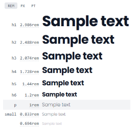 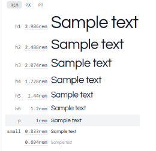

<u>**Colors**</u>

La paleta de OpalTrace ha sido diseñada para contrastar la naturaleza terrestre de la minería con la energía de la innovación tecnológica y el lujo responsable.

- El color de identidad institucional es el Verde Bosque ('#3f816c'), que simboliza la sostenibilidad y la minería ética. Se utiliza en el footer, botones de registro y elementos de navegación principal. Su variante clara, el Verde Agua ('#8dd3c6'), se emplea en tarjetas de beneficios y fondos suaves para denotar limpieza y verificación.

- El color de énfasis industrial es el Naranja Terracota ('#e15921'), que representa el mineral y la tierra. Se aplica en botones de llamada a la acción (CTAs) y alertas importantes. Se complementa con el Naranja Coral ('#ff914d') para destacar elementos interactivos y el Crema Arena ('#ffd086') para fondos de formularios y secciones que requieren un toque de calidez y distinción.

- Los colores neutros incluyen blanco ('#FFFFFF') para contenedores limpios, negro ('#0000') para textos de alto contraste y gris ('#979797') para textos secundarios y bordes, garantizando el cumplimiento de los estándares de contraste para interfaces profesionales.

  

<u>**Spacing**</u>

Se establece una unidad base de 9px para el espaciado interno. Los márgenes mínimos entre secciones de la landing page son de 18px en mobile y 24px en desktop para permitir un flujo visual ordenado. Los radios de borde (border-radius) se definen en 10px para botones, y de 30px a 70px para las tarjetas de contenido (como se observa en los mockups), suavizando la interfaz y dándole un aspecto moderno y amigable.

### 4.1.2. Web Style Guidelines

La interfaz web de OpalTrace adopta un enfoque responsivo y modular, diseñado para ser eficiente tanto en un centro de control minero como en la mano de un consumidor en una joyería.

<u>**Tipografía**</u>

Se utiliza Poppins para los mensajes de impacto y encabezados de sección, aplicando pesos más gruesos para resaltar la propuesta de valor. Questrial se reserva para la explicación de los procesos de trazabilidad (registro de operación, cadena de custodia, etc.) y términos legales, asegurando que la información técnica sea digerible. El interlineado se mantiene en 1.6 para optimizar la lectura de los beneficios de los planes Silver, Gold y Platinum.

<u>**Colores**</u>

La selección cromática en la web refuerza la jerarquía de usuario. El Verde Bosque (#3f816c) actúa como el ancla visual en la barra de navegación y botones primarios de inicio de sesión. El Naranja Terracota (#e15921) se utiliza exclusivamente para las acciones de conversión más importantes, como "Registrarse" o "Subscribirse". Las secciones de "Nuestros Clientes" utilizan fondos claros y bordes sutiles en los tonos de la paleta para diferenciar los segmentos de Mineros, Joyerías y Compradores sin saturar la pantalla.

<u>**Interacción y responsividad**</u>

Los elementos interactivos cuentan con transiciones suaves de 0.3 segundos. Los formularios de registro y contacto utilizan campos amplios con bordes redondeados y tipografía clara para minimizar el error del usuario. La barra de navegación es fija (sticky) para facilitar el acceso a la sección de "Iniciar Sesión" en todo momento. Se garantiza que los elementos de IA e IoT se representen con iconos limpios y colores que indiquen un estado activo y verificado, manteniendo una experiencia de usuario coherente y de alta tecnología.

## 4.2. Information Architecture

### 4.2.1. Organization Systems

La organización del contenido en OpalTrace se estructura para diferenciar la labor informativa del Landing Page de la gestión operativa de la Web Application, asegurando que cada perfil (minera, joyería, consumidor) acceda a los datos de trazabilidad con eficiencia.

**Landing Page**

Se aplica una organización jerárquica (visual hierarchy) diseñada para guiar al visitante desde la propuesta de valor hasta la conversión. El orden de relevancia es:

1. Héroe: Título de impacto centrado en la historia inmutable del mineral.

2. Propuesta Diferenciadora: Trazabilidad IoT, Certificación de Origen y Cumplimiento ESG.

3. Flujo Operativo: Explicación secuencial de 4 pasos (Registro, Extracción, Custodia, Certificación).

4. Segmentos de Audiencia: Soluciones específicas para Productores Mineros, Joyerías y Compradores Finales.

5. Planes de Suscripción: Comparativa de niveles de servicio (Silver, Gold, Platinum).

6. Footer Institucional: Navegación secundaria y enlaces legales.

La categorización sigue un esquema por tópicos (funcionalidades, metodología, precios) y un esquema según audiencia, permitiendo que cada actor de la cadena identifique su solución específica.

**Web Application**

Dentro de la aplicación se utilizan sistemas especializados según el perfil de usuario y la tarea:

- Organización Secuencial (Step-by-step): Se aplica en los flujos críticos de captura de datos:

  - Registro de Lote: Ingreso de peso -> Validación de origen -> Generación de ID único.

  - Cadena de Custodia: Escaneo de QR -> Captura de GPS -> Cambio de estado a "En Tránsito".

  - División de Lotes (Split): Selección de lote padre -> Fragmentación -> Herencia de datos hijos.

- Organización Jerárquica: Utilizada en el Dashboard de Administración (EP06), donde las métricas de seguridad, aprobación de cuentas B2B y alertas de anomalías tienen prioridad visual absoluta.

- Organización Matricial: Empleada en el Inventario de Joyería (EP04), permitiendo separar estrictamente el "Material Certificado" del "Material Externo" mediante filas y columnas que inhabilitan la mezcla de stock.

- Categorización por Audiencia: El sistema adapta el menú lateral y las herramientas según el rol: los Mineros ven herramientas de IoT y sincronización offline, mientras que las Joyerías visualizan certificados y sellos éticos.

### 4.2.2. Labeling Systems

Las etiquetas han sido estandarizadas para evitar confusiones entre el lenguaje industrial y el administrativo, asegurando simplicidad en entornos móviles de campo.

**Landing Page**

| Etiqueta | Contenido que representa |
| :--- | :--- |
| Nosotros | Misión, visión y el rol de MINEX como startup tecnológica. |
| ¿Cómo funciona? | Detalle técnico del proceso de trazabilidad de 4 etapas. |
| Iniciar Sesión | Acceso para usuarios registrados a la plataforma SaaS. |
| Registrarse | Formulario de creación de cuenta para nuevos clientes. |
| Contáctanos | Formulario de soporte para consultas técnicas y comerciales. |
| Planes | Catálogo de suscripciones Silver, Gold y Platinum. |

**Web Application**

| Etiqueta | Contenido que representa |
| :--- | :--- |
| Lotes (Batches) | Listado y registro de minerales en origen. |
| Custodia | Registro de transportes y validación de entregas (GPS). |
| Refinería | Módulo de división (Split) y refinamiento de material. |
| Inventario Joyero | Separación de stock certificado vs. externo. |
| Anomalías | Reportes de discrepancias y bloqueo de lotes. |
| Certificados PDF | Generación de documentos de autenticidad para el cliente. |
| Auditoría (Admin) | Logs de IPs y movimientos inmutables de la red. |
| Offline Sync | Indicador de sincronización de datos locales en caché. |

### 4.2.3. SEO Tags and Meta Tags

**Landing Page**

| Tag | Valor |
| :--- | :--- |
| Title	| OpalTrace: Cada mineral tiene una historia, nosotros la hacemos visible. |
| Description | Plataforma SaaS de trazabilidad y certificación de minerales responsable en Perú. Aseguramos autenticidad mediante IA e IoT. |
| Keywords | trazabilidad minera, minería ética Perú, certificación minerales, IoT minería, IA minera, MINEX, OpalTrace, joyería responsable. |
| Author | MINEX - Startup Tecnológica |

**Web Application**

| Tag | Valor |
| :--- | :--- |
| Title | OpalTrace App - Gestión de Cadena de Custodia |
| Description | Sistema de gestión inmutable para operadores mineros, refinerías y joyerías. Registro de lotes, auditoría y certificación. |
| Keywords | gestión de lotes, trazabilidad industrial, QR minero, custodia de minerales, auditoría B2B. |
| Author | MINEX Technology Team |

### 4.2.4. Searching Systems

Para evitar que los usuarios se pierdan en el volumen de datos de la cadena de suministro, se ofrecen las siguientes opciones:

- Búsqueda por Identificador Único: Una barra global para localizar cualquier lote mediante su ID generado o código QR.

- Filtros de Auditoría (Admin): Permite filtrar movimientos por IP, usuario, rango de fechas y tipo de transacción para investigar posibles fraudes.

- Filtros de Stock (Joyería): Clasificación inmediata entre material "Certificado" y "Externo", evitando la mezcla accidental de inventario.

- Visualización de Resultados: Los datos se presentan en listas dinámicas con estados de color (Verde: Validado, Naranja: En Tránsito, Rojo: Anomalía). Cada resultado permite descargar directamente el certificado PDF de autenticidad.

- Journey Map: Para el consumidor final, la búsqueda se reemplaza por una visualización geográfica (mapa) que muestra los puntos GPS validados por donde pasó la joya.

### 4.2.5. Navigation Systems

El sistema de navegación guía al usuario a través de procesos complejos con el mínimo esfuerzo:

- Navegación Persistente: Un menú lateral (Sidebar) colapsable permite el acceso rápido a los módulos de inventario y trazabilidad. En móvil, se utiliza un menú inferior (Bottom Nav) para acciones rápidas como "Escanear QR".

- Navegación de Flujo (Wizard): Para el registro de lotes y división en refinería, se utilizan indicadores de progreso que informan al usuario en qué etapa del proceso se encuentra.

- Navegación Externa: Enlaces directos a redes sociales oficiales y documentación técnica externa, abriendo siempre en pestañas nuevas para no interrumpir la sesión operativa.

- Navegación Offline: Cuando no hay red, la aplicación muestra un banner de "Modo Offline" que permite seguir navegando por los datos en caché y registrar operaciones en la cola local.

## 4.3. Landing Page UI Design

### 4.3.1. Landing Page Wireframe

**Desktop Landing Page**

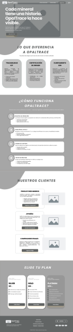
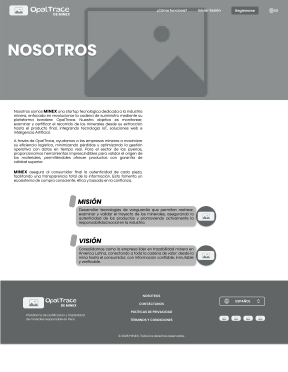
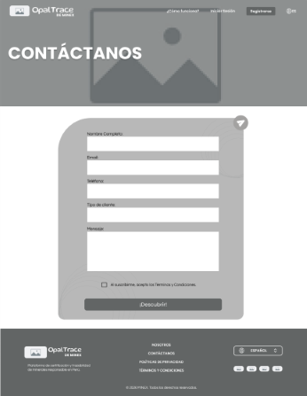
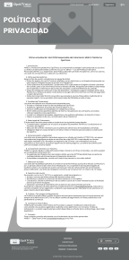
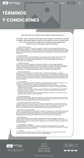

---

## Elementos del Diseño

| Elemento | Justificación |
|----------|---------------|
| **Shape** | Las formas rectangulares con esquinas redondeadas se mantienen como el elemento estructural dominante en todas las páginas del wireframe. En *Contacto*, los campos del formulario son rectángulos de bordes rectos bien definidos, contrastando con el contenedor general del formulario que tiene esquinas redondeadas, creando una jerarquía visual clara entre contenedor e inputs. En *Nosotros*, los bloques de Misión y Visión conservan su forma rectangular redondeada con el acento lateral, confirmando que la forma es intencional y no dependiente del color. Los íconos de placeholder de imagen (montaña) en los headers revelan que las formas rectangulares están previstas como contenedores de imagen desde la etapa de wireframe. |
| **Size** | La jerarquía de tamaños se vuelve aún más evidente sin color: en la *Landing*, el titular principal ("Cada mineral tiene una historia. OpalTrace la hace visible.") es claramente el elemento de mayor tamaño tipográfico, seguido de los títulos de sección en tamaño medio y el cuerpo de texto pequeño. En *Nosotros*, "NOSOTROS" domina visualmente el hero al ser el único elemento de gran tamaño en esa zona. En *Términos y Condiciones* y *Políticas de Privacidad*, los títulos numerados de cada cláusula son perceptiblemente más pequeños que el gran bloque de título del header, lo que estructura visualmente la densidad del contenido legal. |
| **Space** | Sin color como diferenciador, el espacio negativo se convierte en el principal mecanismo de separación entre secciones. En la *Landing* del wireframe, las bandas de fondo alterno (gris claro / blanco / gris oscuro) delimitan las secciones, pero es el espacio vertical entre bloques lo que realmente articula la estructura. En *Contacto*, el espacio entre cada campo del formulario es uniforme y generoso, facilitando la lectura del flujo de datos requeridos. En *Nosotros*, el espacio entre los párrafos introductorios y los bloques de Misión/Visión es suficientemente amplio para que ambas zonas se perciban como secciones distintas. |
| **Line** | Las líneas implícitas generadas por la alineación de elementos son el principal recurso compositivo visible en el wireframe. En *Contacto*, los bordes de los campos de formulario son las únicas líneas explícitas de la página, actuando como guías visuales que ordenan el llenado. En la *Landing*, la separación entre la barra de navegación y el hero se establece por la línea implícita del borde inferior del navbar. En *Términos* y *Privacidad*, los títulos numerados de cada cláusula crean una línea de inicio alineada a la izquierda que actúa como columna vertebral del documento. |
| **Direction** | El flujo vertical descendente es el único eje de lectura en todas las páginas del wireframe, sin distracciones cromáticas. En la *Landing*, la secuencia es inequívoca: hero → diferenciadores → funcionamiento → clientes → planes → footer. Esta progresión guía al usuario a través del embudo de conversión. En *Nosotros*, la dirección vertical lleva desde la presentación corporativa hasta la Misión y la Visión, construyendo el relato institucional de forma ascendente en profundidad. En *Términos* y *Privacidad*, el scroll lineal es la única forma de consumir el contenido, reforzada por la numeración correlativa de las cláusulas. |
| **Texture** | En ausencia de fotografías reales, los placeholders de imagen (ícono de montaña en gris) revelan la intención textural del diseño: los headers de todas las páginas están pensados para albergar imágenes de fondo que aporten riqueza visual. En el wireframe, la textura se simula únicamente a través de las variaciones tonales de gris (fondo oscuro del header, gris medio del área de formulario en *Contacto*, gris claro del footer). Esto demuestra que la estructura textural del diseño es sólida incluso sin activos visuales definitivos. |

---

## Heurísticas de Usabilidad (Jakob Nielsen)

| Heurística | Justificación |
|------------|---------------|
| **H1 – Visibilidad del estado del sistema** | En el wireframe de *Contacto*, el checkbox "Al suscribirme, acepto los Términos y Condiciones" es claramente visible como estado requerido antes del envío. El botón "¡Descubrir!" al tener un fondo oscuro marcado (único elemento de acción primaria en la página) indica visualmente que es el desencadenante del proceso. Sin embargo, al igual que en el diseño a color, no se observan indicadores de estado post-envío (spinner, mensaje de éxito/error), lo que constituye una oportunidad de mejora. |
| **H2 – Relación sistema/mundo real** | El lenguaje del wireframe es idéntico al diseño final, confirmando que la terminología especializada (trazabilidad, cadena de custodia, certificación ESG) fue una decisión arquitectónica, no estética. En *Contacto*, los campos "Nombre Completo", "Email", "Teléfono", "Tipo de cliente" y "Mensaje" responden a los datos que cualquier usuario del sector esperaría proporcionar al contactar a una empresa B2B. El wireframe valida que el contenido y el lenguaje son comprensibles de forma independiente al sistema visual. |
| **H3 – Libertad y control del usuario** | La barra de navegación fija con "¿Cómo funciona?", "Iniciar Sesión" y "Registrarse" se mantiene idéntica en las cinco páginas del wireframe, asegurando que el usuario siempre tiene una salida hacia cualquier sección sin importar en qué punto del sitio se encuentre. El footer replica los cuatro enlaces principales (Nosotros, Contáctanos, Políticas de Privacidad, Términos y Condiciones), duplicando las rutas de escape disponibles. No existen flujos de navegación cerrados o sin retorno. |
| **H4 – Consistencia y estándares** | El wireframe evidencia la consistencia estructural del sistema con mayor claridad que el diseño a color: el navbar tiene exactamente la misma disposición y contenido en todas las páginas, el footer replica la misma organización en tres columnas (logo+descripción, enlaces, selector de idioma+redes sociales), y los encabezados hero siguen siempre el mismo patrón (imagen de fondo con overlay + título en blanco a la izquierda). Esta consistencia estructural confirma que el sistema de diseño opera con estándares definidos. |
| **H5 – Prevención de errores** | En *Contacto* del wireframe, el checkbox de aceptación de términos aparece visualmente desactivado (vacío) de forma predeterminada, lo que previene envíos accidentales. Las etiquetas de texto están posicionadas encima de cada campo de formulario y permanecen visibles durante el llenado, evitando que el usuario olvide qué dato debe ingresar en cada campo. Se recomienda que en la implementación se añada validación de formato para el campo Email y restricción numérica para Teléfono. |
| **H6 – Reconocer antes que recordar** | En la *Landing* del wireframe, las tres tarjetas de tipo de cliente (Productores Mineros, Joyerías, Compradores Finales) con sus botones de acción específicos están todas visibles simultáneamente en la misma sección, eliminando la necesidad de que el usuario recuerde cuál es su perfil o navegue para encontrar su acceso. Los cuatro pasos de "¿Cómo funciona?" están numerados y visibles en secuencia, sin requerir que el usuario memorice el proceso de una pantalla a otra. |
| **H7 – Flexibilidad y eficiencia** | El selector de idioma (globo + "ES") en la esquina superior derecha del navbar es un acelerador de acceso inmediato para usuarios de habla no hispana, visible desde cualquier página sin necesidad de buscar en menús secundarios. En la *Landing*, los tres botones de acción segmentados por perfil de usuario actúan como atajos que evitan que cada tipo de cliente pase por un flujo genérico antes de llegar a su función específica. |
| **H8 – Diseño estético y minimalista** | El wireframe de *Términos y Condiciones* y *Políticas de Privacidad* muestra que incluso sin color, el contenido legal está contenido en un único bloque blanco centrado sin elementos decorativos laterales, columnas adicionales ni banners secundarios. En *Nosotros*, los tres párrafos introductorios y los dos bloques de Misión/Visión son los únicos elementos de contenido en la página, sin sidebars, widgets ni elementos que compitan por la atención del usuario. |
| **H9 – Reconocer y recuperarse de errores** | El wireframe no evidencia mensajes de error o validación inline en el formulario de *Contacto*, lo que es una brecha de diseño identificable ya desde esta etapa. Se recomienda incorporar en el diseño final indicadores visuales de campo inválido (borde rojo, ícono de advertencia y texto explicativo debajo del campo) para que el usuario pueda identificar y corregir errores sin reenviar el formulario completo. |
| **H10 – Ayuda y documentación** | Las páginas de *Términos y Condiciones* y *Políticas de Privacidad* están accesibles desde el footer de todas las páginas, funcionando como documentación legal organizada y siempre localizable. La sección "¿Cómo funciona?" en la *Landing* desglosa el proceso en cuatro pasos concisos y numerados que actúan como guía de uso inline. El enlace "¿Cómo funciona?" en el navbar refuerza el acceso a esta documentación funcional desde cualquier página del sitio. |

---

## Principios de Arquitectura de Información

| Principio | Justificación |
|-----------|---------------|
| **Objects** | El wireframe de la *Landing* trata cada mineral como un objeto con ciclo de vida visible: los cuatro pasos (Registro de Operación, Creación de Lote IoT, Cadena de Custodia, Certificación Final) representan las etapas de vida del objeto mineral dentro de la plataforma, con sus atributos específicos listados en cada tarjeta (coordenadas GPS, firma digital, código QR, transparencia total). Sin color ni fotografía, la estructura de contenido sola es suficiente para comunicar este ciclo de vida. |
| **Choices** | La *Landing* del wireframe ofrece tres rutas de acceso diferenciadas por tipo de usuario (Productores Mineros, Joyerías, Compradores Finales), cada una con su propio botón de acción. La sección "Elige tu Plan" presenta tres opciones (Silver, Gold, Platinium) en columnas paralelas que facilitan la comparación directa. La navegación ofrece dos puntos de entrada al sistema (Iniciar Sesión y Registrarse), atendiendo a usuarios nuevos y recurrentes. |
| **Disclosure** | El wireframe evidencia claramente la estrategia de divulgación progresiva: el hero de la *Landing* comunica el concepto central de forma sintética, la sección de diferenciadores introduce los tres pilares con listas breves, y las páginas de *Términos* y *Privacidad* representan el nivel de máximo detalle para usuarios que requieren información exhaustiva. El usuario elige su nivel de profundidad sin ser forzado a consumir todo el contenido de una vez. |
| **Exemplars** | La sección "Nuestros Clientes" de la *Landing* usa tres ejemplares concretos de perfil de usuario, cada uno con una descripción de caso de uso real y un botón de acción específico. Aunque en el wireframe los placeholders de imagen son genéricos, la estructura de cada tarjeta (título del perfil + descripción de beneficios + CTA) confirma que el patrón de ejemplar está integrado en la arquitectura de contenido, no en los activos visuales. |
| **Front doors** | Todas las páginas secundarias del wireframe (*Contacto*, *Nosotros*, *Términos*, *Privacidad*) son completamente autosuficientes: el navbar con opciones de registro e inicio de sesión, el footer con todos los enlaces del sitio y el selector de idioma garantizan que un usuario que llegue directamente a cualquiera de estas páginas desde un buscador pueda orientarse, entender el contexto de la empresa y navegar hacia cualquier otra sección sin pasar por la home. |
| **Multiple classification** | El contenido de la plataforma puede encontrarse a través de múltiples rutas visibles en el wireframe: por tipo de usuario en la *Landing*, por funcionalidad desde el navbar ("¿Cómo funciona?"), por nivel de plan (Silver/Gold/Platinium), por sección informativa desde el footer (Nosotros, Contáctanos) o por idioma mediante el selector. Esta redundancia de rutas garantiza que distintos perfiles de usuario puedan encontrar la información según su propio modelo mental. |
| **Focused navigation** | El navbar del wireframe está definido por su contenido, no por su posición: "¿Cómo funciona?" responde a la necesidad de comprensión del proceso, "Iniciar Sesión" atiende a usuarios existentes y "Registrarse" a nuevos usuarios. El footer agrupa los enlaces por naturaleza informativa-legal (Nosotros, Contáctanos, Políticas de Privacidad, Términos y Condiciones), estableciendo una separación semántica clara entre la navegación funcional del navbar y la navegación documental del footer. |
| **Growth** | La grilla de tarjetas de "Nuestros Clientes" en el wireframe de la *Landing* admite la incorporación de nuevos perfiles de cliente sin alterar la estructura existente. La sección de planes puede escalar añadiendo una nueva columna sin romper el layout en tres columnas. El footer con su estructura de tres columnas permite añadir nuevas páginas informativas sin rediseño. Los bloques de Misión y Visión en *Nosotros* pueden ampliarse con nuevas secciones (Valores, Equipo) siguiendo el mismo patrón visual. |

---

## Principios de Inclusive Design

| Principio | Justificación |
|-----------|---------------|
| **P1 – Proporciona experiencias comparables** | El wireframe confirma que la estructura de la interfaz es accesible independientemente del sistema visual final: las etiquetas de texto sobre los campos del formulario en *Contacto* son elementos estructurales, no decorativos, lo que garantiza compatibilidad con lectores de pantalla. El contenido de *Términos* y *Privacidad* está en texto plano estructurado, accesible para cualquier tecnología de asistencia. El selector de idioma en el navbar asegura que usuarios de distintas lenguas puedan acceder a la misma calidad de información. |
| **P2 – Considera la situación del usuario** | El wireframe en escala de grises simula condiciones de baja visibilidad de color (daltonismo, pantallas de baja calidad, impresión en blanco y negro), y el diseño sigue siendo completamente legible y funcional. Los títulos de sección son reconocibles por tamaño y posición sin necesidad de color. Los botones CTA son identificables por su forma rectangular y fondo oscuro, sin depender del color naranja. Esto valida que el diseño funciona en condiciones adversas de visualización. |
| **P3 – Sé consistente** | La consistencia del wireframe es su característica más evidente: el navbar, el footer, la estructura de los headers hero y la disposición de los contenidos son idénticos en las cinco páginas. Los campos del formulario en *Contacto* siguen el mismo patrón visual (etiqueta encima, input rectangular blanco). Los bloques de Misión y Visión en *Nosotros* siguen el mismo patrón estructural (acento lateral + título en cursiva + cuerpo sobre fondo oscuro). Esta consistencia hace que la interfaz sea predecible y fácil de aprender. |
| **P4 – Deja al usuario mandar** | La navegación global persistente en todas las páginas del wireframe garantiza que el usuario puede cambiar de sección en cualquier momento sin restricciones. En *Contacto*, el campo "Tipo de cliente" es de texto libre, permitiendo que el usuario se autodesciba en sus propios términos. No se observan elementos modales, restricciones de scroll o flujos bloqueantes que limiten la autonomía del usuario para navegar a su propio ritmo. |
| **P5 – Ofrece opciones** | La *Landing* del wireframe ofrece múltiples rutas para llegar al mismo objetivo (registrarse en la plataforma): el botón "Registrarse" en el navbar, los botones específicos por tipo de cliente en la sección "Nuestros Clientes" y los botones "Suscribirse" en la sección de planes. El footer ofrece "Contáctanos" como alternativa para usuarios que prefieren comunicarse antes de registrarse. Esta redundancia de opciones reduce la fricción para usuarios con distintos niveles de confianza o familiaridad con la plataforma. |
| **P6 – Prioriza el contenido** | En el wireframe de *Nosotros*, los bloques de Misión y Visión son visualmente más prominentes que los párrafos introductorios gracias a su mayor peso visual (fondo oscuro, título en negrita/cursiva, acento lateral), jerarquizando el contenido más estratégico de la página. En la *Landing*, el titular del hero es el elemento de mayor tamaño tipográfico de toda la página, asegurando que la propuesta de valor sea lo primero que el usuario procesa. En *Términos* y *Privacidad*, los títulos numerados priorizan la estructura sobre el contenido denso. |
| **P7 – Agrega valor** | El wireframe demuestra que funciones como el selector de idioma, los botones de acción segmentados por perfil y el acceso a documentación legal desde el footer son decisiones arquitectónicas de valor, no dependientes del sistema visual. La presencia del ícono de envío (avión de papel) sobre el formulario de *Contacto* agrega valor comunicacional incluso en escala de grises, anticipando la función de la página sin necesidad de leer el título. El sistema de navegación doble (navbar funcional + footer documental) agrega valor para usuarios con distintos objetivos de visita. |

**Mobile Web Browser**

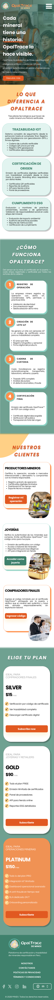
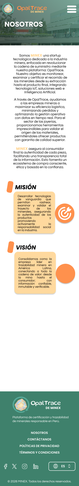
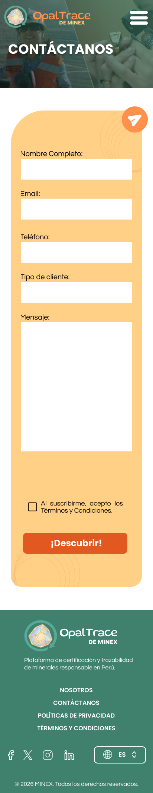
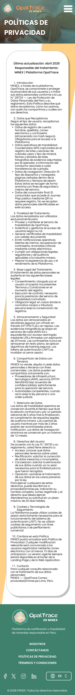
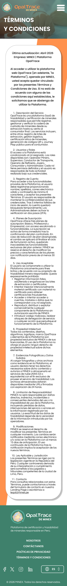
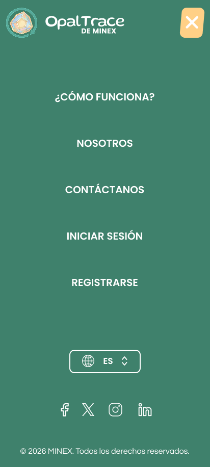

---

## Elementos del Diseño

| Elemento | Justificación |
|----------|---------------|
| **Colour** | La paleta cromática se mantiene coherente con la versión desktop pero adquiere mayor protagonismo en mobile por la reducción del espacio disponible. En *Contáctanos*, el fondo del formulario en naranja/melocotón intenso ocupa prácticamente toda la pantalla, convirtiéndose en el elemento visual dominante que delimita la zona de interacción. En *Inicio de Sesión* y *Registro*, el degradado naranja en la esquina superior derecha contrasta con el blanco del card del formulario, creando profundidad sin recargar la interfaz. El teal oscuro del footer y del menú hamburguesa desplegable (*M_LP-1*) actúa como color de cierre visual en todas las páginas. El botón "Iniciar sesión" en verde teal y el botón "¡Descubrir!" en naranja-rojo diferencian cromáticamente las acciones primarias según el contexto de cada página. |
| **Shape** | El uso de formas circulares es un elemento diferenciador exclusivo de la versión móvil que no aparece con la misma fuerza en desktop. En *Inicio de Sesión* y *Registro*, los círculos de fondo con fotografías de contexto minero (trabajadores, joyería) enmarcan el card del formulario de forma orgánica, suavizando la rigidez de la estructura rectangular. El logo circular de OpalTrace en el header móvil adquiere mayor peso visual al ser prácticamente el único elemento de marca en esa zona. Los campos de formulario en *Inicio de Sesión* y *Registro* usan bordes redondeados más pronunciados que en desktop, siguiendo las convenciones de diseño táctil móvil. El ícono de envío (avión de papel) en *Contáctanos* es circular, contrastando con los inputs rectangulares del formulario. |
| **Size** | El tamaño tipográfico se ajusta al contexto móvil de forma notable. Los títulos hero ("CONTÁCTANOS", "NOSOTROS", "POLÍTICAS DE PRIVACIDAD", "TÉRMINOS Y CONDICIONES") ocupan casi el ancho completo de la pantalla, siendo visibles sin necesidad de hacer zoom. En el menú desplegable (*M_LP-1*), los cinco ítems de navegación ("¿CÓMO FUNCIONA?", "NOSOTROS", "CONTÁCTANOS", "INICIAR SESIÓN", "REGISTRARSE") están dispuestos con tipografía grande y espaciado generoso entre ellos, facilitando el toque en pantallas pequeñas. En *Nosotros*, los títulos "MISIÓN" y "VISIÓN" son considerablemente más grandes que el cuerpo de texto, jerarquizando el contenido clave. En *Políticas de Privacidad*, el texto del cuerpo es notablemente más pequeño que los títulos de sección, lo que es un reto de legibilidad en pantallas de baja resolución. |
| **Space** | El espacio entre elementos interactivos es generoso y está adaptado a la interacción táctil. En el menú móvil desplegable (*M_LP-1*), el espacio vertical entre cada ítem de navegación es amplio, reduciendo el riesgo de toques accidentales. En *Inicio de Sesión* y *Registro*, los campos de formulario tienen separación vertical uniforme que facilita el llenado secuencial con el teclado virtual desplegado. En *Contáctanos*, el espacio entre el campo "Mensaje" (de altura extendida) y el checkbox de aceptación es suficiente para distinguir el área de escritura de la zona de acción. En *Nosotros*, el espacio entre los párrafos introductorios y los bloques de Misión/Visión crea una separación sección-a-sección perceptible en scroll. |
| **Direction** | El flujo de lectura y navegación es estrictamente vertical en todas las pantallas móviles, coherente con el patrón de scroll de una mano. En la *Landing* móvil (*M_LP*), el contenido se apila en una sola columna siguiendo la secuencia: hero → diferenciadores → funcionamiento → clientes → planes, guiando al usuario a través del embudo de conversión mediante scroll continuo. En *Contáctanos*, los campos del formulario se apilan verticalmente en el orden lógico de un proceso de contacto (identificación → datos de contacto → clasificación → mensaje). En el menú desplegable (*M_LP-1*), los ítems se organizan verticalmente de arriba a abajo en orden de relevancia para el usuario (funcionalidad → información → acceso → registro). |
| **Texture** | Las fotografías circulares de fondo en *Inicio de Sesión* y *Registro* aportan textura contextual al entorno del formulario, humanizando una pantalla que de otro modo sería puramente funcional. Las imágenes muestran trabajadores mineros y ambientes de joyería, reforzando el contexto de uso de la plataforma. En *Nosotros* y *Contáctanos*, las fotografías del hero con overlay teal aportan textura visual al banner superior. En la *Landing* móvil, las tarjetas de "Nuestros Clientes" incluyen fotografías reales que aportan riqueza textural a secciones de otra forma dominadas por texto. |
| **Line** | Las líneas explícitas son mínimas en la versión móvil, siguiendo el principio de diseño limpio. Los bordes de los campos de formulario en *Inicio de Sesión*, *Registro* y *Contáctanos* son las únicas líneas explícitas de cada pantalla, cumpliendo una función puramente funcional de delimitación de área de entrada. En el footer de todas las páginas, la separación entre el bloque de logo/descripción y los enlaces de navegación se logra mediante espacio vertical, no líneas. El separador entre el copyright y el resto del footer es la única línea horizontal visible en la interfaz móvil. |

---

## Heurísticas de Usabilidad (Jakob Nielsen)

| Heurística | Justificación |
|------------|---------------|
| **H1 – Visibilidad del estado del sistema** | En *Inicio de Sesión*, el campo de Email usa el texto "Email" como placeholder y el de Contraseña usa "Contraseña", indicando visualmente el estado vacío/pendiente de cada campo. El botón "Iniciar sesión" está siempre visible y activo visualmente (fondo teal sólido), informando al usuario que la acción está disponible. En *Registro*, la indicación "Mínimo 8 caracteres" debajo del campo de contraseña es un indicador de estado preventivo que informa al usuario del requisito antes de que cometa el error. Sin embargo, no se observan indicadores de carga, spinner o mensajes de confirmación post-envío en ninguna de las pantallas, lo que sería necesario implementar para cumplir esta heurística plenamente. |
| **H2 – Relación sistema/mundo real** | El saludo "Bienvenido" en la pantalla de *Inicio de Sesión* usa lenguaje cercano y coloquial, propio de la comunicación digital con el usuario final. Los campos "Nombres" y "Apellidos" en *Registro* están separados (en lugar de usar un genérico "Nombre completo"), lo que corresponde a la forma en que los documentos de identidad y formularios formales solicitan esta información en el contexto latinoamericano. El enlace "¿Olvidaste tu contraseña?" usa una pregunta directa en lugar de "Recuperar contraseña", apelando al lenguaje natural del usuario. En *Contáctanos*, el botón "¡Descubrir!" aunque efectista, podría generar ambigüedad respecto a la acción real que desencadena (enviar un formulario de contacto). |
| **H3 – Libertad y control del usuario** | El menú hamburguesa desplegable (*M_LP-1*) incluye un botón de cierre en forma de "X" en naranja en la esquina superior derecha, proporcionando una salida de emergencia clara e inmediata para el usuario que abrió el menú por error. En *Inicio de Sesión*, el enlace "¿No tienes cuenta? Regístrate aquí" y en *Registro* el enlace "¿Ya tienes una cuenta? Inicia Sesión" permiten cambiar de flujo sin retroceder con el botón nativo del navegador. El footer disponible en todas las páginas con los cuatro enlaces principales garantiza libertad de navegación desde cualquier punto. |
| **H4 – Consistencia y estándares** | El header móvil es idéntico en todas las páginas: logo circular de OpalTrace a la izquierda e ícono hamburguesa a la derecha. El footer replica exactamente la misma estructura en todas las pantallas: logo + descripción, cuatro enlaces de navegación, íconos de redes sociales y selector de idioma. Los botones de acción primaria (verde teal en *Inicio de Sesión* y *Registro*, naranja-rojo en *Contáctanos* y *Landing*) mantienen su estilo consistente dentro de cada contexto funcional. El selector de idioma (globo + "ES" + flechas) tiene el mismo diseño y posición en footer de todas las páginas. |
| **H5 – Prevención de errores** | En *Registro*, la indicación "Mínimo 8 caracteres" aparece directamente bajo el campo de contraseña como guía preventiva antes de que el usuario cometa el error. El campo "Confirmar Contraseña" en *Registro* obliga a una doble entrada, previniendo errores de tipeo en un campo crítico. El checkbox de aceptación de términos en *Contáctanos* y *Registro* requiere una acción deliberada antes del envío, evitando suscripciones o registros accidentales. El enlace subrayado "He leído y acepto los términos de uso y políticas de privacidad" en *Registro* lleva directamente al documento legal, evitando que el usuario acepte algo que no ha podido revisar. |
| **H6 – Reconocer antes que recordar** | En el menú desplegable (*M_LP-1*), todas las secciones del sitio están visibles simultáneamente, eliminando la necesidad de que el usuario recuerde la estructura de navegación. En *Inicio de Sesión*, los enlaces "¿Olvidaste tu contraseña?" y "¿No tienes cuenta? Regístrate aquí" están visibles sin scroll, anticipando las dos situaciones de error más comunes sin que el usuario tenga que buscarlos. En *Registro*, los placeholders de los campos ("Nombres", "Apellidos", "Email", "Contraseña", "Confirmar Contraseña") refuerzan visualmente qué dato corresponde a cada campo incluso durante el llenado. |
| **H7 – Flexibilidad y eficiencia** | El menú hamburguesa desplegable con todos los ítems de navegación en pantalla completa permite a usuarios expertos saltar directamente a cualquier sección con un solo toque, sin necesidad de navegar jerárquicamente. El enlace "Regístrate aquí" en *Inicio de Sesión* y "Inicia Sesion" en *Registro* son atajos cruzados que evitan que el usuario tenga que salir de la pantalla actual y buscar la opción alternativa. El selector de idioma en el footer es accesible desde cualquier página sin pasos intermedios. |
| **H8 – Diseño estético y minimalista** | La pantalla de *Inicio de Sesión* es el ejemplo más claro de diseño minimalista en la versión móvil: solo contiene el saludo "Bienvenido", dos campos (Email, Contraseña), un botón de acción primaria y dos enlaces auxiliares, sin ningún elemento decorativo que compita con la tarea principal. El menú desplegable (*M_LP-1*) es igualmente minimalista: fondo teal sólido, cinco ítems de navegación en tipografía grande, selector de idioma e íconos de redes sociales, sin imágenes ni elementos adicionales. En *Registro*, el formulario concentra solo los campos estrictamente necesarios para crear una cuenta. |
| **H9 – Reconocer y recuperarse de errores** | En las pantallas de *Inicio de Sesión* y *Registro*, no se observan mensajes de error o validación inline visibles en el diseño estático, lo que representa una brecha importante en mobile donde el espacio es limitado y el usuario no puede ver el formulario completo sin hacer scroll. Se recomienda implementar mensajes de error inline debajo de cada campo (borde rojo + texto explicativo corto) para que el usuario identifique y corrija el error sin perder el contexto de qué campo está fallando. En *Inicio de Sesión*, el enlace "¿Olvidaste tu contraseña?" es la única ruta de recuperación visible ante el error de credenciales. |
| **H10 – Ayuda y documentación** | El enlace "He leído y acepto los términos de uso y políticas de privacidad" en *Registro* proporciona acceso directo a la documentación legal relevante en el momento exacto en que el usuario la necesita, sin obligarle a buscarla. Las páginas de *Términos y Condiciones* y *Políticas de Privacidad* están accesibles desde el footer de todas las páginas móviles. En *Políticas de Privacidad*, la estructura numerada del 1 al 11 organiza el contenido en secciones temáticas que el usuario puede escanear rápidamente para encontrar la información específica que busca. |

---

## Principios de Arquitectura de Información

| Principio | Justificación |
|-----------|---------------|
| **Objects** | En la *Landing* móvil, cada mineral trazado se trata como un objeto con ciclo de vida visible a través de los cuatro pasos numerados (Registro de Operación, Creación de Lote IoT, Cadena de Custodia, Certificación Final), cada uno con sus atributos específicos listados. La pantalla de *Inicio de Sesión* trata la sesión del usuario como un objeto con estado propio: inexistente (registro), activo (sesión iniciada) o recuperable (contraseña olvidada), y ofrece rutas para cada uno de estos estados. En *Políticas de Privacidad*, los datos del usuario se tratan como objetos con atributos clasificados (datos de registro, datos operativos, datos de navegación, datos del consumidor final) y ciclo de vida definido (retención, eliminación, anonimización). |
| **Choices** | El menú desplegable móvil (*M_LP-1*) presenta cinco opciones significativas que cubren los distintos objetivos de visita: comprensión del producto ("¿Cómo funciona?"), información corporativa ("Nosotros"), contacto ("Contáctanos"), acceso de usuarios existentes ("Iniciar Sesión") y captación de nuevos usuarios ("Registrarse"). En la *Landing* móvil, los tres botones de acción diferenciados por tipo de cliente (Productores Mineros, Joyerías, Compradores Finales) ofrecen rutas de entrada adaptadas al perfil real del usuario. Los tres planes (Silver, Gold, Platinium) presentan opciones de suscripción comparables en una sola vista de scroll. |
| **Disclosure** | La versión móvil aplica divulgación progresiva de forma especialmente rigurosa, dado que el espacio de pantalla es limitado. El hero de la *Landing* comunica la propuesta de valor en dos líneas ("Cada mineral tiene una historia. OpalTrace la hace visible."), sin detalles técnicos. La sección de diferenciadores introduce los tres pilares con listas breves. Las páginas de *Términos* y *Privacidad* representan el nivel máximo de detalle, accesibles solo para quienes deciden profundizar. La pantalla de *Inicio de Sesión* muestra únicamente los elementos imprescindibles para la tarea de autenticación, sin exponer información sobre planes, características u otros contenidos. |
| **Exemplars** | La sección "Nuestros Clientes" de la *Landing* móvil usa tres ejemplares concretos de perfil de usuario con fotografía real, título del perfil, descripción de beneficios específicos y botón de acción correspondiente. Cada tarjeta de cliente funciona como un ejemplo tangible del valor que la plataforma aporta a ese segmento: "Certifica tu operación, accede a mercados internacionales" (Productores Mineros), "Verifica la autenticidad de los minerales que compras" (Joyerías), "Ingresa el código brindado por el certificado OpalTrace" (Compradores Finales). |
| **Front doors** | Las páginas de *Contáctanos*, *Nosotros*, *Políticas de Privacidad* y *Términos y Condiciones* en versión móvil son completamente autosuficientes: todas incluyen el header con logo y menú de acceso completo, y el footer con los cuatro enlaces de navegación, selector de idioma e íconos de redes sociales. Un usuario que llegue directamente a *Políticas de Privacidad* desde un resultado de búsqueda en su móvil puede entender el contexto de la empresa (footer) y navegar hacia cualquier otra sección sin necesidad de pasar por la home. Las pantallas de *Inicio de Sesión* y *Registro* incluyen también rutas cruzadas entre sí. |
| **Multiple classification** | El contenido de OpalTrace puede encontrarse en la versión móvil a través de múltiples rutas: mediante el menú hamburguesa desplegable (navegación global), mediante los botones de acción por tipo de cliente en la *Landing* (clasificación por perfil de usuario), mediante los botones de plan en la sección "Elige tu Plan" (clasificación por nivel de servicio), o mediante el footer (clasificación por tipo de contenido: informativo-corporativo vs. legal). El selector de idioma añade una dimensión adicional de clasificación por mercado lingüístico. |
| **Focused navigation** | El menú desplegable móvil (*M_LP-1*) está definido por el contenido que agrupa, no por su posición: "¿Cómo funciona?" responde a la necesidad de comprensión del producto, "Nosotros" a la necesidad de confianza institucional, "Contáctanos" a la necesidad de comunicación directa, "Iniciar Sesión" al acceso de usuarios recurrentes y "Registrarse" a la captación de nuevos usuarios. El footer agrupa los enlace por naturaleza documental-legal, separando semánticamente la navegación funcional (menú hamburguesa) de la navegación informativa (footer). |
| **Growth** | La estructura de tarjetas de "Nuestros Clientes" en la *Landing* móvil es escalable: el patrón de una tarjeta por tipo de cliente (imagen + título + lista de beneficios + botón CTA) puede replicarse para añadir nuevos segmentos sin alterar el layout de columna única. El menú desplegable puede incorporar nuevos ítems de navegación siguiendo el mismo patrón tipográfico. Los planes Silver/Gold/Platinium están estructurados como tarjetas apilables verticalmente, lo que permite añadir un nuevo nivel sin rediseño. El footer con su estructura modular admite nuevas páginas informativas o legales. |

---

## Principios de Inclusive Design

| Principio | Justificación |
|-----------|---------------|
| **P1 – Proporciona experiencias comparables** | Las pantallas de *Inicio de Sesión* y *Registro* en versión móvil ofrecen la misma funcionalidad que en desktop, sin recortar campos ni simplificar el proceso de autenticación por limitaciones de espacio. Las etiquetas de texto ("Email", "Contraseña", "Nombres", "Apellidos") están posicionadas encima de cada campo, manteniéndose visibles durante el llenado y siendo compatibles con lectores de pantalla. El contenido legal en *Políticas de Privacidad* y *Términos y Condiciones* está disponible en su totalidad en mobile, sin versiones resumidas o simplificadas que priven al usuario de información relevante. |
| **P2 – Considera la situación del usuario** | El diseño del menú hamburguesa desplegable en pantalla completa (*M_LP-1*) está pensado para el uso con una sola mano: los cinco ítems de navegación tienen un tamaño de toque generoso y están centrados en pantalla, accesibles con el pulgar sin necesidad de estirar el dedo. Los campos de formulario en *Contáctanos*, *Inicio de Sesión* y *Registro* tienen altura suficiente para ser seleccionados fácilmente con el dedo en contextos de uso en movimiento. El alto contraste entre el texto blanco y el fondo teal oscuro en el header y footer facilita la lectura en condiciones de luz solar directa, frecuente en el contexto minero al aire libre. |
| **P3 – Sé consistente** | El patrón de header móvil (logo circular a la izquierda + hamburguesa a la derecha) es idéntico en todas las pantallas. El footer replica exactamente la misma estructura en todas las páginas. Los botones de acción primaria mantienen el mismo estilo dentro de cada contexto funcional: verde teal para autenticación (*Inicio de Sesión*, *Registro*) y naranja-rojo para conversión (*Contáctanos*, *Landing*). Los campos de formulario tienen el mismo estilo en todas las pantallas que los incluyen (borde redondeado, placeholder en gris, fondo blanco). Esta consistencia hace que el comportamiento de la interfaz sea predecible sin importar en qué pantalla esté el usuario. |
| **P4 – Deja al usuario mandar** | El botón de cierre "X" en el menú desplegable permite al usuario cerrarlo en cualquier momento sin consecuencias. En *Registro*, el enlace "¿Ya tienes una cuenta? Inicia Sesion" y en *Inicio de Sesión* el enlace "¿No tienes cuenta? Regístrate aquí" permiten al usuario cambiar de decisión en cualquier momento del flujo. El scroll libre en todas las páginas permite al usuario avanzar o retroceder en el contenido a su propio ritmo. En *Políticas de Privacidad* y *Términos y Condiciones*, el usuario puede leer el contenido completo sin ser forzado a aceptar nada para continuar navegando. |
| **P5 – Ofrece opciones** | La pantalla de *Inicio de Sesión* ofrece dos rutas alternativas según la situación del usuario: recuperación de contraseña ("¿Olvidaste tu contraseña?") y registro de cuenta nueva ("¿No tienes cuenta? Regístrate aquí"), cubriendo los dos casos de uso más frecuentes además del acceso estándar. La *Landing* móvil ofrece tres puntos de entrada diferenciados por tipo de cliente, reduciendo la fricción al no obligar a todos los perfiles a seguir el mismo flujo de registro genérico. El footer ofrece "Contáctanos" como alternativa para usuarios que prefieren comunicarse antes de comprometerse con un registro. |
| **P6 – Prioriza el contenido** | En *Inicio de Sesión*, el único elemento de contenido que compite con el formulario es el saludo "Bienvenido" en tipografía grande, priorizando completamente la tarea de autenticación. En *Nosotros* móvil, los bloques de Misión y Visión con fondo naranja y tipografía destacada están claramente jerarquizados sobre los párrafos de texto plano, guiando la atención hacia el contenido estratégico de la empresa. En el menú desplegable (*M_LP-1*), el fondo teal sólido y el tamaño de fuente grande priorizan los ítems de navegación como el único contenido relevante en ese estado de la interfaz. |
| **P7 – Agrega valor** | Las fotografías circulares de contexto en *Inicio de Sesión* y *Registro* agregan valor humanizando unas pantallas que son puramente funcionales, recordando al usuario el sector y el propósito de la plataforma en el momento de autenticarse. La indicación "Mínimo 8 caracteres" en *Registro* agrega valor preventivo al guiar al usuario sobre los requisitos de seguridad antes de cometer el error. El enlace directo a Términos y Políticas en el checkbox de *Registro* agrega valor de transparencia, permitiendo al usuario revisar los documentos legales en el momento exacto en que los necesita, sin interrumpir el flujo de registro. |

### 4.3.2. Landing Page Mock-up

**Desktop Landing Page**

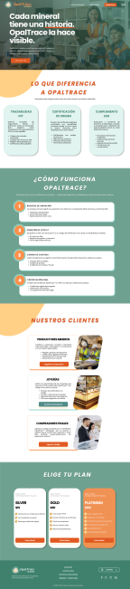
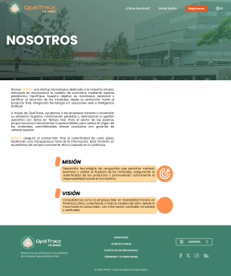
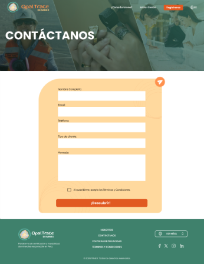

---

## Elementos del Diseño

| Elemento | Justificación |
|----------|---------------|
| **Colour** | La paleta utiliza naranja/coral como color de acción y teal oscuro como color corporativo. En la *Landing*, los botones CTA "Regístrate" y el plan Platinium aparecen en naranja para guiar la mirada hacia las conversiones. En *Términos* y *Privacidad*, el fondo blanco con el color de acento naranja restringido al header crea jerarquía visual sin distraer la lectura de contenido legal. En *Contacto*, el fondo del formulario en color melocotón suave diferencia la zona interactiva del fondo blanco circundante. |
| **Shape** | Se usan formas rectangulares con esquinas redondeadas de forma consistente en tarjetas, campos de formulario y botones, generando una sensación moderna y amigable. En la *Landing*, las tarjetas de las tres propuestas de valor (Trazabilidad IoT, Certificación, Cumplimiento) y las de clientes (Productores Mineros, Joyerías, Compradores) mantienen el mismo tratamiento de borde. Los íconos circulares (logotipo, pasos numerados en "¿Cómo funciona?") contrastan con los rectángulos y aportan variedad sin romper coherencia. En *Nosotros*, los bloques de Misión y Visión usan rectángulos redondeados con un acento naranja lateral que actúa como divisor visual. |
| **Direction** | El flujo de lectura en la *Landing* es estrictamente vertical (scroll), guiando al usuario desde la propuesta de valor principal, hacia el diferenciador, el funcionamiento, los clientes y finalmente los planes de precio. Esta dirección descendente acompaña el recorrido de decisión de compra. En *Nosotros*, las secciones Misión y Visión se disponen de forma vertical y secuencial, reforzando la lectura narrativa. En *Contacto*, los campos del formulario se apilan verticalmente facilitando el llenado lineal sin ambigüedad. |
| **Size** | La jerarquía tipográfica es clara: el titular principal de la *Landing* ("Cada mineral tiene una historia") es el elemento de mayor tamaño en toda la página, seguido de los títulos de sección en tamaño medio, y el cuerpo textual en tamaño pequeño. En *Nosotros*, "NOSOTROS" en el hero ocupa casi todo el ancho, estableciendo una jerarquía dominante. En *Términos y Condiciones* y *Políticas de Privacidad*, los títulos de cláusulas son notablemente más pequeños que el gran banner del header, marcando la transición hacia contenido denso. |
| **Texture** | Las imágenes de fondo en los headers de todas las páginas usan fotografías reales del sector minero y de joyería superpuestas con un overlay de color teal semitransparente. Esto aporta textura visual sin sacrificar legibilidad del texto blanco superpuesto. En *Nosotros*, los bloques de Misión y Visión tienen un fondo anaranjado que actúa como textura de color diferenciando esas áreas del resto del contenido blanco. |
| **Space** | El uso del espacio negativo es generoso en todas las páginas: las secciones de la *Landing* tienen separaciones verticales amplias entre bloques, evitando la sensación de saturación. En *Contacto*, el formulario centra su contenido con márgenes amplios a los lados, dando respiro visual. En *Nosotros*, los párrafos introductorios tienen interlineado y separación que facilitan la lectura. En las páginas de *Términos* y *Privacidad*, el contenido se enmarca en un contenedor blanco con espacio interno generoso respecto al fondo. |
| **Line** | En la *Landing*, los separadores entre secciones se logran a través del contraste de color de fondo (blanco a teal, teal a crema/melocotón) en lugar de líneas explícitas, resultando en una delimitación limpia. En *Nosotros*, el pequeño rectángulo naranja vertical junto al título "Misión" y "Visión" actúa como línea de acento que ordena visualmente el contenido. En el navbar, la línea implícita entre logo/navegación y botones CTA se mantiene por alineación consistente. |

---

## 10 Heurísticas de Usabilidad (Jakob Nielsen)

| Heurística | Justificación |
|------------|---------------|
| **H1 – Visibilidad del estado del sistema** | En *Contacto*, el formulario incluye un checkbox de aceptación de términos visible antes del envío, informando al usuario del estado requerido antes de continuar. El botón "¡Descubrir!" actúa como indicador del estado de acción disponible. Sin embargo, no se aprecian indicadores de progreso o confirmación visual post-envío en el diseño estático, lo que sería una mejora recomendable. |
| **H2 – Relación sistema/mundo real** | El lenguaje usado en la *Landing* está orientado al usuario objetivo: términos como "trazabilidad", "cadena de custodia", "certificación de origen" y "cumplimiento ESG" son vocabulario propio de la industria minera. En *Contacto*, el campo "Tipo de cliente" refleja la segmentación real (Productores Mineros, Joyerías, Compradores Finales) que el usuario reconoce de la misma plataforma. Los íconos y la fotografía minera contextualizan sin necesidad de explicaciones adicionales. |
| **H3 – Libertad y control del usuario** | La barra de navegación persistente en todas las páginas permite al usuario regresar a cualquier sección en cualquier momento. El footer con enlaces a todas las secciones refuerza esta libertad de navegación. No se observan modales o flujos sin salida que atrapen al usuario. |
| **H4 – Consistencia y estándares** | La barra de navegación es idéntica en las cinco páginas: mismo logo, mismos ítems ("¿Cómo funciona?", "Iniciar Sesión", "Registrarse"), mismo selector de idioma. El footer replica la misma estructura en todas las páginas con los mismos cuatro enlaces y los mismos íconos de redes sociales. Los botones CTA mantienen siempre el mismo estilo naranja redondeado, reforzando el patrón reconocible para el usuario. |
| **H5 – Prevención de errores** | En *Contacto*, el checkbox explícito "Al suscribirme, acepto los Términos y Condiciones" requiere una acción deliberada antes de enviar, evitando suscripciones accidentales. Los campos del formulario tienen etiquetas visibles encima de cada input (no dentro como placeholder que desaparece), reduciendo el error de olvidar qué información ingresar. El campo "Tipo de cliente" podría mejorarse como dropdown para evitar entradas inconsistentes. |
| **H6 – Reconocer antes que recordar** | La *Landing* presenta explícitamente los tres tipos de clientes con sus funcionalidades específicas y botones de acción visibles, sin que el usuario deba recordar a cuál segmento pertenece ni buscar esta información en otra sección. La sección de planes muestra los tres niveles (Silver, Gold, Platinium) simultáneamente, facilitando la comparación sin necesidad de navegar entre páginas. |
| **H7 – Flexibilidad y eficiencia** | El selector de idioma (ES) en el navbar de todas las páginas permite cambiar el contexto lingüístico con un clic, siendo un acelerador para usuarios internacionales. Los botones específicos por tipo de cliente en la *Landing* ("Registrar mi operación", "Acceder como joyero", "Ingresar código") funcionan como atajos directos según el perfil del usuario, evitando que todos pasen por el mismo flujo genérico. |
| **H8 – Diseño estético y minimalista** | Las páginas de *Términos* y *Privacidad* presentan el contenido legal en un contenedor blanco limpio, sin elementos decorativos que compitan con el texto. En *Nosotros*, los bloques de Misión y Visión son simples: título, ícono y texto descriptivo, sin tablas ni listas complejas. La *Landing* presenta cada sección con un foco claro, evitando múltiples llamadas a la acción simultáneas en el mismo bloque visual. |
| **H9 – Ayudar a reconocer y recuperarse de errores** | En el diseño actual del formulario de *Contacto*, no se observan mensajes de error visibles en el diseño estático (esto correspondería a la lógica de validación implementada). Sin embargo, la separación clara de los campos con etiquetas explícitas y el checkbox de aceptación visible reducen la probabilidad de errores. Se recomienda implementar validación inline con mensajes descriptivos para campos vacíos o correo mal formateado. |
| **H10 – Ayuda y documentación** | Las secciones de *Términos y Condiciones* y *Políticas de Privacidad* actúan como documentación estructurada y de fácil acceso desde el footer de todas las páginas. La sección "¿Cómo funciona?" en la *Landing* desglosa el proceso en cuatro pasos secuenciales y numerados, funcionando como guía inline sin necesidad de salir de la página. El enlace "¿Cómo funciona?" en el navbar permite acceso rápido desde cualquier punto del sitio. |

---

## 8 Principios de Arquitectura de Información (AI)

| Principio | Justificación |
|-----------|---------------|
| **Objects** | Cada mineral trazado en la plataforma es tratado como un objeto vivo con ciclo de vida propio: registro de operación, creación de lote IoT, cadena de custodia y certificación final. Esto se visualiza en los cuatro pasos de la sección "¿Cómo funciona?" de la *Landing*, donde cada etapa muestra los atributos (datos GPS, firma digital, código QR) y comportamientos del objeto mineral a lo largo del proceso. |
| **Choices** | La *Landing* ofrece alternativas significativas de acceso según el tipo de usuario: "Registrar mi operación" para productores mineros, "Acceder como joyero" para joyerías, e "Ingresar código" para compradores finales. La sección de planes presenta tres opciones (Silver, Gold, Platinium) con diferencias claras en características, permitiendo al usuario seleccionar según sus necesidades reales. |
| **Disclosure** | La *Landing* aplica divulgación progresiva: el hero muestra el concepto central ("Cada mineral tiene una historia") sin abrumar con detalles técnicos. La sección "Lo que diferencia a OpalTrace" introduce los tres pilares de forma resumida, con una lista breve que invita a profundizar. Las páginas de *Términos* y *Privacidad* contienen el nivel máximo de detalle para quienes necesitan ir más a fondo. |
| **Exemplars** | La sección "Nuestros Clientes" de la *Landing* usa ejemplos concretos de cada categoría de usuario: muestra a un productor minero con su equipo de protección, una joyería con sus productos y un comprador final con código de verificación. Cada tarjeta describe casos de uso específicos ("Certifica tu operación, accede a mercados internacionales"), actuando como ejemplares tangibles de lo que cada perfil puede lograr con la plataforma. |
| **Front doors** | Todas las páginas secundarias (*Contacto*, *Nosotros*, *Términos*, *Privacidad*) son autosuficientes: incluyen el navbar completo con acceso a registro e inicio de sesión, y el footer con todos los enlaces del sitio. Un usuario que llegue directamente a la página de *Políticas de Privacidad* desde un motor de búsqueda puede entender el contexto de la empresa y navegar hacia cualquier otra sección sin necesidad de pasar por la home. |
| **Multiple classification** | El contenido de OpalTrace puede encontrarse a través de múltiples rutas: por tipo de usuario (Productores Mineros, Joyerías, Compradores Finales), por funcionalidad ("¿Cómo funciona?" en el navbar), por plan de precios (Silver/Gold/Platinium) o por rol en la cadena de trazabilidad. El selector de idioma añade otra dimensión de clasificación para usuarios de diferentes mercados. |
| **Focused navigation** | El navbar no se define por posición sino por contenido: "¿Cómo funciona?" lleva directamente al proceso, "Iniciar Sesión" al acceso de usuarios existentes, "Registrarse" a la captación. El footer organiza los enlaces por tipo de contenido informativo-legal (Nosotros, Contáctanos, Políticas de Privacidad, Términos y Condiciones), separando claramente la navegación funcional (navbar) de la navegación informativa (footer). |
| **Growth** | La estructura de la *Landing* está diseñada para escalar: las tarjetas de "Nuestros Clientes" y los bloques de diferenciadores usan una grilla flexible que permite añadir nuevos tipos de clientes o características sin romper el layout. Los planes Silver/Gold/Platinium son extensibles, y el sistema de navegación (navbar + footer) admite nuevas páginas sin necesidad de rediseño estructural. |

---

## Principios de Inclusive Design

| Principio | Justificación |
|-----------|---------------|
| **P1 – Proporciona experiencias comparables** | La estructura del formulario en *Contacto* usa etiquetas de texto visibles sobre cada campo (no solo placeholders), lo que mantiene la funcionalidad para usuarios de lectores de pantalla. El selector de idioma (ES) en todas las páginas permite que usuarios hispanohablantes accedan al mismo contenido que usuarios de otros idiomas, manteniendo la calidad y completitud de la información. El contenido legal en *Términos* y *Privacidad* está disponible para todos los perfiles de usuario sin restricción. |
| **P2 – Considera la situación del usuario** | El diseño de alto contraste entre texto blanco y el overlay teal oscuro en los headers mejora la legibilidad en condiciones de luz solar directa, contexto habitual en operaciones mineras al aire libre. La fuente de tamaño considerable en títulos principales y el uso de colores de acción claramente distinguibles (naranja sobre fondo claro) facilitan la lectura en dispositivos móviles con pantallas de menor resolución, comunes en zonas con infraestructura tecnológica limitada. |
| **P3 – Sé consistente** | El navbar, footer, paleta de colores, tipografía y botones CTA son idénticos en las cinco páginas analizadas. El ícono de idioma (globo + "ES") mantiene la misma posición y apariencia en toda la interfaz. Los bloques de contenido (tarjetas, secciones con fondo alterno) siguen el mismo patrón visual, haciendo que las interacciones sean predecibles para el usuario independientemente de la página en la que se encuentre. |
| **P4 – Deja al usuario mandar** | En *Contacto*, el usuario controla qué información comparte: el campo "Tipo de cliente" es libre, lo que permite auto-clasificarse sin estar limitado a opciones predefinidas. La navegación libre entre todas las páginas desde el navbar y el footer en todo momento garantiza que el usuario pueda interrumpir cualquier flujo y redirigirse según su propia intención, sin flujos forzados o lineales sin salida. |
| **P5 – Ofrece opciones** | La *Landing* ofrece tres rutas de entrada diferenciadas según el perfil del usuario (productor minero, joyería, comprador final), cada una con un botón de acción distinto adaptado a su flujo específico. La sección de planes presenta tres niveles de acceso (Silver, Gold, Platinium) permitiendo que usuarios con distintos presupuestos y necesidades encuentren una opción adecuada. El footer ofrece múltiples formas de contacto y redes sociales como vías alternativas de comunicación. |
| **P6 – Prioriza el contenido** | En *Nosotros*, los bloques de Misión y Visión están destacados visualmente (fondo naranja, tipografía en negrita, ícono de apoyo) sobre el texto corrido, jerarquizando la información más relevante de la empresa. En la *Landing*, el titular principal ("Cada mineral tiene una historia. OpalTrace la hace visible.") domina visualmente el hero, comunicando la propuesta de valor antes de cualquier otro contenido. Las secciones de planes priorizan el precio y el nombre del plan como elementos de mayor tamaño. |
| **P7 – Agrega valor** | El selector de idioma en todas las páginas agrega valor real para usuarios no hispanohablantes en la cadena minera internacional. Los botones de acción segmentados por tipo de cliente en la *Landing* eliminan pasos innecesarios, llevando directamente al flujo relevante para cada perfil. Las páginas de *Términos* y *Privacidad* aportan transparencia y confianza al usuario, un valor diferencial crítico en una plataforma que maneja datos de trazabilidad sensibles para la industria minera. |

**Mobile Web Browser**

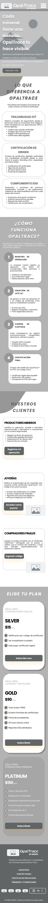
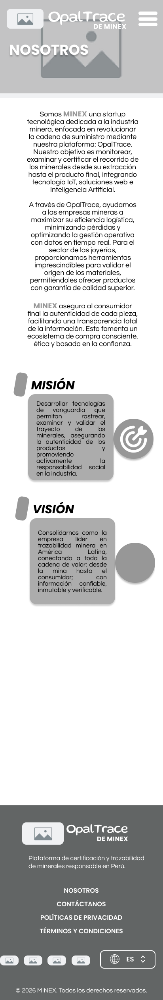
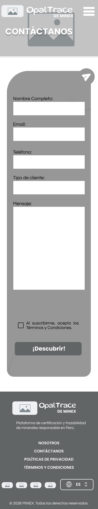
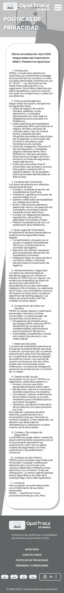
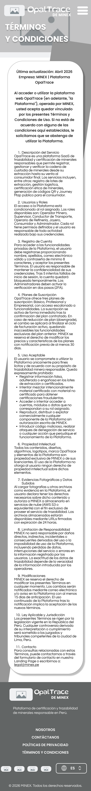
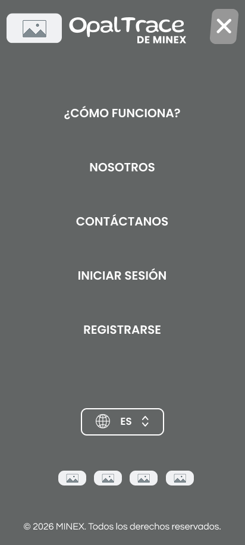

---

## Elementos del Diseño

| Elemento | Justificación |
|----------|---------------|
| **Shape** | Sin color, las formas son el principal recurso compositivo del wireframe móvil. En la *Landing*, las tarjetas de tipo de cliente (Productores Mineros, Joyerías, Compradores Finales) y las de planes (Silver, Gold, Platinium) se perciben como rectángulos con esquinas redondeadas apilados verticalmente, confirmando que la estructura de contenido es sólida independientemente del sistema de color. En *Nosotros*, los bloques de Misión y Visión conservan su forma rectangular con acento lateral en escala de grises, demostrando que la jerarquía visual depende de la forma, no del color. El menú hamburguesa desplegable (*WML*) muestra cinco ítems de navegación como bloques de texto puro sobre fondo gris, sin ningún otro recurso formal. Los placeholders de imagen (ícono de montaña) en los headers revelan que las formas rectangulares están previstas como contenedores de imagen desde la etapa de wireframe. |
| **Size** | La jerarquía tipográfica es el elemento más legible del wireframe móvil. En la *Landing*, el titular hero ("Cada mineral tiene una historia. OpalTrace la hace visible.") ocupa prácticamente el ancho completo de la pantalla y es visiblemente más grande que cualquier otro texto. En *Nosotros*, "MISIÓN" y "VISIÓN" son tipográficamente más grandes que el cuerpo de texto que los acompaña. En el menú desplegable (*WML*), los cinco ítems de navegación tienen un tamaño de fuente considerablemente mayor que el selector de idioma o el copyright del footer, estableciendo una jerarquía clara de relevancia. En *Políticas de Privacidad* y *Términos y Condiciones*, los títulos numerados de cada cláusula son perceptiblemente más grandes que el cuerpo de texto, estructurando el contenido denso para facilitar el escaneo. |
| **Space** | El espacio negativo es el único recurso de separación disponible en el wireframe sin color. En el menú desplegable (*WML*), el espacio vertical entre cada ítem de navegación es amplio y uniforme, facilitando la interacción táctil y reduciendo el riesgo de toques accidentales. En *Nosotros*, el espacio entre los párrafos introductorios y los bloques de Misión/Visión marca claramente la transición entre secciones. En la *Landing*, el espacio entre las tarjetas de diferenciadores (Trazabilidad IoT, Certificación de Origen, Cumplimiento ESG) y la sección "¿Cómo funciona?" separa visualmente los bloques de contenido sin necesidad de líneas divisoras. En *Términos* y *Privacidad*, el espacio entre cláusulas numeradas es el único separador estructural. |
| **Direction** | El flujo de lectura estrictamente vertical queda más expuesto en el wireframe que en el diseño a color, al no existir elementos visuales que distraigan la mirada. En la *Landing*, la secuencia de scroll es inequívoca: hero → diferenciadores → funcionamiento → clientes → planes → footer. En *Nosotros*, la dirección narrativa va de la presentación corporativa hacia la Misión y la Visión. En el menú desplegable (*WML*), los ítems están alineados verticalmente al centro de la pantalla, creando un eje de lectura central descendente. En *Políticas de Privacidad* y *Términos*, la numeración correlativa de las cláusulas refuerza la dirección lineal de lectura. |
| **Line** | Las líneas explícitas son prácticamente inexistentes en el wireframe móvil, lo que confirma que la separación entre secciones se logra mediante espacio y contraste tonal. La única excepción visible son los bordes de los campos de formulario en *Contáctanos*, que actúan como las únicas líneas explícitas de esa pantalla, cumpliendo una función puramente funcional de delimitación de área de entrada. Los separadores del footer entre el logo, los enlaces de navegación y el copyright son líneas implícitas generadas por el espacio vertical, no elementos gráficos independientes. |
| **Texture** | Los placeholders de imagen en escala de grises (ícono de montaña con marco rectangular) en los headers de *Nosotros*, *Políticas de Privacidad*, *Términos y Condiciones* y la *Landing* revelan la intención textural del diseño final: todas esas zonas están previstas para albergar fotografías reales que aporten riqueza visual y contexto. En el wireframe, la textura se simula únicamente a través de las variaciones tonales de gris: fondo más oscuro en el header, gris medio en el footer, blanco en el contenido principal. Esto demuestra que la arquitectura textural del diseño funciona como estructura de tres bandas (header oscuro / contenido claro / footer oscuro) sin depender de activos fotográficos. |

---

## Heurísticas de Usabilidad (Jakob Nielsen)

| Heurística | Justificación |
|------------|---------------|
| **H1 – Visibilidad del estado del sistema** | En el wireframe de la *Landing*, los cuatro pasos numerados de "¿Cómo funciona?" (Registro de Operación, Creación de Lote IoT, Cadena de Custodia, Certificación Final) representan estados del objeto mineral en la plataforma, informando al visitante del ciclo de vida del sistema sin necesidad de color. El menú desplegable (*WML*) muestra el estado "abierto" del menú de navegación mediante el botón de cierre "X" en la esquina superior derecha, que reemplaza al ícono hamburguesa y actúa como indicador visual del estado actual de la interfaz. Sin embargo, el wireframe no evidencia indicadores de carga ni confirmaciones post-acción, lo que constituye una brecha a resolver en el diseño final. |
| **H2 – Relación sistema/mundo real** | El lenguaje del wireframe es idéntico al diseño final, confirmando que la terminología del dominio minero (trazabilidad, cadena de custodia, certificación ESG, lote IoT) es una decisión de contenido y no estética. En *Términos y Condiciones*, la estructura numerada del 1 al 11 sigue el formato estándar de documentos legales, usando el vocabulario jurídico que el usuario esperaría encontrar ("Uso Aceptable", "Propiedad Intelectual", "Ley Aplicable y Jurisdicción"). En *Nosotros*, la denominación "startup tecnológica" y la referencia a IoT e Inteligencia Artificial sitúan a la empresa en el marco del ecosistema tecnológico reconocible para el usuario objetivo. |
| **H3 – Libertad y control del usuario** | El botón de cierre "X" en el menú desplegable (*WML*) es la salida de emergencia más visible del wireframe móvil, permitiendo al usuario abandonar el estado de menú abierto con un solo toque. El header con logo y menú hamburguesa está presente en todas las páginas del wireframe, garantizando acceso permanente a la navegación global. El footer con los cuatro enlaces principales (Nosotros, Contáctanos, Políticas de Privacidad, Términos y Condiciones) duplica las rutas de escape disponibles desde cualquier punto del sitio. |
| **H4 – Consistencia y estándares** | El wireframe demuestra que la consistencia estructural es independiente del sistema visual. El patrón de header (logo + hamburguesa) es idéntico en las cinco pantallas. El footer replica exactamente la misma estructura en todas las páginas: logo + descripción, cuatro enlaces de navegación, íconos de redes sociales y selector de idioma. Los bloques de Misión y Visión en *Nosotros* siguen el mismo patrón estructural (acento lateral + título en cursiva/negrita + cuerpo sobre fondo diferenciado). Las tarjetas de planes en la *Landing* (Silver, Gold, Platinium) tienen la misma estructura interna: etiqueta de perfil ideal, nombre del plan, precio y lista de características. |
| **H5 – Prevención de errores** | En el wireframe de *Contáctanos*, el checkbox de aceptación de términos aparece visualmente desactivado por defecto, previniendo envíos accidentales. Las etiquetas de texto posicionadas encima de cada campo del formulario permanecen visibles durante el llenado, evitando que el usuario olvide qué dato debe ingresar. En *Registro* (referenciado en US09), la indicación "Mínimo 8 caracteres" bajo el campo de contraseña es un indicador preventivo que anticipa el requisito antes de que el usuario cometa el error. La separación visual entre el campo "Confirmar Contraseña" y el campo "Contraseña" refuerza la doble validación de un dato crítico. |
| **H6 – Reconocer antes que recordar** | El menú desplegable (*WML*) muestra simultáneamente todas las secciones del sitio, eliminando la necesidad de que el usuario recuerde la estructura de navegación. En la *Landing*, las tres tarjetas de tipo de cliente están visibles en la misma sección de scroll, sin requerir que el usuario recuerde cuál era su perfil al llegar a la pantalla de registro. Los cuatro pasos de "¿Cómo funciona?" están numerados y visibles en secuencia, sin requerir que el usuario memorice el proceso entre pantallas. En *Políticas de Privacidad* y *Términos*, los títulos numerados actúan como índice visual que permite al usuario ubicar la información buscada sin leer el documento completo. |
| **H7 – Flexibilidad y eficiencia** | El menú hamburguesa desplegable con todos los ítems en pantalla completa permite a usuarios expertos saltar directamente a cualquier sección con un toque, sin necesidad de navegar jerárquicamente. El selector de idioma (globo + "ES") en el footer es accesible desde cualquier página sin pasos intermedios. En la *Landing*, los botones de acción segmentados por perfil de usuario actúan como atajos que llevan directamente al flujo relevante sin pasar por una pantalla de selección de perfil adicional. |
| **H8 – Diseño estético y minimalista** | El wireframe de *Inicio de Sesión* es el ejemplo más minimalista: únicamente contiene el saludo "Bienvenido", dos campos (Email, Contraseña), un botón de acción y dos enlaces auxiliares, sin decoración alguna. El menú desplegable (*WML*) es igualmente minimalista: fondo gris sólido, cinco ítems de navegación centrados, selector de idioma e íconos de redes sociales. En *Nosotros*, los tres párrafos introductorios y los dos bloques de Misión/Visión son los únicos elementos de contenido, sin sidebars ni widgets secundarios que compitan por la atención. |
| **H9 – Reconocer y recuperarse de errores** | El wireframe no evidencia mensajes de error o validación inline en ninguno de los formularios, lo que es una brecha identificable desde esta etapa de diseño. Según la US07, el sistema debe rechazar el envío e identificar campos incompletos (Escenario 2), correos con formato inválido (Escenario 3) y falta de aceptación de términos (Escenario 4). Se recomienda incorporar en el diseño final indicadores visuales de campo inválido (borde con estado de error + texto explicativo breve debajo del campo) para que el usuario identifique y corrija errores sin necesidad de reenviar el formulario completo. |
| **H10 – Ayuda y documentación** | Las páginas de *Términos y Condiciones* y *Políticas de Privacidad* están accesibles desde el footer de todas las páginas del wireframe, cumpliendo las US10 y US11. La sección "¿Cómo funciona?" en la *Landing* desglosa el proceso en cuatro pasos numerados que actúan como documentación funcional inline, respondiendo a la US04. El enlace "¿Cómo funciona?" en el menú desplegable refuerza el acceso a esta guía desde cualquier punto del sitio, respondiendo al Escenario 2 de la US04 (acceso persistente). |

---

## Principios de Arquitectura de Información

| Principio | Justificación |
|-----------|---------------|
| **Objects** | El wireframe de la *Landing* trata cada mineral como un objeto con ciclo de vida propio visible en los cuatro pasos: Registro de Operación (con atributos: datos de identificación, geolocalización, documentación legal), Creación de Lote IoT (atributos: ID único, sensores, firma digital del productor), Cadena de Custodia (comportamiento: transferencia automática entre actores, detección de anomalías) y Certificación Final (atributos: certificado PDF descargable, código QR, verificación pública). Sin color ni fotografía, la estructura textual sola comunica este ciclo de vida, validando que el tratamiento de contenido como objeto es una decisión arquitectónica. |
| **Choices** | La *Landing* del wireframe ofrece tres rutas de acceso diferenciadas (Productores Mineros, Joyerías, Compradores Finales) con botones de acción específicos para cada perfil, respondiendo a la US03. La sección de planes (Silver, Gold, Platinium) presenta tres opciones con diferencias explícitas en características, respondiendo a la US05. El menú desplegable ofrece cinco ítems que cubren todos los objetivos de visita posibles. En *Inicio de Sesión* (US09), los enlaces "¿Olvidaste tu contraseña?" y "¿No tienes cuenta? Regístrate aquí" ofrecen rutas alternativas según la situación del usuario. |
| **Disclosure** | El wireframe evidencia la estrategia de divulgación progresiva en su forma más pura: el hero de la *Landing* comunica el concepto central en dos líneas sin detalles técnicos. La sección de diferenciadores introduce los tres pilares con listas breves de cuatro a seis ítems. Las páginas de *Términos* y *Privacidad* representan el máximo nivel de detalle, con once secciones numeradas de contenido legal exhaustivo, accesibles solo para usuarios que deciden profundizar (US10 y US11). Esta arquitectura de divulgación progresiva funciona sin depender del sistema visual. |
| **Exemplars** | La sección "Nuestros Clientes" de la *Landing* usa tres ejemplares concretos de perfil de usuario. Aunque en el wireframe los placeholders de imagen son genéricos, la estructura de cada tarjeta (título del perfil + lista de beneficios específicos + botón CTA) confirma que el patrón de ejemplar está integrado en la arquitectura de contenido, respondiendo a la US03. Los cuatro pasos de "¿Cómo funciona?" son también ejemplares del proceso, describiendo qué ocurre concretamente en cada etapa (US04). |
| **Front doors** | Todas las páginas del wireframe son autosuficientes para un usuario que llegue directamente desde un motor de búsqueda: el header con logo y menú de acceso completo, y el footer con todos los enlaces del sitio, garantizan orientación y navegación desde cualquier punto de entrada. Esto responde a la US08 (persistencia del idioma durante la sesión) y a la US09 (redirección a módulos de identidad desde cualquier página). El footer de *Políticas de Privacidad* y *Términos* incluye acceso directo a Contáctanos, permitiendo que un usuario que llegue a la documentación legal pueda comunicarse con MINEX sin pasar por la home. |
| **Multiple classification** | El contenido puede encontrarse a través de múltiples rutas en el wireframe: por tipo de usuario en la *Landing* (US03), por funcionalidad en el menú desplegable ("¿Cómo funciona?" → US04), por nivel de suscripción en la sección de planes (US05), por naturaleza informativa en el footer (Nosotros → US06, Contáctanos → US07), por naturaleza legal en el footer (Términos → US10, Privacidad → US11) y por idioma mediante el selector (US08). Esta redundancia de rutas garantiza que distintos perfiles de usuario encuentren la información según su propio modelo mental. |
| **Focused navigation** | El menú desplegable (*WML*) está definido por su contenido, no por su posición: "¿Cómo funciona?" (comprensión del producto), "Nosotros" (confianza institucional), "Contáctanos" (comunicación directa), "Iniciar Sesión" (acceso de usuarios recurrentes) y "Registrarse" (captación de nuevos usuarios). El footer agrupa los enlaces por naturaleza documental-legal, separando semánticamente la navegación funcional del menú hamburguesa de la navegación informativa del footer. Esta distinción semántica se sostiene incluso en escala de grises. |
| **Growth** | La estructura de tarjetas apiladas verticalmente en la *Landing* (diferenciadores, clientes, planes) es nativa al scroll móvil y admite la incorporación de nuevos elementos sin alterar el layout. El patrón de tarjeta de cliente (título + lista + botón) puede replicarse para nuevos segmentos. Los planes Silver/Gold/Platinium son tarjetas estructuralmente idénticas que permiten añadir un nuevo nivel simplemente añadiendo una tarjeta más. El menú desplegable puede incorporar nuevos ítems siguiendo el mismo patrón tipográfico, respondiendo al principio de escalabilidad requerido por el crecimiento de la plataforma (US08, futuras expansiones). |

---

## Principios de Inclusive Design

| Principio | Justificación |
|-----------|---------------|
| **P1 – Proporciona experiencias comparables** | El wireframe confirma que la interfaz es funcional y comprensible sin color: las etiquetas de texto sobre cada campo del formulario en *Contáctanos* son elementos estructurales que garantizan compatibilidad con lectores de pantalla. El contenido de *Términos* y *Privacidad* está disponible en texto plano estructurado, accesible para cualquier tecnología de asistencia. El selector de idioma (US08) garantiza que usuarios de distintas lenguas accedan a la misma calidad de contenido. La estructura en columna única del wireframe móvil es nativamente compatible con tecnologías de accesibilidad que leen el contenido de forma lineal. |
| **P2 – Considera la situación del usuario** | El wireframe en escala de grises simula condiciones de baja visibilidad de color (daltonismo, pantallas de baja resolución, impresión en blanco y negro) y el diseño sigue siendo completamente legible y navegable. Los ítems del menú desplegable tienen tamaño y espaciado suficiente para interacción táctil con el pulgar en contextos de uso con una sola mano (condición habitual en entornos mineros). Los títulos hero son legibles incluso en pantallas de tamaño pequeño gracias a su escala tipográfica prominente. La estructura de columna única elimina la necesidad de zoom horizontal, siendo apropiada para contextos de uso en movimiento. |
| **P3 – Sé consistente** | El wireframe demuestra que la consistencia estructural es el fundamento del diseño móvil de OpalTrace: el header (logo + hamburguesa) y el footer (logo + enlaces + selector de idioma + redes sociales) son idénticos en las cinco pantallas analizadas. Los campos de formulario tienen el mismo estilo en todas las pantallas que los incluyen. Los bloques de Misión y Visión en *Nosotros* siguen el mismo patrón estructural. Los títulos de sección tienen el mismo tratamiento tipográfico (mayúsculas, tamaño prominente) en todas las páginas. Esta consistencia hace que el comportamiento de la interfaz sea predecible sin importar en qué pantalla se encuentre el usuario. |
| **P4 – Deja al usuario mandar** | El botón de cierre "X" en el menú desplegable permite al usuario cerrarlo en cualquier momento sin consecuencias. El scroll libre en todas las páginas permite al usuario avanzar o retroceder en el contenido a su propio ritmo. En *Términos* y *Privacidad*, el usuario puede leer el contenido completo sin ser forzado a aceptar nada para continuar navegando. En *Contáctanos*, el campo "Tipo de cliente" es de texto libre, permitiendo que el usuario se autoclasifique en sus propios términos sin estar limitado a opciones predefinidas. El footer con los cuatro enlaces principales garantiza que el usuario pueda redirigirse a cualquier sección en cualquier momento. |
| **P5 – Ofrece opciones** | La *Landing* ofrece tres rutas de entrada diferenciadas por tipo de usuario, reduciendo la fricción al no obligar a todos los perfiles a seguir el mismo flujo. El menú desplegable ofrece cinco ítems que cubren todos los objetivos de visita posibles. La sección de planes presenta tres niveles de acceso con diferencias explícitas, permitiendo que usuarios con distintos presupuestos y necesidades encuentren una opción adecuada. El footer ofrece "Contáctanos" como alternativa para usuarios que prefieren comunicarse antes de comprometerse con un registro. El selector de idioma (US08) ofrece al usuario la opción de consumir el contenido en el idioma de su preferencia. |
| **P6 – Prioriza el contenido** | En el wireframe de la *Landing*, el titular hero es el elemento de mayor escala tipográfica de toda la pantalla, comunicando la propuesta de valor antes de cualquier otro contenido. En *Nosotros*, los bloques de Misión y Visión son visualmente más prominentes que los párrafos de texto plano gracias a su mayor peso visual (acento lateral + tipografía destacada + fondo diferenciado). En el menú desplegable (*WML*), los cinco ítems de navegación son el único contenido relevante, sin elementos secundarios que compitan por la atención. En *Términos* y *Privacidad*, los títulos numerados priorizan la estructura sobre el contenido denso, facilitando el escaneo. |
| **P7 – Agrega valor** | El wireframe demuestra que funciones de valor como el selector de idioma (US08), los botones de acción segmentados por perfil (US03), el acceso a documentación legal desde el footer (US10, US11) y los accesos cruzados entre Inicio de Sesión y Registro (US09) son decisiones arquitectónicas de valor, independientes del sistema visual. La presencia del ícono de envío (avión de papel) sobre el formulario de *Contáctanos* agrega valor comunicacional incluso en escala de grises, anticipando la función de la página. La indicación "Mínimo 8 caracteres" en el formulario de registro agrega valor preventivo al guiar al usuario sobre los requisitos de seguridad antes de cometer el error. |

---

## 4.4. Web Applications UX/UI Design

### 4.4.1. Web Applications Wireframes

### Elementos del Diseño

| Elemento | Justificación |
|----------|---------------|
| **Shape** | Los wireframes de la Web Application deben usar rectángulos con esquinas redondeadas como forma dominante para tarjetas de lote, tablas de auditoría y paneles de KPI, siguiendo el mismo lenguaje formal establecido en el portal informativo. Los campos de formulario de registro (US13: nombre, peso, tipo de mineral) deben ser rectangulares con bordes bien definidos para diferenciar el área de entrada del fondo del panel. Los estados de lote ("En Origen", "En Tránsito", "En Planta") deben representarse mediante etiquetas tipo chip o badge de bordes redondeados, diferenciando su naturaleza de estado del contenido de las celdas de tabla circundantes. |
| **Size** | La jerarquía de tamaños debe priorizar los KPIs críticos de la operación: el número de lotes activos, el conteo de anomalías pendientes y el estado de conectividad deben presentarse con tipografía notablemente más grande que el cuerpo de las tablas. En el panel del Operador Minero, el identificador de lote generado (US13) debe ser el elemento de mayor tamaño en la pantalla de confirmación, dado que es el dato que el usuario necesita comunicar o escanear. En el dashboard del Administrador MINEX (US26, US27, US28), los contadores de cuentas pendientes de aprobación deben tener mayor jerarquía tipográfica que los registros ya procesados. |
| **Space** | Los wireframes de la Web Application deben contemplar espaciado generoso entre filas de tablas de lotes y auditoría para facilitar la lectura en condiciones de uso operativo (pantallas con guantes, iluminación variable en refinería). Las zonas de acción crítica (botones "Aprobar", "Rechazar", "Bloquear lote") deben tener espacio suficiente alrededor para evitar clics accidentales. En el formulario de registro de lote (US13), el espacio entre campos debe ser uniforme y mayor que en formularios de contacto, dado el contexto de llenado en entornos industriales. |
| **Direction** | Los wireframes deben establecer un flujo de lectura horizontal en el dashboard principal (sidebar de navegación izquierdo → panel de KPIs central → panel de alertas derecho), coherente con las convenciones de interfaces de gestión empresarial. En pantallas de detalle de lote, el flujo debe ser vertical y cronológico: datos de origen arriba → eventos de custodia en orden temporal → estado actual abajo, reflejando el ciclo de vida del objeto mineral (US13, US18, US19). En la pantalla de aprobación de cuentas B2B (US27), la dirección debe ser de izquierda a derecha: listado de solicitudes → detalle de la solicitud seleccionada → acciones disponibles. |
| **Colour** | Los wireframes deben reservar zonas de color para comunicar estados del sistema sin ambigüedad: el estado "En Origen" en tono neutro, "En Tránsito" en tono cálido de advertencia, "En Planta" en tono informativo y "Anomalía" en tono de alerta roja (US16). Esta codificación cromática debe aplicarse de forma consistente en tarjetas, badges de estado y filas de tabla a lo largo de todas las pantallas de la Web Application. Los botones de acción destructiva o crítica (bloquear lote, rechazar cuenta) deben diferenciarse cromáticamente de los botones de acción positiva (aprobar, confirmar recepción). |

### Heurísticas de Usabilidad (Jakob Nielsen)

| Heurística | Justificación |
|------------|---------------|
| **H1 – Visibilidad del estado del sistema** | Los wireframes deben incorporar indicadores de estado permanentes en el header de la Web Application: estado de conectividad online/offline (US14, US15), número de registros pendientes de sincronización y estado de la sesión activa del usuario. Cada lote debe mostrar su estado actual de forma visible en la tarjeta o fila de tabla, sin necesidad de abrir un detalle. Las operaciones de larga duración (sincronización, generación de PDF, carga a AWS S3) deben representarse con un indicador de progreso en el wireframe, respondiendo a la US15 (sincronización automática) y US33 (generación de certificado PDF). |
| **H2 – Relación sistema/mundo real** | Los wireframes deben usar terminología del dominio minero en todas las etiquetas: "Lote", "Merma", "Cadena de Custodia", "Refinería", "Sellado Ético", nunca términos técnicos genéricos como "Registro", "Entidad" o "Item". Los formularios de registro de lote (US13) deben ordenar los campos según el flujo operativo real: tipo de mineral → peso bruto → coordenadas GPS → fotografía de evidencia, no según convenciones de formularios web genéricos. El mapa de Journey Map del consumidor final (US25) debe usar iconografía geográfica reconocible, no diagramas de flujo abstractos. |
| **H3 – Libertad y control del usuario** | Los wireframes deben incluir botón "Cancelar" en todos los formularios de registro y edición. En la pantalla de división de lotes (US20), el wireframe debe contemplar un paso de confirmación con resumen antes de ejecutar la operación, dado que es irreversible. En modo offline (US14), el wireframe debe mostrar una opción "Descartar registro en cola" para que el operador pueda eliminar un registro local antes de la sincronización. El Administrador MINEX debe poder deshacer la aprobación de una cuenta B2B dentro de un período definido (US27). |
| **H4 – Consistencia y estándares** | Los wireframes deben establecer un sistema de navegación consistente: sidebar fijo a la izquierda con las secciones principales del rol activo, header con el nombre del usuario, su rol y el selector de idioma, y footer con los enlaces de documentación legal. Los badges de estado deben usar siempre el mismo formato (texto en mayúsculas, fondo de color, esquinas redondeadas) en todas las pantallas. Los botones de acción primaria deben tener el mismo estilo en toda la aplicación, independientemente del rol del usuario. |
| **H5 – Prevención de errores** | Los wireframes deben incluir validación inline en el formulario de registro de lote (US13): alerta inmediata si el peso ingresado es negativo o cero (Escenario 2 de US13). En la división de lotes (US20), el sistema debe mostrar en tiempo real la suma de pesos de los lotes hijos versus el peso del lote padre, previniendo que el operario exceda el límite (Escenario 2 de US20). En el registro de material de joyería (US22, US23), el wireframe debe incluir una advertencia visual cuando el usuario intente combinar material certificado con externo antes de ejecutar la operación. |
| **H6 – Reconocer antes que recordar** | Los wireframes del dashboard deben mostrar el historial reciente de lotes del usuario activo sin necesidad de buscar, respondiendo al contexto operativo del Operador Minero que trabaja con los mismos lotes durante su turno. El escáner de código QR (US17, US18) debe mostrar el nombre del lote, su peso y su estado actual inmediatamente después del escaneo, sin requerir que el usuario recuerde el número de lote previamente. El Journey Map del consumidor final (US25) debe presentar toda la secuencia de trazabilidad visualmente, sin requerir que el cliente recuerde información de pantallas anteriores. |
| **H7 – Flexibilidad y eficiencia** | Los wireframes deben contemplar accesos directos por rol: el Operador Minero debe poder registrar un nuevo lote desde el dashboard con un solo clic, sin navegar por menús. El Transportista debe poder escanear un código QR directamente desde la pantalla principal de su perfil (US18). El Administrador MINEX debe poder aprobar o rechazar una cuenta B2B desde el listado sin necesidad de abrir el detalle completo (US27). Los usuarios expertos deben poder filtrar y ordenar las tablas de lotes por columna con un clic en el encabezado. |
| **H8 – Diseño estético y minimalista** | Los wireframes deben diseñar pantallas específicas por rol: el Operador Minero solo ve las funciones de registro y monitoreo de sus lotes, nunca las herramientas de administración del sistema. El Joyero solo ve su inventario certificado y externo, no los datos de extracción minera. El Consumidor Final solo ve el Journey Map de su producto (US24, US25), sin acceso a paneles operativos. Esta segmentación por rol elimina la información innecesaria para cada perfil, reduciendo la carga cognitiva. |
| **H9 – Reconocer y recuperarse de errores** | Los wireframes deben definir pantallas de error específicas: pantalla de "Código no encontrado" para el consumidor que escanea un QR inválido (Escenario 2 de US24), con mensaje claro y opción de "Intentar con otro código". Pantalla de "Error de sincronización" para el operador que pierde la conexión (US15), con indicación del número de registros en cola y opción de reintentar. Pantalla de "Acceso denegado" para intentos fallidos de autenticación (US26), con indicación del número de intentos restantes antes del bloqueo. |
| **H10 – Ayuda y documentación** | Los wireframes deben contemplar tooltips o textos de ayuda inline en campos técnicos complejos: el campo de coordenadas GPS en el registro de lote (US13) debe incluir un ícono de ayuda que explique que las coordenadas se capturan automáticamente. La pantalla de división de lotes (US20) debe incluir una nota explicativa sobre la regla de conservación de masa. El footer de la Web Application debe incluir enlace a los mismos documentos de Términos (US10) y Políticas de Privacidad (US11) disponibles en el portal informativo. |

### Principios de Arquitectura de Información

| Principio | Justificación |
|-----------|---------------|
| **Objects** | La Web Application trata los lotes de mineral como objetos con ciclo de vida completo y atributos definidos: ID único, tipo de mineral, peso, coordenadas GPS, estado actual, historial de eventos, fotografías de evidencia y firma digital del productor. Cada cambio de estado (US13 → US18 → US19 → US21) es un evento en el ciclo de vida del objeto. Los certificados digitales (US17, US33) son objetos derivados del lote con sus propios atributos (código QR, PDF descargable, URL pública). Las cuentas de usuario (US27) son objetos con estado de aprobación, rol asignado y registro de actividad. |
| **Choices** | La Web Application debe ofrecer alternativas significativas según el contexto de cada rol: el Operador Minero puede registrar un lote manualmente o capturar datos automáticamente por GPS (US13); el Transportista puede escanear el QR o ingresar el ID manualmente (US18); el Joyero puede consultar su inventario por material certificado o por material externo (US21, US22); el Administrador puede aprobar o rechazar cuentas B2B (US27). En el dashboard, los filtros por estado, fecha y tipo de mineral ofrecen alternativas de visualización del mismo contenido. |
| **Disclosure** | La Web Application debe aplicar divulgación progresiva en todas sus pantallas: el dashboard muestra únicamente KPIs y alertas críticas; el listado de lotes muestra ID, estado y fecha; el detalle del lote muestra el historial completo de eventos, fotografías y datos técnicos. El Journey Map del consumidor (US25) debe mostrar primero la validación de autenticidad, y revelar el detalle geográfico del recorrido solo si el usuario solicita más información. El panel de auditoría (US28) debe mostrar primero el resumen del evento y revelar los datos técnicos (IP, token) bajo demanda. |
| **Exemplars** | Los wireframes de registro de lote (US13) deben incluir ejemplos de valores válidos en los campos de formulario: "Ej: 450.5 kg" en el campo de peso, "Ej: Au (Oro)" en el campo de tipo de mineral. La pantalla de Journey Map del consumidor (US25) debe mostrar un ejemplo del recorrido completo con puntos geográficos etiquetados ("Mina La Esperanza → Refinería Central → Joyería Arte Fino → Cliente Final"). El panel de auditoría (US28) debe mostrar un ejemplo de registro de evento para que el Administrador comprenda la estructura antes de consultar registros reales. |
| **Front doors** | Cada sección de la Web Application debe ser accesible directamente mediante URL, dado que los usuarios llegarán por notificación de correo electrónico (US07, alertas operativas) o por enlace desde el portal informativo (US09). El consumidor final accede al Journey Map directamente mediante el código QR de su producto, sin pasar por ninguna pantalla de autenticación (US24, US25). Las notificaciones de anomalía (US16) deben incluir un enlace directo al lote afectado, permitiendo al Supervisor acceder al detalle sin navegar por el dashboard. |
| **Multiple classification** | Los lotes de la Web Application pueden encontrarse por múltiples criterios: por estado (En Origen, En Tránsito, En Planta, Certificado, Anomalía), por tipo de mineral, por fecha de registro, por actor responsable actual o por ID. El inventario de joyería puede consultarse por tipo de material (certificado vs. externo) o por fecha de recepción (US21, US22). El panel de auditoría del Administrador (US28) puede filtrarse por usuario, por IP, por tipo de evento o por rango de fecha. |
| **Focused navigation** | La navegación de la Web Application debe organizarse por contenido y no por posición: el sidebar del Operador Minero debe contener "Mis Lotes", "Registrar Lote", "Anomalías" y "Sincronización Offline", que son las tareas reales de ese rol. El sidebar del Administrador debe contener "Cuentas Pendientes", "Auditoría" y "Gestión de Usuarios". Nunca deben incluirse en el sidebar secciones que correspondan a otro rol, aunque el espacio lo permita. La navegación refleja el modelo mental del usuario de cada perfil, no la arquitectura técnica del sistema. |
| **Growth** | La Web Application debe diseñarse para soportar el crecimiento de lotes, usuarios y datos sin rediseño estructural: las tablas de lotes deben implementar paginación y búsqueda desde el primer sprint. El sistema de roles (US13: Operador Minero, US18: Transportista, US19: Operario de Refinería, US21: Joyero, US26: Administrador) debe ser extensible para incorporar nuevos perfiles sin alterar la arquitectura de navegación. El Journey Map del consumidor (US25) debe escalar para mostrar cadenas de trazabilidad con múltiples divisiones de lote (US20) sin perder legibilidad. |

### Principios de Inclusive Design

| Principio | Justificación |
|-----------|---------------|
| **P1 – Proporciona experiencias comparables** | La Web Application debe ofrecer la misma funcionalidad operativa en modo online y offline (US14, US15), garantizando que operadores en zonas remotas sin conectividad puedan registrar lotes sin perder datos. El Journey Map del consumidor final (US24, US25) debe ser accesible sin cuenta ni registro, garantizando que cualquier persona con el código QR pueda verificar la autenticidad de su joya. Los certificados digitales (US33) deben generarse en PDF descargable, permitiendo que usuarios sin conexión permanente puedan consultar el documento offline. |
| **P2 – Considera la situación del usuario** | Los formularios de registro de lote (US13) deben diseñarse para uso con guantes en entornos mineros: campos de mayor altura táctil, botones de acción de tamaño generoso y mínimo uso del teclado virtual mediante captura automática de GPS y fotografía. El modo offline (US14) está diseñado para el contexto real de zonas remotas sin señal, donde el operador no puede depender de la conectividad para registrar su trabajo. El escáner QR del transportista (US18) debe funcionar bajo condiciones de iluminación variable, propias del contexto de carga y descarga en carretera. |
| **P3 – Sé consistente** | La Web Application debe mantener el mismo sistema de colores de estado (neutro/cálido/frío/alerta) en todas las pantallas de todos los roles. Los badges de estado deben tener el mismo diseño en el dashboard del Operador Minero, en el panel del Administrador y en el listado del Joyero. Los formularios de registro deben usar el mismo patrón de etiqueta-campo en todas las pantallas, independientemente del rol. El footer de la Web Application debe mantener los mismos enlaces de Términos y Privacidad disponibles en el portal informativo. |
| **P4 – Deja al usuario mandar** | El Operador Minero debe poder decidir cuándo sincronizar sus registros offline (US14, US15), con opción de forzar la sincronización o mantener los datos en cola. El Joyero debe poder consultar su inventario, filtrarlo y exportarlo sin restricciones de visualización (US21, US22). El Administrador debe poder auditar cualquier registro del sistema (US28) sin limitaciones de acceso. El consumidor final (US24, US25) debe poder explorar el Journey Map a su propio ritmo, sin temporizadores ni redirecciones automáticas. |
| **P5 – Ofrece opciones** | El Transportista puede validar la recepción de un lote escaneando el QR o ingresando el ID manualmente (US18), ofreciendo una alternativa cuando la cámara no está disponible. El Operador Minero puede registrar datos con captura automática de GPS o ingreso manual de coordenadas (US13). El Joyero puede registrar material recibido por escaneo del certificado o por ingreso manual del código de lote (US21). El Administrador puede aprobar cuentas desde el listado o desde el detalle completo de la solicitud (US27). |
| **P6 – Prioriza el contenido** | El dashboard de cada rol debe priorizar visualmente las alertas y anomalías sobre el contenido rutinario: una anomalía detectada (US16) debe aparecer en la posición más visible del panel, con mayor jerarquía visual que los lotes en estado normal. El Journey Map del consumidor (US25) debe priorizar la validación de autenticidad ("Producto certificado OpalTrace") sobre el detalle técnico del recorrido, dado que ese es el dato más relevante para el usuario final. El panel de aprobación del Administrador (US27) debe priorizar las cuentas pendientes de revisión sobre las ya procesadas. |
| **P7 – Agrega valor** | La funcionalidad offline con sincronización automática (US14, US15) agrega valor real al operador minero en zonas remotas, diferenciando a OpalTrace de plataformas que requieren conectividad permanente. La generación automática del código QR vinculado al lote (US17) agrega valor al proceso de etiquetado, eliminando la necesidad de herramientas externas. El bloqueo automático ante intentos de mezcla de material (US23) agrega valor de integridad al ecosistema, protegiendo la garantía ética de la cadena de trazabilidad sin requerir supervisión manual constante. El Journey Map público (US25) agrega valor al consumidor final al proporcionarle transparencia completa sobre el origen de su joya sin necesidad de registro. |

### 4.4.2. Web Applications Wireflow Diagrams

| Element / Architecture Information / Inclusive Design | Justificación |
|------------------------------------------------------|---------------|
| **Direction (Elemento de diseño)** | Los wireflows establecen la dirección de navegación entre pantallas según el rol del usuario. El flujo del Operador Minero sigue una dirección lineal ascendente en el ciclo del lote: Login → Dashboard → Registrar Lote → Confirmación de Lote → Generación QR. El flujo del Transportista sigue una dirección de validación: Dashboard → Escaneo QR → Confirmación de Custodia → Registro de Coordenadas GPS. El flujo del Administrador tiene una dirección de revisión bifurcada: Dashboard → Listado de Solicitudes → Detalle de Solicitud → Aprobar / Rechazar. Cada flujo refleja la lógica de trabajo real del actor, no una estructura técnica arbitraria. |
| **Shape (Elemento de diseño)** | En los diagramas de wireflow, las pantallas se representan como rectángulos con esquinas redondeadas conectadas por flechas direccionales. Los puntos de decisión (¿Conexión disponible? → Sí: Sincronizar / No: Guardar en cola) se representan como rombos, siguiendo la convención estándar de diagramas de flujo reconocible para el equipo de desarrollo y diseño. Los estados de error se representan con pantallas diferenciadas visualmente del flujo principal, usando bordes discontinuos para indicar su naturaleza excepcional. |
| **H1 – Visibilidad del estado del sistema** | Los wireflows deben incluir transiciones de estado explícitas entre pantallas: cada flecha de conexión debe estar etiquetada con el evento que la desencadena ("Tap en Registrar", "Escaneo exitoso", "Error de validación"). Los wireflows del modo offline deben mostrar claramente los dos caminos posibles: flujo con conectividad (datos van al servidor) y flujo sin conectividad (datos van a la cola local), con sus respectivos indicadores de estado en pantalla. |
| **H3 – Libertad y control del usuario** | Los wireflows deben incluir rutas de retroceso en cada pantalla: ningún flujo debe ser un callejón sin salida. El flujo de registro de lote debe incluir la opción de cancelar y volver al dashboard desde cualquier paso del formulario. El flujo de división de lotes debe incluir una pantalla de confirmación antes de ejecutar la operación, con opción de volver al paso anterior. El flujo de aprobación de cuentas debe incluir la opción de "Ver más detalles" antes de tomar la decisión final. |
| **H5 – Prevención de errores** | Los wireflows deben representar explícitamente los flujos de validación: el flujo de registro de lote debe mostrar la ramificación hacia la pantalla de error cuando el peso es negativo o nulo (Escenario 2), con retorno al formulario con el campo en estado de error. El flujo de mezcla de materiales debe mostrar el bloqueo inmediato como una pantalla intercalada antes de que la operación se complete, con mensaje explicativo y opción de volver atrás. |
| **Objects (AI)** | Los wireflows visualizan el ciclo de vida completo del objeto mineral a través de las transiciones de pantalla: cada paso del flujo corresponde a un cambio de estado del lote. El wireflow del EP02 muestra la secuencia completa desde el registro inicial hasta la generación del QR. El wireflow del EP03 muestra la transferencia de custodia del Operador Minero al Transportista y del Transportista al Operario de Refinería. El wireflow del EP04 muestra la recepción del material certificado por el Joyero y la restricción de mezcla. Esta representación permite al equipo de desarrollo entender el ciclo de vida del objeto antes de implementarlo. |
| **Front doors (AI)** | Los wireflows deben incluir los puntos de entrada externos al sistema: el flujo del consumidor final comienza con el escaneo del QR desde la cámara del móvil (fuera de la aplicación), no desde el login. El flujo de activación de cuenta comienza con el enlace de correo electrónico recibido tras el registro, accediendo directamente a la pantalla de configuración de contraseña sin pasar por la landing page. El flujo de notificación de anomalía comienza con el enlace en el correo de alerta, accediendo directamente al detalle del lote afectado. |
| **P3 – Sé consistente (Inclusive Design)** | Los wireflows deben usar las mismas convenciones visuales para representar transiciones equivalentes en diferentes roles: la aprobación de una acción siempre va a la misma tipología de pantalla de confirmación, independientemente de si es un Operador Minero confirmando un registro o un Administrador aprobando una cuenta. Los flujos de error siempre siguen el mismo patrón: pantalla de error → mensaje descriptivo → opción de reintentar o volver atrás. |
| **P4 – Deja al usuario mandar (Inclusive Design)** | Los wireflows deben garantizar que el usuario siempre tiene control sobre las transiciones de pantalla: ninguna pantalla debe redirigir automáticamente sin la acción explícita del usuario, excepto la sincronización en segundo plano que ocurre sin interrumpir el flujo activo. El flujo de modo offline debe mostrar que el usuario puede continuar operando normalmente mientras la sincronización está pendiente, sin ser bloqueado por el estado de conectividad. |

### 4.4.2. Web Applications Mock-ups

### Elementos del Diseño

| Elemento | Justificación |
|----------|---------------|
| **Colour** | Los mock-ups de la Web Application deben aplicar la paleta cromática de OpalTrace de forma semántica: verde teal como color corporativo de la interfaz (sidebar, header, botones de acción positiva), naranja/coral para alertas de nivel medio y elementos de atención del productor minero, y rojo para estados de anomalía y acciones destructivas. Los estados del lote deben usar colores de semáforo extendido: gris para "En Origen", azul para "En Tránsito", amarillo-naranja para "En Planta", verde para "Certificado" y rojo para "Anomalía". Esta codificación debe ser consistente en badges, filas de tabla y gráficos del dashboard. |
| **Shape** | Los mock-ups deben usar tarjetas con esquinas redondeadas (border-radius generoso) para los paneles de KPI del dashboard, siguiendo las convenciones de diseño de interfaces de gestión empresarial modernas. Los badges de estado del lote deben ser cápsulas (border-radius = 50% de la altura), diferenciando su naturaleza de indicador del contenido de celda de tabla. Los botones de acción primaria (Registrar Lote, Aprobar Cuenta, Confirmar Recepción) deben ser rectángulos de esquinas completamente redondeadas, coherentes con el estilo de botones del portal informativo. |
| **Size** | Los mock-ups del dashboard deben jerarquizar visualmente los KPIs: los contadores principales (lotes activos, anomalías pendientes, cuentas por aprobar) en tipografía de 32-40px, los títulos de sección en 18-22px y el cuerpo de las tablas en 14px. En el Journey Map del consumidor final, el título "Producto Certificado OpalTrace" debe ser el elemento de mayor tamaño tipográfico, comunicando la validación antes de cualquier detalle del recorrido. Los botones táctiles en las pantallas móviles de la Web App deben tener una altura mínima de 44px, cumpliendo las guías de accesibilidad táctil. |
| **Texture** | Los mock-ups deben usar fotografías reales del contexto minero y de joyería en las pantallas de Journey Map del consumidor, añadiendo riqueza visual y credibilidad al recorrido de trazabilidad mostrado. Las pantallas de dashboard operativo deben evitar el uso de fotografías de fondo para no competir con los datos y alertas críticos. Los íconos del sistema (lote, QR, GPS, PDF, anomalía) deben ser de trazo fino y monocromáticos, coherentes con el estilo minimalista de la interfaz. |
| **Space** | Los mock-ups deben contemplar padding generoso en los formularios operativos, dado el contexto de uso con guantes en entornos industriales. Las tablas de lotes y auditoría deben tener interlineado de al menos 1.5× para facilitar la lectura de datos operativos críticos. Los paneles de KPI del dashboard deben estar separados entre sí con espacio suficiente para evitar la confusión entre indicadores de diferentes categorías. |

### Heurísticas de Usabilidad (Jakob Nielsen)

| Heurística | Justificación |
|------------|---------------|
| **H1 – Visibilidad del estado del sistema** | Los mock-ups deben incluir un indicador de estado de conectividad permanente en el header (punto verde/rojo + texto "Online"/"Offline"), especialmente crítico para el Operador Minero en zonas remotas. Los badges de estado del lote deben cambiar de color y texto de forma sincrónica con cada evento de la cadena de custodia, proporcionando retroalimentación visual inmediata al usuario activo. Las operaciones de sincronización deben representarse con un indicador de progreso no bloqueante en el header, mostrando el número de registros en cola. |
| **H2 – Relación sistema/mundo real** | Los mock-ups del formulario de registro de lote deben usar íconos de dominio minero: un ícono de roca para "Tipo de mineral", un ícono de báscula para "Peso", un ícono de pin de mapa para "Coordenadas GPS" y un ícono de cámara para "Fotografía de evidencia". El Journey Map del consumidor debe representar el recorrido sobre un mapa geográfico real, no un diagrama abstracto, usando íconos diferenciados para cada tipo de actor (mina, refinería, joyería, consumidor). |
| **H4 – Consistencia y estándares** | Los mock-ups deben aplicar el sistema de diseño del portal informativo (misma tipografía, mismo sistema de colores, mismo estilo de botones) en la Web Application, garantizando continuidad visual para el usuario que transita del portal al sistema. El sidebar de navegación debe mantener el mismo orden de ítems en todas las sesiones del mismo rol. Los mensajes de confirmación y error deben usar el mismo formato de toast o modal en toda la aplicación. |
| **H8 – Diseño estético y minimalista** | Los mock-ups del Operador Minero deben mostrar únicamente las funciones de su rol: registro de lotes, monitoreo de sus lotes activos y reporte de anomalías. No deben incluir controles de administración ni métricas de otros roles. Los mock-ups del consumidor final (US24, US25) deben ser los más simples de la aplicación: únicamente el resultado de la verificación y el mapa del recorrido, sin sidebar, sin header complejo, sin datos técnicos. |
| **H9 – Reconocer y recuperarse de errores** | Los mock-ups deben diseñar pantallas de error específicas y accionables: el error de código QR inválido debe mostrar el mensaje "Este código no corresponde a un producto certificado OpalTrace" con la opción "Intentar con otro código". El error de sincronización debe mostrar el número de registros no sincronizados y la opción "Reintentar ahora". El error de validación en el formulario de lote debe resaltar el campo inválido con borde rojo y mostrar el mensaje de corrección debajo del campo. |

### Principios de Arquitectura de Información

| Principio | Justificación |
|-----------|---------------|
| **Exemplars** | Los mock-ups deben incluir datos de ejemplo realistas en los estados vacíos iniciales: el dashboard vacío del Operador Minero recién registrado debe mostrar un ejemplo de tarjeta de lote con datos ficticios pero plausibles ("Lote #OT-2026-0001 · Au (Oro) · 450 kg · En Origen"), comunicando al usuario nuevo qué tipo de contenido verá cuando opere el sistema. La pantalla de Journey Map del consumidor debe usar un ejemplo de recorrido completo en el estado inicial, antes de que el usuario ingrese su código. |
| **Disclosure** | Los mock-ups del dashboard deben aplicar divulgación progresiva en tres niveles: nivel 1 (dashboard) muestra KPIs y alertas; nivel 2 (listado de lotes) muestra ID, estado, fecha y actor responsable; nivel 3 (detalle del lote) muestra el historial completo de eventos, fotografías, coordenadas GPS y cadena de firmas digitales. El usuario solo accede al siguiente nivel si decide profundizar, sin ser saturado con información técnica en el primer contacto. |
| **Multiple classification** | Los mock-ups de listado de lotes deben incluir filtros por estado, por tipo de mineral, por fecha y por actor responsable, permitiendo que diferentes usuarios encuentren el mismo lote por distintos criterios. El inventario del Joyero debe poder consultarse en vista de lista o en vista de grilla, ofreciendo dos formas de organizar visualmente el mismo contenido. El panel de auditoría del Administrador debe poder filtrarse por tipo de evento, por usuario o por rango de fechas. |

### Principios de Inclusive Design

| Principio | Justificación |
|-----------|---------------|
| **P1 – Proporciona experiencias comparables** | Los mock-ups deben garantizar que las pantallas operativas críticas (registro de lote, escaneo de custodia, consulta de trazabilidad) funcionen tanto en desktop como en móvil, con la misma completitud funcional. El Journey Map del consumidor (US25) debe ser accesible desde cualquier dispositivo con cámara, sin necesidad de instalar una aplicación nativa. Los certificados PDF (US33) deben generarse con texto seleccionable, no como imagen, para ser accesibles mediante lectores de pantalla. |
| **P6 – Prioriza el contenido** | Los mock-ups del dashboard deben implementar una jerarquía visual clara: las anomalías pendientes en la posición más visible (primera tarjeta, color de alerta), seguidas de los lotes en tránsito, luego los lotes en estado normal. El Journey Map del consumidor debe mostrar el resultado de la verificación ("Certificado" / "No certificado") como el elemento de mayor jerarquía visual, antes de cualquier detalle del recorrido. |
| **P7 – Agrega valor** | El modo offline con sincronización automática (US14, US15) representado en los mock-ups agrega valor diferencial para operadores en zonas remotas. La generación automática de certificados PDF (US33) agrega valor al proceso de joyería, eliminando documentación manual. El bloqueo automático de mezcla de materiales (US23) agrega valor de integridad al ecosistema sin requerir supervisión manual. El Journey Map público (US25) agrega valor al consumidor final al proporcionar transparencia completa sobre el origen de su joya sin fricción de registro. |

### 4.4.3. Web Applications User Flow Diagrams

| Element / Architecture Information / Inclusive Design | Justificación |
|------------------------------------------------------|---------------|
| **Direction (Elemento de diseño)** | Los User Flow Diagrams representan la dirección de las decisiones del usuario, no solo las transiciones técnicas del sistema. El flujo del Operador Minero ante una zona sin señal toma la dirección hacia el almacenamiento local, mientras que con señal toma la dirección hacia el servidor. El flujo del Administrador se bifurca en la pantalla de revisión de cuenta B2B: si los datos son válidos, la dirección es hacia la aprobación; si son inconsistentes, hacia el rechazo con notificación. Cada bifurcación del diagrama refleja una decisión real del usuario, no una condición técnica invisible. |
| **H1 – Visibilidad del estado del sistema** | Los User Flow Diagrams deben incluir los estados que el sistema muestra al usuario en cada punto del flujo, no solo las acciones del usuario. En el flujo de registro de lote, el diagrama debe mostrar que tras la confirmación, el sistema presenta una pantalla con el ID generado y el estado "En Origen", informando al usuario del resultado de su acción. En el flujo de sincronización, el diagrama debe mostrar la notificación de sincronización completada con el número de registros transferidos. |
| **H3 – Libertad y control del usuario** | Los User Flow Diagrams deben representar explícitamente las rutas de abandono disponibles en cada pantalla: el flujo de registro de lote debe mostrar la opción de "Cancelar" que retorna al dashboard, disponible desde cada paso del formulario. El flujo de división de lotes debe mostrar la pantalla de confirmación como un paso obligatorio antes de ejecutar, con la opción "Volver a editar" como alternativa a "Confirmar". El flujo del consumidor final no debe tener puntos de bloqueo: si el código es inválido, el usuario puede reintentar sin restricciones. |
| **H5 – Prevención de errores** | Los User Flow Diagrams deben representar las validaciones como nodos de decisión explícitos en el flujo, no como comportamientos implícitos del sistema. El flujo de registro de lote debe mostrar el nodo "¿Peso > 0?" antes de la confirmación, con la ruta hacia la pantalla de error si la condición no se cumple. El flujo de mezcla de materiales debe mostrar el nodo "¿Material mixto?" como punto de bloqueo inmediato antes de que la operación se registre, con ruta hacia el mensaje de error y retorno al formulario. |
| **Objects (AI)** | Los User Flow Diagrams visualizan el ciclo de vida del objeto mineral desde la perspectiva del usuario que interactúa con él en cada etapa. El diagrama del EP02 muestra el flujo completo desde que el Operador Minero registra el lote hasta que genera el QR. El diagrama del EP03 muestra el flujo de transferencia de custodia entre actores. El diagrama del EP05 muestra el flujo del consumidor desde el escaneo del QR hasta la visualización completa del Journey Map. Juntos, los diagramas de cada épica componen el ciclo de vida completo del objeto mineral en la plataforma. |
| **Choices (AI)** | Los User Flow Diagrams deben representar los puntos de elección del usuario como nodos de bifurcación explícitos: en el flujo de acceso (US09), el nodo "¿Tiene cuenta?" bifurca hacia Login o hacia Registro. En el flujo del Transportista, el nodo "¿Cámara disponible?" bifurca hacia escaneo QR o hacia ingreso manual del ID. En el flujo del Administrador, el nodo "¿Datos válidos?" bifurca hacia Aprobar o hacia Rechazar. Cada bifurcación representa una alternativa real disponible para el usuario en ese punto del flujo. |
| **P2 – Considera la situación del usuario (Inclusive Design)** | Los User Flow Diagrams deben incluir flujos alternativos para condiciones de uso adversas: el flujo de registro offline (US14) debe representarse como un camino paralelo al flujo online, activado por la condición "Sin conectividad". El flujo de escaneo QR (US18) debe incluir una ruta alternativa de ingreso manual activada por "Cámara no disponible o ilegible". El flujo de consulta del consumidor (US24) debe incluir una ruta de error amigable para códigos inválidos, sin bloquear al usuario ni requerir que cierre la aplicación para reintentar. |
| **P5 – Ofrece opciones (Inclusive Design)** | Los User Flow Diagrams deben representar visualmente que el usuario siempre tiene más de una ruta para completar una tarea crítica: el registro de lote puede completarse con captura automática de GPS o con ingreso manual de coordenadas. La validación de custodia puede completarse por escaneo QR o por ingreso de ID. La consulta de trazabilidad del consumidor puede iniciarse desde el QR de la joya o desde el portal público ingresando el código manualmente. Estas alternativas deben estar representadas como bifurcaciones explícitas en el diagrama, no como notas al margen. |

## 4.5. Web Applications Prototyping

## 4.6. Domain-Driven Software Architecture
OpalTrace utiliza el enfoque de Domain-Driven Design (DDD) con el fin de facilitar la colaboración entre developers y expertos en el sector. Para esto, el sistema utiliza una organización entre 8 Bounded Context independientes de manera que logramos separar claramente las responsabilidades. Con esto también resaltamos las funcionalidades clave para hacer del proyecto altamente escalable de manera que se pueda incrementar la eficiencia de  procesos como el mantenimiento o la escalación. 

A continuación se muestran y describen los Bounded Context que forman la solución:
| Bounded Context | Descripción | Módulos incluidos |
| :--- | :--- | :--- |
| **Identity & Access Management** | Autenticación, autorización y gestión de cuentas por rol (RBAC). | Identity & Access Management|
| **Mineral Extraction & Offline Ops** | Registro de lotes, operación offline y anomalías en campo. | Extracción Minera y Operaciones Offline|
| **Custody Chain & Logistics** | Transferencia de responsabilidad y transporte de lotes. | Logística y Cadena de Custodia |
| **Refinery Processing** | Procesamiento, división de lotes y asignación a joyerías. | Procesamiento en Refinería|
| **Jewelry Inventory & Certification** | Inventario ético, certificación y emisión de documentos. | Inventario de Joyería y Certificación|
| **Consumer Experience** | Verificación pública del origen de joyas por consumidores. | Experiencia del Consumidor Final|
| **Reporting & Analytics** | Dashboards, reportes de merma, ESG y exportaciones. | Reportes y Analytics |
| **Subscriptions & Billing** | Gestión de planes, acceso escalonado a funcionalidades y facturación. | Subscriptions & Billing |

### 4.6.1. Design-Level EventStorming
### 4.6.1. Design-Level EventStorming
Utilizando la técnica de Event Storming a nivel de diseño, hemos logrado identificar los eventos de dominio y los comandos quienes cargan con la lógica de negocio en cada Bounded Context.

A continuación, se muestra la matriz de interdependencias entre los módulos:
| Origen (Evento) | Destino (Comando) | Descripción |
| :--- | :--- | :--- |
| Custody Chain & Logistics: Alert Generated | Reporting & Analytics: Generate weight loss report | Genera un reporte de perdida de peso cuando se genere una alerta. |
| Refinery Processing: Child lot destination set | Jewelry Inventory & Certification: Register Child lot in Inventory | El proceso en el que las joyerías reciben el lote de mineral. |
| Jewelry Inventory & Certification: Certificate Saved | Consumer Traceability: View certificate | Permite al consumidor ver el certificado generado por los joyeros. |
| Mineral Extraction & Offline Ops: Incident reported | Reporting & Analytics: View Production dashboard | Permite al supervisor revisar los incidentes que suceden durante el proceso de mineria. |

Para visualizar el EventStorming de mejor manera recomendamos ingresar al siguiente link:
[Visualizar EventStorming en Miro](https://miro.com/app/board/uXjVHECaLVQ=/?share_link_id=862745943611)

Vista general del tablero, con el flujo completo de eventos entre los Bounded Context.
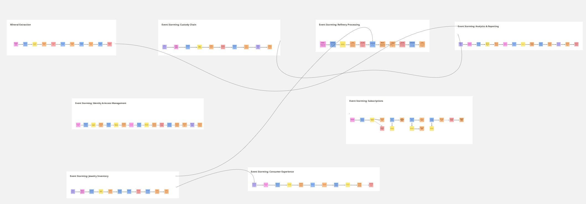

Identity & Access Management: registro, autenticación y activación de cuentas, evento que habilita el resto de las acciones del sistema.
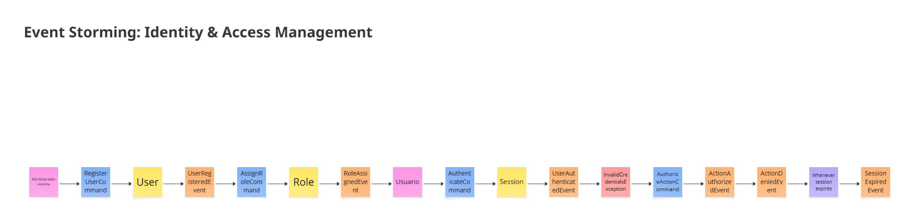

Mineral Extraction & Offline Ops: extracción del mineral, creación del lote y registro de incidentes en campo.
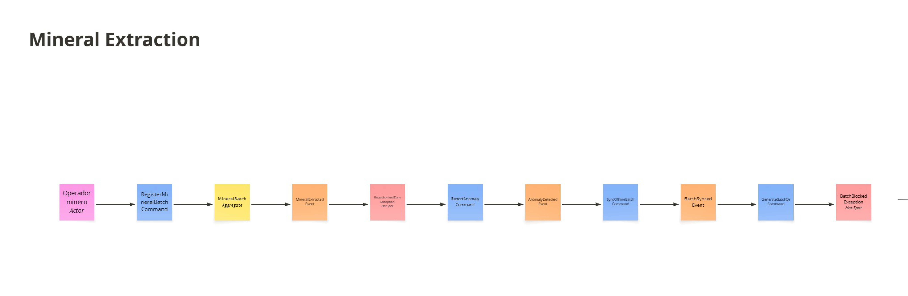

Custody Chain & Logistics: transporte del lote, actualización de ubicación y generación de alertas por desvíos en la cadena de custodia.
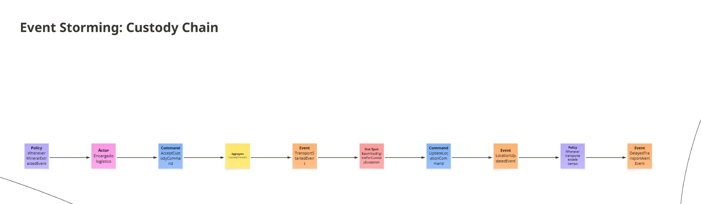

Refinery Processing: división del lote en planta y asignación de destino de cada lote hijo hacia las joyerías.
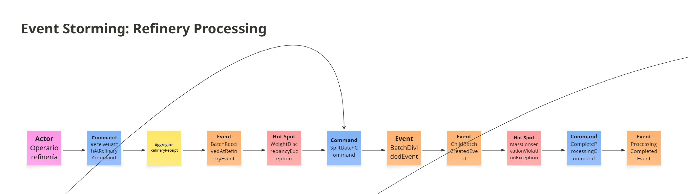

Jewelry Inventory & Certification: registro del lote recibido, generación de certificados y control del stock en joyería.
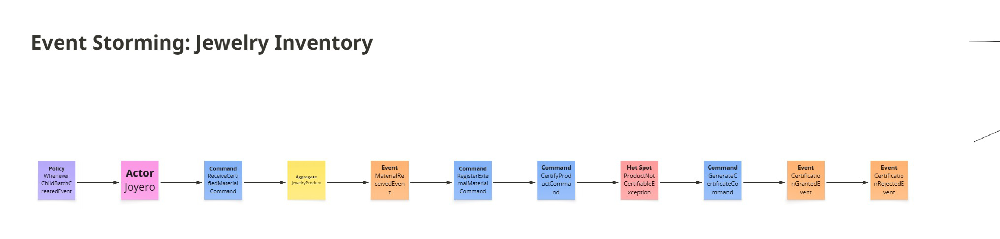

Consumer Experience: verificación pública del certificado y del código QR por parte del consumidor final.
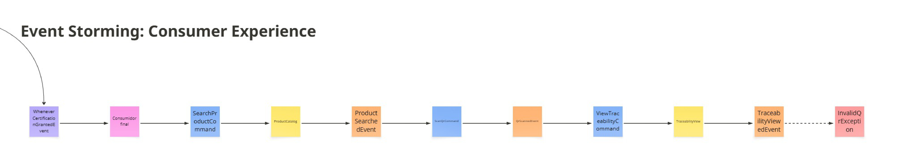

Reporting & Analytics: generación de reportes de merma y dashboards a partir de los eventos emitidos por los demás contextos.
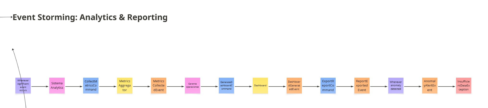

Subscriptions & Billing: asignación de planes y habilitación de funcionalidades según el plan que otorga administración.
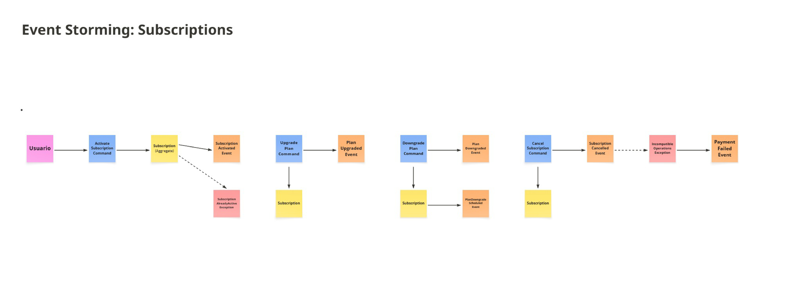

### 4.6.2. Software Architecture Context Diagram
 
El diagrama de contexto establece los límites de la plataforma OpalTrace y su interacción con los diferentes perfiles de usuario y sistemas externos críticos para el negocio.
 
A nivel de usuarios, el sistema orquesta las acciones de seis perfiles diferenciados: el Mining Operator (registro de Batches y telemetría de IoT Devices en campo), el Logistics Manager (gestión de Transport Operations y monitoreo de Location), el Refinery Operator (recepción y Processing Operations de Batches en planta), el B2B Jeweler (gestión de inventario certificado y solicitud de Certifications de Autenticidad), el End Consumer (Traceability Verification pública vía QR Code sin autenticación requerida) y el MINEX Administrator (auditoría de Organizations y gestión del ecosistema empresarial).
 
A nivel de integraciones externas, la plataforma se comunica con un IoT Gateway para recibir telemetría de IoT Devices en tiempo real (protocolo MQTT/HTTPS), delega el procesamiento de pagos de suscripción a Stripe API, valida la geolocalización de los Batches mediante Google Maps API y garantiza la inmutabilidad de las Certifications y evidencias almacenándolas de forma segura en AWS S3.
 
.png)
 
*Figura 1. Diagrama de Contexto del Sistema OpalTrace.*
 
---
 
### 4.6.3. Software Architecture Container Diagrams
 
En el segundo nivel de abstracción (Contenedores), se ha diseñado una arquitectura desacoplada orientada a la escalabilidad y la resiliencia operativa.
 
La interfaz de usuario se gestiona mediante una separación de responsabilidades: una **Web Application** (Java/Spring Boot) encargada exclusivamente de entregar los recursos estáticos al navegador, y una **Single Page Application** (Angular 17) que se ejecuta en el navegador del cliente y renderiza módulos distintos según el JWT recibido — módulo Extraction para el Mining Operator, módulo Logistics para el Logistics Manager, módulo Refinery para el Refinery Operator, módulo Jewelry para el B2B Jeweler, módulo Consumer (público, sin autenticación) para el End Consumer y módulos Analytics y Admin para el MINEX Administrator.
 
La SPA consume los servicios expuestos por la **OpalTrace API** (Spring Boot), implementada como un monolito modular que organiza la lógica de negocio en 9 Bounded Contexts DDD internos. No se utilizan microservicios ni API Gateway — los Bounded Contexts conviven dentro de una única API con separación estricta de responsabilidades por módulo. Toda la información de la cadena de suministro — Batches, Products, Certifications, Organizations, TrackingEvents y Subscriptions — se persiste en una única instancia de **MySql**.
 
.png)
 
*Figura 2. Diagrama de Contenedores de OpalTrace.*
 
---
 
### 4.6.4. Software Architecture Components Diagrams
 
Para el nivel de componentes se ha adoptado el patrón **Domain-Driven Design (DDD)** combinado con **Clean Architecture**, aplicado individualmente a cada uno de los 9 Bounded Contexts tanto en el Frontend como en el Backend. Cada BC está estructurado en cuatro capas: **Interfaces** (controladores REST y DTOs), **Application** (casos de uso), **Domain** (Aggregate Roots, Value Objects, Domain Events e invariantes) e **Infrastructure** (repositorios JDBC y adaptadores externos). En el Backend, cada BC protege sus endpoints mediante un **Security Connector** que valida el JWT antes de invocar cualquier caso de uso, con excepción del IAM BC (que emite el JWT) y el Consumer BC (acceso público sin autenticación).
 
---
 
### Frontend — Single Page Application
 
#### Vista General — Frontend
 
La Single Page Application está organizada por Bounded Context, siguiendo la misma estructura DDD del Backend. Cada BC del frontend implementa sus propias capas de Presentation, Application, Domain e Infrastructure, todas compartiendo la infraestructura base del módulo `Shared` (base-api, base-assembler, base-entity, interceptors y componentes de layout reutilizables).
 
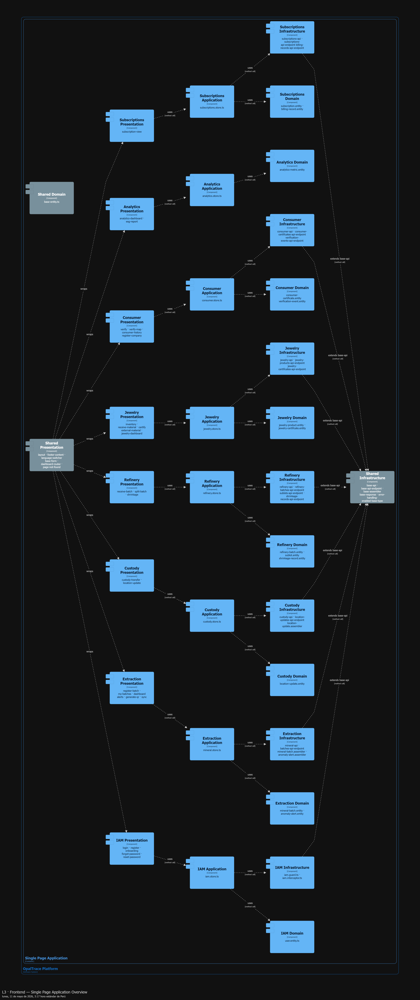
 
*Figura 3. Vista General del Frontend — Single Page Application.*
 
---
 
#### BC1 — Identity & Access Management (Frontend)
 
El módulo IAM del frontend gestiona el flujo completo de autenticación del usuario. Su Infrastructure layer implementa el `iam.guard.ts` que protege las rutas Angular verificando la validez del JWT antes de permitir la navegación, y el `iam.interceptor.ts` que inyecta automáticamente el token en el header `Authorization` de cada petición HTTP saliente. Las vistas cubren el ciclo completo de identidad: login, register, onboarding, forgot-password y reset-password.
 

 
*Figura 4. Frontend — BC1: Identity & Access Management.*
 
---
 
#### BC2 — Mineral Extraction (Frontend)
 
El módulo de Mineral Extraction provee las vistas de registro de Batches, visualización de lotes activos, gestión de alertas de anomalías, generación de QR Code y sincronización offline. Su Domain layer define las entidades `mineral-batch` y `anomaly-alert`, y su Infrastructure layer implementa los assemblers y API endpoints para la comunicación con el backend.
 

 
*Figura 5. Frontend — BC2: Mineral Extraction.*
 
---
 
#### BC3 — Custody Chain (Frontend)
 
El módulo de Custody Chain expone las vistas de transferencia de custodia y actualización de Location. Su Infrastructure layer implementa el `location-updates-api-endpoint` para el monitoreo GPS en tiempo real durante las Transport Operations.
 
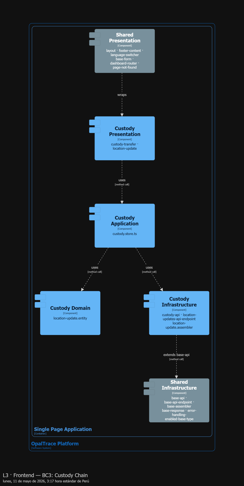
 
*Figura 6. Frontend — BC3: Custody Chain.*
 
---
 
#### BC4 — Refinery Processing (Frontend)
 
El módulo de Refinery Processing gestiona la recepción de Batches, la división en sublotes y el registro de mermas. Su Domain layer define tres entidades clave: `refinery-batch`, `sublot` y `shrinkage-record`, reflejando fielmente el modelo de dominio del backend.
 

 
*Figura 7. Frontend — BC4: Refinery Processing.*
 
---
 
#### BC5 — Jewelry Inventory (Frontend)
 
El módulo de Jewelry Inventory provee el dashboard de joyería, gestión de inventario certificado, recepción de material, registro de material externo y solicitud de Certifications de Autenticidad. Su Infrastructure layer implementa endpoints separados para productos y certificaciones.
 

 
*Figura 8. Frontend — BC5: Jewelry Inventory.*
 
---
 
#### BC6 — Consumer Experience (Frontend)
 
El módulo Consumer Experience es el único módulo público de la SPA — no requiere autenticación. Provee las vistas de verificación de autenticidad vía QR Code, visualización del mapa de trazabilidad geográfico, historial de verificaciones y registro de empresa. Su Infrastructure layer implementa endpoints de solo lectura para Certifications y Verification Events.
 

 
*Figura 9. Frontend — BC6: Consumer Experience.*
 
---
 
#### BC7 — Analytics (Frontend)
 
El módulo Analytics (que se corresponde con el Reporting & Analytics BC del backend) provee el dashboard de métricas de trazabilidad y el reporte ESG de cumplimiento ambiental. Su Application layer utiliza el `analytics.store.ts` para gestionar el estado de las métricas en el cliente.
 
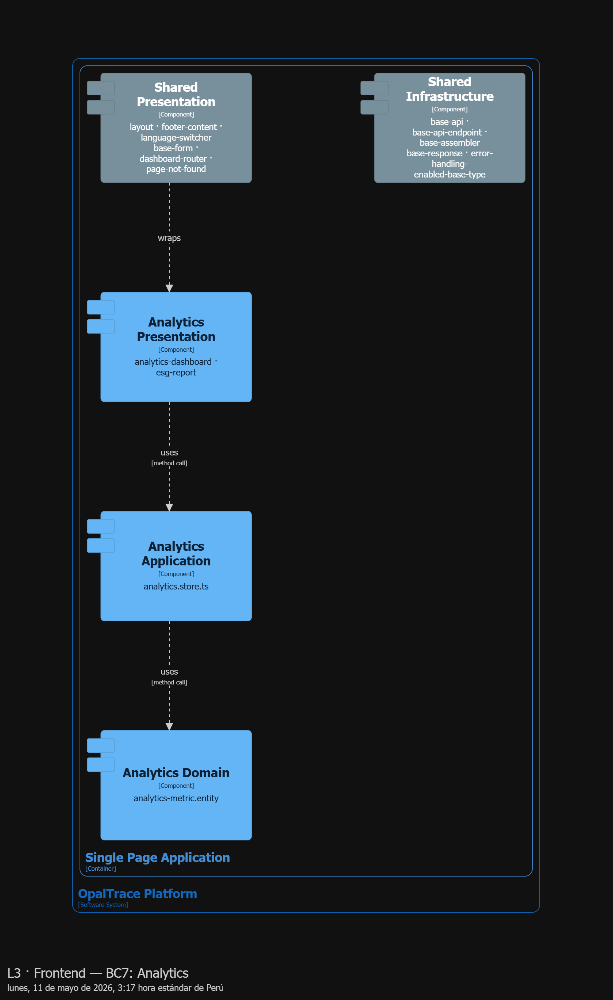
 
*Figura 10. Frontend — BC7: Analytics.*
 
---
 
#### BC8 — Subscriptions (Frontend)
 
El módulo Subscriptions gestiona la visualización del plan activo, el historial de facturación y las opciones de upgrade o cancelación. Su Domain layer define las entidades `subscription` y `billing-record`, y su Infrastructure layer se comunica con el Billing BC del backend a través de los endpoints de suscripciones y registros de facturación.
 
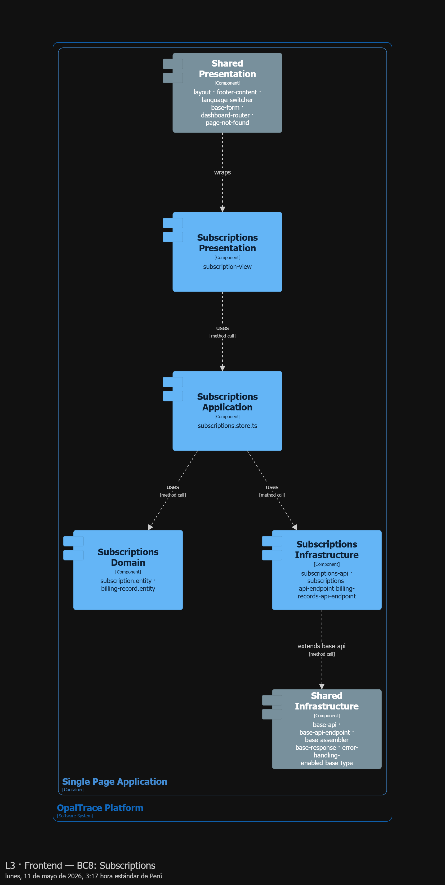
 
*Figura 11. Frontend — BC8: Subscriptions.*
 
---
 
### Backend — OpalTrace API
 
#### Vista General — Backend
 
La OpalTrace API se implementa como un monolito modular con 8 Bounded Contexts internos, organizados bajo el paquete base `com.opaltrace.platform`. Cada contexto sigue una estructura de cuatro capas (interfaces, application, domain, infrastructure) y se comunica con los demás exclusivamente a través de un Event Publisher interno, evitando que un Bounded Context importe directamente el repositorio o el aggregate de otro. El flujo principal de eventos sigue la cadena de valor del mineral: MineralExtractedEvent dispara la elegibilidad de custodia, la finalización de la custodia habilita la recepción en refinería, ChildBatchCreatedEvent habilita el ingreso de material certificado a joyería, y CertificationGrantedEvent habilita la verificación pública en Consumer Experience. El BC de Analytics consume eventos de los demás contextos para construir sus reportes, y el BC de Subscriptions se relaciona con IAM a través del cambio de plan del usuario.
 
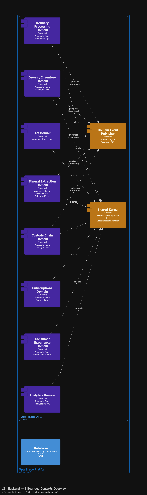
 
Figura 12. Vista general del backend — 8 Bounded Contexts.
 
---
 
#### BC1 — Identity & Access Management
 
El BC de Identity & Access Management gestiona el registro, autenticación y rol de los usuarios de la plataforma a través de su Aggregate Root User. El AuthenticationController expone el endpoint de inicio de sesión, mientras que UsersController gestiona el registro diferenciado para usuarios empresariales y usuarios consumidores. La capa de dominio define los value objects EmailAddress, HashedPassword, UserRole, UserSegment, PlanTier y RucNumber, y emite UserRegisteredEvent al completar el registro. La capa de infraestructura implementa UserRepositoryImpl para la persistencia y TokenService para la generación y validación de JWT.
 
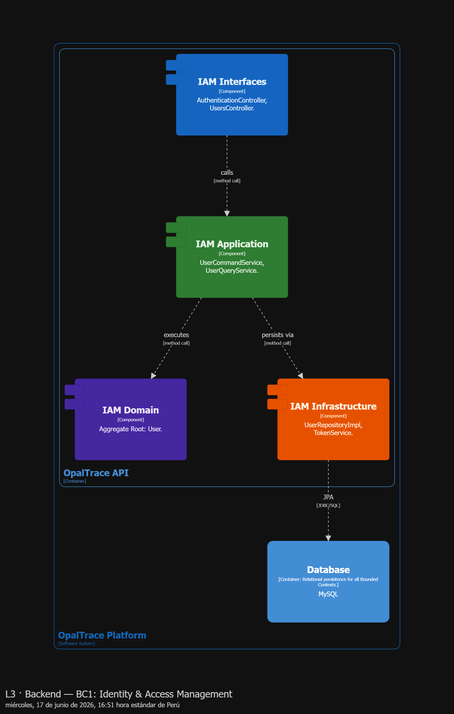
 
Figura 13. Backend — BC1: Identity & Access Management.
 
---
 
#### BC2 — Mineral Extraction
 
El BC de Mineral Extraction gestiona el registro de lotes minerales a través de dos Aggregate Roots: MineralBatch y AuthorizedZone. MineralBatchesController expone los endpoints de registro de lotes, generación de código QR y sincronización offline, mientras que MineralBatchAnomaliesController gestiona el reporte de anomalías mediante la entidad AnomalyReport. La capa de dominio define los value objects GpsCoordinate, MineralType, WeightKg, BatchStatus y AnomalyCategory, y emite MineralExtractedEvent, AnomalyDetectedEvent y BatchSyncedEvent. La capa de infraestructura implementa MineralBatchRepositoryImpl y AuthorizedZoneRepositoryImpl.
 

 
Figura 14. Backend — BC2: Mineral Extraction.
 
---
 
#### BC3 — Custody Chain
 
El BC de Custody Chain gestiona la transferencia formal de custodia de lotes minerales a través de su Aggregate Root CustodyTransfer, con la entidad LocationUpdate para el registro del recorrido. CustodyTransferController expone los endpoints para aceptar custodia y actualizar la ubicación durante el transporte. La capa de dominio define el value object CustodyStatus y emite TransportStartedEvent, LocationUpdatedEvent y DelayedTransportAlertEvent cuando el transporte excede el tiempo esperado. La capa de infraestructura implementa CustodyTransferRepositoryImpl.
 

 
Figura 15. Backend — BC3: Custody Chain.
 
---
 
#### BC4 — Refinery Processing
 
El BC de Refinery Processing gestiona la recepción de lotes en planta y su división en sublotes a través de su Aggregate Root RefineryReceipt, con la entidad SubLotRecord para registrar cada fracción resultante. RefineryBatchesController expone los endpoints para recibir, dividir y completar el procesamiento de un lote. La capa de dominio define el value object ProcessingStatus y emite BatchReceivedAtRefineryEvent, BatchDividedEvent, ChildBatchCreatedEvent y ProcessingCompletedEvent. El sistema valida la conservación de masa entre el lote padre y sus sublotes, lanzando MassConservationViolationException cuando la discrepancia de peso excede el margen permitido.
 

 
Figura 16. Backend — BC4: Refinery Processing.
 
---
 
#### BC5 — Jewelry Inventory
 
El BC de Jewelry Inventory gestiona el inventario de joyería y la emisión de certificados a través de su Aggregate Root JewelryProduct. JewelryInventoryController expone los endpoints para recibir material certificado y registrar material externo, mientras que ProductCertificationController gestiona la solicitud y consulta de certificados. La capa de dominio define los value objects InventoryCategory y CertificationState, y emite MaterialReceivedEvent, CertificationGrantedEvent, CertificationRejectedEvent y CertificateDownloadedEvent. Un producto no certificable lanza ProductNotCertifiableException al intentar emitir su certificado.
 

 
Figura 17. Backend — BC5: Jewelry Inventory.
 
---
 
#### BC6 — Consumer Experience
 
El BC de Consumer Experience es el único contexto con acceso público de la plataforma, implementado a través de su Aggregate Root ProductVerification y la entidad TraceabilityPoint para representar cada punto del recorrido del mineral. ProductVerificationController expone los endpoints para verificar la autenticidad de un producto por su número de certificado y consultar el mapa de trazabilidad asociado. La capa de dominio define el value object VerificationResult y emite AuthenticityVerifiedEvent, TraceabilityViewedEvent y SuspiciousVerificationAttemptEvent cuando se detecta un patrón de verificación sospechoso.
 

 
Figura 18. Backend — BC6: Consumer Experience.
 
---
 
#### BC7 — Analytics
 
El BC de Analytics consolida la información generada por los demás contextos a través de su Aggregate Root AnalyticsReport. AnalyticsDashboardController expone los endpoints del dashboard operativo, los indicadores de merma y el análisis comparativo, mientras que EsgReportsController gestiona la generación y consulta de reportes ESG. La capa de dominio define los value objects DashboardMetrics, ShrinkageIndicator, ComparativeMetrics, ReportType y ComplianceStatus, y emite ReportGeneratedEvent, EsgComplianceUpdatedEvent y WeightLossAlertTriggeredEvent.
 
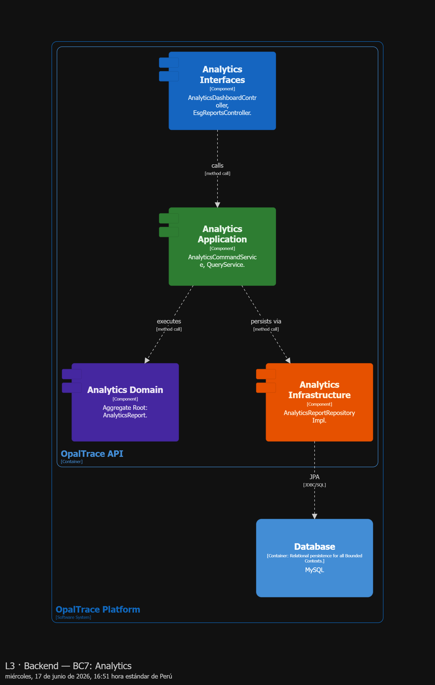
 
Figura 19. Backend — BC7: Analytics.
 
---
 
#### BC8 — Subscriptions
 
El BC de Subscriptions gestiona los planes de suscripción de las organizaciones a través de su Aggregate Root Subscription, con la entidad BillingRecord para el historial de facturación. SubscriptionsController expone los endpoints de activación, mejora, degradación y cancelación del plan, mientras que BillingController gestiona la consulta del historial de pagos y comprobantes. La capa de dominio define los value objects BillingCycle, PaymentStatus y SubscriptionStatus, y emite SubscriptionActivatedEvent, PlanUpgradedEvent, PlanDowngradedEvent, PlanDowngradeScheduledEvent, SubscriptionCancelledEvent y PaymentFailedEvent. Una operación incompatible con el estado actual de la suscripción lanza IncompatibleOperationsException.
 

 
Figura 20. Backend — BC8: Subscriptions.
 
## 4.7. Software Object-Oriented Design

### 4.7.1. Class Diagrams
 
El diseño orientado a objetos de OpalTrace sigue estrictamente los principios de Domain-Driven Design (DDD), organizando las clases en torno a los conceptos del negocio real y no a consideraciones técnicas. Cada Bounded Context encapsula su propio modelo de dominio, definiendo con precisión sus Aggregate Roots, Entities, Value Objects, Domain Events, Enums y Repository interfaces — todos alineados con el lenguaje ubicuo del dominio minero-joyero.
 
La decisión de dividir los diagramas por Bounded Context responde a tres razones fundamentales. Primero, alta cohesión: cada diagrama agrupa únicamente las clases que colaboran dentro de un mismo contexto delimitado, evitando dependencias innecesarias entre contextos. Segundo, bajo acoplamiento: los Bounded Contexts se comunican exclusivamente a través de Domain Events, nunca mediante referencias directas a clases de otros contextos. Tercero, claridad visual: un diagrama monolítico con los 9 contextos resultaría ilegible; la separación permite inspeccionar cada módulo de forma independiente y coherente con la arquitectura C4 definida previamente.
 
Adicionalmente, se presentan diagramas de detalle para los tres Aggregates más críticos del sistema — `MineralBatch` (Lote), `JewelryProduct` (Product) y `JewelryCertificate` (Certification de Autenticidad) — que concentran las invariantes y reglas de negocio más importantes de la plataforma.
 
---
 
#### Vista General — Todos los Bounded Contexts
 
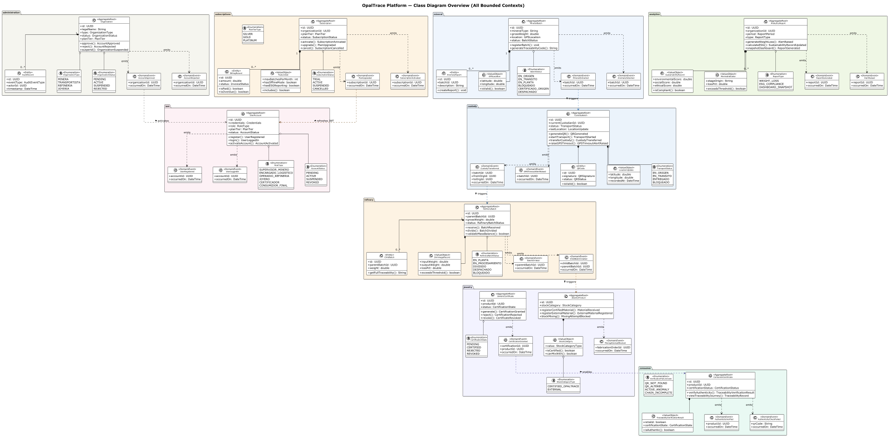
 
*Figura 1. Vista general de todos los Bounded Contexts — OpalTrace Platform.*
 
---
 
#### Bounded Context 1: Identity & Access Management
 
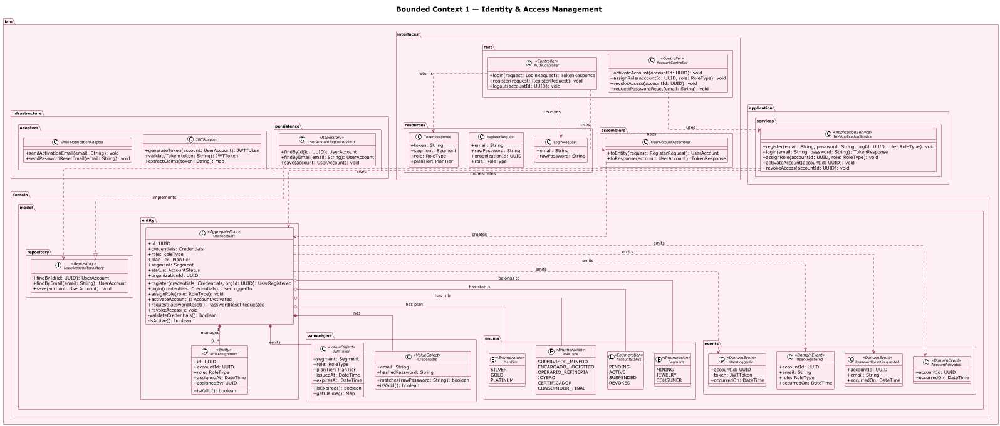
 
*Figura 2. Diagrama de clases — BC1: Identity & Access Management.*
 
---
 
#### Bounded Context 2: Mineral Extraction & Offline Ops
 
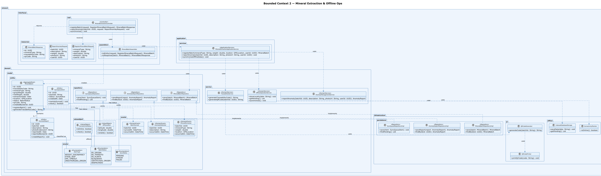
 
*Figura 3. Diagrama de clases — BC2: Mineral Extraction & Offline Ops.*
 
---
 
#### Bounded Context 3: Custody Chain & Logistics
 
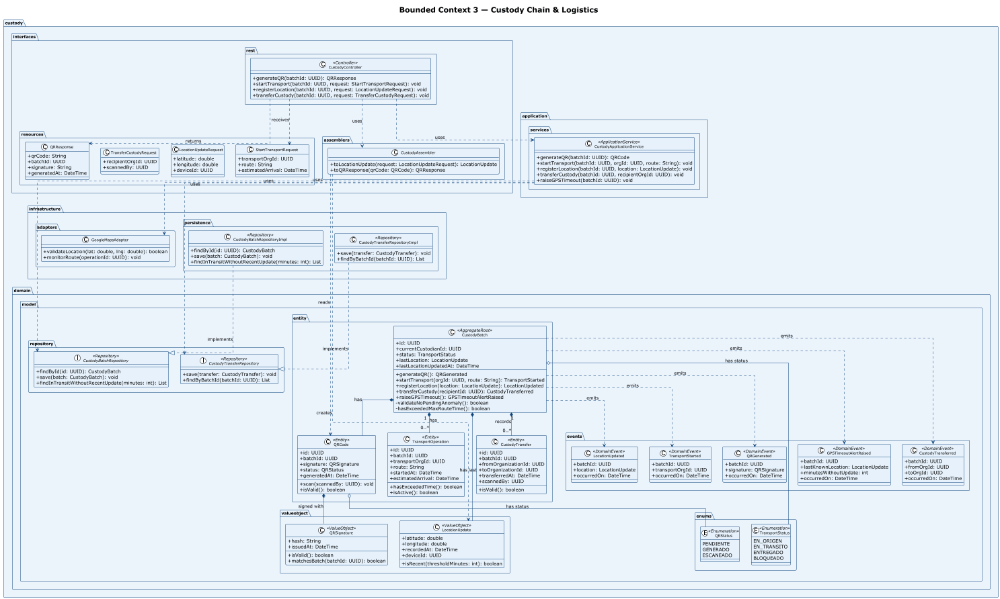

*Figura 4. Diagrama de clases — BC3: Custody Chain & Logistics.*
 
---
 
#### Bounded Context 4: Refinery Processing
 
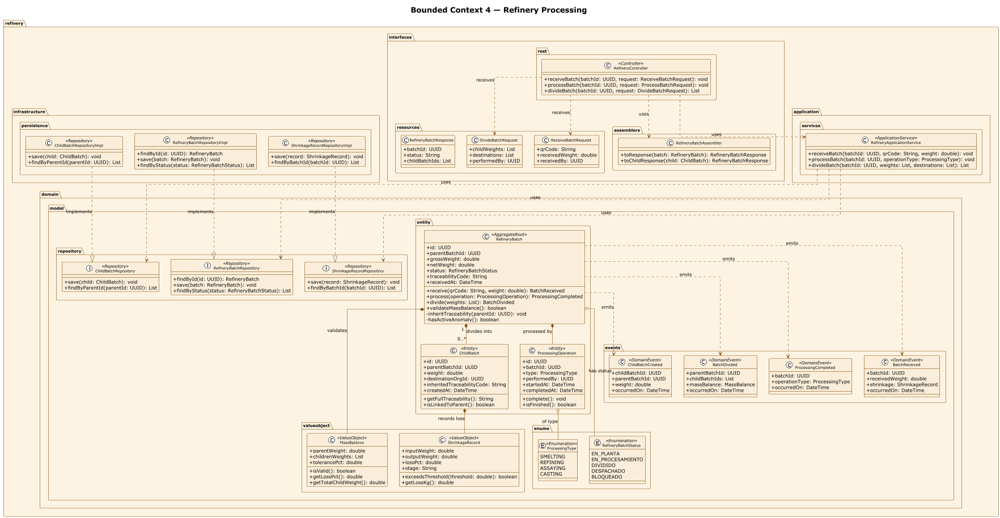
 
*Figura 5. Diagrama de clases — BC4: Refinery Processing.*
 
---
 
#### Bounded Context 5: Jewelry Inventory & Certification
 
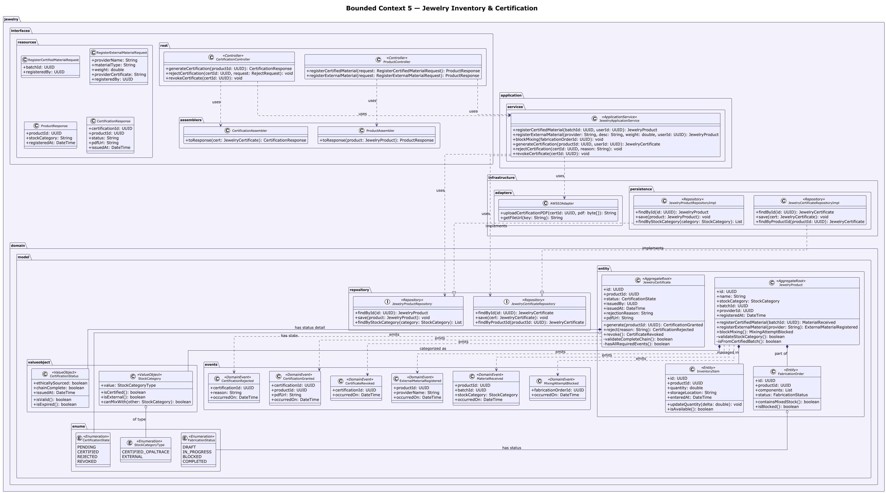
 
*Figura 6. Diagrama de clases — BC5: Jewelry Inventory & Certification.*
 
---
 
#### Bounded Context 6: Consumer Experience
 
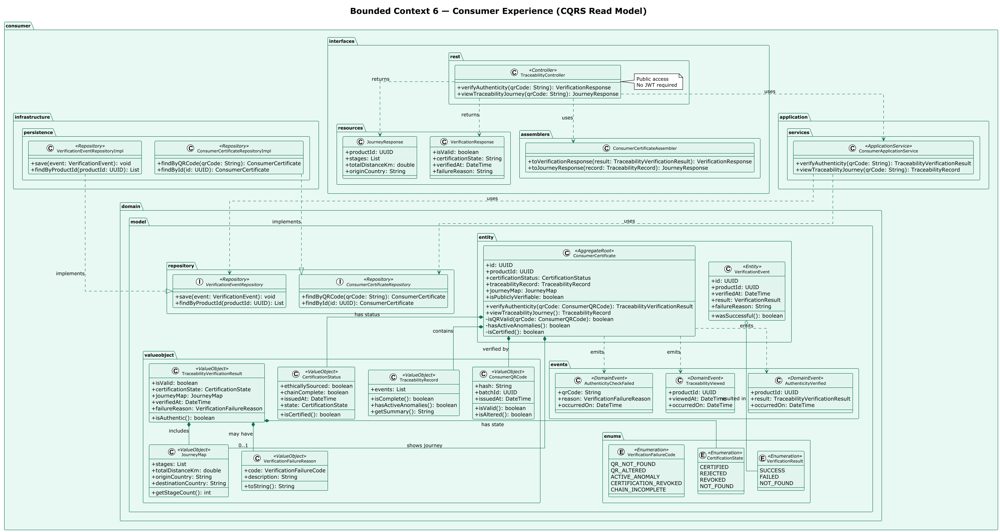
 
*Figura 7. Diagrama de clases — BC6: Consumer Experience (CQRS Read Model).*
 
---
 
#### Bounded Context 7: Administration & Audit
 
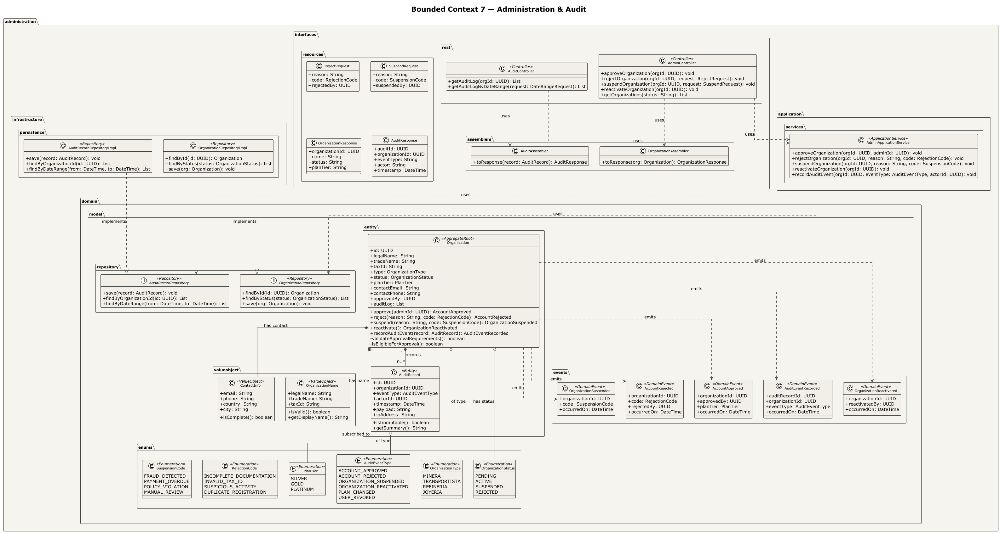
 
*Figura 8. Diagrama de clases — BC7: Administration & Audit.*
 
---
 
#### Bounded Context 8: Reporting & Analytics
 
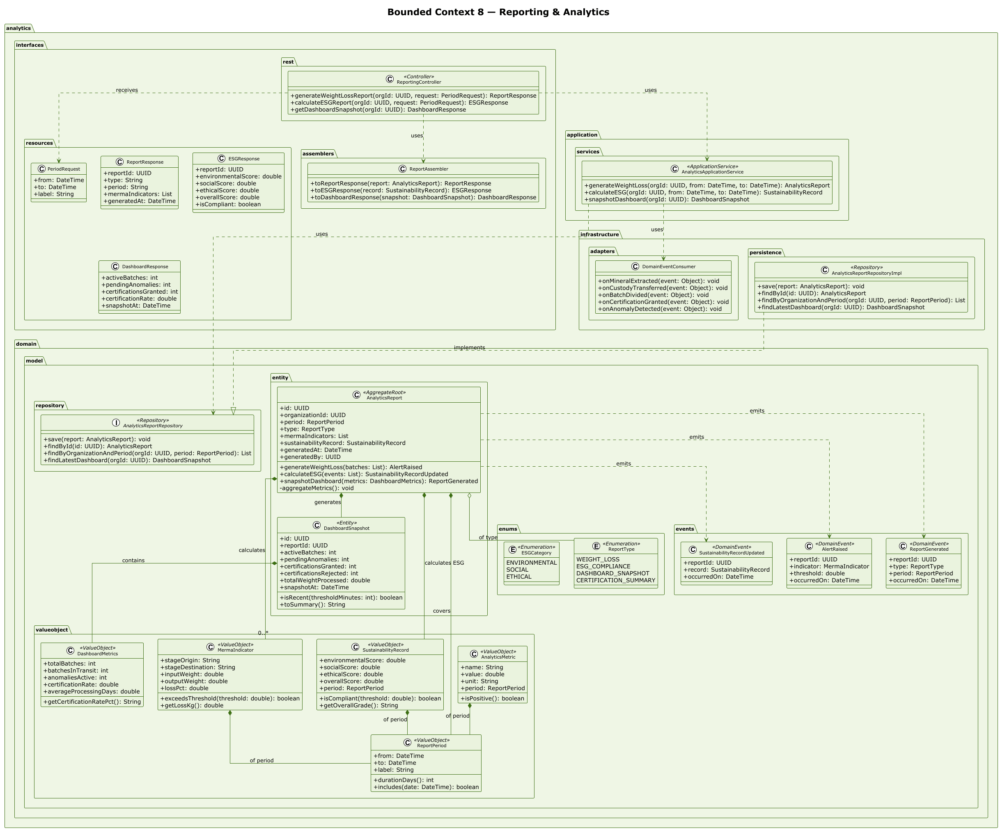
 
*Figura 9. Diagrama de clases — BC8: Reporting & Analytics.*
 
---
 
#### Bounded Context 9: Subscriptions & Billing
 
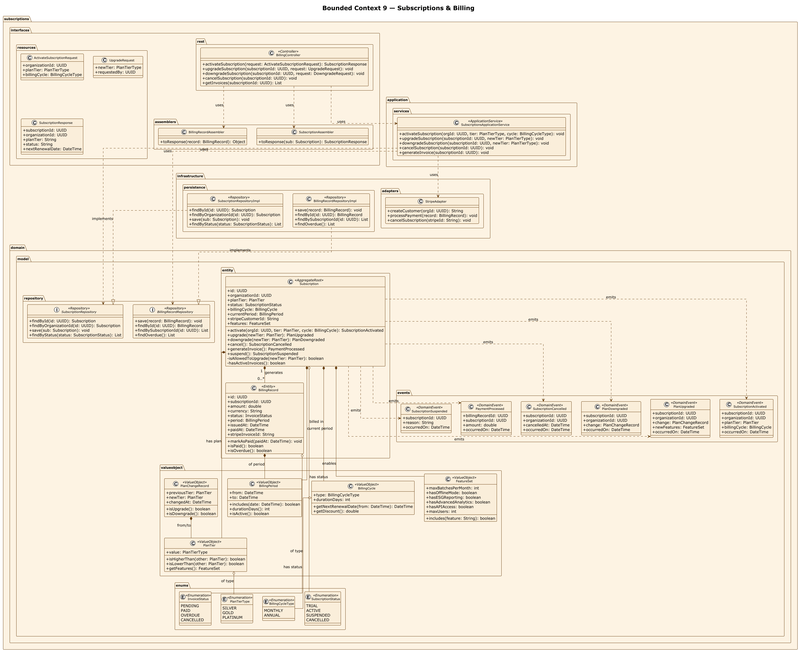
 
*Figura 10. Diagrama de clases — BC9: Subscriptions & Billing.*
 
---
 
### 4.7.2. Class Dictionary
 
Los diagramas de clases presentados en la sección anterior modelan el dominio de OpalTrace siguiendo una estructura DDD consistente. A continuación se describen los elementos más relevantes de cada Bounded Context.
 
#### BC1 — Identity & Access Management
 
El Aggregate Root `UserAccount` centraliza la autenticación y autorización de todos los actores del sistema. Encapsula las credenciales mediante el Value Object `Credentials`, emite el JWT con claims `{ segment, role, planTier }` consumido por todos los demás Bounded Contexts, y gestiona el ciclo de vida de la cuenta a través de los estados definidos en el enum `AccountStatus`. El enum `RoleType` define los seis roles del sistema: `SUPERVISOR_MINERO`, `ENCARGADO_LOGISTICO`, `OPERARIO_REFINERIA`, `JOYERO`, `CERTIFICADOR` y `CONSUMIDOR_FINAL`.
 
#### BC2 — Mineral Extraction & Offline Ops
 
El Aggregate Root `MineralBatch` es el punto de entrada de toda la cadena de trazabilidad. Registra el Batch con validación geográfica mediante el Value Object `GPSLocation`, gestiona la cola offline a través de `SyncQueueItem` con timestamps inmutables, y detecta anomalías registradas en `AnomalyReport`. El enum `BatchStatus` define el ciclo de vida del lote: `EN_ORIGEN`, `EN_TRANSITO`, `EN_PLANTA`, `BLOQUEADO`, `CERTIFICADO_ORIGEN` y `DESPACHADO`. La invariante central impide que un Batch con `AnomalyReport` activo avance de estado.
 
#### BC3 — Custody Chain & Logistics
 
El Aggregate Root `CustodyBatch` gestiona la transferencia formal de responsabilidad legal entre Organizations. El Entity `QRCode` con su Value Object `QRSignature` garantiza la autenticidad del Batch durante el transporte. El Value Object `LocationUpdate` registra las actualizaciones GPS del recorrido. La invariante crítica dispara automáticamente `GPSTimeoutAlertRaised` cuando un Batch en tránsito supera el tiempo máximo sin actualización de Location.
 
#### BC4 — Refinery Processing
 
El Aggregate Root `RefineryBatch` implementa la invariante de conservación de masa mediante el Value Object `MassBalance`: la suma de pesos de los `ChildBatch` no puede superar el peso del Batch padre. Cada `ChildBatch` hereda de forma inmutable el `TraceabilityRecord` del Batch padre. El Value Object `ShrinkageRecord` registra la merma en cada etapa de procesamiento, dato crítico para los reportes ESG del BC8.
 
#### BC5 — Jewelry Inventory & Certification
 
Este BC posee dos Aggregate Roots independientes. `JewelryProduct` impone la separación estricta entre `StockCategoryType.CERTIFIED_OPALTRACE` y `EXTERNAL` mediante el Value Object `StockCategory`, bloqueando automáticamente cualquier operación de fabricación que intente combinarlos (`MixingAttemptBlocked`). `JewelryCertificate` — denominada **Certification de Autenticidad** en el lenguaje ubicuo — valida la cadena completa `MineralExtracted → TransportStarted → BatchReceived → MaterialReceived` antes de emitir `CertificationGranted`. El enum `RejectionCode` clasifica los motivos de rechazo: `INCOMPLETE_CHAIN`, `ACTIVE_ANOMALY`, `INVALID_QR` y `MIXED_STOCK`.
 
#### BC6 — Consumer Experience
 
Implementa el patrón **CQRS**: el Aggregate Root `ConsumerCertificate` es un read model de solo lectura que proyecta el estado consolidado del Mineral desde todos los BCs anteriores. No modifica ningún dato. El Value Object `TraceabilityVerificationResult` encapsula el resultado de la verificación pública vía QR Code. El enum `VerificationFailureCode` detalla la causa exacta del fallo ante un QR inválido, alterado o con anomalías activas.
 
#### BC7 — Administration & Audit
 
El Aggregate Root `Organization` gestiona el ciclo de vida de las cuentas empresariales B2B. El Entity `AuditRecord` es inmutable por diseño — registra cada acción administrativa con actor, timestamp e IP. Los enums `RejectionCode` y `SuspensionCode` clasifican los motivos de rechazo y suspensión según reglas de negocio definidas por MINEX.
 
#### BC8 — Reporting & Analytics
 
El Aggregate Root `AnalyticsReport` es un read model event-driven que consolida información de todos los BCs. El Value Object `MermaIndicator` calcula la pérdida de peso entre etapas. El Value Object `SustainabilityRecord` agrega las métricas ESG en tres dimensiones: `environmentalScore`, `socialScore` y `ethicalScore`. El Entity `DashboardSnapshot` captura el estado del sistema en un momento dado para el Dashboard de monitoreo en tiempo real.
 
#### BC9 — Subscriptions & Billing
 
El Aggregate Root `Subscription` controla el acceso escalonado a funcionalidades mediante el Value Object `FeatureSet`, que define los límites de uso según `PlanTierType`: `SILVER`, `GOLD` o `PLATINUM`. El Entity `BillingRecord` registra cada transacción de pago con su estado en el enum `InvoiceStatus`. Al cambiar de plan, `Subscription` emite `PlanUpgraded` o `PlanDowngraded` para que el BC1 refresque el JWT del usuario con el nuevo `planTier`.
 
---
 
### 4.7.3. Aggregate Diagrams
 
A continuación se presentan los diagramas de detalle de los tres Aggregates más críticos del dominio OpalTrace. Estos diagramas muestran en profundidad los límites del aggregate, sus entidades internas, Value Objects, invariantes de negocio y Domain Events que produce.
 
---
 
#### Aggregate: MineralBatch (Lote) — BC2 Mineral Extraction
 
El `MineralBatch` es el Aggregate Root que origina toda la cadena de trazabilidad. Es el único punto de entrada para registrar un Batch, detectar anomalías y gestionar la operación offline. Sus cuatro invariantes clave garantizan la integridad desde el origen.
 
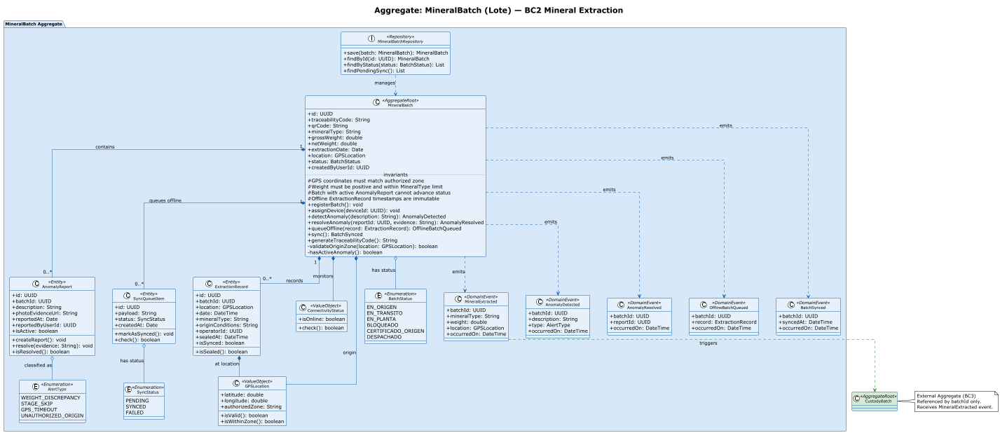
 
*Figura 11. Aggregate Diagram — MineralBatch (Lote).*
 
---
 
#### Aggregate: JewelryProduct (Product) — BC5 Jewelry Inventory
 
El `JewelryProduct` es el Aggregate Root que controla la segregación ética del inventario. Su invariante más importante bloquea automáticamente cualquier intento de mezclar material certificado OpalTrace con material externo, protegiendo la integridad de la cadena de valor.
 
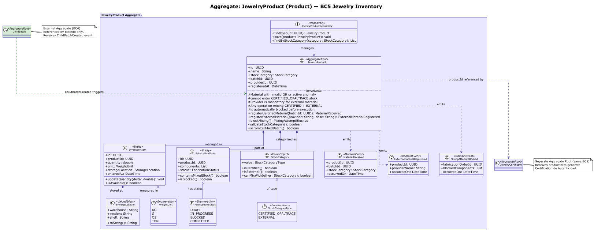

*Figura 12. Aggregate Diagram — JewelryProduct (Product).*
 
---
 
#### Aggregate: JewelryCertificate (Certification de Autenticidad) — BC5 Jewelry Inventory
 
El `JewelryCertificate` es el Aggregate Root con la invariante más compleja del sistema. Solo puede emitir una Certification de Autenticidad cuando la `TraceabilityRecord` del Batch es íntegra y completa — los cuatro eventos `MineralExtracted`, `TransportStarted`, `BatchReceived` y `MaterialReceived` deben existir sin gaps ni anomalías activas.
 
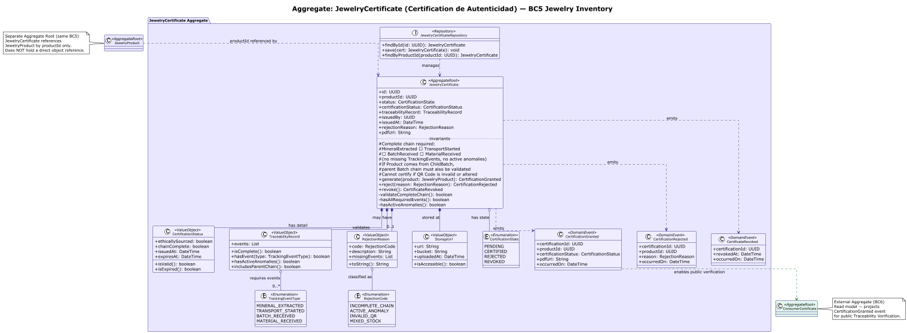
 
*Figura 13. Aggregate Diagram — JewelryCertificate (Certification de Autenticidad).*

## 4.8. Database Design
 
### 4.8.1. Database Diagrams
 
El diseño de base de datos de OpalTrace está implementado en MySQL 8.0 con InnoDB, organizado en torno a las entidades centrales del dominio. Las tablas utilizan `bigint` con `AUTO_INCREMENT` como identificador primario y campos `created_at`/`updated_at` en todas las entidades. Los enums del dominio se implementan como columnas `ENUM` nativas de MySQL. Las relaciones entre tablas se establecen mediante Foreign Keys explícitas.
 
A continuación se presentan los diagramas de base de datos por tabla, tal como fueron generados desde Redgate Data Modeler.
 
---
 
#### Vista General
 
El diagrama de vista general muestra la totalidad de las tablas del sistema y sus relaciones. `mineral_batches` actúa como tabla central referenciada por `anomaly_reports`; `custody_transfers` es referenciada por `location_updates`; `refinery_receipts` es referenciada por `sub_lot_records`; y `subscriptions` es referenciada por `billing_records`.
 

 
*Figura 1. Vista general del modelo de base de datos — OpalTrace Platform.*
 
---
 
#### users
 
Tabla central de identidad. Almacena credenciales, rol (`ADMIN`, `CONSUMER`, `SUPERVISOR`), segmento (`MINING`, `JEWELRY`, `CONSUMER`) y `plan_tier` contratado. Referenciada implícitamente por la mayoría de tablas mediante campos `_user_id`.
 
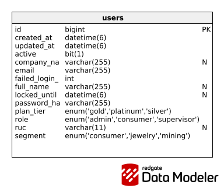
 
*Figura 2. Tabla users.*
 
---
 
#### mineral_batches
 
Tabla central de trazabilidad. Almacena el `batch_id` único, tipo de mineral, peso, coordenadas GPS de origen embebidas, estado del lote (`EN_ORIGEN`, `EN_TRANSITO`, `EN_PLANTA`, `PROCESADO`, `CERTIFICADO`) y el `qr_code_data` generado.
 
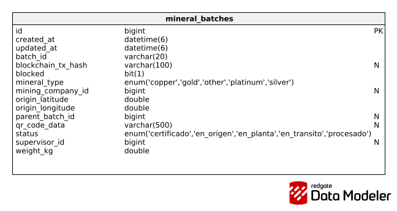
 
*Figura 3. Tabla mineral_batches.*
 
---
 
#### anomaly_reports
 
Registra anomalías detectadas sobre un lote. Referencia a `mineral_batches` mediante FK en `batch_id`. Almacena la categoría (`WEIGHT_DISCREPANCY`, `BROKEN_SEAL`, `CONTAMINATION`, etc.), descripción, evidencia fotográfica y estado de resolución.
 
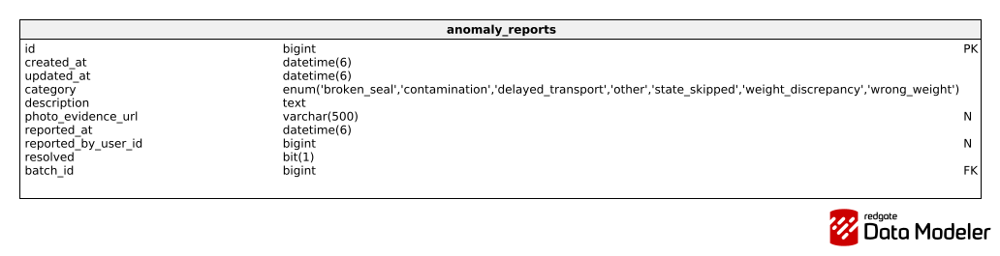
 
*Figura 4. Tabla anomaly_reports.*
 
---
 
#### authorized_zones
 
Almacena zonas geográficas autorizadas para operaciones mineras. Define un área circular mediante `center_latitude`, `center_longitude` y `radius_meters`.
 
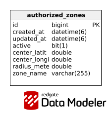
 
*Figura 5. Tabla authorized_zones.*
 
---
 
#### custody_transfers
 
Registra cada transferencia de custodia de un lote. Almacena coordenadas de inicio y fin del trayecto, estado (`PENDING`, `IN_TRANSIT`, `DELIVERED`) y referencia al `batch_id` correspondiente.
 
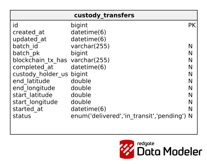
 
*Figura 6. Tabla custody_transfers.*
 
---
 
#### location_updates
 
Persiste cada actualización GPS durante un transporte activo. Referencia a `custody_transfers` mediante FK en `transfer_id`.
 
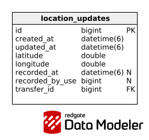
 
*Figura 7. Tabla location_updates.*
 
---
 
#### refinery_receipts
 
Registra la recepción de un lote en refinería. Almacena el peso declarado vs. el peso original para calcular `weight_discrepancy_percent`, y las marcas de tiempo de recepción y fin de procesamiento.
 
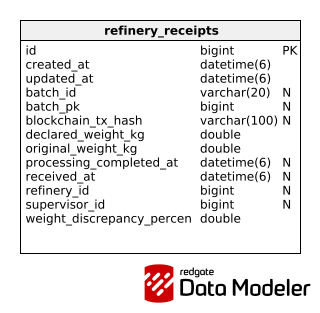
 
*Figura 8. Tabla refinery_receipts.*
 
---
 
#### sub_lot_records
 
Registra los sublotes generados a partir de un lote padre en refinería. Referencia a `refinery_receipts` mediante FK en `receipt_id`.
 
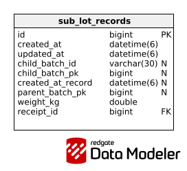
 
*Figura 9. Tabla sub_lot_records.*
 
---
 
#### jewelry_products
 
Almacena los productos de joyería con su estado de certificación (`PENDING`, `CERTIFIED`, `REJECTED`, `REVOKED`) y categoría de stock (`CERTIFIED_STOCK`, `EXTERNAL_STOCK`). El campo `can_generate_certificate` implementa la invariante de elegibilidad para certificación.
 
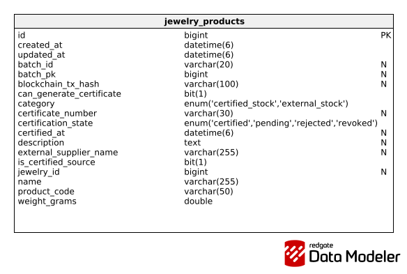
 
*Figura 10. Tabla jewelry_products.*
 
---
 
#### product_verifications
 
Registra cada intento de verificación pública de un producto vía QR. Almacena el resultado (`AUTHENTIC`, `NOT_VERIFIABLE`), la razón de fallo si aplica, y la IP del verificador.
 
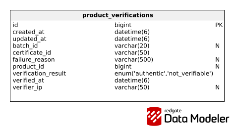
 
*Figura 11. Tabla product_verifications.*
 
---
 
#### analytics_reports
 
Centraliza los reportes generados por el sistema. Almacena el tipo (`ESG`, `SHRINKAGE`, `DASHBOARD`, `COMPARATIVE`), el período analizado y el `compliance_status` resultante.
 
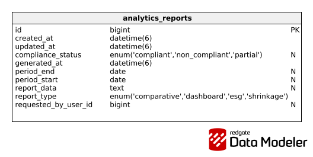
 
*Figura 12. Tabla analytics_reports.*
 
---
 
#### subscriptions
 
Almacena la suscripción activa de cada usuario con su `plan_tier` (`SILVER`, `GOLD`, `PLATINUM`), ciclo de facturación (`MONTHLY`, `ANNUAL`), estado (`ACTIVE`, `SUSPENDED`, `CANCELLED`) y datos de downgrade programado.
 
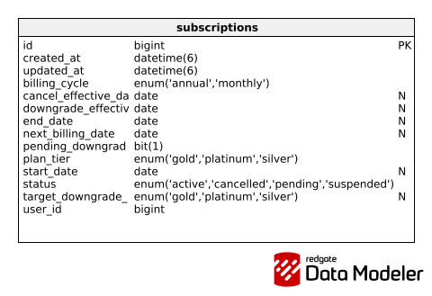
 
*Figura 13. Tabla subscriptions.*
 
---
 
#### billing_records
 
Registra cada transacción de pago asociada a una suscripción. Almacena el monto, `invoice_number` único, método de pago y estado (`COMPLETED`, `REJECTED`, `REFUNDED`).
 
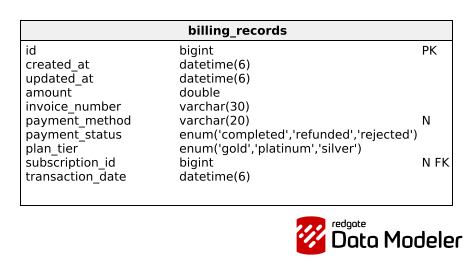
 
*Figura 14. Tabla billing_records.*