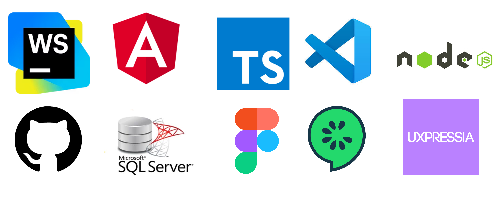
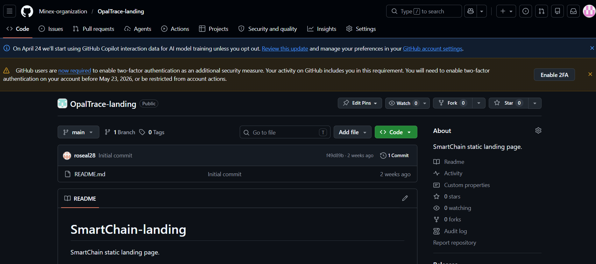

# CAPÍTULO V: Product Implementation, Validation & Deployment

## 5.1. Software Configuration Management

### 5.1.1. Software Development Environment Configuration

**-Project Management:**
1. Herramienta: Trello
Propósito: Gestión de tareas, planificación de sprints y seguimiento del progreso del equipo mediante tableros Kanban. 

**-Requirements Management:**
1. Herramienta: UXPressia
Propósito: Creación de artefactos de needfinding como User Personas, User Journey Maps y Empathy Maps para comprender las necesidades del usuario.
2. Herramienta: Miro
Propósito: Desarrollo de Event Storming (Big Picture y Process Level) para el modelado de procesos y definición del alcance del sistema.
3. Herramienta: Gherkin
Propósito: Definición de criterios de aceptación y escenarios de prueba en formato Given–When–Then.

**-Product UX/UI Design:**
1. Herramienta: Figma
Propósito: Diseño de wireframes y mockups de la interfaz del sistema, incluyendo la landing page.

**-Software Development:**
1. Herramienta: Visual Studio Code
Propósito: Entorno de desarrollo utilizado para la programación del sistema.
2. Herramienta: GitHub
Propósito: Control de versiones y trabajo colaborativo mediante repositorios, commits y ramas. Cada miembro del equipo clonará el repositorio para desarrollar de manera distribuida sus features.
3. Tecnología Frontend: Angular
Lenguaje: TypeScript
Propósito: Desarrollo de la interfaz web interactiva del sistema.
4. Tecnología Backend: Node.js 
Propósito: Desarrollo de la lógica del servidor, manejo de peticiones HTTP y conexión con la base de datos.
5. Base de Datos: Microsoft SQL Server
Propósito: Almacenamiento y gestión de la información del sistema.
6. Herramienta: WebStorm
Propósito: Entorno de desarrollo especializado para aplicaciones JavaScript y TypeScript, especialmente útil para nuestro proyecto OpalTrace con Angular.

**-Software Deployment:**
1. Herramienta: GitHub Pages
Propósito: Despliegue de la solución de cada producto digital de OpalTrace desde nuestro repositorio de Github.

**-Software Documentation:**
1. Herramienta: Markdown
Propósito: Documentación técnica del proyecto (README y documentación del código).
2. Herramienta: Structurizr
Propósito: Elaboración de diagramas de arquitectura del sistema utilizando el modelo C4 (contexto, contenedores, componentes y código).

### 5.1.2. Source Code Management
Para el control de versiones y la organización ordenada del código de nuestro proyecto OpalTrace, 
el equipo utiliza GitHub como plataforma principal. GitHub nos permite almacenar código fuente 
del Landing Page, Front-End, Back-End llevar un registro histórico de cambios, colaborar de manera estructurada y garantizar trazabilidad durante todo el ciclo de desarrollo. Por ende, creamos la organización Minex-Organization, que incluye los siguientes repositorios:
| Solución  | Nombre del repositorio  |  Enlace  |
|---|---|---|
| Report | OpalTrace-report  | https://github.com/Minex-organization/OpalTrace-report.git  |
| Landing Page  | OpalTrace-landing  |  https://github.com/Minex-organization/OpalTrace-landing.git |
| Front-End  |  OpalTrace-frontend  | https://github.com/Minex-organization/OpalTrace-frontend.git  |
| Back-End (Web Services)  | OpalTrace-backend   |   |

Nuestro equipo de trabajo ha aplicado el flujo GitFlow, de acuerdo al artículo "A successful Git branching model” de Vincent Driessen. Nuestra organización cuenta con dos ramas permanentes: master (rama que refleja estados listos para entregas) y develop (rama de integración). Desde la rama develop crearemos ramas feature con la nomenclatura "feature/chapter-#-description", por ejemplo feature/chapter-ii-interviews y en el caso un miembro del equipo desarrolla en totalidad un capítulo "feature-chapter-#-content" en estas nuevas ramas feature cada miembro realiza el trabajo de forma aislada, una vez terminado se fusiona en develop para integrarla en la próxima versión. Una vez que se acerque la fecha de entrega del producto se creama una rama release a partir de develop, donde se realizarán tareas menores como la correción de errores. Finalmente la rama se fusiona en master y en develop para asegurar que los arreglos se mantengan en el futuro.

En síntesis cada nueva funcionalidad se desarrollará en un feature Branch, mientras que las versiones preparadas para lanzamiento se manejarán en release branches con la convención release/vX.Y.Z aplicando Semantic Versioning. Finalmente, las correcciones urgentes se resolverán mediante hotfix branches con el formato hotfix/vX.Y.Z. Todas las confirmaciones seguirán las reglas de Conventional Commits para mantener así un historial claro y estructurado, asegurando un buen camino en el registro de versiones para OpalTrace.

**Repositorio report**

**Repositorio Landing Page**

**Repositorio FrontEnd**

**Repositorio BackEnd**
//añadir captura de pantallas

### 5.1.3. Source Code Style Guide & Conventions

Todos los identificadores (archivos, clases, métodos, variables, etc.) deben estar en inglés.

1. HTML

- Etiquetas y atributos en minúsculas  
`<section id="mineral-tracking"></section>`  

- Cerrar siempre los elementos  
``

- Comillas dobles para valores de atributos  
`<button type="button" class="primary-button"></button>`

- Incluir siempre alt (y width/height si es posible) en imágenes  
``

- Sangría de 2 espacios  

2. CSS

- kebab-case para nombres de clases e IDs  
 .mineral-card { … }  
 #tracking-map { … }  

- BEM opcional en componentes complejos  
 .tracking-card__status--active { … }  

- Agrupar o alfabetizar propiedades  

- Omitir unidades en valores cero  
 margin: 0;  

- Separar bloques con una línea en blanco  

3. JavaScript

- camelCase para variables y funciones  
 `function calculateMineralWeight() { }`

- Usar `const` y `let` en lugar de `var`  

- Evitar funciones largas (máx. 20–30 líneas)  

- Manejo de errores con `try/catch`  

- Uso de ES6+ (arrow functions, destructuring, etc.)  

4. TypeScript (Angular)

- Seguir la Angular Style Guide (https://angular.io/guide/styleguide)  
- Convenciones de nombres:  
 • Clases/Componentes/Servicios: PascalCase, p. ej. MineralTrackingService  
 • Interfaces/Tipos: PascalCase, p. ej. MineralData  
 • Variables/Métodos/Propiedades: camelCase, p. ej. getMineralData()  
 • Constantes: UPPER_SNAKE_CASE, p. ej. MAX_TRACKING_DISTANCE  
- Archivos en kebab-case, p. ej. mineral-tracking.component.ts  
- Siempre usar punto y coma al final de cada línea  
- Orden de imports: externos → módulos del proyecto → relativo  
- Evitar any; preferir tipado estricto  
- Lint y formateo automáticos con ESLint y Prettier  

5. Java (Spring Boot)

- Seguir Google Java Style Guide (https://google.github.io/styleguide/javaguide.html)  
- Convenciones de nombres:  
 • Clases/Enums: PascalCase, p. ej. MineralShipment  
 • Métodos/Variables: camelCase, p. ej. calculateRoute()  
 • Constantes: UPPER_SNAKE_CASE, p. ej. DEFAULT_TIMEOUT  
- Sangría de 4 espacios (sin tabs)  
- Llaves en la misma línea, p. ej.  
 public class TrackingService {  
 public void processData() {  
 // …  
 }  
 }  
- Una instrucción por línea  
- Uso de anotaciones de Spring Boot: @RestController, @Service, @Repository  
- Separación por capas: Controller, Service, Repository, Model  

### 5.1.4. Software Deployment Configuration
- Creación de la Landing Page:
1. Se crea un repositorio (OpalTrace-landing) desde Minex-organization

2. Agregar a los miembros del equipo

3. Habilitar GitHub Pages en branch master y ruta "/(root)"

- Creación de Front-End App
1. Creación del repositorio (OpalTrace-frontend) dentro de la organización Minex-organization

2. Agregar a los miembros del equipo

## 5.2. Landing Page, Services & Applications Implementation

### 5.2.1. Sprint 1

### 5.2.1.1. Sprint Planning 1
En esta sección se detallan los aspectos clave del Sprint Planning Meeting correspondiente al Sprint 1 del proyecto. El enfoque principal de este sprint es el desarrollo e implementación de la **Landing Page** del sistema de trazabilidad minera, la cual permitirá comunicar la propuesta de valor, beneficios y funcionalidades de la plataforma a los usuarios finales.

| Sprint # | Sprint 1 |
|----------|---------|
| Date | 2026 - 04 - 20 |
| Time | 10:00 PM |
| Location | Reunión virtual vía Discord |
| Prepared by | Armestar Felipa, Adrian Andres |
| Attendees (to planning meeting) | Armestar Felipa, Adrian Andres; Baldeon Vivar, Santiago Armando; Philco Mota, Katty Yolanda; Vergraray Calderon, Rose Almendra; Yi Torrejon, Ethan Raul |
| Sprint n – 1 Review Summary | No existe sprint previo |
| Sprint 1 Goal | Our focus is on designing and deploying the landing page of our traceability platform. We believe it will provide clarity about our solution and attract potential users. This will be confirmed when users can navigate and understand the platform through the landing page. |
| Sprint 1 Velocity | 20 story points |
| Sum of story points | 20 story points |

---

### 5.2.1.2. Aspect Leaders and Collaborators

En este sprint se busca completar la landing page del sistema, incluyendo su diseño visual, contenido informativo y despliegue. Para lograr una correcta organización del equipo, se ha definido la siguiente matriz de liderazgo y colaboración:

| Team Member                         | GitHub username | Diseño Landing Page | Desarrollo Frontend | Despliegue |
|------------------------------------|-----------------|--------------------|---------------------|------------|
| Armestar Felipa, Adrian Andres     | adrianAF        | L                  | C                   | C          |
| Baldeon Vivar, Santiago Armando    | Santibal11      | C                  | L                   | C          |
| Philco Mota, Katty Yolanda         | kattyPM         | C                  | C                   | L          |
| Vergraray Calderon, Rose Almendra  | roseVC          | C                  | C                   | C          |
| Yi Torrejon, Ethan Raul            | ethanYT         | C                  | C                   | C          |

---

### 5.2.1.3. Sprint Backlog 1

El objetivo principal del Sprint 1 es desarrollar una **Landing Page funcional** basada en la épica **EP05: Landing Page y Marketing**, específicamente en la historia de usuario **US17: Navegación Principal del Sitio**.

| Sprint # | User Story ID | User Story Title | Task ID | Task Title | Description | Estimation (hours) | Assigned To | Status | Story Points |
|----------|--------------|------------------|---------|------------|-------------|--------------------|-------------|--------|--------------|
| Sprint 1 | US17 | Navegación Principal del Sitio | T01 | Diseñar estructura de la landing | Definir secciones principales: hero, servicios, beneficios, contacto | 2 | Armestar Felipa | Done | 3 |
| Sprint 1 | US17 | Navegación Principal del Sitio | T02 | Crear diseño UI/UX | Diseñar prototipo visual de la landing page | 3 | Baldeon Vivar | Done | 3 |
| Sprint 1 | US17 | Navegación Principal del Sitio | T03 | Implementar header | Crear barra de navegación con menú y scroll | 2 | Yi Torrejon | Done | 2 |
| Sprint 1 | US17 | Navegación Principal del Sitio | T04 | Implementar hero section | Sección principal con mensaje y CTA | 2 | Vergraray Calderon | Done | 2 |
| Sprint 1 | US17 | Navegación Principal del Sitio | T05 | Implementar sección servicios | Mostrar funcionalidades clave del sistema | 2 | Armestar Felipa | Done | 2 |
| Sprint 1 | US17 | Navegación Principal del Sitio | T06 | Implementar sección beneficios | Explicar ventajas del sistema | 2 | Philco Mota | Done | 2 |
| Sprint 1 | US17 | Navegación Principal del Sitio | T07 | Implementar sección contacto | Formulario y datos de contacto | 2 | Baldeon Vivar | Done | 2 |
| Sprint 1 | US17 | Navegación Principal del Sitio | T08 | Implementar diseño responsive | Adaptar a móviles y tablets | 3 | Yi Torrejon | Done | 2 |
| Sprint 1 | US17 | Navegación Principal del Sitio | T09 | Configurar navegación scroll | Implementar navegación por anclas | 2 | Philco Mota | Done | 1 |
| Sprint 1 | US17 | Navegación Principal del Sitio | T10 | Despliegue en la nube | Publicar la landing page | 2 | Vergraray Calderon | Done | 1 |

---

### 5.2.1.4. Development Evidence for Sprint Review

| Repository | Branch | Commit Id | Commit Message | Commit Message Body | Committed on |
|------------|--------|-----------|----------------|---------------------|--------------|
| traceability-landing | feature/header | a12b34 | feat: add header component | Implementación del menú principal con navegación | 2026-04-21 |
| traceability-landing | feature/hero | b45c67 | feat: hero section | Se agregó sección principal con CTA | 2026-04-21 |
| traceability-landing | feature/services | c78d90 | feat: services section | Se implementaron servicios del sistema | 2026-04-22 |
| traceability-landing | feature/benefits | d12e34 | feat: benefits section | Se añadieron beneficios del producto | 2026-04-22 |
| traceability-landing | feature/contact | e56f78 | feat: contact section | Se creó formulario de contacto | 2026-04-22 |
| traceability-landing | feature/responsive | f90g12 | style: responsive design | Adaptación a dispositivos móviles | 2026-04-23 |

---

### 5.2.1.5. Execution Evidence for Sprint Review

Durante este Sprint se desarrolló completamente la Landing Page del sistema de trazabilidad minera. Esta permite a los usuarios comprender el propósito del sistema, sus beneficios y cómo funciona.

**Secciones implementadas:**

- Header  

- Hero  

- Servicios  

- Beneficios  

- Contacto  

- Footer  

---

### 5.2.1.6. Services Documentation Evidence for Sprint Review

Durante este Sprint no se desarrollaron servicios backend ni APIs, ya que el enfoque fue exclusivamente la implementación de la Landing Page. La documentación de servicios será abordada en los siguientes Sprints.

---

### 5.2.1.7. Software Deployment Evidence for Sprint Review

Durante este Sprint se realizó el despliegue de la Landing Page utilizando un servicio de hosting web.

**Actividades realizadas:**
- Configuración del repositorio en GitHub
- Integración con plataforma de despliegue
- Publicación automática al hacer push en main
- Validación de acceso público

### 5.2.1.8. Team Collaboration Insights during Sprint

Durante el Sprint, el equipo trabajó de manera colaborativa en el desarrollo de la Landing Page.

| Nombre | Actividad |
|--------|----------|
| Armestar Felipa | Diseño general y estructura |
| Baldeon Vivar | UI/UX y desarrollo frontend |
| Philco Mota | Sección beneficios y navegación |
| Vergraray Calderon | Hero y despliegue |
| Yi Torrejon | Header y responsive |

**Repositorio:**
- https://github.com/traceability-project/landing-page

El equipo logró completar el Sprint cumpliendo todos los objetivos planteados y manteniendo una buena coordinación en el desarrollo.

### 5.2.2. Sprint 2

### 5.2.2.1. Sprint Planning 2

<table>
  <tr>
    <th colspan="2">Sprint #</th>
    <th colspan="2">Sprint 2</th>
  </tr>
  <tr>
    <th colspan="4">Sprint Planning Background</th>
  </tr>
  <tr>
    <td colspan="2">Date</td>
    <td colspan="2">2026-04-24</td>
  </tr>
  <tr>
    <td colspan="2">Time</td>
    <td colspan="2">07:00 PM (GMT-5)</td>
  </tr>
  <tr>
    <td colspan="2">Location</td>
    <td colspan="2">Reunión virtual vía Microsoft Teams</td>
  </tr>
  <tr>
    <td colspan="2">Prepared By</td>
    <td colspan="2">Villarreal Bazan, Angel Martin</td>
  </tr>
  <tr>
    <td colspan="2">Attendees (to planning meeting)</td>
    <td colspan="2">Del Aguila Del Aguila, Olenka Priscilla / Espinoza Cruz, Angela Milagros / Mora Rivera, Joel Fernando / Soto Palacios, Brandon Wilder / Villarreal Bazan, Angel Martin</td>
  </tr>
  <tr>
    <th colspan="4">Sprint 1 Review Summary</th>
  </tr>
  <tr>
    <td colspan="4">En el Sprint 1 se entregó la Landing Page de NutriSmart en su totalidad: Hero, sección de funciones principales con subpágina completa, tabla comparativa de planes, módulo de internacionalización en_US / es_419 con persistencia de sesión, subpágina About Us, formulario de contacto, sección de redes sociales, subpágina de Términos y Condiciones y subpágina de Políticas de privacidad. El sitio fue desplegado exitosamente en GitHub Pages. Las User Stories comprometidas (US-LP01–US-LP11) fueron completadas al 100%, con un total de 15 Story Points entregados.</td>
  </tr>
  <tr>
    <th colspan="4">Sprint 1 Retrospective Summary</th>
  </tr>
  <tr>
    <td colspan="4"> *Fortalezas* Distribución clara de responsabilidades mediante la matriz LACX. Disciplina en el uso de Conventional Commits y GitFlow. *Áreas de mejora* Ausencia de datos de prueba compartidos; cada integrante trabajó con mocks locales distintos, generando inconsistencias en la integración. *Acuerdos para Sprint 2* (1) Crear auth.mock.ts con usuario autenticado completo antes de iniciar implementación. (2) Reuniones de sincronización dos veces por semana. (3) Usar develop como única fuente de integración antes de merge a main.</td>
  </tr>
  <tr>
    <th colspan="4">Sprint Goal &amp; User Stories</th>
  </tr>
  <tr>
    <td colspan="2">Sprint 2 Goal</td>
    <td colspan="2">Our focus is on delivering the complete authenticated frontend of the OpalTrace web application, covering the IAM, Subscriptions, Mineral Extraction, Custody Chain, Refinery Processing, Jewelry Inventory, Consumer Experience, and Analytics bounded contexts. We believe it delivers a functional and navigable experience that allows users to register corporate and consumer accounts, complete a 3-step onboarding flow with segment and plan selection, manage and upgrade subscription plans, register mineral batches with GPS zone validation and offline support via IndexedDB, transfer custody across the supply chain with QR scanning and GPS tracking, process batches in the refinery with sublot splitting and shrinkage monitoring, receive and certify jewelry materials distinguishing certified from external stock, verify product authenticity through a public QR page without authentication, and monitor operational metrics through a real-time analytics dashboard with ESG reports and comparative analysis. This will be confirmed when a user can complete the full registration and onboarding flow, interact with all primary views of each bounded context using json-server mock data, observe automatic anomaly detection and batch blocking working correctly, navigate the geographic traceability map with blockchain transaction hashes, generate and download digital certificates and billing receipts as PDFs, and navigate between all authenticated views without broken routes or accessibility violations.</td>
  </tr>
  <tr>
    <td colspan="2">Sprint 2 Velocity</td>
    <td colspan="2">116 Story Points</td>
  </tr>
  <tr>
    <td colspan="2">Sum of Story Points</td>
    <td colspan="2">116 Story Points</td>
  </tr>
</table>

### 5.2.1.2. Aspect Leaders and Collaborators

El Sprint 2 abarca la construcción del frontend completo de la aplicación web autenticada OpalTrace, siguiendo la arquitectura DDD por bounded context (`domain / application / infrastructure / presentation`). Los aspectos identificados para organizar el liderazgo y la colaboración son los siguientes:

**IAM:** Comprende el scaffold inicial del proyecto Angular con estructura DDD, los flujos de registro empresarial (validacion de RUC de 11 digitos y dominio corporativo), registro de consumidor final (plan Silver), inicio de sesion con JWT y redireccion por segmento, bloqueo por intentos fallidos, recuperacion de contrasena con token temporal y onboarding en 3 pasos con CDK Stepper.
 
**Consumer Experience** Comprende la pagina publica de verificacion de autenticidad de joyas mediante QR accesible sin autenticacion, indicador visual verde/rojo con motivo especifico del resultado, historial completo de trazabilidad desde extraccion hasta certificacion y mapa interactivo del recorrido geografico del mineral con marcadores por tipo de evento, hashes blockchain verificables y linea punteada para gaps de cobertura GPS.

**Custody Chain & Logistics:** Comprende la transferencia formal de custodia mediante escaneo QR con validacion de estado e isBlocked, ingreso manual alternativo del ID de lote, actualizacion de ubicacion GPS en transito con mapa de ruta y alerta de tiempo excesivo sin reporte (DelayedTransport).

**Jewelry Inventory & Certification:** Comprende el ingreso de material certificado OpalTrace con scanner QR (isCertifiedSource=true), registro de material externo con campo externalSupplier obligatorio (canGenerateCertificate=false), inventario segmentado visualmente (Stock Certificado en verde / Stock Externo en gris), flujo de certificacion con validacion de integridad completa (incluyendo herencia de sublotes y ausencia de material externo) y generacion del certificado digital PDF con QR verificable en formato CERT-YYYY-NNNN.
 
**Mineral Extraction & Offline Ops:** Comprende el registro de lotes con validacion GPS de zona autorizada y generacion de ID OT-YYYY-NNNN, modo offline con cola persistente en IndexedDB, sincronizacion automatica con resolucion de duplicados al recuperar conexion, reporte de anomalias con bloqueo automatico de lote, panel de alertas automaticas y generacion de QR con firma digital.

**Refinery Processing:** Comprende la recepcion de lotes en refineria con validacion de trazabilidad completa y deteccion automatica de discrepancia de peso mayor al 2%, division de lotes en sublotes con herencia de eventos (ChildBatchCreated y parentBatchId), listado de sublotes con cadena de trazabilidad y registro de merma con indicadores de eficiencia de proceso. Disponible exclusivamente para plan Platinum.
 
**Reporting & Analytics** Comprende el dashboard de trazabilidad con 4 metricas en tiempo real y filtro por periodo (plan Gold), indicadores de merma operativa con graficos de eficiencia, reportes ESG exportables en PDF (plan Platinum) y analisis comparativo entre dos periodos seleccionables (plan Platinum). Las secciones Platinum muestran badge de upgrade para usuarios Gold.
 
**Subscriptions & Billing:** Comprende la tabla comparativa de planes Silver/Gold/Platinum con bounded contexts habilitados y precios, flujo de upgrade con dialogo de confirmacion y cargo prorrateado, flujo de downgrade con validacion de operaciones incompatibles (lotes en estado En Planta), historial de facturacion con descarga de recibos PDF y cancelacion de suscripcion con acceso de solo lectura por 30 dias post-cancelacion.

| Team Member (Last Name, First Name) | GitHub Username | IAM | Consumer Experience | Custody Chain & Logistics | Jewelry Inventory & Certification | Mineral Extraction & Offline Ops | Refinery Processing | Reporting & Analytics | Subscriptions & Billing |
|-------------------------------------|-----------------|:----------------:|:-----------------------------------:|:-----------------------------------:|:-------------------------------------:|:--------------------------------------------:|:-----------------------------------:|:-----------------------------------:|:-----------------------------------:|
| Armestar Felipa, Adrian Andres | @adrianAF | C | C | L | C | C | C | L | C |
| Baldeon Vivar, Santiago Armando | @Santibal11 | C | C | C | C | L | C | C | C |
| Philco Mota, Katty Yolanda | @kattyPM | C | C | C | L | C | C | C | C |
| Vergaray Calderon, Rose Almendra | @roseVC | L | L | C | C | C | C | C | L |
| Yi Torrejon, Ethan Raul | @ethanYT | L | L | C | C | C | L | C | C |

### 5.2.2.3. Sprint Backlog 2

El Sprint Backlog 2 contiene todas las tareas de desarrollo frontend identificadas en el Sprint Planning, organizadas por bounded context y user story. Cada tarea especifica las entidades de dominio, servicios de infraestructura, componentes de presentación y comportamientos mock implementados durante el sprint.

| US ID | US Title | Task ID | Task Title | Description | Est. (h) | Assigned To | Status |
|-------|----------|---------|------------|-------------|----------|-------------|--------|
| US27-28 | Registro Empresarial y Consumidor | T01 | Scaffold del proyecto y configuración compartida | Inicializar proyecto Angular con estructura DDD por bounded context (`iam/`, `mineral-extraction/`, `custody-chain/`, `refinery-processing/`, `jewelry-inventory/`, `consumer-experience/`, `analytics/`, `subscriptions/`, `shared/`). Configurar Angular Router con grupos de rutas públicas y protegidas. Integrar Angular Material con tema personalizado OpalTrace (`#1B3A6B`). Configurar HttpClient con `BaseApi` y `BaseApiEndpoint`. Configurar `json-server` con `db.json` con fixtures para todos los endpoints del Sprint 2. Crear `auth.mock.ts` con usuario autenticado completo (`segment`, `role`, `planTier`). | 5 | Vergaray | Done |
| US27-28 | Registro Empresarial y Consumidor | T02 | Capas DDD del bounded context IAM | Crear entidades de dominio `UserCredentials` y `UserProfile`. Crear clase de infraestructura `IamApi` extendiendo `BaseApi` con métodos `register()`, `login()`, `logout()`, `forgotPassword()` y `resetPassword()`. Crear `IamAssembler` y el servicio `IamStore` con Angular Signals implementando todos los métodos correspondientes. | 3 | Vergaray | Done |
| US27 | Registro cuenta empresarial | T03 | Vista de registro empresarial con validación | Implementar vista `/auth/register` con Angular Reactive Forms para razón social, RUC (11 dígitos), correo corporativo y contraseña (mínimo 8 caracteres). Validadores custom que rechazan correos públicos (gmail, hotmail, yahoo) y formatos de RUC inválidos. Al confirmar llamar `IamStore.register()` mock y redirigir al flujo de selección de plan. Mostrar errores de Angular Material para correo duplicado (409) y contraseña débil. Aplicar `aria-required` y `aria-invalid` a todos los campos. | 4 | Vergaray | Done |
| US29 | Inicio de sesión con credenciales | T04 | Vista de login con persistencia JWT y redirección por segmento | Implementar vista `/auth/login` con Angular Reactive Forms para correo y contraseña. Al confirmar llamar `IamStore.login()` mock, almacenar el JWT en `localStorage` y redirigir a `/dashboard` según segmento (`MINING` → dashboard de lotes, `JEWELRY` → inventario, `CONSUMER` → verificación QR). Mostrar error genérico de Angular Material tras 1 intento fallido. Tras 5 fallos consecutivos mostrar banner de bloqueo temporal 15 minutos. Aplicar `aria-invalid` a campos en error. | 4 | Vergaray | Done |
| US30 | Recuperación de contraseña | T05 | Vistas de olvidé contraseña y restablecimiento | Implementar vista `/auth/forgot-password` con input de correo que llama `IamStore.forgotPassword()` mock y muestra mensaje neutral independientemente de si el correo existe. Implementar vista `/auth/reset-password` con inputs de nueva contraseña y confirmación con validación cruzada de campos via Angular Reactive Forms. Al confirmar redirigir a `/auth/login` con Snackbar de confirmación. Mostrar mensaje de expiración si el token es inválido. | 3 | Vergaray | Done |
| US27 | Registro cuenta empresarial | T06 | Vista de onboarding en 3 pasos con Angular CDK Stepper | Implementar flujo `/onboarding` con CDK Stepper con 3 pasos: (1) Selección de segmento `MINING` o `JEWELRY` con tarjetas visuales; (2) Datos fiscales RUC y razón social con preview de validación; (3) Selección de plan Gold o Platinum con tabla comparativa de bounded contexts habilitados y precio. Al confirmar llamar `IamStore.completeOnboarding()` mock y redirigir a `/dashboard` correspondiente. | 5 | Vergaray | Done |
| US29 | Inicio de sesión con credenciales | T07 | Logout e implementación de AuthGuard | Implementar acción de logout en el sidebar que llama `IamStore.logout()` mock, limpia el JWT de `localStorage` y redirige a `/auth/login`. Implementar `AuthGuard` que redirige usuarios no autenticados a `/auth/login` para todas las rutas protegidas excepto `/auth/*` y `/verify/*`. | 2 | Vergaray | Done |
| US22-23 | Selección y upgrade de plan | T08 | Capas DDD del bounded context Subscriptions | Crear entidades de dominio `Subscription` y `BillingRecord`. Crear clase de infraestructura `SubscriptionsApi` extendiendo `BaseApi` con métodos `getActivePlan()`, `upgradePlan()`, `downgradePlan()`, `cancelPlan()` y `getBillingHistory()`. Crear `SubscriptionsAssembler` y el servicio `SubscriptionsStore` con Angular Signals. | 3 | Vergaray | Done |
| US22-23 | Selección y upgrade de plan | T09 | Vista de suscripción con tabla comparativa y plan activo | Implementar vista `/subscription` mostrando: banner de plan activo (nombre del plan, fecha de renovación, precio, botón Cancelar plan), sección de selección con 3 tarjetas Angular Material (Silver, Gold, Platinum) mostrando precio, lista de funcionalidades y botón de acción (Plan actual / Upgrade / Downgrade). Tabla de historial de pagos con columnas fecha, plan, monto, estado y botón Descargar recibo. La tarjeta del plan actual muestra badge `Current plan`; las otras muestran botones activos. | 5 | Vergaray | Done |
| US23-24 | Upgrade y downgrade de plan | T10 | Diálogos de confirmación upgrade y downgrade | Implementar diálogo Angular Material de Upgrade mostrando nombre del plan objetivo, lista de funcionalidades desbloqueadas con badges verdes, detalle de cargo prorrateado, input de tarjeta Stripe placeholder y botón Confirmar upgrade → `SubscriptionActivated`. Implementar diálogo de Downgrade mostrando funcionalidades que se perderán en rojo, fecha efectiva al fin del ciclo y botón Confirmar downgrade. Bloquear downgrade si existen lotes activos en estado `En Planta` listando los IDs bloqueantes. | 3 | Vergaray | Done |
| US26 | Cancelación de suscripción | T11 | Vista de cancelación con retención de datos 30 días | Implementar flujo de cancelación desde la vista `/subscription`. Al confirmar llamar `SubscriptionsStore.cancelPlan()` mock, actualizar `SubscriptionStatus` a `CANCELLED`, mostrar Snackbar con fecha efectiva de cancelación y acceso de solo lectura durante 30 días. Mostrar advertencia de archivado permanente de datos tras los 30 días. | 3 | Vergaray | Done |
| US01-06 | Extracción mineral y trazabilidad IoT | T12 | Capas DDD del bounded context Mineral Extraction | Crear entidades de dominio `MineralBatch`, `GpsCoordinate` y `AnomalyReport`. Crear clase de infraestructura `MineralApi` extendiendo `BaseApi` con métodos `registerBatch()`, `getBatches()`, `reportAnomaly()`, `generateQr()`, `syncOfflineQueue()` y `getAnomalyAlerts()`. Crear `MineralAssembler` y el servicio `MineralStore` con Angular Signals con todos los métodos. | 3 | Baldeon | Done |
| US01 | Registro de lote con validación de origen | T13 | Formulario de registro de lote con GPS y validación de zona | Implementar vista `/mineral/register` con Angular Reactive Forms para peso (kg), tipo de mineral y coordenadas GPS capturadas automáticamente. Validador custom que verifica coordenadas contra lista de zonas autorizadas mock (radio 500m). Al confirmar generar ID `OTYYYYNNNN`, establecer estado `En Origen` y llamar `MineralStore.registerBatch()` mock que retorna comprobante con hash de transacción blockchain. Mostrar errores de zona no autorizada y peso inválido con rangos esperados por tipo de mineral. | 5 | Baldeon | Done |
| US02 | Ingreso de datos offline | T14 | Cola offline con IndexedDB e indicador de estado | Implementar servicio `OfflineQueueService` que almacena transacciones en IndexedDB con timestamp sellado y firma digital local. Mostrar indicador visual `Modo Offline` en el header cuando no hay conexión. Mostrar contador de registros pendientes (`N lotes pendientes de sincronización`). Persistir la cola ante cierre de sesión y restaurarla al próximo inicio de sesión del mismo usuario. | 5 | Baldeon | Done |
| US03 | Sincronización automática | T15 | Sincronización automática con resolución de duplicados | Detectar recuperación de conexión mediante Network Information API. Al recuperar conexión ejecutar transferencia automática de la cola respetando orden de timestamp. Llamar `MineralStore.syncOfflineQueue()` mock que descarta duplicados por `batchId` o timestamp. Mostrar notificación de éxito y marcar registros sincronizados como completados. Retomar desde el punto de interrupción en caso de fallo parcial. | 4 | Baldeon | Done |
| US04 | Reporte de anomalías con bloqueo de lote | T16 | Formulario de reporte de anomalía y badge de bloqueo | Implementar formulario de reporte de anomalía con descripción, selector de categoría (peso incorrecto, contaminación, sellado violado) y carga de evidencia fotográfica. Al confirmar llamar `MineralStore.reportAnomaly()` mock que establece `isBlocked=true` y registra evento `AnomalyDetected`. Mostrar badge visual `Bloqueado por Anomalía` en rojo sobre la tarjeta del lote afectado. | 4 | Baldeon | Done |
| US05 | Detección automática de anomalías | T17 | Panel de alertas automáticas de trazabilidad | Implementar panel de alertas en `/mineral/alerts` mostrando alertas automáticas de tipo `WeightDiscrepancy` (diferencia >2% entre etapas), `StateSkipped` (salto de etapa sin `TransportStarted`) y `DelayedTransport` (tiempo excesivo sin actualización GPS). Cada alerta muestra ID de lote, tipo, descripción y timestamp. Datos servidos desde `MineralStore` mock. | 3 | Baldeon | Done |
| US06 | Generación de QR de lote | T18 | Vista de generación y descarga de QR con firma digital | Implementar botón de generación de QR en la vista de detalle del lote. Llamar `MineralStore.generateQr()` mock que rechaza lotes con `isBlocked=true` o trazabilidad incompleta (HTTP 422 con motivo específico). En caso exitoso mostrar preview de imagen PNG del QR con firma digital y botón de descarga directa. | 3 | Baldeon | Done |
| US07-08 | Cadena de custodia y logística | T19 | Capas DDD del bounded context CustodyChain | Crear entidades de dominio `CustodyTransfer` y `LocationUpdate`. Crear clase de infraestructura `CustodyApi` extendiendo `BaseApi` con métodos `acceptCustody()`, `updateLocation()`, `getCustodyHistory()` y `getLocationHistory()`. Crear `CustodyAssembler` y el servicio `CustodyStore` con Angular Signals. | 3 | Yi Ethan | Done |
| US07 | Transferencia de custodia con registro de estado | T20 | Vista de escaneo QR y aceptación de custodia | Implementar vista `/custody/transfer` con componente de escaneo QR usando API de cámara del dispositivo. Alternativa de ingreso manual de ID en formato `OTYYYYNNNN` con validación de formato. Al escanear o ingresar el ID, `CustodyStore` recupera el lote y valida que no tenga `isBlocked=true` y esté en estado `En Origen`. Al confirmar llamar `CustodyStore.acceptCustody()` mock que registra evento `TransportStarted`, actualiza estado a `En Tránsito` y captura coordenadas GPS del punto de recepción. Mostrar mensaje claro ante lote bloqueado o en estado incorrecto. | 5 | Yi Ethan | Done |
| US08 | Actualización de ubicación en tránsito | T21 | Vista de actualización GPS con mapa de ruta y alerta de demora | Implementar formulario de actualización de ubicación en `/custody/location` mostrando mapa de ruta actualizable con marcadores de puntos GPS registrados. Al registrar nueva ubicación llamar `CustodyStore.updateLocation()` mock. Mostrar indicador visual de alerta `DelayedTransport` en naranja cuando el lote supera el tiempo máximo definido para la ruta sin nueva actualización GPS. | 4 | Yi Ethan | Done |
| US16-17 | Experiencia del consumidor final | T22 | Capas DDD del bounded context Consumer Experience | Crear entidades de dominio `VerificationResult` y `GeographicRoute`. Crear clase de infraestructura `ConsumerApi` extendiendo `BaseApi` con métodos `verifyQr()`, `getTraceabilityMap()` y `registerVerificationEvent()`. Crear `ConsumerAssembler` y `ConsumerStore` con Angular Signals. | 2 | Yi Ethan | Done |
| US16 | Verificación de autenticidad mediante QR | T23 | Vista pública de verificación de autenticidad sin autenticación | Implementar página `/verify/:certificateId` accesible sin autenticación ni registro previo. Mostrar indicador visual verde con mensaje `Producto Auténtico Certificado` y número `CERTYYYYYNNNN` si el `CertificationState` es `CERTIFIED` y la firma digital es válida. Mostrar indicador rojo con mensaje `Autenticidad No Verificable` y motivo específico (QR no registrado, Certificado revocado, Anomalía detectada en lote [ID]) en caso contrario. Presentar recorrido completo de trazabilidad desde extracción hasta certificación. Registrar evento `AuthenticityVerified` con timestamp. | 5 | Yi Ethan | Done |
| US17 | Visualización del recorrido geográfico | T24 | Mapa interactivo del recorrido mineral con hashes blockchain | Implementar mapa interactivo en `/verify/:certificateId/map` mostrando cada punto geográfico en orden cronológico con marcadores diferenciados por tipo de evento (extracción, transporte, refinería, joyería). Al hacer clic en cada marcador mostrar fecha, actor responsable y hash de transacción blockchain con enlace a explorador público. Trazar línea continua entre puntos y línea punteada para gaps de cobertura GPS. Registrar evento `TraceabilityViewed`. | 5 | Yi Ethan | Done |
| US18-19 | Dashboard y métricas de trazabilidad | T25 | Capas DDD del bounded context Analytics | Crear entidades `OperationalMetrics`, `ShrinkageRecord` y `EsgReport`. Crear clase `AnalyticsApi` extendiendo `BaseApi` con métodos `getMetrics()`, `getShrinkageData()`, `getEsgReport()`, `getComparativeAnalysis()` y `exportPdfReport()`. Crear `AnalyticsAssembler` y `AnalyticsStore` con Angular Signals. | 3 | Yi Ethan | Done |
| US18 | Dashboard de trazabilidad por segmento | T26 | Vista de dashboard con métricas en tiempo real | Implementar vista `/analytics/dashboard` con 4 tarjetas de métricas en tiempo real: total de lotes activos por estado (`En Origen` / `En Tránsito` / `En Planta` / `Certificado`), lotes en tránsito con última ubicación, anomalías activas pendientes de resolución y tiempo promedio por etapa. Datos servidos desde `AnalyticsStore` mock. Aplicar `aria-live='polite'` a todas las tarjetas de métricas. Incluir filtro por periodo temporal que actualiza todas las métricas. | 6 | Yi Ethan | Done |
| US19 | Indicadores de merma | T27 | Vista de indicadores de merma operativa con gráficos | Implementar sección `/analytics/shrinkage` con gráficos de porcentaje de merma por lote, periodo y tipo de mineral. Mostrar indicador de eficiencia del proceso (merma real vs merma objetivo). Chart de barras con datos de `AnalyticsStore` mock. Aplicar `aria-label` a todos los elementos del gráfico. | 4 | Yi Ethan | Done |
| US20-21 | Reportes ESG y análisis comparativo | T28 | Vista de reportes ESG y análisis comparativo (plan Platinum) | Implementar sección `/analytics/esg` visible solo para plan Platinum con indicadores ambientales y sociales exportables en PDF. Implementar sección `/analytics/comparative` con selector de dos periodos y gráficos comparativos de métricas operativas entre rangos de tiempo. Para plan Gold mostrar badge `Plan Platinum requerido` con botón de upgrade. Activar/desactivar desde `AnalyticsStore` según `planTier` del JWT. | 5 | Yi Ethan | Done |
| US12-15 | Inventario y certificación de joyería | T29 | Capas DDD del bounded context JewelryInventory | Crear entidades de dominio `JewelryProduct`, `CertifiedMaterial` y `ExternalMaterial`. Crear clase `JewelryApi` extendiendo `BaseApi` con métodos `receiveMaterial()`, `registerExternalMaterial()`, `getInventory()`, `certifyProduct()`, `generateCertificate()` y `downloadCertificate()`. Crear `JewelryAssembler` y `JewelryStore` con Angular Signals. | 3 | Philco | Done |
| US12 | Recepción de material con trazabilidad OpalTrace | T30 | Vista de ingreso de material certificado con scanner QR | Implementar formulario de recepción en `/jewelry/receive` con scanner QR de lote OpalTrace. Al escanear llamar `JewelryStore.receiveMaterial()` mock que verifica trazabilidad completa del lote (`MineralExtracted` → `TransportStarted` → `LocationUpdated` → `BatchReceived`). Si es válido clasificar en Stock Certificado con `isCertifiedSource=true`. Si `isBlocked=true` rechazar recepción mostrando motivo. Separar completamente Stock Certificado de Stock Externo en base de datos via flag. | 4 | Philco | Done |
| US13 | Registro de material externo | T31 | Vista de ingreso de material externo con restricción de sellado | Implementar formulario de material externo en `/jewelry/external` con campo `externalSupplier` obligatorio. Al confirmar `JewelryStore.registerExternalMaterial()` establece `isCertifiedSource=false` y `canGenerateCertificate=false`. Inhabilitar automáticamente la generación de certificados OpalTrace para ese material. En la vista de inventario presentar Stock Certificado (etiqueta verde) y Stock Externo (etiqueta gris) en dos secciones completamente separadas sin vista combinada. | 3 | Philco | Done |
| US14 | Validación de integridad antes de certificar | T32 | Vista de flujo de certificación con validación de trazabilidad | Implementar flujo `/jewelry/certify` con validación automática de integridad antes de habilitar la certificación: verificar historial completo de eventos sin gaps, `isBlocked=false` en todos los lotes, sin anomalías activas y `isCertifiedSource=true` en todos los materiales. Si es válido establecer `CertificationState=CERTIFIED` y registrar evento `CertificationGranted`. En caso contrario mostrar HTTP 422 con evento `CertificationRejected` y motivo específico por lote (falta evento X, anomalía activa, material externo ID). Validar herencia de sublotes verificando `parentBatchId` y suma de pesos. | 5 | Philco | Done |
| US15 | Generación y descarga de certificado digital | T33 | Vista de generación de certificado PDF con QR verificable | Implementar botón de generación en la vista de detalle del producto certificado. Solo disponible para productos con `CertificationState=CERTIFIED`. `JewelryStore.generateCertificate()` compila PDF con trazabilidad completa, QR de verificación vinculado al `certificateId`, datos del producto, información de la joyería certificadora, número `CERT-YYYY-NNNN` y firma digital. Proveer descarga directa sin pasos adicionales. Registrar evento `CertificateDownloaded`. | 4 | Philco | Done |
| US28 | Registro de cuenta individual para consumidor final | T39 | Vista de registro para consumidor final con flujo Silver | Implementar vista `/auth/register-consumer` con Angular Reactive Forms para nombre completo, correo electrónico (acepta dominios públicos: gmail, hotmail, yahoo) y contraseña (mínimo 8 caracteres) con indicador de fortaleza (débil/media/fuerte). Al confirmar llamar `IamStore.register()` mock estableciendo `segment=CONSUMER`, `role=CONSUMIDOR_FINAL` y registrar evento `UserRegistered`. Mostrar error de Angular Material para correo duplicado (HTTP 409) y contraseña débil (HTTP 400). Redirigir automáticamente a selección de plan Silver (sin opción Gold/Platinum). Aplicar `aria-required` y `aria-invalid` a todos los campos. Incluir enlace a `/auth/register` para usuarios empresariales. | 3 | Vergaray | Done |
| US25 | Visualización de historial de facturación y descarga de recibos | T40 | Vista de historial de facturación con descarga de recibos PDF | Extraer el historial de pagos de T09 en una sección dedicada `/subscription/billing`. Implementar tabla ordenada cronológicamente (más reciente a más antigua) con columnas: fecha de transacción, plan contratado (Silver/Gold/Platinum), monto total, estado del pago (Completado/Rechazado/Reembolsado) y método de pago (últimos 4 dígitos de tarjeta). Cada fila incluye botón `Descargar Recibo` que llama `SubscriptionsStore.downloadReceipt()` mock y genera dinámicamente un PDF con: datos completos del usuario/empresa, fecha, detalle del plan, monto base, impuestos, monto total y número de factura único `FACT-YYYY-NNNN`. Proveer descarga directa del PDF sin pasos adicionales. Si no existen transacciones mostrar estado vacío con mensaje `No tienes pagos registrados aún`. | 4 | Vergaray | Done |
| US09-11 | Procesamiento en refinería | T34 | Capas DDD del bounded context Refinery Processing | Crear entidades de dominio `RefineryBatch`, `SubLot` y `ShrinkageRecord`. Crear clase `RefineryApi` extendiendo `BaseApi` con métodos `receiveBatch()`, `splitBatch()`, `registerShrinkage()` y `getProcessingHistory()`. Crear `RefineryAssembler` y el servicio `RefineryStore` con Angular Signals. | 3 | Armestar | Done |
| US09 | Recepción y procesamiento en refinería | T35 | Vista de recepción del lote en refinería con validación completa | Implementar formulario de recepción en `/refinery/receive`. Al escanear el QR del lote llamar `RefineryStore.receiveBatch()` mock que valida trazabilidad completa (`MineralExtracted` → `TransportStarted` → `BatchReceived` sin gaps). Si el peso declarado difiere más de 2% del peso registrado en origen generar alerta `WeightDiscrepancy` automáticamente y bloquear el lote. En caso válido emitir evento `BatchReceived` con timestamp y ubicación de la refinería. | 5 | Armestar | Done |
| US10 | División de lotes en sublotes | T36 | Vista de división del lote padre en sublotes con herencia de trazabilidad | Implementar formulario de división en `/refinery/split/:batchId` mostrando peso del lote padre y campos dinámicos para N sublotes con peso proporcional. Validar que la suma de pesos de sublotes es igual al peso del padre. Al confirmar llamar `RefineryStore.splitBatch()` mock que genera IDs de sublotes con referencia al `parentBatchId` y registra evento `ChildBatchCreated`. Mostrar listado de sublotes generados con herencia visual de trazabilidad. | 5 | Armestar | Done |
| US10 | División de lotes en sublotes | T37 | Listado de sublotes con herencia de trazabilidad y parentBatchId | Implementar vista `/refinery/sublots` mostrando tabla de sublotes con referencia al `parentBatchId` de origen, peso asignado, evento `ChildBatchCreated` y estado actual. Permitir navegar al detalle del lote padre para verificar la cadena completa de trazabilidad heredada. | 3 | Armestar | Done |
| US11 | Registro de merma y eficiencia de proceso | T38 | Vista de registro de merma con indicador de eficiencia | Implementar formulario `/refinery/shrinkage` con campos de porcentaje de merma, tipo de pérdida (evaporación, residuo, contaminación) y lote asociado. Llamar `RefineryStore.registerShrinkage()` mock. Mostrar indicador de eficiencia del proceso (merma real vs merma objetivo definida por tipo de mineral) con color verde si está dentro del rango y rojo si lo supera. | 4 | Armestar | Done |

### 5.2.1.4. Development Evidence for Sprint Review

Durante este sprint, el equipo completó la implementación del frontend completo de la aplicación web autenticada de OpalTrace. El desarrollo cubrió los bounded contexts de IAM, Subscriptions, Mineral Extraction, Custody Chain, Refinery Processing, Jewelry Inventory, Consumer Experience y Analytics, incluyendo el módulo de verificación pública de autenticidad mediante QR con emisión de AuthenticityVerified y el flujo de generación de certificados digitales con firma blockchain. Todo el trabajo fue gestionado mediante GitFlow, con ramas feature/ individuales por bounded context fusionadas en develop y liberadas en main como versión 2.0.0.

| Repository | Branch | Commit Id | Commit Message | Commit Message Body | Committed on |
|---|---|---|---|---|---|
| [OpalTrace-webapp](https://github.com/Minex-organization/OpalTrace-webapp) | feature/jewelry-inventory | a1b2c3 | feat(jewelry-inventory): add jewelry store | Se agregó el store principal del módulo jewelry inventory | 2026-05-12 |
| [OpalTrace-webapp](https://github.com/Minex-organization/OpalTrace-webapp) | feature/jewelry-inventory | d4e5f6 | feat(jewelry-inventory): add jewelry certificate entity | Se agregó la entidad JewelryCertificate al modelo de dominio | 2026-05-12 |
| [OpalTrace-webapp](https://github.com/Minex-organization/OpalTrace-webapp) | feature/jewelry-inventory | g7h8i9 | feat(jewelry-inventory): add jewelry product entity | Se agregó la entidad JewelryProduct al modelo de dominio | 2026-05-12 |
| [OpalTrace-webapp](https://github.com/Minex-organization/OpalTrace-webapp) | feature/jewelry-inventory | j1k2l3 | feat(jewelry-inventory): add jewelry api | Se implementó el servicio API para el bounded context de joyería | 2026-05-12 |
| [OpalTrace-webapp](https://github.com/Minex-organization/OpalTrace-webapp) | feature/jewelry-inventory | m4n5o6 | feat(jewelry-inventory): add jewelry certificate assembler | Se agregó el assembler para transformar respuestas del certificado | 2026-05-12 |
| [OpalTrace-webapp](https://github.com/Minex-organization/OpalTrace-webapp) | feature/jewelry-inventory | p7q8r9 | feat(jewelry-inventory): add jewelry certificate resource | Se agregó el resource del certificado de joyería | 2026-05-12 |
| [OpalTrace-webapp](https://github.com/Minex-organization/OpalTrace-webapp) | feature/jewelry-inventory | s1t2u3 | feat(jewelry-inventory): add jewelry certificates api endpoint | Se implementó el endpoint para consulta de certificados | 2026-05-03 |
| [OpalTrace-webapp](https://github.com/Minex-organization/OpalTrace-webapp) | feature/jewelry-inventory | v4w5x6 | feat(jewelry-inventory): add jewelry product assembler | Se agregó el assembler para transformar respuestas del producto | 2026-05-03 |
| [OpalTrace-webapp](https://github.com/Minex-organization/OpalTrace-webapp) | feature/jewelry-inventory | y7z8a1 | feat(jewelry-inventory): add jewelry product resource | Se agregó el resource del producto de joyería | 2026-05-03 |
| [OpalTrace-webapp](https://github.com/Minex-organization/OpalTrace-webapp) | feature/jewelry-inventory | b2c3d4 | feat(jewelry-inventory): add jewelry product api endpoint | Se implementó el endpoint para consulta de productos | 2026-05-12 |
| [OpalTrace-webapp](https://github.com/Minex-organization/OpalTrace-webapp) | feature/jewelry-inventory | e5f6g7 | chore: update jewelry-inventory.routes.ts file | Se actualizó el archivo de rutas del módulo jewelry inventory | 2026-05-12 |
| [OpalTrace-webapp](https://github.com/Minex-organization/OpalTrace-webapp) | feature/mineral-extraction | h8i9j1 | feat(mineral-extraction): add mineral store | Se agregó el store principal del módulo mineral extraction | 2026-05-12 |
| [OpalTrace-webapp](https://github.com/Minex-organization/OpalTrace-webapp) | feature/mineral-extraction | k2l3m4 | feat(mineral-extraction): add anomaly alert entity | Se agregó la entidad AnomalyAlert al modelo de dominio | 2026-05-12 |
| [OpalTrace-webapp](https://github.com/Minex-organization/OpalTrace-webapp) | feature/mineral-extraction | n5o6p7 | feat(mineral-extraction): add mineral batch entity | Se agregó la entidad MineralBatch al modelo de dominio | 2026-05-12 |
| [OpalTrace-webapp](https://github.com/Minex-organization/OpalTrace-webapp) | feature/mineral-extraction | q8r9s1 | feat(mineral-extraction): add alerts api endpoint | Se implementó el endpoint para consulta de alertas | 2026-05-12 |
| [OpalTrace-webapp](https://github.com/Minex-organization/OpalTrace-webapp) | feature/mineral-extraction | t2u3v4 | feat(mineral-extraction): add anomaly alert assembler | Se agregó el assembler para transformar respuestas de alertas | 2026-05-12 |
| [OpalTrace-webapp](https://github.com/Minex-organization/OpalTrace-webapp) | feature/mineral-extraction | w5x6y7 | feat(mineral-extraction): add anomaly alert resource | Se agregó el resource de la alerta de anomalía | 2026-05-12 |
| [OpalTrace-webapp](https://github.com/Minex-organization/OpalTrace-webapp) | feature/mineral-extraction | z8a1b2 | feat(mineral-extraction): add batches api endpoint | Se implementó el endpoint para consulta de lotes minerales | 2026-05-03 |
| [OpalTrace-webapp](https://github.com/Minex-organization/OpalTrace-webapp) | feature/mineral-extraction | c3d4e5 | feat(mineral-extraction): add mineral api | Se implementó el servicio API para el bounded context de extracción | 2026-05-03 |
| [OpalTrace-webapp](https://github.com/Minex-organization/OpalTrace-webapp) | feature/mineral-extraction | f6g7h8 | feat(mineral-extraction): add mineral batch assembler | Se agregó el assembler para transformar respuestas del lote mineral | 2026-05-03 |
| [OpalTrace-webapp](https://github.com/Minex-organization/OpalTrace-webapp) | feature/mineral-extraction | i9j1k2 | feat(mineral-extraction): add mineral batch resource | Se agregó el resource del lote mineral | 2026-05-12 |
| [OpalTrace-webapp](https://github.com/Minex-organization/OpalTrace-webapp) | feature/mineral-extraction | l3m4n5 | chore: update mineral-extraction.routes.ts file | Se actualizó el archivo de rutas del módulo mineral extraction | 2026-05-12 |
| [OpalTrace-webapp](https://github.com/Minex-organization/OpalTrace-webapp) | feature/refinery-processing | o6p7q8 | feat(refinery-processing): add refinery store | Se agregó el store principal del módulo refinery processing | 2026-05-12 |
| [OpalTrace-webapp](https://github.com/Minex-organization/OpalTrace-webapp) | feature/refinery-processing | r9s1t2 | feat(refinery-processing): add refinery batch entity | Se agregó la entidad RefineryBatch al modelo de dominio | 2026-05-12 |
| [OpalTrace-webapp](https://github.com/Minex-organization/OpalTrace-webapp) | feature/refinery-processing | u3v4w5 | feat(refinery-processing): add shrinkage record entity | Se agregó la entidad ShrinkageRecord al modelo de dominio | 2026-05-12 |
| [OpalTrace-webapp](https://github.com/Minex-organization/OpalTrace-webapp) | feature/refinery-processing | x6y7z8 | feat(refinery-processing): add sublot entity | Se agregó la entidad Sublot al modelo de dominio | 2026-05-12 |
| [OpalTrace-webapp](https://github.com/Minex-organization/OpalTrace-webapp) | feature/refinery-processing | a1b2c3 | feat(refinery-processing): add refinery api | Se implementó el servicio API para el bounded context de refinería | 2026-05-12 |
| [OpalTrace-webapp](https://github.com/Minex-organization/OpalTrace-webapp) | feature/refinery-processing | d4e5f6 | feat(refinery-processing): add refinery batch assembler | Se agregó el assembler para transformar respuestas del lote de refinería | 2026-05-03 |
| [OpalTrace-webapp](https://github.com/Minex-organization/OpalTrace-webapp) | feature/refinery-processing | g7h8i9 | feat(refinery-processing): add refinery batches api endpoint | Se implementó el endpoint para consulta de lotes de refinería | 2026-05-03 |
| [OpalTrace-webapp](https://github.com/Minex-organization/OpalTrace-webapp) | feature/refinery-processing | j1k2l3 | feat(refinery-processing): add shrinkage records api endpoint | Se implementó el endpoint para consulta de registros de merma | 2026-05-03 |
| [OpalTrace-webapp](https://github.com/Minex-organization/OpalTrace-webapp) | feature/refinery-processing | m4n5o6 | feat(refinery-processing): add shrinkage record assembler | Se agregó el assembler para transformar respuestas de merma | 2026-05-12 |
| [OpalTrace-webapp](https://github.com/Minex-organization/OpalTrace-webapp) | feature/refinery-processing | p7q8r9 | feat(refinery-processing): add shrinkage record resource | Se agregó el resource del registro de merma | 2026-05-12 |
| [OpalTrace-webapp](https://github.com/Minex-organization/OpalTrace-webapp) | feature/refinery-processing | s1t2u3 | feat(refinery-processing): add sublots api endpoint | Se implementó el endpoint para consulta de sublotes | 2026-05-12 |
| [OpalTrace-webapp](https://github.com/Minex-organization/OpalTrace-webapp) | feature/refinery-processing | v4w5x6 | feat(refinery-processing): add sublot assembler | Se agregó el assembler para transformar respuestas del sublote | 2026-05-12 |
| [OpalTrace-webapp](https://github.com/Minex-organization/OpalTrace-webapp) | feature/refinery-processing | y7z8a1 | feat(refinery-processing): add sublot resource | Se agregó el resource del sublote | 2026-05-12 |
| [OpalTrace-webapp](https://github.com/Minex-organization/OpalTrace-webapp) | feature/refinery-processing | b2c3d4 | chore: update refinery-processing.routes.ts file | Se actualizó el archivo de rutas del módulo refinery processing | 2026-05-12 |
| [OpalTrace-webapp](https://github.com/Minex-organization/OpalTrace-webapp) | feature/custody-chain | e5f6g7 | feat(custody-chain): add custody store | Se agregó el store principal del módulo custody chain | 2026-05-12 |
| [OpalTrace-webapp](https://github.com/Minex-organization/OpalTrace-webapp) | feature/custody-chain | h8i9j1 | feat(custody-chain): add location update entity | Se agregó la entidad LocationUpdate al modelo de dominio | 2026-05-12 |
| [OpalTrace-webapp](https://github.com/Minex-organization/OpalTrace-webapp) | feature/custody-chain | k2l3m4 | feat(custody-chain): add custody api | Se implementó el servicio API para el bounded context de custodia | 2026-05-12 |
| [OpalTrace-webapp](https://github.com/Minex-organization/OpalTrace-webapp) | feature/custody-chain | n5o6p7 | feat(custody-chain): add location update assembler | Se agregó el assembler para transformar respuestas de ubicación | 2026-05-03 |
| [OpalTrace-webapp](https://github.com/Minex-organization/OpalTrace-webapp) | feature/custody-chain | q8r9s1 | feat(custody-chain): add location update resource | Se agregó el resource de la actualización de ubicación | 2026-05-03 |
| [OpalTrace-webapp](https://github.com/Minex-organization/OpalTrace-webapp) | feature/custody-chain | t2u3v4 | feat(custody-chain): add location updates api endpoint | Se implementó el endpoint para consulta de ubicaciones | 2026-05-12 |
| [OpalTrace-webapp](https://github.com/Minex-organization/OpalTrace-webapp) | feature/custody-chain | w5x6y7 | chore: update custody-chain.routes.ts file | Se actualizó el archivo de rutas del módulo custody chain | 2026-05-12 |
| [OpalTrace-webapp](https://github.com/Minex-organization/OpalTrace-webapp) | feature/iam | z8a1b2 | feat(iam): add iam store | Se agregó el store principal del módulo identity & access management | 2026-05-12 |
| [OpalTrace-webapp](https://github.com/Minex-organization/OpalTrace-webapp) | feature/iam | c3d4e5 | feat(iam): add user account entity | Se agregó la entidad UserAccount al modelo de dominio | 2026-05-12 |
| [OpalTrace-webapp](https://github.com/Minex-organization/OpalTrace-webapp) | feature/iam | f6g7h8 | feat(iam): add role entity | Se agregó la entidad Role al modelo de dominio | 2026-05-12 |
| [OpalTrace-webapp](https://github.com/Minex-organization/OpalTrace-webapp) | feature/iam | i9j1k2 | feat(iam): add iam api | Se implementó el servicio API para el bounded context de IAM | 2026-05-12 |
| [OpalTrace-webapp](https://github.com/Minex-organization/OpalTrace-webapp) | feature/iam | l3m4n5 | feat(iam): add user account assembler | Se agregó el assembler para transformar respuestas de usuario | 2026-05-12 |
| [OpalTrace-webapp](https://github.com/Minex-organization/OpalTrace-webapp) | feature/iam | o6p7q8 | feat(iam): add user account resource | Se agregó el resource de la cuenta de usuario | 2026-05-12 |
| [OpalTrace-webapp](https://github.com/Minex-organization/OpalTrace-webapp) | feature/iam | r9s1t2 | feat(iam): add user accounts api endpoint | Se implementó el endpoint para gestión de cuentas de usuario | 2026-05-12 |
| [OpalTrace-webapp](https://github.com/Minex-organization/OpalTrace-webapp) | feature/iam | u3v4w5 | feat(iam): add sign-in assembler | Se agregó el assembler para transformar respuestas de autenticación | 2026-05-12 |
| [OpalTrace-webapp](https://github.com/Minex-organization/OpalTrace-webapp) | feature/iam | x6y7z8 | feat(iam): add sign-in resource | Se agregó el resource del proceso de inicio de sesión | 2026-05-12 |
| [OpalTrace-webapp](https://github.com/Minex-organization/OpalTrace-webapp) | feature/iam | a9b1c2 | feat(iam): add authentication api endpoint | Se implementó el endpoint para autenticación de usuarios | 2026-05-12 |
| [OpalTrace-webapp](https://github.com/Minex-organization/OpalTrace-webapp) | feature/iam | d3e4f5 | chore: update iam.routes.ts file | Se actualizó el archivo de rutas del módulo IAM | 2026-05-12 |
| [OpalTrace-webapp](https://github.com/Minex-organization/OpalTrace-webapp) | feature/subscriptions-billing | g6h7i8 | feat(subscriptions-billing): add subscriptions store | Se agregó el store principal del módulo subscriptions & billing | 2026-05-12 |
| [OpalTrace-webapp](https://github.com/Minex-organization/OpalTrace-webapp) | feature/subscriptions-billing | j9k1l2 | feat(subscriptions-billing): add subscription plan entity | Se agregó la entidad SubscriptionPlan al modelo de dominio | 2026-05-12 |
| [OpalTrace-webapp](https://github.com/Minex-organization/OpalTrace-webapp) | feature/subscriptions-billing | m3n4o5 | feat(subscriptions-billing): add billing record entity | Se agregó la entidad BillingRecord al modelo de dominio | 2026-05-12 |
| [OpalTrace-webapp](https://github.com/Minex-organization/OpalTrace-webapp) | feature/subscriptions-billing | p6q7r8 | feat(subscriptions-billing): add subscriptions api | Se implementó el servicio API para el bounded context de suscripciones | 2026-05-03 |
| [OpalTrace-webapp](https://github.com/Minex-organization/OpalTrace-webapp) | feature/subscriptions-billing | s9t1u2 | feat(subscriptions-billing): add subscription plan assembler | Se agregó el assembler para transformar respuestas del plan | 2026-05-03 |
| [OpalTrace-webapp](https://github.com/Minex-organization/OpalTrace-webapp) | feature/subscriptions-billing | v3w4x5 | feat(subscriptions-billing): add subscription plan resource | Se agregó el resource del plan de suscripción | 2026-05-12 |
| [OpalTrace-webapp](https://github.com/Minex-organization/OpalTrace-webapp) | feature/subscriptions-billing | y6z7a8 | feat(subscriptions-billing): add subscription plans api endpoint | Se implementó el endpoint para consulta de planes de suscripción | 2026-05-12 |
| [OpalTrace-webapp](https://github.com/Minex-organization/OpalTrace-webapp) | feature/subscriptions-billing | b9c1d2 | feat(subscriptions-billing): add billing record assembler | Se agregó el assembler para transformar respuestas de facturación | 2026-05-12 |
| [OpalTrace-webapp](https://github.com/Minex-organization/OpalTrace-webapp) | feature/subscriptions-billing | e3f4g5 | feat(subscriptions-billing): add billing record resource | Se agregó el resource del registro de facturación | 2026-05-12 |
| [OpalTrace-webapp](https://github.com/Minex-organization/OpalTrace-webapp) | feature/subscriptions-billing | h6i7j8 | feat(subscriptions-billing): add billing records api endpoint | Se implementó el endpoint para consulta de registros de facturación | 2026-05-12 |
| [OpalTrace-webapp](https://github.com/Minex-organization/OpalTrace-webapp) | feature/subscriptions-billing | k9l1m2 | chore: update subscriptions-billing.routes.ts file | Se actualizó el archivo de rutas del módulo subscriptions & billing | 2026-05-12 |

### 5.2.2.5. Execution Evidence for Sprint Review

Durante el Sprint 2, el equipo completó la implementación del frontend completo de la aplicación web autenticada de OpalTrace, cubriendo los bounded contexts de IAM, Subscriptions, Mineral Extraction, Custody Chain, Refinery Processing, Jewelry Inventory, Consumer Experience y Analytics. La aplicación consume una capa de servicios mock mediante json-server, presenta navegación completa entre todas las vistas autenticadas, formularios validados con Angular Reactive Forms, estado reactivo gestionado con Angular Signals, y atributos ARIA en todos los componentes interactivos. El módulo de trazabilidad mineral registra lotes con validación de zona GPS, gestiona una cola offline en IndexedDB con sincronización automática al recuperar conexión, emite eventos de dominio como AnomalyDetected, TransportStarted y CertificationGranted, y actualiza el estado del lote en tiempo real a lo largo de toda la cadena de custodia desde la extracción hasta la certificación final.

**URL del video de demostración del Sprint 2:** [Video sprint 2](https://drive.google.com/drive/folders/1mzn5Kcsza7XuY-m50KO7CaiFEqaPcPu_?usp=sharing)

### 5.2.2.6. Services Documentation Evidence for Sprint Review

El Sprint 2 tuvo como alcance exclusivo la construcción del frontend de la aplicación web autenticada. Todos los datos son servidos mediante una capa mock con json-server a partir del archivo db.json, sin conexión a endpoints reales de backend. Por esta razón, no se generó documentación OpenAPI ni se desplegaron Web Services durante esta iteración.

La especificación completa de los endpoints RESTful que el frontend consumirá en producción se encuentra documentada en las Technical Stories del Product Backlog del Capítulo III. Su implementación está planificada para el Sprint 3 dentro del repositorio OpalTrace-backend, cubriendo: IAM y gestión de sesiones con JWT, Subscriptions y facturación, Mineral Extraction con validación de zona GPS y cola offline, Custody Chain con registro de transferencias y actualizaciones de ubicación, Refinery Processing con división de sublotes y merma, Jewelry Inventory con certificación y generación de certificados digitales, Consumer Experience con verificación pública de autenticidad, y Analytics con exportación de reportes ESG en PDF.

### 5.2.2.7. Software Deployment Evidence for Sprint Review

Durante este sprint se realizó el despliegue de la aplicación web de OpalTrace en GitHub Pages, utilizando el repositorio OpalTrace-webapp como fuente de despliegue continuo y la URL generada (https://minex-organization.github.io/OpalTrace-webapp/) como punto de acceso público. A continuación se describen los pasos realizados.

##### Creación del repositorio en GitHub

Se creó el repositorio público `opaltrace-webappp` bajo la organización `MINEX` en GitHub. Este repositorio centraliza el código fuente del frontend Angular y sirve como base para el despliegue continuo desde Coolify.

[Link del repositorio opaltrace-webapp](https://github.com/Minex-organization/OpalTrace-webapp)

##### URL de despliegue

La aplicación web quedó disponible públicamente en: [opaltrace-webapp](https://minex-organization.github.io/OpalTrace-webapp/)

### 5.2.2.8. Team Collaboration Insights during Sprint

Durante el Sprint, el equipo trabajó de manera colaborativa en el desarrollo del frontend.

| Nombre | Actividad |
|--------|----------|
| Armestar Felipa, Adrian Andres     | Custody Chain & Logistics y Reporting & Analytics       |
| Baldeon Vivar, Santiago Armando    | Mineral Extraction & Offline Ops      |
| Philco Mota, Katty Yolanda         | Jewelry Inventory & Certification         |
| Vergraray Calderon, Rose Almendra  | Identity & Access Management, Subscriptions & Billing, Consumer Experience |
| Yi Torrejon, Ethan Raul            |  Refinery Processing        |

**Evidencia de colaboración:**

El equipo logró completar el Sprint cumpliendo todos los objetivos planteados y manteniendo una buena coordinación en el desarrollo.