# CAPÍTULO V: Product Implementation, Validation & Deployment

El proceso de construcción, verificación y puesta en marcha de OpalTrace representa la fase donde los conceptos arquitectónicos se materializan en una solución funcional. Esta etapa es determinante para transformar los modelos de diseño en una plataforma operativa, permitiendo validar la viabilidad de la propuesta de trazabilidad minera y asegurar que el producto final cumpla con los estándares de calidad esperados por los usuarios en el ecosistema minero, joyero y de consumo responsable.

## 5.1. Software Configuration Management

La gestión de configuración de software (SCM) en OpalTrace garantiza la integridad y trazabilidad de todos los artefactos del proyecto durante su ciclo de vida. Este apartado detalla los procesos para administrar los cambios en el código fuente y la documentación, asegurando versiones reproducibles y una colaboración estructurada que minimice conflictos y optimice la calidad de las entregas finales.

### 5.1.1. Software Development Environment Configuration

En este apartado, el equipo detalla el ecosistema de herramientas digitales seleccionadas para la construcción de OpalTrace. Cada solución ha sido elegida para optimizar una fase específica del ciclo de vida, garantizando la interoperabilidad y el flujo de trabajo constante entre los miembros del proyecto.

**Project Management**

Con el fin de centralizar la administración de tareas y asegurar la sincronía del grupo, se adoptaron plataformas que permiten una planificación ágil y un seguimiento detallado del backlog.

- **Trello:** Herramienta de tipo SaaS. Se utilizó como el tablero Kanban principal para la organización de las User Stories y la asignación de responsabilidades individuales. Su interfaz permitió visualizar el progreso de cada funcionalidad desde su etapa de "To Do" hasta su validación final.

    [Link de registro o inicio de sesión](https://trello.com)

- **Discord:** Herramienta de tipo SaaS. Se empleó como el centro neurálgico para la comunicación formal y síncrona del equipo. Esta plataforma permitió integrar las sesiones de videoconferencia con el chat grupal por canales temáticos, facilitando la toma de decisiones estratégicas y la organización de reuniones de sprint review y daily stand-ups.

    [Link de registro, inicio de sesión y descarga](https://discord.com)

**Requirements Management**

Para la fase de análisis y especificación de los requerimientos de OpalTrace, se implementaron herramientas de modelado visual que permiten transformar las necesidades del usuario en estructuras técnicas comprensibles para todo el equipo.

- **UXPressia:** Herramienta de tipo SaaS. Se aplicó para la construcción de los User Personas, Customer Journey Maps y Empathy Maps. Permitió identificar los puntos de dolor de las empresas mineras, joyerías y consumidores finales al gestionar la trazabilidad de minerales, orientando el diseño hacia soluciones personalizadas por segmento.

    [Link de registro o inicio de sesión](https://uxpressia.com)

- **Miro:** Herramienta de tipo SaaS. Se estableció como el entorno colaborativo principal para la captura de requisitos dinámicos. A través de sesiones de Event Storming (Big Picture y Process Level), el equipo pudo identificar los eventos de dominio, las reglas de negocio y los flujos de trabajo de los bounded contexts de OpalTrace. Esta herramienta facilitó la transición de las necesidades del cliente hacia una lógica de sistema reactiva.

    [Link de registro o inicio de sesión](https://miro.com)

- **Structurizr:** Herramienta de tipo SaaS. Se utilizó para la especificación técnica de los requisitos arquitectónicos mediante el modelo C4. Esta suite permitió documentar el contexto del sistema, los contenedores y los componentes de manera jerárquica, asegurando que el diseño de software esté alineado estrictamente con las capacidades funcionales exigidas por la plataforma.

    [Link de registro o inicio de sesión](https://structurizr.com)

**Product UX/UI Design**

En el diseño de la interfaz y la experiencia del usuario para la trazabilidad minera, se utilizaron soluciones enfocadas en la fidelidad visual y el entendimiento de las necesidades del cliente.

- **Figma:** Herramienta de tipo SaaS. Se utilizó para la arquitectura visual de OpalTrace, permitiendo la creación de prototipos interactivos de alta fidelidad. Mediante esta plataforma, se definieron los wireframes, mockups, estilos, tipografía y los componentes de UI que aseguran una experiencia coherente y atractiva para los tres segmentos objetivo.

    [Link de registro, inicio de sesión y descarga](https://www.figma.com)

**Software Development**

Para la fase de construcción de la plataforma, se seleccionaron entornos de desarrollo integrados (IDE) que maximizan la productividad del equipo y aseguran la calidad del código fuente mediante herramientas avanzadas de depuración y autocompletado.

- **Visual Studio Code:** Herramienta de tipo Desktop (IDE). Se utilizó como el entorno de trabajo versátil para la edición de scripts, archivos de configuración y la integración de herramientas de control de versiones. Gracias a su ecosistema de extensiones, permitió una edición ágil y personalizada de los diferentes módulos del proyecto.

    [Link de descarga](https://code.visualstudio.com/)

- **IntelliJ IDEA:** Herramienta de tipo Desktop (IDE). Se empleó como el entorno de desarrollo integrado especializado para la arquitectura del backend en Spring Boot con Java. Su potente motor de análisis de código permitió gestionar de forma robusta los componentes del dominio y asegurar que la lógica del servidor cumpla con los estándares de rendimiento exigidos por la plataforma.

    [Link de descarga](https://www.jetbrains.com/idea/)

- **WebStorm:** Herramienta de tipo Desktop (IDE). Se empleó como el entorno de desarrollo integrado especializado para la arquitectura del frontend en Angular. Su potente motor de análisis de código permitió gestionar de forma robusta los componentes reactivos de la interfaz y asegurar que la lógica de cliente cumpla con los estándares de rendimiento exigidos.

    [Link de descarga](https://www.jetbrains.com/webstorm/)

**Software Testing**

Con el objetivo de garantizar la calidad y el cumplimiento de los criterios de aceptación, se utilizó un estándar de especificación basado en el comportamiento.

- **Gherkin:** Lenguaje de especificación técnica. Se implementó para definir los escenarios de prueba bajo el formato "Given, When, Then". Su uso permitió que las validaciones del sistema fueran legibles tanto para el equipo de desarrollo como para el área de negocio, asegurando que cada funcionalidad opere según lo previsto.

    [Link de la documentación y uso](https://cucumber.io/docs/gherkin/)

**Software Documentation**

La gestión de los activos digitales y la preservación del historial de cambios se realizó mediante una plataforma líder en el control de versiones.

- **GitHub:** Herramienta de tipo SaaS. Se utilizó como el repositorio maestro de OpalTrace, donde se resguardó el código fuente, la documentación técnica y las definiciones de pruebas. Su infraestructura permitió la colaboración asíncrona entre desarrolladores y garantizó la trazabilidad total del proyecto.

    [Link de registro o inicio de sesión](https://github.com)

**Software Deployment**

Con el propósito de garantizar la accesibilidad de la propuesta de valor inicial y automatizar su publicación, se utilizó un servicio de alojamiento en la nube que permite el despliegue efectivo del sitio de presentación (Landing Page).

- **GitHub Pages:** Herramienta de tipo SaaS. Actúa como la plataforma de publicación estática para la difusión inicial del proyecto. Su implementación permitió automatizar el ciclo de actualización a partir del código fuente resguardado en la rama principal, facilitando una sincronización inmediata entre los ajustes realizados por el equipo y la versión web disponible para los usuarios.

    [Link de la documentación y uso](https://pages.github.com/)

### 5.1.2. Source Code Management

Para garantizar la integridad y el control total sobre las modificaciones del software, el equipo ha seleccionado GitHub como plataforma centralizada de gestión de versiones. Este sistema permite una colaboración distribuida y asíncrona, facilitando la auditoría de cambios y la integración de las diferentes capas de la aplicación OpalTrace.

**Repositorios del Proyecto**

La solución se ha segmentado en repositorios independientes para mantener una arquitectura limpia y una separación de responsabilidades clara:

- **OpalTrace-report:** Repositorio de soporte utilizado para la gestión de la documentación técnica e informes del proyecto.

    [Link del repositorio OpalTrace-report](https://github.com/upc-pre-202610-1asi0729-11863-minex/OpalTrace-report)

- **OpalTrace-website:** Repositorio dedicado al sitio de presentación estática (Landing Page).

    [Link del repositorio OpalTrace-website](https://github.com/upc-pre-202610-1asi0729-11863-minex/OpalTrace-website)

- **OpalTrace-webapp:** Espacio reservado para el código del cliente web (Frontend) construido en Angular.

    [Link del repositorio OpalTrace-webapp](https://github.com/upc-pre-202610-1asi0729-11863-minex/OpalTrace-webapp)

- **OpalTrace-platform:** Contiene el núcleo de la solución (Backend), desarrollado como una API RESTful en Java con Spring Boot. Este repositorio aloja la lógica de negocio, los servicios de dominio y las migraciones de base de datos.

    [Link del repositorio OpalTrace-platform](https://github.com/upc-pre-202610-1asi0729-11863-minex/OpalTrace-platform)

**Implementación de GitFlow**

Para la organización y administración de la base de código, el equipo ha adoptado el esquema de ramificación GitFlow. Este flujo de trabajo se fundamenta en el modelo estratégico propuesto por Vincent Driessen en su publicación “A successful Git branching model”, el cual proporciona una estructura robusta para gestionar el ciclo de vida del software mediante roles específicos para cada rama:

- **Main Branch:** Resguarda el código fuente definitivo que se encuentra en el entorno de producción. Es la versión oficial y estable de OpalTrace; cualquier cambio aquí representa una versión liberada al usuario.
    - **Notación:** `main`.
- **Develop Branch:** Actúa como la rama matriz para la integración de todas las capacidades técnicas en desarrollo. Es el espacio donde se consolidan las funcionalidades antes de ser enviadas a la fase de publicación.
    - **Notación:** `develop`.
- **Feature Branches:** Segmentos temporales creados para trabajar en requerimientos específicos o historias de usuario del backlog. Se originan a partir de develop y deben reintegrarse a esta misma rama una vez finalizada y validada la tarea.
    - **Notación:** `feature/nombre-funcionalidad`.
- **Release Branches:** Utilizadas para preparar un lanzamiento oficial de la plataforma. Permiten realizar auditorías finales, ajustes de configuración y correcciones menores sin interrumpir el desarrollo de nuevas funciones en la rama matriz.
    - **Notación:** `release/vX.Y.Z`.
- **Hotfix Branches:** Ramas de corrección urgente creadas directamente desde main para resolver errores críticos detectados en producción. Una vez corregido el problema, se fusionan tanto en main como en develop para mantener la consistencia del código en todas las ramas activas.
    - **Notación:** `hotfix/nombre-del-error`.

**Conventional Commits**

Se adopta esta convención para estandarizar el historial de cambios y facilitar la generación automática de bitácoras (changelogs). El formato mandatorio es: `<tipo>[alcance]: <descripción>`.

Los tipos de confirmación permitidos son:

- **feat:** Incorporación de una nueva funcionalidad o capacidad al sistema.
- **fix:** Resolución de un error técnico, bug o comportamiento no deseado.
- **docs:** Modificaciones exclusivas en la documentación, manuales o archivos README.
- **style:** Ajustes relacionados con el formato, indentación o estética del código sin alterar su lógica funcional.
- **chore:** Labores de mantenimiento, actualizaciones de dependencias o ajustes en la configuración del entorno de compilación.
- **refactor:** Cambios en la estructura del código destinados a mejorar su legibilidad o eficiencia interna.
- **test:** Inclusión, corrección o actualización de escenarios de pruebas unitarias o de integración.

**Semantic Versioning**

Se emplea la versión 2.0.0 de Semantic Versioning bajo el esquema vX.Y.Z:

- **X (MAYOR):** Cambios grandes o incompatibles con versiones anteriores.
- **Y (MINOR):** Nuevas funcionalidades compatibles con versiones anteriores.
- **Z (PATCH):** Correcciones menores o parches que no afectan la funcionalidad.

### 5.1.3. Source Code Style Guide & Conventions

Para asegurar que el código de OpalTrace sea mantenible, escalable y profesional, el equipo ha adoptado una serie de normas y guías de estilo internacionales. Como política fundamental, toda la nomenclatura técnica (variables, clases, métodos y comentarios) será redactada íntegramente en inglés, garantizando un estándar global en el desarrollo.

**HTML**

Siguiendo la "HTML Style Guide and Coding Conventions" de W3Schools y la "Google HTML/CSS Style Guide", se mantiene una arquitectura semántica y accesible. El código se escribe íntegramente en minúsculas, con una indentación de dos espacios y comentarios descriptivos para separar bloques funcionales.

Estructura y etiquetas principales empleadas:

- **Base:** `<!DOCTYPE html>`, `<html>`, `<head>`, `<body>` para la jerarquía global.
- **Metadatos:** `<meta>`, `<title>`, `<link>` para la configuración y vinculación de estilos.
- **Semántica:** `<nav>`, `<section>`, `<header>`, `<footer>`, `<main>` para la organización del contenido principal.
- **Contenido:** `<h1>`, `<h2>`, `
`, ``, `<a>` para la visualización de información de trazabilidad y enlaces.
- **Interacción:** `<form>`, `<input>`, `<label>`, `<button>` para el registro de datos en formularios interactivos.

**CSS**

El archivo de estilos se estructuró bajo la "Google HTML/CSS Style Guide", aplicando una organización modular mediante comentarios. Se emplea kebab-case para clases y una indentación uniforme de dos espacios.

Propiedades y convenciones aplicadas:

- **Diseño y Layout:** `display: flex`, `grid-template-columns`, `position`, `z-index` para una interfaz responsiva.
- **Dimensiones:** `width`, `height`, `max-width`, `min-height`.
- **Espaciado:** `padding`, `margin`, `gap`.
- **Tipografía:** `font-family`, `font-size`, `font-weight`, `line-height`, `color`.
- **Decoración:** `background-color`, `border-radius`, `box-shadow`, `border`.
- **Interactividad:** `transition`, `transform`, `:hover` para mejorar la experiencia de usuario.

**JavaScript**

La lógica de cliente se fundamenta en las "MDN JavaScript guidelines" y la "W3C JavaScript Style Guide", priorizando un código modular, seguro y de alto rendimiento. Se aplica la convención camelCase para la nomenclatura de variables y funciones.

Estructura y elementos técnicos aplicados:

- **Selección del DOM:** `document.getElementById()` y `document.querySelector()` para la captura de elementos de la interfaz.
- **Gestión de Eventos:** `addEventListener()` para controlar acciones como click y el evento `DOMContentLoaded`.
- **Validaciones de Datos:** Expresiones regulares para verificar la integridad de correos electrónicos y formatos de entrada.
- **Interacción Dinámica:** Manipulación de clases mediante `classList` para menús interactivos y feedback visual en formularios.
- **Control Lógico:** Condicionales `if/else`, bucles `forEach` para la actualización dinámica de contenido.

**TypeScript (Angular)**

El desarrollo del frontend en Angular se rige por la "Angular Style Guide" oficial y las "Google TypeScript Style Guide".

Convenciones de tipografía y estructura:

- **PascalCase:** Para nombres de clases, componentes e interfaces `(ej. MineralTrackingService)`.
- **camelCase:** Para variables locales, propiedades y métodos `(ej. batchId, getMineralData())`.
- **kebab-case:** Para nombres de archivos y selectores de componentes `(ej. mineral-tracking.component.ts)`.
- **Principios SOLID:** Implementación del Principio de Responsabilidad Única (SRP). Cada componente o servicio gestiona una operación atómica del dominio.
- **Tipado estricto:** Se utiliza el modo estricto de TypeScript para garantizar la integridad de los datos en tiempo de compilación.

**Java (Spring Boot)**

El desarrollo del backend se rige por la "Google Java Style Guide" y las convenciones oficiales de Oracle.

Convenciones de tipografía y estructura:

- **PascalCase:** Para nombres de clases e interfaces `(ej. MineralBatch, CustodyTransferService)`.
- **camelCase:** Para métodos, parámetros y variables locales `(ej. registerBatch(), calculateShrinkage())`.
- **Principios SOLID:** Cada servicio o controlador de Spring Boot gestiona una operación atómica del dominio, evitando el acoplamiento innecesario.
- **Anotaciones de Spring Boot:** Uso explícito de `@RestController`, `@Service`, `@Repository` y `@Entity` para mejorar la legibilidad.
- **Formateo:** Sangría de 4 espacios, llaves en la misma línea, una instrucción por línea.

**Gherkin (.feature)**

Las pruebas de aceptación del sistema fueron redactadas empleando la sintaxis Gherkin, siguiendo las "Gherkin Conventions for Readable Specifications".

Convenciones aplicadas:

- **Estructura canónica Given – When – Then:** Se emplea este formato de forma estricta para mapear la secuencia lógica y las precondiciones, acciones y resultados esperados de cada caso de prueba.
- **Uso de Scenario Outline y Examples:** Se implementan plantillas de escenarios junto con tablas de datos para validar de manera eficiente diversos flujos de entrada y salida.
- **Equilibrio de lenguaje:** Se utiliza un léxico que balancea la terminología técnica con el lenguaje de negocio.

### 5.1.4. Software Deployment Configuration

Durante este sprint se configuraron la organización y los repositorios del proyecto OpalTrace en GitHub, estableciendo la estructura base para el despliegue de todos los productos digitales de la solución.

##### Creación de la organización en GitHub

Se creó la organización `upc-pre-202610-1asi0729-11863-minex` en GitHub, la cual centraliza todos los repositorios del proyecto. Para crearla:

1. Iniciar sesión en [github.com](https://github.com)
2. Hacer click en el ícono de perfil → **Your organizations**
3. Click en **New organization**
4. Seleccionar el plan **Free**
5. Ingresar el nombre `upc-pre-202610-1asi0729-11863-minex`
6. Completar la configuración e invitar a los miembros del equipo

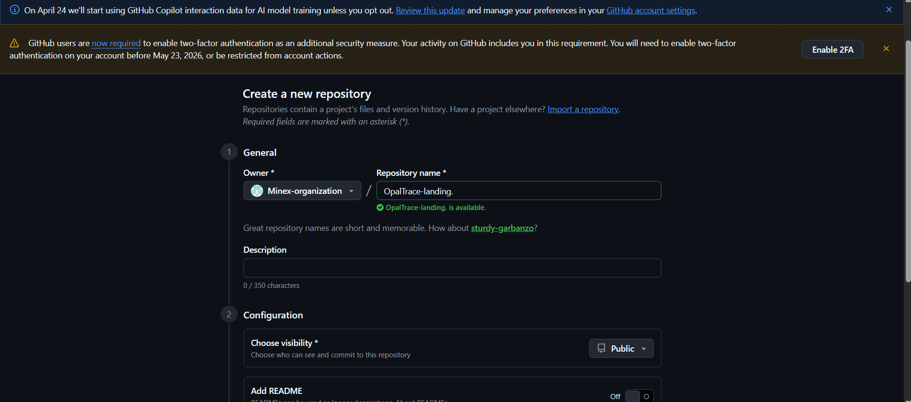

##### Creación de los repositorios

Dentro de la organización se crearon 4 repositorios, uno por cada producto digital de la solución:

| Repositorio | Descripción |
|---|---|
| `OpalTrace-report` | Documentación e informe del proyecto |
| `OpalTrace-website` | Landing page estática |
| `OpalTrace-webapp` | Frontend Web Application |
| `OpalTrace-platform` | Web Services / Backend |

Para crear cada repositorio: ir a la organización → **Repositories** → **New** → asignar nombre → seleccionar **Public** → inicializar con `README.md` → **Create repository**.

##### Configuración de ramas base (GitFlow)

En cada repositorio se estableció la estructura de ramas siguiendo GitFlow:

- Por defecto GitHub crea la rama `main`
- Desde `main` se crea la rama `develop`
- Se establece `develop` como rama base para los Pull Requests en **Settings** → **Branches** → **Default branch**

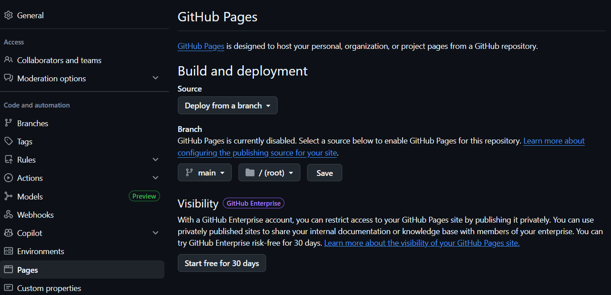

##### Habilitación de GitHub Pages

Para la landing page se habilitó GitHub Pages en el repositorio `OpalTrace-website`:

1. Ir al repositorio → **Settings** → **Pages**
2. En **Source** seleccionar: **Deploy from a branch**
3. **Branch:** `main` / **Folder:** `/ (root)`
4. Hacer click en **Save**

## 5.2. Landing Page, Services & Applications Implementation

La implementación del Landing Page, los servicios web y las aplicaciones representa la etapa crítica donde el equipo consolida el desarrollo de OpalTrace. Este proceso permite materializar el diseño y las funcionalidades planificadas, transformando los requisitos en un producto tangible y operativo. En esta fase se traduce cada especificación técnica en código fuente, construyendo la infraestructura necesaria para satisfacer las necesidades identificadas de los segmentos objetivo: empresas mineras, joyerías y consumidores finales.

### 5.2.1. Sprint 1

#### 5.2.1.1. Sprint Planning 1

<table>
  <tr>
    <th colspan="2">Sprint #</th>
    <th colspan="2">Sprint 1</th>
  </tr>
  <tr>
    <th colspan="4">Sprint Planning Background</th>
  </tr>
  <tr>
    <td colspan="2">Date</td>
    <td colspan="2">2026-04-20</td>
  </tr>
  <tr>
    <td colspan="2">Time</td>
    <td colspan="2">10:00 PM (GMT-5)</td>
  </tr>
  <tr>
    <td colspan="2">Location</td>
    <td colspan="2">Reunión virtual vía Discord</td>
  </tr>
  <tr>
    <td colspan="2">Prepared By</td>
    <td colspan="2">Vergaray Calderon, Rose Almendra</td>
  </tr>
  <tr>
    <td colspan="2">Attendees (to planning meeting)</td>
    <td colspan="2">Armestar Felipa, Adrian Andres / Baldeon Vivar, Santiago Armando / Philco Mota, Katty Yolanda / Vergaray Calderon, Rose Almendra / Yi Torrejon, Ethan Raul</td>
  </tr>
  </tr>
  <tr>
    <th colspan="4">Sprint Goal &amp; User Stories</th>
  </tr>
  <tr>
    <td colspan="2">Sprint 1 Goal</td>
    <td colspan="2">Our focus is on delivering a fully functional and publicly accessible OpalTrace Landing Page in both Spanish and English. We believe it delivers a clear understanding of the platform's value proposition, traceability flow, subscription plans, and team identity to potential users from all three target segments: mining companies, jewelry stores, and end consumers. This will be confirmed when any visitor can navigate all landing page sections (Hero, Features, Plans, About Us, FAQ, Contact), switch the interface language between Spanish (es_419) and English (en_US), and access the web application entry point from the landing page without any broken links or accessibility violations.</td>
  </tr>
  <tr>
    <td colspan="2">Sprint 1 Velocity</td>
    <td colspan="2">20 Story Points</td>
  </tr>
  <tr>
    <td colspan="2">Sum of Story Points</td>
    <td colspan="2">20 Story Points</td>
  </tr>
</table>

#### 5.2.1.2. Aspect Leaders and Collaborators

El Sprint 1 abarca exclusivamente la construcción del sitio web estático (Landing Page) de OpalTrace. Los aspectos identificados para organizar el liderazgo y la colaboración en este sprint son los siguientes:

**Hero & Navigation:** Comprende la barra de navegación fija, el carrusel hero con sus diapositivas (call-to-action de trazabilidad, video About-the-Product, video About-the-Team), y el enrutamiento entre páginas del sitio estático.

**Features, Plans & Flow:** Comprende la visualización del flujo de trazabilidad minera end-to-end, la sección de funcionalidades principales de OpalTrace, los diferenciadores frente a la competencia y la tabla comparativa de planes Silver, Gold y Platinum.

**About MINEX & Contact:** Comprende la subpágina About Us con la descripción de la startup MINEX, misión, visión, el perfil del equipo y el formulario de contacto con validación del lado cliente.

**i18n & a11y:** Comprende la implementación del módulo de internacionalización (es_419 / en_US) con persistencia de preferencia de idioma durante la sesión, y el cumplimiento de accesibilidad con atributos ARIA en todos los componentes interactivos.

**Footer & Legal:** Comprende el footer global con enlaces legales, redes sociales, selector de idioma y copyright, la subpágina de Términos y Condiciones, y el vínculo del botón de login con el punto de entrada de la aplicación web.

| Team Member (Last Name, First Name) | GitHub Username | Hero & Navigation | Features, Plans & Flow | About MINEX & Contact | i18n & a11y | Footer & Legal |
|-------------------------------------|-----------------|:-----------------:|:----------------------:|:---------------------:|:-----------:|:--------------:|
| Armestar Felipa, Adrian Andres | Adrian5102 | L | C | C | C | C |
| Baldeon Vivar, Santiago Armando | santibal11 | C | L | C | C | C |
| Philco Mota, Katty Yolanda | kattyph | C | C | L | C | C |
| Vergaray Calderon, Rose Almendra | roseVC | C | C | C | L | C |
| Yi Torrejon, Ethan Raul | EthanYT | C | C | C | C | L |

#### 5.2.1.3. Sprint Backlog 1

El Sprint 1 tiene como objetivo principal entregar el sitio web estático (Landing Page) de OpalTrace completamente funcional, accesible y desplegado públicamente. Todos los User Stories de este sprint pertenecen al Epic Landing Page y cubren: hero con carrusel, impacto y diferenciadores de OpalTrace, identificación de perfil de usuario, visualización del flujo de trazabilidad, comparativa de planes, información corporativa MINEX, formulario de contacto, internacionalización, redireccionamiento a login, términos y condiciones, y acceso a redes sociales.

| US ID | US Title | Task ID | Task Title | Description | Est. (h) | Assigned To | Status |
|-------|----------|---------|------------|-------------|----------|-------------|--------|
| US_LP01 | Evaluación del impacto de OpalTrace | T01 | Configurar repositorio y estructura base | Crear OpalTrace-website, configurar GitFlow, añadir .gitignore, README.md y estructura de carpetas. | 2 | Armestar Felipa | Done |
| US_LP01 | Evaluación del impacto de OpalTrace | T02 | Implementar tokens de diseño globales | Definir propiedades CSS (paleta de colores, tipografía, espaciado) alineadas con la identidad visual de OpalTrace. | 3 | Armestar Felipa | Done |
| US_LP01 | Evaluación del impacto de OpalTrace | T03 | Construir navbar responsive | Implementar barra de navegación fija con logo, enlaces, selector de idioma, botón login y menú hamburguesa. | 3 | Armestar Felipa | Done |
| US_LP01 | Evaluación del impacto de OpalTrace | T04 | Construir slide hero CTA | Primera diapositiva del carrusel con titular de impacto, subtítulo y botón CTA. | 3 | Armestar Felipa | Done |
| US_LP01 | Evaluación del impacto de OpalTrace | T05 | Construir slide hero About-the-Product | Segunda diapositiva integrando el video About-the-Product con controles accesibles. | 2 | Armestar Felipa | Done |
| US_LP01 | Evaluación del impacto de OpalTrace | T06 | Construir slide hero About-the-Team | Tercera diapositiva integrando el video About-the-Team con botones anterior/siguiente con aria-label. | 2 | Armestar Felipa | Done |
| US_LP02 | Decisión informada sobre diferenciadores técnicos | T07 | Construir sección de diferenciadores y funcionalidades | Sección de características clave de OpalTrace con tarjetas de capacidad (tracking IoT, QR, IA, dashboards). | 3 | Baldeon Vivar | Done |
| US_LP02 | Decisión informada sobre diferenciadores técnicos | T08 | Construir subpágina features.html | Página completa de funcionalidades organizada por bounded context. | 3 | Baldeon Vivar | Done |
| US_LP04 | Visualización del flujo de trazabilidad | T09 | Construir sección de flujo end-to-end | Sección que ilustra el recorrido del mineral desde la extracción hasta el consumidor final. | 3 | Baldeon Vivar | Done |
| US_LP05 | Comparación de planes comerciales | T10 | Construir tabla comparativa de planes | Sección comparativa de los planes Silver, Gold y Platinum con CTA por plan. | 3 | Baldeon Vivar | Done |
| US_LP06 | Consulta corporativa MINEX | T11 | Construir subpágina about-us.html | Página About Us con descripción de MINEX, misión, visión y tarjetas del equipo. Contenido i18n-ready. | 3 | Philco Mota | Done |
| US_LP07 | Envío de formulario de contacto | T12 | Construir contact.html con validación | Página de contacto con campos nombre, correo, asunto y mensaje. Validación de campos y mensajes de error accesibles. | 4 | Philco Mota | Done |
| US_LP07 | Envío de formulario de contacto | T13 | Implementar confirmación de envío | Al envío válido mostrar mensaje de confirmación con aria-live="assertive" y restablecer el formulario. | 2 | Philco Mota | Done |
| US_LP08 | Internacionalización del portal | T14 | Implementar módulo i18n | Crear i18n.js con mapas de traducción es_419 y en_US. Implementar applyTranslation(lang). | 4 | Vergaray Calderon | Done |
| US_LP08 | Internacionalización del portal | T15 | Implementar selector de idioma | Vincular el selector de idioma del navbar y footer a applyTranslation(). Persistir en sessionStorage. | 2 | Vergaray Calderon | Done |
| US_LP08 | Internacionalización del portal | T16 | Añadir atributos data-i18n | Auditar todas las páginas e insertar atributos data-i18n en cada nodo de texto. | 3 | Vergaray Calderon | Done |
| US_LP09 | Redirección a módulos de identidad | T17 | Añadir botón login en todos los headers | Asegurar que el botón de login esté en el navbar de todas las páginas con redirección correcta. | 1 | Yi Torrejon | Done |
| US_LP10 | Consulta de términos y condiciones | T18 | Construir subpágina terms.html | Página de Términos y Condiciones con contenido legal. Enlazada desde el footer en todas las páginas. | 2 | Yi Torrejon | Done |
| US_LP10 | Consulta de términos y condiciones | T19 | Construir footer global del sitio | Footer con tagline, enlaces de navegación, redes sociales, selector de idioma y aviso de copyright. | 3 | Yi Torrejon | Done |
| US_LP11 | Acceso a canales externos oficiales | T20 | Implementar enlaces a redes sociales | Añadir enlaces de redes sociales en el footer con target="_blank" rel="noopener noreferrer" y aria-label. | 1 | Yi Torrejon | Done |

#### 5.2.1.4. Development Evidence for Sprint Review

Durante este sprint, el equipo completó la implementación completa de la landing page de OpalTrace. El desarrollo abarcó la creación de todas las páginas (index, features, about-us, contact y terms), la hoja de estilos compartida con su sistema de diseño, las interacciones en JavaScript, la internacionalización (i18n) y los assets estáticos del proyecto. Todo el trabajo fue gestionado mediante GitFlow, con ramas feature/ individuales por página fusionadas en develop y finalmente liberadas en main como versión 1.0.0.

| Repository | Branch | Commit Id | Commit Message | Commit Message Body | Committed on |
|---|---|---|---|---|---|
| upc-pre-202610-1asi0729-11863-minex/OpalTrace-website | feature/set-up | a12b34 | feat: initial project setup | Creación del repositorio y estructura base del proyecto | 2026-04-20 |
| upc-pre-202610-1asi0729-11863-minex/OpalTrace-website | feature/index | d05346a | feat: add navbar markup | Implementación de la barra de navegación con menú hamburguesa | 2026-04-21 |
| upc-pre-202610-1asi0729-11863-minex/OpalTrace-website | feature/index | 7e4bd8a | feat: add hero section markup | Sección principal con carrusel de tres diapositivas y CTA | 2026-04-21 |
| upc-pre-202610-1asi0729-11863-minex/OpalTrace-website | feature/index | 54ee410 | style: add index page styles | Estilos del hero, navbar y secciones principales del index | 2026-04-21 |
| upc-pre-202610-1asi0729-11863-minex/OpalTrace-website | feature/index | ab2e26d | feat: add traceability flow section markup | Sección del flujo de trazabilidad minera end-to-end | 2026-04-21 |
| upc-pre-202610-1asi0729-11863-minex/OpalTrace-website | feature/index | 391b735 | feat: add plans markup | Tabla comparativa de planes Silver, Gold y Platinum | 2026-04-22 |
| upc-pre-202610-1asi0729-11863-minex/OpalTrace-website | feature/index | be2b0e8 | feat: add features section markup | Sección de funcionalidades principales y diferenciadores | 2026-04-22 |
| upc-pre-202610-1asi0729-11863-minex/OpalTrace-website | feature/features | 748bcb0 | feat: add features page markup | Subpágina con lista completa de funcionalidades por bounded context | 2026-04-22 |
| upc-pre-202610-1asi0729-11863-minex/OpalTrace-website | feature/features | 88705fc | style: add features page styles | Estilos de la subpágina de funcionalidades | 2026-04-22 |
| upc-pre-202610-1asi0729-11863-minex/OpalTrace-website | feature/about-us | 1318a66 | feat: add about us page markup | Subpágina About Us con descripción de MINEX, misión, visión y equipo | 2026-04-22 |
| upc-pre-202610-1asi0729-11863-minex/OpalTrace-website | feature/about-us | 3ed9a72 | style: add about us page styles | Estilos de la subpágina About Us | 2026-04-22 |
| upc-pre-202610-1asi0729-11863-minex/OpalTrace-website | feature/contact | 8a25e71 | feat: add contact page markup | Formulario de contacto con validación del lado cliente | 2026-04-22 |
| upc-pre-202610-1asi0729-11863-minex/OpalTrace-website | feature/contact | 160a277 | style: add contact page styles | Estilos del formulario y página de contacto | 2026-04-22 |
| upc-pre-202610-1asi0729-11863-minex/OpalTrace-website | feature/terms | ef7e448 | feat: add terms page markup | Subpágina de Términos y Condiciones con contenido legal | 2026-04-23 |
| upc-pre-202610-1asi0729-11863-minex/OpalTrace-website | feature/terms | 1df54f1 | style: add terms page styles | Estilos de la página de Términos y Condiciones | 2026-04-23 |
| upc-pre-202610-1asi0729-11863-minex/OpalTrace-website | feature/footer | 15592db | style: add footer styles | Estilos del footer global del sitio | 2026-04-23 |
| upc-pre-202610-1asi0729-11863-minex/OpalTrace-website | feature/footer | edacad3 | style: add responsive styles | Adaptación responsive para dispositivos móviles y tablets | 2026-04-23 |
| upc-pre-202610-1asi0729-11863-minex/OpalTrace-website | feature/footer | 2e708ec | feat: add i18n translations | Módulo de internacionalización con diccionarios es_419 y en_US | 2026-04-23 |
| upc-pre-202610-1asi0729-11863-minex/OpalTrace-website | feature/footer | 9f012bb | feat: add core scripts and interactions | Scripts de interactividad: carrusel, menú, validaciones y i18n | 2026-04-23 |
| upc-pre-202610-1asi0729-11863-minex/OpalTrace-website | feature/footer | 240e369 | chore: add project assets | Imágenes, íconos y fuentes del proyecto | 2026-04-23 |

#### 5.2.1.5. Execution Evidence for Sprint Review

Durante el Sprint 1, el equipo completó la implementación y despliegue público del sitio web estático (Landing Page) de OpalTrace. Se entregaron todas las User Stories comprometidas (US_LP01–US_LP11), cubriendo la totalidad de las secciones del sitio: hero con carrusel de tres diapositivas, sección de impacto y diferenciadores de OpalTrace, visualización del flujo de trazabilidad end-to-end, tabla comparativa de planes Silver/Gold/Platinum, módulo de internacionalización es_419/en_US con persistencia de sesión, subpágina About MINEX con misión, visión y tarjetas del equipo, formulario de contacto con validación del lado cliente, redirección persistente al login, subpágina de Términos y Condiciones, y acceso a canales externos. El sitio fue desplegado en GitHub Pages.

**URL del video de demostración del Sprint 1:** `[Insertar URL del video de demostración]`

**URL de la Landing Page desplegada:** [OpalTrace-website](https://upc-pre-202610-1asi0729-11863-minex.github.io/OpalTrace-website/)

#### 5.2.1.6. Services Documentation Evidence for Sprint Review

El Sprint 1 tuvo como único alcance la implementación del sitio web estático (Landing Page) de OpalTrace. En esta iteración no se desarrollaron ni desplegaron Web Services, endpoints RESTful ni ningún componente de backend. Por ello, no existe documentación de servicios con OpenAPI que reportar en este sprint.

#### 5.2.1.7. Software Deployment Evidence for Sprint Review

Durante este sprint se realizó el despliegue de la landing page de OpalTrace en GitHub Pages. El proceso abarcó la configuración del repositorio remoto, la integración del flujo GitFlow con la rama `main` como fuente de despliegue, y la habilitación del servicio de hosting estático de GitHub.

##### Creación del repositorio en GitHub

Se creó el repositorio público `OpalTrace-website` bajo la organización `upc-pre-202610-1asi0729-11863-minex` en GitHub.

[Link del repositorio OpalTrace-website](https://github.com/upc-pre-202610-1asi0729-11863-minex/OpalTrace-website)

##### Configuración de ramas bajo GitFlow

- `main` → rama de producción (fuente de despliegue)
- `develop` → rama de integración
- `feature/*` → ramas de desarrollo por funcionalidad

Todo el trabajo fue integrado mediante Pull Requests desde las ramas `feature/*` hacia `develop`, y finalmente desde `develop` hacia `main` como parte del release `v1.0.0`.

##### Configuración de GitHub Pages

1. Ingresar al repositorio en GitHub
2. Ir a **Settings** → **Pages**
3. En la sección **Build and deployment** seleccionar: **Source:** Deploy from a branch / **Branch:** `main` / **Folder:** `/ (root)`
4. Hacer click en **Save**

##### URL de despliegue

La landing page quedó disponible públicamente en: [OpalTrace-website](https://upc-pre-202610-1asi0729-11863-minex.github.io/OpalTrace-website/)

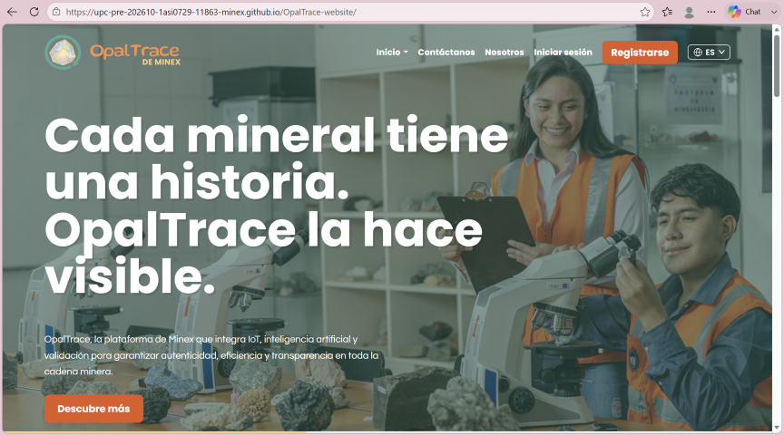

#### 5.2.1.8. Team Collaboration Insights during Sprint

Durante el Sprint 1, todos los miembros del equipo participaron activamente en las actividades de implementación, tal como se refleja en los analíticos de colaboración de GitHub. Cada integrante aportó commits correspondientes a los aspectos bajo su liderazgo.

| Nombre | Actividad principal |
|--------|---------------------|
| Armestar Felipa, Adrian Andres | Hero, navbar, carrusel y estructura base del proyecto |
| Baldeon Vivar, Santiago Armando | Sección de funcionalidades, flujo de trazabilidad y tabla de planes |
| Philco Mota, Katty Yolanda | Subpágina About MINEX y formulario de contacto con validación |
| Vergaray Calderon, Rose Almendra | Módulo i18n (es_419/en_US) y atributos de accesibilidad ARIA |
| Yi Torrejon, Ethan Raul | Footer global, Términos y Condiciones, redes sociales y diseño responsive |

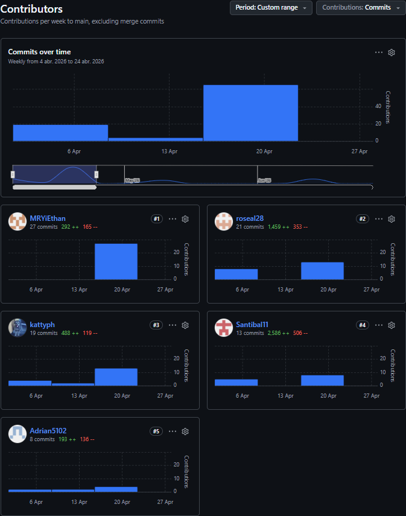

### 5.2.2. Sprint 2

### 5.2.2.1. Sprint Planning 2

<table>
  <tr>
    <th colspan="2">Sprint #</th>
    <th colspan="2">Sprint 2</th>
  </tr>
  <tr>
    <th colspan="4">Sprint Planning Background</th>
  </tr>
  <tr>
    <td colspan="2">Date</td>
    <td colspan="2">2026-04-24</td>
  </tr>
  <tr>
    <td colspan="2">Time</td>
    <td colspan="2">07:00 PM (GMT-5)</td>
  </tr>
  <tr>
    <td colspan="2">Location</td>
    <td colspan="2">Reunión virtual vía Microsoft Teams</td>
  </tr>
  <tr>
    <td colspan="2">Prepared By</td>
    <td colspan="2">Villarreal Bazan, Angel Martin</td>
  </tr>
  <tr>
    <td colspan="2">Attendees (to planning meeting)</td>
    <td colspan="2">Del Aguila Del Aguila, Olenka Priscilla / Espinoza Cruz, Angela Milagros / Mora Rivera, Joel Fernando / Soto Palacios, Brandon Wilder / Villarreal Bazan, Angel Martin</td>
  </tr>
  <tr>
    <th colspan="4">Sprint 1 Review Summary</th>
  </tr>
  <tr>
    <td colspan="4">En el Sprint 1 se entregó la Landing Page de NutriSmart en su totalidad: Hero, sección de funciones principales con subpágina completa, tabla comparativa de planes, módulo de internacionalización en_US / es_419 con persistencia de sesión, subpágina About Us, formulario de contacto, sección de redes sociales, subpágina de Términos y Condiciones y subpágina de Políticas de privacidad. El sitio fue desplegado exitosamente en GitHub Pages. Las User Stories comprometidas (US-LP01–US-LP11) fueron completadas al 100%, con un total de 15 Story Points entregados.</td>
  </tr>
  <tr>
    <th colspan="4">Sprint 1 Retrospective Summary</th>
  </tr>
  <tr>
    <td colspan="4"> *Fortalezas* Distribución clara de responsabilidades mediante la matriz LACX. Disciplina en el uso de Conventional Commits y GitFlow. *Áreas de mejora* Ausencia de datos de prueba compartidos; cada integrante trabajó con mocks locales distintos, generando inconsistencias en la integración. *Acuerdos para Sprint 2* (1) Crear auth.mock.ts con usuario autenticado completo antes de iniciar implementación. (2) Reuniones de sincronización dos veces por semana. (3) Usar develop como única fuente de integración antes de merge a main.</td>
  </tr>
  <tr>
    <th colspan="4">Sprint Goal &amp; User Stories</th>
  </tr>
  <tr>
    <td colspan="2">Sprint 2 Goal</td>
    <td colspan="2">Our focus is on delivering the complete authenticated frontend of the OpalTrace web application, covering the IAM, Subscriptions, Mineral Extraction, Custody Chain, Refinery Processing, Jewelry Inventory, Consumer Experience, and Analytics bounded contexts. We believe it delivers a functional and navigable experience that allows users to register corporate and consumer accounts, complete a 3-step onboarding flow with segment and plan selection, manage and upgrade subscription plans, register mineral batches with GPS zone validation and offline support via IndexedDB, transfer custody across the supply chain with QR scanning and GPS tracking, process batches in the refinery with sublot splitting and shrinkage monitoring, receive and certify jewelry materials distinguishing certified from external stock, verify product authenticity through a public QR page without authentication, and monitor operational metrics through a real-time analytics dashboard with ESG reports and comparative analysis. This will be confirmed when a user can complete the full registration and onboarding flow, interact with all primary views of each bounded context using json-server mock data, observe automatic anomaly detection and batch blocking working correctly, navigate the geographic traceability map with blockchain transaction hashes, generate and download digital certificates and billing receipts as PDFs, and navigate between all authenticated views without broken routes or accessibility violations.</td>
  </tr>
  <tr>
    <td colspan="2">Sprint 2 Velocity</td>
    <td colspan="2">116 Story Points</td>
  </tr>
  <tr>
    <td colspan="2">Sum of Story Points</td>
    <td colspan="2">116 Story Points</td>
  </tr>
</table>

### 5.2.1.2. Aspect Leaders and Collaborators

El Sprint 2 abarca la construcción del frontend completo de la aplicación web autenticada OpalTrace, siguiendo la arquitectura DDD por bounded context (`domain / application / infrastructure / presentation`). Los aspectos identificados para organizar el liderazgo y la colaboración son los siguientes:

**IAM:** Comprende el scaffold inicial del proyecto Angular con estructura DDD, los flujos de registro empresarial (validacion de RUC de 11 digitos y dominio corporativo), registro de consumidor final (plan Silver), inicio de sesion con JWT y redireccion por segmento, bloqueo por intentos fallidos, recuperacion de contrasena con token temporal y onboarding en 3 pasos con CDK Stepper.
 
**Consumer Experience** Comprende la pagina publica de verificacion de autenticidad de joyas mediante QR accesible sin autenticacion, indicador visual verde/rojo con motivo especifico del resultado, historial completo de trazabilidad desde extraccion hasta certificacion y mapa interactivo del recorrido geografico del mineral con marcadores por tipo de evento, hashes blockchain verificables y linea punteada para gaps de cobertura GPS.

**Custody Chain & Logistics:** Comprende la transferencia formal de custodia mediante escaneo QR con validacion de estado e isBlocked, ingreso manual alternativo del ID de lote, actualizacion de ubicacion GPS en transito con mapa de ruta y alerta de tiempo excesivo sin reporte (DelayedTransport).

**Jewelry Inventory & Certification:** Comprende el ingreso de material certificado OpalTrace con scanner QR (isCertifiedSource=true), registro de material externo con campo externalSupplier obligatorio (canGenerateCertificate=false), inventario segmentado visualmente (Stock Certificado en verde / Stock Externo en gris), flujo de certificacion con validacion de integridad completa (incluyendo herencia de sublotes y ausencia de material externo) y generacion del certificado digital PDF con QR verificable en formato CERT-YYYY-NNNN.
 
**Mineral Extraction & Offline Ops:** Comprende el registro de lotes con validacion GPS de zona autorizada y generacion de ID OT-YYYY-NNNN, modo offline con cola persistente en IndexedDB, sincronizacion automatica con resolucion de duplicados al recuperar conexion, reporte de anomalias con bloqueo automatico de lote, panel de alertas automaticas y generacion de QR con firma digital.

**Refinery Processing:** Comprende la recepcion de lotes en refineria con validacion de trazabilidad completa y deteccion automatica de discrepancia de peso mayor al 2%, division de lotes en sublotes con herencia de eventos (ChildBatchCreated y parentBatchId), listado de sublotes con cadena de trazabilidad y registro de merma con indicadores de eficiencia de proceso. Disponible exclusivamente para plan Platinum.
 
**Reporting & Analytics** Comprende el dashboard de trazabilidad con 4 metricas en tiempo real y filtro por periodo (plan Gold), indicadores de merma operativa con graficos de eficiencia, reportes ESG exportables en PDF (plan Platinum) y analisis comparativo entre dos periodos seleccionables (plan Platinum). Las secciones Platinum muestran badge de upgrade para usuarios Gold.
 
**Subscriptions & Billing:** Comprende la tabla comparativa de planes Silver/Gold/Platinum con bounded contexts habilitados y precios, flujo de upgrade con dialogo de confirmacion y cargo prorrateado, flujo de downgrade con validacion de operaciones incompatibles (lotes en estado En Planta), historial de facturacion con descarga de recibos PDF y cancelacion de suscripcion con acceso de solo lectura por 30 dias post-cancelacion.

| Team Member (Last Name, First Name) | GitHub Username | IAM | Consumer Experience | Custody Chain & Logistics | Jewelry Inventory & Certification | Mineral Extraction & Offline Ops | Refinery Processing | Reporting & Analytics | Subscriptions & Billing |
|-------------------------------------|-----------------|:----------------:|:-----------------------------------:|:-----------------------------------:|:-------------------------------------:|:--------------------------------------------:|:-----------------------------------:|:-----------------------------------:|:-----------------------------------:|
| Armestar Felipa, Adrian Andres | @adrianAF | C | C | L | C | C | C | L | C |
| Baldeon Vivar, Santiago Armando | @Santibal11 | C | C | C | C | L | C | C | C |
| Philco Mota, Katty Yolanda | @kattyPM | C | C | C | L | C | C | C | C |
| Vergaray Calderon, Rose Almendra | @roseVC | L | L | C | C | C | C | C | L |
| Yi Torrejon, Ethan Raul | @ethanYT | L | L | C | C | C | L | C | C |

### 5.2.2.3. Sprint Backlog 2

El Sprint Backlog 2 contiene todas las tareas de desarrollo frontend identificadas en el Sprint Planning, organizadas por bounded context y user story. Cada tarea especifica las entidades de dominio, servicios de infraestructura, componentes de presentación y comportamientos mock implementados durante el sprint.

| US ID | US Title | Task ID | Task Title | Description | Est. (h) | Assigned To | Status |
|-------|----------|---------|------------|-------------|----------|-------------|--------|
| US27-28 | Registro Empresarial y Consumidor | T01 | Scaffold del proyecto y configuración compartida | Inicializar proyecto Angular con estructura DDD por bounded context (`iam/`, `mineral-extraction/`, `custody-chain/`, `refinery-processing/`, `jewelry-inventory/`, `consumer-experience/`, `analytics/`, `subscriptions/`, `shared/`). Configurar Angular Router con grupos de rutas públicas y protegidas. Integrar Angular Material con tema personalizado OpalTrace (`#1B3A6B`). Configurar HttpClient con `BaseApi` y `BaseApiEndpoint`. Configurar `json-server` con `db.json` con fixtures para todos los endpoints del Sprint 2. Crear `auth.mock.ts` con usuario autenticado completo (`segment`, `role`, `planTier`). | 5 | Vergaray | Done |
| US27-28 | Registro Empresarial y Consumidor | T02 | Capas DDD del bounded context IAM | Crear entidades de dominio `UserCredentials` y `UserProfile`. Crear clase de infraestructura `IamApi` extendiendo `BaseApi` con métodos `register()`, `login()`, `logout()`, `forgotPassword()` y `resetPassword()`. Crear `IamAssembler` y el servicio `IamStore` con Angular Signals implementando todos los métodos correspondientes. | 3 | Vergaray | Done |
| US27 | Registro cuenta empresarial | T03 | Vista de registro empresarial con validación | Implementar vista `/auth/register` con Angular Reactive Forms para razón social, RUC (11 dígitos), correo corporativo y contraseña (mínimo 8 caracteres). Validadores custom que rechazan correos públicos (gmail, hotmail, yahoo) y formatos de RUC inválidos. Al confirmar llamar `IamStore.register()` mock y redirigir al flujo de selección de plan. Mostrar errores de Angular Material para correo duplicado (409) y contraseña débil. Aplicar `aria-required` y `aria-invalid` a todos los campos. | 4 | Vergaray | Done |
| US29 | Inicio de sesión con credenciales | T04 | Vista de login con persistencia JWT y redirección por segmento | Implementar vista `/auth/login` con Angular Reactive Forms para correo y contraseña. Al confirmar llamar `IamStore.login()` mock, almacenar el JWT en `localStorage` y redirigir a `/dashboard` según segmento (`MINING` → dashboard de lotes, `JEWELRY` → inventario, `CONSUMER` → verificación QR). Mostrar error genérico de Angular Material tras 1 intento fallido. Tras 5 fallos consecutivos mostrar banner de bloqueo temporal 15 minutos. Aplicar `aria-invalid` a campos en error. | 4 | Vergaray | Done |
| US30 | Recuperación de contraseña | T05 | Vistas de olvidé contraseña y restablecimiento | Implementar vista `/auth/forgot-password` con input de correo que llama `IamStore.forgotPassword()` mock y muestra mensaje neutral independientemente de si el correo existe. Implementar vista `/auth/reset-password` con inputs de nueva contraseña y confirmación con validación cruzada de campos via Angular Reactive Forms. Al confirmar redirigir a `/auth/login` con Snackbar de confirmación. Mostrar mensaje de expiración si el token es inválido. | 3 | Vergaray | Done |
| US27 | Registro cuenta empresarial | T06 | Vista de onboarding en 3 pasos con Angular CDK Stepper | Implementar flujo `/onboarding` con CDK Stepper con 3 pasos: (1) Selección de segmento `MINING` o `JEWELRY` con tarjetas visuales; (2) Datos fiscales RUC y razón social con preview de validación; (3) Selección de plan Gold o Platinum con tabla comparativa de bounded contexts habilitados y precio. Al confirmar llamar `IamStore.completeOnboarding()` mock y redirigir a `/dashboard` correspondiente. | 5 | Vergaray | Done |
| US29 | Inicio de sesión con credenciales | T07 | Logout e implementación de AuthGuard | Implementar acción de logout en el sidebar que llama `IamStore.logout()` mock, limpia el JWT de `localStorage` y redirige a `/auth/login`. Implementar `AuthGuard` que redirige usuarios no autenticados a `/auth/login` para todas las rutas protegidas excepto `/auth/*` y `/verify/*`. | 2 | Vergaray | Done |
| US22-23 | Selección y upgrade de plan | T08 | Capas DDD del bounded context Subscriptions | Crear entidades de dominio `Subscription` y `BillingRecord`. Crear clase de infraestructura `SubscriptionsApi` extendiendo `BaseApi` con métodos `getActivePlan()`, `upgradePlan()`, `downgradePlan()`, `cancelPlan()` y `getBillingHistory()`. Crear `SubscriptionsAssembler` y el servicio `SubscriptionsStore` con Angular Signals. | 3 | Vergaray | Done |
| US22-23 | Selección y upgrade de plan | T09 | Vista de suscripción con tabla comparativa y plan activo | Implementar vista `/subscription` mostrando: banner de plan activo (nombre del plan, fecha de renovación, precio, botón Cancelar plan), sección de selección con 3 tarjetas Angular Material (Silver, Gold, Platinum) mostrando precio, lista de funcionalidades y botón de acción (Plan actual / Upgrade / Downgrade). Tabla de historial de pagos con columnas fecha, plan, monto, estado y botón Descargar recibo. La tarjeta del plan actual muestra badge `Current plan`; las otras muestran botones activos. | 5 | Vergaray | Done |
| US23-24 | Upgrade y downgrade de plan | T10 | Diálogos de confirmación upgrade y downgrade | Implementar diálogo Angular Material de Upgrade mostrando nombre del plan objetivo, lista de funcionalidades desbloqueadas con badges verdes, detalle de cargo prorrateado, input de tarjeta Stripe placeholder y botón Confirmar upgrade → `SubscriptionActivated`. Implementar diálogo de Downgrade mostrando funcionalidades que se perderán en rojo, fecha efectiva al fin del ciclo y botón Confirmar downgrade. Bloquear downgrade si existen lotes activos en estado `En Planta` listando los IDs bloqueantes. | 3 | Vergaray | Done |
| US26 | Cancelación de suscripción | T11 | Vista de cancelación con retención de datos 30 días | Implementar flujo de cancelación desde la vista `/subscription`. Al confirmar llamar `SubscriptionsStore.cancelPlan()` mock, actualizar `SubscriptionStatus` a `CANCELLED`, mostrar Snackbar con fecha efectiva de cancelación y acceso de solo lectura durante 30 días. Mostrar advertencia de archivado permanente de datos tras los 30 días. | 3 | Vergaray | Done |
| US01-06 | Extracción mineral y trazabilidad IoT | T12 | Capas DDD del bounded context Mineral Extraction | Crear entidades de dominio `MineralBatch`, `GpsCoordinate` y `AnomalyReport`. Crear clase de infraestructura `MineralApi` extendiendo `BaseApi` con métodos `registerBatch()`, `getBatches()`, `reportAnomaly()`, `generateQr()`, `syncOfflineQueue()` y `getAnomalyAlerts()`. Crear `MineralAssembler` y el servicio `MineralStore` con Angular Signals con todos los métodos. | 3 | Baldeon | Done |
| US01 | Registro de lote con validación de origen | T13 | Formulario de registro de lote con GPS y validación de zona | Implementar vista `/mineral/register` con Angular Reactive Forms para peso (kg), tipo de mineral y coordenadas GPS capturadas automáticamente. Validador custom que verifica coordenadas contra lista de zonas autorizadas mock (radio 500m). Al confirmar generar ID `OTYYYYNNNN`, establecer estado `En Origen` y llamar `MineralStore.registerBatch()` mock que retorna comprobante con hash de transacción blockchain. Mostrar errores de zona no autorizada y peso inválido con rangos esperados por tipo de mineral. | 5 | Baldeon | Done |
| US02 | Ingreso de datos offline | T14 | Cola offline con IndexedDB e indicador de estado | Implementar servicio `OfflineQueueService` que almacena transacciones en IndexedDB con timestamp sellado y firma digital local. Mostrar indicador visual `Modo Offline` en el header cuando no hay conexión. Mostrar contador de registros pendientes (`N lotes pendientes de sincronización`). Persistir la cola ante cierre de sesión y restaurarla al próximo inicio de sesión del mismo usuario. | 5 | Baldeon | Done |
| US03 | Sincronización automática | T15 | Sincronización automática con resolución de duplicados | Detectar recuperación de conexión mediante Network Information API. Al recuperar conexión ejecutar transferencia automática de la cola respetando orden de timestamp. Llamar `MineralStore.syncOfflineQueue()` mock que descarta duplicados por `batchId` o timestamp. Mostrar notificación de éxito y marcar registros sincronizados como completados. Retomar desde el punto de interrupción en caso de fallo parcial. | 4 | Baldeon | Done |
| US04 | Reporte de anomalías con bloqueo de lote | T16 | Formulario de reporte de anomalía y badge de bloqueo | Implementar formulario de reporte de anomalía con descripción, selector de categoría (peso incorrecto, contaminación, sellado violado) y carga de evidencia fotográfica. Al confirmar llamar `MineralStore.reportAnomaly()` mock que establece `isBlocked=true` y registra evento `AnomalyDetected`. Mostrar badge visual `Bloqueado por Anomalía` en rojo sobre la tarjeta del lote afectado. | 4 | Baldeon | Done |
| US05 | Detección automática de anomalías | T17 | Panel de alertas automáticas de trazabilidad | Implementar panel de alertas en `/mineral/alerts` mostrando alertas automáticas de tipo `WeightDiscrepancy` (diferencia >2% entre etapas), `StateSkipped` (salto de etapa sin `TransportStarted`) y `DelayedTransport` (tiempo excesivo sin actualización GPS). Cada alerta muestra ID de lote, tipo, descripción y timestamp. Datos servidos desde `MineralStore` mock. | 3 | Baldeon | Done |
| US06 | Generación de QR de lote | T18 | Vista de generación y descarga de QR con firma digital | Implementar botón de generación de QR en la vista de detalle del lote. Llamar `MineralStore.generateQr()` mock que rechaza lotes con `isBlocked=true` o trazabilidad incompleta (HTTP 422 con motivo específico). En caso exitoso mostrar preview de imagen PNG del QR con firma digital y botón de descarga directa. | 3 | Baldeon | Done |
| US07-08 | Cadena de custodia y logística | T19 | Capas DDD del bounded context CustodyChain | Crear entidades de dominio `CustodyTransfer` y `LocationUpdate`. Crear clase de infraestructura `CustodyApi` extendiendo `BaseApi` con métodos `acceptCustody()`, `updateLocation()`, `getCustodyHistory()` y `getLocationHistory()`. Crear `CustodyAssembler` y el servicio `CustodyStore` con Angular Signals. | 3 | Yi Ethan | Done |
| US07 | Transferencia de custodia con registro de estado | T20 | Vista de escaneo QR y aceptación de custodia | Implementar vista `/custody/transfer` con componente de escaneo QR usando API de cámara del dispositivo. Alternativa de ingreso manual de ID en formato `OTYYYYNNNN` con validación de formato. Al escanear o ingresar el ID, `CustodyStore` recupera el lote y valida que no tenga `isBlocked=true` y esté en estado `En Origen`. Al confirmar llamar `CustodyStore.acceptCustody()` mock que registra evento `TransportStarted`, actualiza estado a `En Tránsito` y captura coordenadas GPS del punto de recepción. Mostrar mensaje claro ante lote bloqueado o en estado incorrecto. | 5 | Yi Ethan | Done |
| US08 | Actualización de ubicación en tránsito | T21 | Vista de actualización GPS con mapa de ruta y alerta de demora | Implementar formulario de actualización de ubicación en `/custody/location` mostrando mapa de ruta actualizable con marcadores de puntos GPS registrados. Al registrar nueva ubicación llamar `CustodyStore.updateLocation()` mock. Mostrar indicador visual de alerta `DelayedTransport` en naranja cuando el lote supera el tiempo máximo definido para la ruta sin nueva actualización GPS. | 4 | Yi Ethan | Done |
| US16-17 | Experiencia del consumidor final | T22 | Capas DDD del bounded context Consumer Experience | Crear entidades de dominio `VerificationResult` y `GeographicRoute`. Crear clase de infraestructura `ConsumerApi` extendiendo `BaseApi` con métodos `verifyQr()`, `getTraceabilityMap()` y `registerVerificationEvent()`. Crear `ConsumerAssembler` y `ConsumerStore` con Angular Signals. | 2 | Yi Ethan | Done |
| US16 | Verificación de autenticidad mediante QR | T23 | Vista pública de verificación de autenticidad sin autenticación | Implementar página `/verify/:certificateId` accesible sin autenticación ni registro previo. Mostrar indicador visual verde con mensaje `Producto Auténtico Certificado` y número `CERTYYYYYNNNN` si el `CertificationState` es `CERTIFIED` y la firma digital es válida. Mostrar indicador rojo con mensaje `Autenticidad No Verificable` y motivo específico (QR no registrado, Certificado revocado, Anomalía detectada en lote [ID]) en caso contrario. Presentar recorrido completo de trazabilidad desde extracción hasta certificación. Registrar evento `AuthenticityVerified` con timestamp. | 5 | Yi Ethan | Done |
| US17 | Visualización del recorrido geográfico | T24 | Mapa interactivo del recorrido mineral con hashes blockchain | Implementar mapa interactivo en `/verify/:certificateId/map` mostrando cada punto geográfico en orden cronológico con marcadores diferenciados por tipo de evento (extracción, transporte, refinería, joyería). Al hacer clic en cada marcador mostrar fecha, actor responsable y hash de transacción blockchain con enlace a explorador público. Trazar línea continua entre puntos y línea punteada para gaps de cobertura GPS. Registrar evento `TraceabilityViewed`. | 5 | Yi Ethan | Done |
| US18-19 | Dashboard y métricas de trazabilidad | T25 | Capas DDD del bounded context Analytics | Crear entidades `OperationalMetrics`, `ShrinkageRecord` y `EsgReport`. Crear clase `AnalyticsApi` extendiendo `BaseApi` con métodos `getMetrics()`, `getShrinkageData()`, `getEsgReport()`, `getComparativeAnalysis()` y `exportPdfReport()`. Crear `AnalyticsAssembler` y `AnalyticsStore` con Angular Signals. | 3 | Yi Ethan | Done |
| US18 | Dashboard de trazabilidad por segmento | T26 | Vista de dashboard con métricas en tiempo real | Implementar vista `/analytics/dashboard` con 4 tarjetas de métricas en tiempo real: total de lotes activos por estado (`En Origen` / `En Tránsito` / `En Planta` / `Certificado`), lotes en tránsito con última ubicación, anomalías activas pendientes de resolución y tiempo promedio por etapa. Datos servidos desde `AnalyticsStore` mock. Aplicar `aria-live='polite'` a todas las tarjetas de métricas. Incluir filtro por periodo temporal que actualiza todas las métricas. | 6 | Yi Ethan | Done |
| US19 | Indicadores de merma | T27 | Vista de indicadores de merma operativa con gráficos | Implementar sección `/analytics/shrinkage` con gráficos de porcentaje de merma por lote, periodo y tipo de mineral. Mostrar indicador de eficiencia del proceso (merma real vs merma objetivo). Chart de barras con datos de `AnalyticsStore` mock. Aplicar `aria-label` a todos los elementos del gráfico. | 4 | Yi Ethan | Done |
| US20-21 | Reportes ESG y análisis comparativo | T28 | Vista de reportes ESG y análisis comparativo (plan Platinum) | Implementar sección `/analytics/esg` visible solo para plan Platinum con indicadores ambientales y sociales exportables en PDF. Implementar sección `/analytics/comparative` con selector de dos periodos y gráficos comparativos de métricas operativas entre rangos de tiempo. Para plan Gold mostrar badge `Plan Platinum requerido` con botón de upgrade. Activar/desactivar desde `AnalyticsStore` según `planTier` del JWT. | 5 | Yi Ethan | Done |
| US12-15 | Inventario y certificación de joyería | T29 | Capas DDD del bounded context JewelryInventory | Crear entidades de dominio `JewelryProduct`, `CertifiedMaterial` y `ExternalMaterial`. Crear clase `JewelryApi` extendiendo `BaseApi` con métodos `receiveMaterial()`, `registerExternalMaterial()`, `getInventory()`, `certifyProduct()`, `generateCertificate()` y `downloadCertificate()`. Crear `JewelryAssembler` y `JewelryStore` con Angular Signals. | 3 | Philco | Done |
| US12 | Recepción de material con trazabilidad OpalTrace | T30 | Vista de ingreso de material certificado con scanner QR | Implementar formulario de recepción en `/jewelry/receive` con scanner QR de lote OpalTrace. Al escanear llamar `JewelryStore.receiveMaterial()` mock que verifica trazabilidad completa del lote (`MineralExtracted` → `TransportStarted` → `LocationUpdated` → `BatchReceived`). Si es válido clasificar en Stock Certificado con `isCertifiedSource=true`. Si `isBlocked=true` rechazar recepción mostrando motivo. Separar completamente Stock Certificado de Stock Externo en base de datos via flag. | 4 | Philco | Done |
| US13 | Registro de material externo | T31 | Vista de ingreso de material externo con restricción de sellado | Implementar formulario de material externo en `/jewelry/external` con campo `externalSupplier` obligatorio. Al confirmar `JewelryStore.registerExternalMaterial()` establece `isCertifiedSource=false` y `canGenerateCertificate=false`. Inhabilitar automáticamente la generación de certificados OpalTrace para ese material. En la vista de inventario presentar Stock Certificado (etiqueta verde) y Stock Externo (etiqueta gris) en dos secciones completamente separadas sin vista combinada. | 3 | Philco | Done |
| US14 | Validación de integridad antes de certificar | T32 | Vista de flujo de certificación con validación de trazabilidad | Implementar flujo `/jewelry/certify` con validación automática de integridad antes de habilitar la certificación: verificar historial completo de eventos sin gaps, `isBlocked=false` en todos los lotes, sin anomalías activas y `isCertifiedSource=true` en todos los materiales. Si es válido establecer `CertificationState=CERTIFIED` y registrar evento `CertificationGranted`. En caso contrario mostrar HTTP 422 con evento `CertificationRejected` y motivo específico por lote (falta evento X, anomalía activa, material externo ID). Validar herencia de sublotes verificando `parentBatchId` y suma de pesos. | 5 | Philco | Done |
| US15 | Generación y descarga de certificado digital | T33 | Vista de generación de certificado PDF con QR verificable | Implementar botón de generación en la vista de detalle del producto certificado. Solo disponible para productos con `CertificationState=CERTIFIED`. `JewelryStore.generateCertificate()` compila PDF con trazabilidad completa, QR de verificación vinculado al `certificateId`, datos del producto, información de la joyería certificadora, número `CERT-YYYY-NNNN` y firma digital. Proveer descarga directa sin pasos adicionales. Registrar evento `CertificateDownloaded`. | 4 | Philco | Done |
| US28 | Registro de cuenta individual para consumidor final | T39 | Vista de registro para consumidor final con flujo Silver | Implementar vista `/auth/register-consumer` con Angular Reactive Forms para nombre completo, correo electrónico (acepta dominios públicos: gmail, hotmail, yahoo) y contraseña (mínimo 8 caracteres) con indicador de fortaleza (débil/media/fuerte). Al confirmar llamar `IamStore.register()` mock estableciendo `segment=CONSUMER`, `role=CONSUMIDOR_FINAL` y registrar evento `UserRegistered`. Mostrar error de Angular Material para correo duplicado (HTTP 409) y contraseña débil (HTTP 400). Redirigir automáticamente a selección de plan Silver (sin opción Gold/Platinum). Aplicar `aria-required` y `aria-invalid` a todos los campos. Incluir enlace a `/auth/register` para usuarios empresariales. | 3 | Vergaray | Done |
| US25 | Visualización de historial de facturación y descarga de recibos | T40 | Vista de historial de facturación con descarga de recibos PDF | Extraer el historial de pagos de T09 en una sección dedicada `/subscription/billing`. Implementar tabla ordenada cronológicamente (más reciente a más antigua) con columnas: fecha de transacción, plan contratado (Silver/Gold/Platinum), monto total, estado del pago (Completado/Rechazado/Reembolsado) y método de pago (últimos 4 dígitos de tarjeta). Cada fila incluye botón `Descargar Recibo` que llama `SubscriptionsStore.downloadReceipt()` mock y genera dinámicamente un PDF con: datos completos del usuario/empresa, fecha, detalle del plan, monto base, impuestos, monto total y número de factura único `FACT-YYYY-NNNN`. Proveer descarga directa del PDF sin pasos adicionales. Si no existen transacciones mostrar estado vacío con mensaje `No tienes pagos registrados aún`. | 4 | Vergaray | Done |
| US09-11 | Procesamiento en refinería | T34 | Capas DDD del bounded context Refinery Processing | Crear entidades de dominio `RefineryBatch`, `SubLot` y `ShrinkageRecord`. Crear clase `RefineryApi` extendiendo `BaseApi` con métodos `receiveBatch()`, `splitBatch()`, `registerShrinkage()` y `getProcessingHistory()`. Crear `RefineryAssembler` y el servicio `RefineryStore` con Angular Signals. | 3 | Armestar | Done |
| US09 | Recepción y procesamiento en refinería | T35 | Vista de recepción del lote en refinería con validación completa | Implementar formulario de recepción en `/refinery/receive`. Al escanear el QR del lote llamar `RefineryStore.receiveBatch()` mock que valida trazabilidad completa (`MineralExtracted` → `TransportStarted` → `BatchReceived` sin gaps). Si el peso declarado difiere más de 2% del peso registrado en origen generar alerta `WeightDiscrepancy` automáticamente y bloquear el lote. En caso válido emitir evento `BatchReceived` con timestamp y ubicación de la refinería. | 5 | Armestar | Done |
| US10 | División de lotes en sublotes | T36 | Vista de división del lote padre en sublotes con herencia de trazabilidad | Implementar formulario de división en `/refinery/split/:batchId` mostrando peso del lote padre y campos dinámicos para N sublotes con peso proporcional. Validar que la suma de pesos de sublotes es igual al peso del padre. Al confirmar llamar `RefineryStore.splitBatch()` mock que genera IDs de sublotes con referencia al `parentBatchId` y registra evento `ChildBatchCreated`. Mostrar listado de sublotes generados con herencia visual de trazabilidad. | 5 | Armestar | Done |
| US10 | División de lotes en sublotes | T37 | Listado de sublotes con herencia de trazabilidad y parentBatchId | Implementar vista `/refinery/sublots` mostrando tabla de sublotes con referencia al `parentBatchId` de origen, peso asignado, evento `ChildBatchCreated` y estado actual. Permitir navegar al detalle del lote padre para verificar la cadena completa de trazabilidad heredada. | 3 | Armestar | Done |
| US11 | Registro de merma y eficiencia de proceso | T38 | Vista de registro de merma con indicador de eficiencia | Implementar formulario `/refinery/shrinkage` con campos de porcentaje de merma, tipo de pérdida (evaporación, residuo, contaminación) y lote asociado. Llamar `RefineryStore.registerShrinkage()` mock. Mostrar indicador de eficiencia del proceso (merma real vs merma objetivo definida por tipo de mineral) con color verde si está dentro del rango y rojo si lo supera. | 4 | Armestar | Done |

### 5.2.1.4. Development Evidence for Sprint Review

Durante este sprint, el equipo completó la implementación del frontend completo de la aplicación web autenticada de OpalTrace. El desarrollo cubrió los bounded contexts de IAM, Subscriptions, Mineral Extraction, Custody Chain, Refinery Processing, Jewelry Inventory, Consumer Experience y Analytics, incluyendo el módulo de verificación pública de autenticidad mediante QR con emisión de AuthenticityVerified y el flujo de generación de certificados digitales con firma blockchain. Todo el trabajo fue gestionado mediante GitFlow, con ramas feature/ individuales por bounded context fusionadas en develop y liberadas en main como versión 2.0.0.

| Repository | Branch | Commit Id | Commit Message | Commit Message Body | Committed on |
|---|---|---|---|---|---|
| [OpalTrace-webapp](https://github.com/Minex-organization/OpalTrace-webapp) | feature/jewelry-inventory | a1b2c3 | feat(jewelry-inventory): add jewelry store | Se agregó el store principal del módulo jewelry inventory | 2026-05-12 |
| [OpalTrace-webapp](https://github.com/Minex-organization/OpalTrace-webapp) | feature/jewelry-inventory | d4e5f6 | feat(jewelry-inventory): add jewelry certificate entity | Se agregó la entidad JewelryCertificate al modelo de dominio | 2026-05-12 |
| [OpalTrace-webapp](https://github.com/Minex-organization/OpalTrace-webapp) | feature/jewelry-inventory | g7h8i9 | feat(jewelry-inventory): add jewelry product entity | Se agregó la entidad JewelryProduct al modelo de dominio | 2026-05-12 |
| [OpalTrace-webapp](https://github.com/Minex-organization/OpalTrace-webapp) | feature/jewelry-inventory | j1k2l3 | feat(jewelry-inventory): add jewelry api | Se implementó el servicio API para el bounded context de joyería | 2026-05-12 |
| [OpalTrace-webapp](https://github.com/Minex-organization/OpalTrace-webapp) | feature/jewelry-inventory | m4n5o6 | feat(jewelry-inventory): add jewelry certificate assembler | Se agregó el assembler para transformar respuestas del certificado | 2026-05-12 |
| [OpalTrace-webapp](https://github.com/Minex-organization/OpalTrace-webapp) | feature/jewelry-inventory | p7q8r9 | feat(jewelry-inventory): add jewelry certificate resource | Se agregó el resource del certificado de joyería | 2026-05-12 |
| [OpalTrace-webapp](https://github.com/Minex-organization/OpalTrace-webapp) | feature/jewelry-inventory | s1t2u3 | feat(jewelry-inventory): add jewelry certificates api endpoint | Se implementó el endpoint para consulta de certificados | 2026-05-03 |
| [OpalTrace-webapp](https://github.com/Minex-organization/OpalTrace-webapp) | feature/jewelry-inventory | v4w5x6 | feat(jewelry-inventory): add jewelry product assembler | Se agregó el assembler para transformar respuestas del producto | 2026-05-03 |
| [OpalTrace-webapp](https://github.com/Minex-organization/OpalTrace-webapp) | feature/jewelry-inventory | y7z8a1 | feat(jewelry-inventory): add jewelry product resource | Se agregó el resource del producto de joyería | 2026-05-03 |
| [OpalTrace-webapp](https://github.com/Minex-organization/OpalTrace-webapp) | feature/jewelry-inventory | b2c3d4 | feat(jewelry-inventory): add jewelry product api endpoint | Se implementó el endpoint para consulta de productos | 2026-05-12 |
| [OpalTrace-webapp](https://github.com/Minex-organization/OpalTrace-webapp) | feature/jewelry-inventory | e5f6g7 | chore: update jewelry-inventory.routes.ts file | Se actualizó el archivo de rutas del módulo jewelry inventory | 2026-05-12 |
| [OpalTrace-webapp](https://github.com/Minex-organization/OpalTrace-webapp) | feature/mineral-extraction | h8i9j1 | feat(mineral-extraction): add mineral store | Se agregó el store principal del módulo mineral extraction | 2026-05-12 |
| [OpalTrace-webapp](https://github.com/Minex-organization/OpalTrace-webapp) | feature/mineral-extraction | k2l3m4 | feat(mineral-extraction): add anomaly alert entity | Se agregó la entidad AnomalyAlert al modelo de dominio | 2026-05-12 |
| [OpalTrace-webapp](https://github.com/Minex-organization/OpalTrace-webapp) | feature/mineral-extraction | n5o6p7 | feat(mineral-extraction): add mineral batch entity | Se agregó la entidad MineralBatch al modelo de dominio | 2026-05-12 |
| [OpalTrace-webapp](https://github.com/Minex-organization/OpalTrace-webapp) | feature/mineral-extraction | q8r9s1 | feat(mineral-extraction): add alerts api endpoint | Se implementó el endpoint para consulta de alertas | 2026-05-12 |
| [OpalTrace-webapp](https://github.com/Minex-organization/OpalTrace-webapp) | feature/mineral-extraction | t2u3v4 | feat(mineral-extraction): add anomaly alert assembler | Se agregó el assembler para transformar respuestas de alertas | 2026-05-12 |
| [OpalTrace-webapp](https://github.com/Minex-organization/OpalTrace-webapp) | feature/mineral-extraction | w5x6y7 | feat(mineral-extraction): add anomaly alert resource | Se agregó el resource de la alerta de anomalía | 2026-05-12 |
| [OpalTrace-webapp](https://github.com/Minex-organization/OpalTrace-webapp) | feature/mineral-extraction | z8a1b2 | feat(mineral-extraction): add batches api endpoint | Se implementó el endpoint para consulta de lotes minerales | 2026-05-03 |
| [OpalTrace-webapp](https://github.com/Minex-organization/OpalTrace-webapp) | feature/mineral-extraction | c3d4e5 | feat(mineral-extraction): add mineral api | Se implementó el servicio API para el bounded context de extracción | 2026-05-03 |
| [OpalTrace-webapp](https://github.com/Minex-organization/OpalTrace-webapp) | feature/mineral-extraction | f6g7h8 | feat(mineral-extraction): add mineral batch assembler | Se agregó el assembler para transformar respuestas del lote mineral | 2026-05-03 |
| [OpalTrace-webapp](https://github.com/Minex-organization/OpalTrace-webapp) | feature/mineral-extraction | i9j1k2 | feat(mineral-extraction): add mineral batch resource | Se agregó el resource del lote mineral | 2026-05-12 |
| [OpalTrace-webapp](https://github.com/Minex-organization/OpalTrace-webapp) | feature/mineral-extraction | l3m4n5 | chore: update mineral-extraction.routes.ts file | Se actualizó el archivo de rutas del módulo mineral extraction | 2026-05-12 |
| [OpalTrace-webapp](https://github.com/Minex-organization/OpalTrace-webapp) | feature/refinery-processing | o6p7q8 | feat(refinery-processing): add refinery store | Se agregó el store principal del módulo refinery processing | 2026-05-12 |
| [OpalTrace-webapp](https://github.com/Minex-organization/OpalTrace-webapp) | feature/refinery-processing | r9s1t2 | feat(refinery-processing): add refinery batch entity | Se agregó la entidad RefineryBatch al modelo de dominio | 2026-05-12 |
| [OpalTrace-webapp](https://github.com/Minex-organization/OpalTrace-webapp) | feature/refinery-processing | u3v4w5 | feat(refinery-processing): add shrinkage record entity | Se agregó la entidad ShrinkageRecord al modelo de dominio | 2026-05-12 |
| [OpalTrace-webapp](https://github.com/Minex-organization/OpalTrace-webapp) | feature/refinery-processing | x6y7z8 | feat(refinery-processing): add sublot entity | Se agregó la entidad Sublot al modelo de dominio | 2026-05-12 |
| [OpalTrace-webapp](https://github.com/Minex-organization/OpalTrace-webapp) | feature/refinery-processing | a1b2c3 | feat(refinery-processing): add refinery api | Se implementó el servicio API para el bounded context de refinería | 2026-05-12 |
| [OpalTrace-webapp](https://github.com/Minex-organization/OpalTrace-webapp) | feature/refinery-processing | d4e5f6 | feat(refinery-processing): add refinery batch assembler | Se agregó el assembler para transformar respuestas del lote de refinería | 2026-05-03 |
| [OpalTrace-webapp](https://github.com/Minex-organization/OpalTrace-webapp) | feature/refinery-processing | g7h8i9 | feat(refinery-processing): add refinery batches api endpoint | Se implementó el endpoint para consulta de lotes de refinería | 2026-05-03 |
| [OpalTrace-webapp](https://github.com/Minex-organization/OpalTrace-webapp) | feature/refinery-processing | j1k2l3 | feat(refinery-processing): add shrinkage records api endpoint | Se implementó el endpoint para consulta de registros de merma | 2026-05-03 |
| [OpalTrace-webapp](https://github.com/Minex-organization/OpalTrace-webapp) | feature/refinery-processing | m4n5o6 | feat(refinery-processing): add shrinkage record assembler | Se agregó el assembler para transformar respuestas de merma | 2026-05-12 |
| [OpalTrace-webapp](https://github.com/Minex-organization/OpalTrace-webapp) | feature/refinery-processing | p7q8r9 | feat(refinery-processing): add shrinkage record resource | Se agregó el resource del registro de merma | 2026-05-12 |
| [OpalTrace-webapp](https://github.com/Minex-organization/OpalTrace-webapp) | feature/refinery-processing | s1t2u3 | feat(refinery-processing): add sublots api endpoint | Se implementó el endpoint para consulta de sublotes | 2026-05-12 |
| [OpalTrace-webapp](https://github.com/Minex-organization/OpalTrace-webapp) | feature/refinery-processing | v4w5x6 | feat(refinery-processing): add sublot assembler | Se agregó el assembler para transformar respuestas del sublote | 2026-05-12 |
| [OpalTrace-webapp](https://github.com/Minex-organization/OpalTrace-webapp) | feature/refinery-processing | y7z8a1 | feat(refinery-processing): add sublot resource | Se agregó el resource del sublote | 2026-05-12 |
| [OpalTrace-webapp](https://github.com/Minex-organization/OpalTrace-webapp) | feature/refinery-processing | b2c3d4 | chore: update refinery-processing.routes.ts file | Se actualizó el archivo de rutas del módulo refinery processing | 2026-05-12 |
| [OpalTrace-webapp](https://github.com/Minex-organization/OpalTrace-webapp) | feature/custody-chain | e5f6g7 | feat(custody-chain): add custody store | Se agregó el store principal del módulo custody chain | 2026-05-12 |
| [OpalTrace-webapp](https://github.com/Minex-organization/OpalTrace-webapp) | feature/custody-chain | h8i9j1 | feat(custody-chain): add location update entity | Se agregó la entidad LocationUpdate al modelo de dominio | 2026-05-12 |
| [OpalTrace-webapp](https://github.com/Minex-organization/OpalTrace-webapp) | feature/custody-chain | k2l3m4 | feat(custody-chain): add custody api | Se implementó el servicio API para el bounded context de custodia | 2026-05-12 |
| [OpalTrace-webapp](https://github.com/Minex-organization/OpalTrace-webapp) | feature/custody-chain | n5o6p7 | feat(custody-chain): add location update assembler | Se agregó el assembler para transformar respuestas de ubicación | 2026-05-03 |
| [OpalTrace-webapp](https://github.com/Minex-organization/OpalTrace-webapp) | feature/custody-chain | q8r9s1 | feat(custody-chain): add location update resource | Se agregó el resource de la actualización de ubicación | 2026-05-03 |
| [OpalTrace-webapp](https://github.com/Minex-organization/OpalTrace-webapp) | feature/custody-chain | t2u3v4 | feat(custody-chain): add location updates api endpoint | Se implementó el endpoint para consulta de ubicaciones | 2026-05-12 |
| [OpalTrace-webapp](https://github.com/Minex-organization/OpalTrace-webapp) | feature/custody-chain | w5x6y7 | chore: update custody-chain.routes.ts file | Se actualizó el archivo de rutas del módulo custody chain | 2026-05-12 |
| [OpalTrace-webapp](https://github.com/Minex-organization/OpalTrace-webapp) | feature/iam | z8a1b2 | feat(iam): add iam store | Se agregó el store principal del módulo identity & access management | 2026-05-12 |
| [OpalTrace-webapp](https://github.com/Minex-organization/OpalTrace-webapp) | feature/iam | c3d4e5 | feat(iam): add user account entity | Se agregó la entidad UserAccount al modelo de dominio | 2026-05-12 |
| [OpalTrace-webapp](https://github.com/Minex-organization/OpalTrace-webapp) | feature/iam | f6g7h8 | feat(iam): add role entity | Se agregó la entidad Role al modelo de dominio | 2026-05-12 |
| [OpalTrace-webapp](https://github.com/Minex-organization/OpalTrace-webapp) | feature/iam | i9j1k2 | feat(iam): add iam api | Se implementó el servicio API para el bounded context de IAM | 2026-05-12 |
| [OpalTrace-webapp](https://github.com/Minex-organization/OpalTrace-webapp) | feature/iam | l3m4n5 | feat(iam): add user account assembler | Se agregó el assembler para transformar respuestas de usuario | 2026-05-12 |
| [OpalTrace-webapp](https://github.com/Minex-organization/OpalTrace-webapp) | feature/iam | o6p7q8 | feat(iam): add user account resource | Se agregó el resource de la cuenta de usuario | 2026-05-12 |
| [OpalTrace-webapp](https://github.com/Minex-organization/OpalTrace-webapp) | feature/iam | r9s1t2 | feat(iam): add user accounts api endpoint | Se implementó el endpoint para gestión de cuentas de usuario | 2026-05-12 |
| [OpalTrace-webapp](https://github.com/Minex-organization/OpalTrace-webapp) | feature/iam | u3v4w5 | feat(iam): add sign-in assembler | Se agregó el assembler para transformar respuestas de autenticación | 2026-05-12 |
| [OpalTrace-webapp](https://github.com/Minex-organization/OpalTrace-webapp) | feature/iam | x6y7z8 | feat(iam): add sign-in resource | Se agregó el resource del proceso de inicio de sesión | 2026-05-12 |
| [OpalTrace-webapp](https://github.com/Minex-organization/OpalTrace-webapp) | feature/iam | a9b1c2 | feat(iam): add authentication api endpoint | Se implementó el endpoint para autenticación de usuarios | 2026-05-12 |
| [OpalTrace-webapp](https://github.com/Minex-organization/OpalTrace-webapp) | feature/iam | d3e4f5 | chore: update iam.routes.ts file | Se actualizó el archivo de rutas del módulo IAM | 2026-05-12 |
| [OpalTrace-webapp](https://github.com/Minex-organization/OpalTrace-webapp) | feature/subscriptions-billing | g6h7i8 | feat(subscriptions-billing): add subscriptions store | Se agregó el store principal del módulo subscriptions & billing | 2026-05-12 |
| [OpalTrace-webapp](https://github.com/Minex-organization/OpalTrace-webapp) | feature/subscriptions-billing | j9k1l2 | feat(subscriptions-billing): add subscription plan entity | Se agregó la entidad SubscriptionPlan al modelo de dominio | 2026-05-12 |
| [OpalTrace-webapp](https://github.com/Minex-organization/OpalTrace-webapp) | feature/subscriptions-billing | m3n4o5 | feat(subscriptions-billing): add billing record entity | Se agregó la entidad BillingRecord al modelo de dominio | 2026-05-12 |
| [OpalTrace-webapp](https://github.com/Minex-organization/OpalTrace-webapp) | feature/subscriptions-billing | p6q7r8 | feat(subscriptions-billing): add subscriptions api | Se implementó el servicio API para el bounded context de suscripciones | 2026-05-03 |
| [OpalTrace-webapp](https://github.com/Minex-organization/OpalTrace-webapp) | feature/subscriptions-billing | s9t1u2 | feat(subscriptions-billing): add subscription plan assembler | Se agregó el assembler para transformar respuestas del plan | 2026-05-03 |
| [OpalTrace-webapp](https://github.com/Minex-organization/OpalTrace-webapp) | feature/subscriptions-billing | v3w4x5 | feat(subscriptions-billing): add subscription plan resource | Se agregó el resource del plan de suscripción | 2026-05-12 |
| [OpalTrace-webapp](https://github.com/Minex-organization/OpalTrace-webapp) | feature/subscriptions-billing | y6z7a8 | feat(subscriptions-billing): add subscription plans api endpoint | Se implementó el endpoint para consulta de planes de suscripción | 2026-05-12 |
| [OpalTrace-webapp](https://github.com/Minex-organization/OpalTrace-webapp) | feature/subscriptions-billing | b9c1d2 | feat(subscriptions-billing): add billing record assembler | Se agregó el assembler para transformar respuestas de facturación | 2026-05-12 |
| [OpalTrace-webapp](https://github.com/Minex-organization/OpalTrace-webapp) | feature/subscriptions-billing | e3f4g5 | feat(subscriptions-billing): add billing record resource | Se agregó el resource del registro de facturación | 2026-05-12 |
| [OpalTrace-webapp](https://github.com/Minex-organization/OpalTrace-webapp) | feature/subscriptions-billing | h6i7j8 | feat(subscriptions-billing): add billing records api endpoint | Se implementó el endpoint para consulta de registros de facturación | 2026-05-12 |
| [OpalTrace-webapp](https://github.com/Minex-organization/OpalTrace-webapp) | feature/subscriptions-billing | k9l1m2 | chore: update subscriptions-billing.routes.ts file | Se actualizó el archivo de rutas del módulo subscriptions & billing | 2026-05-12 |

### 5.2.2.5. Execution Evidence for Sprint Review

Durante el Sprint 2, el equipo completó la implementación del frontend completo de la aplicación web autenticada de OpalTrace, cubriendo los bounded contexts de IAM, Subscriptions, Mineral Extraction, Custody Chain, Refinery Processing, Jewelry Inventory, Consumer Experience y Analytics. La aplicación consume una capa de servicios mock mediante json-server, presenta navegación completa entre todas las vistas autenticadas, formularios validados con Angular Reactive Forms, estado reactivo gestionado con Angular Signals, y atributos ARIA en todos los componentes interactivos. El módulo de trazabilidad mineral registra lotes con validación de zona GPS, gestiona una cola offline en IndexedDB con sincronización automática al recuperar conexión, emite eventos de dominio como AnomalyDetected, TransportStarted y CertificationGranted, y actualiza el estado del lote en tiempo real a lo largo de toda la cadena de custodia desde la extracción hasta la certificación final.

**URL del video de demostración del Sprint 2:** [Video sprint 2](https://drive.google.com/drive/folders/1mzn5Kcsza7XuY-m50KO7CaiFEqaPcPu_?usp=sharing)

### 5.2.2.6. Services Documentation Evidence for Sprint Review

El Sprint 2 tuvo como alcance exclusivo la construcción del frontend de la aplicación web autenticada. Todos los datos son servidos mediante una capa mock con json-server a partir del archivo db.json, sin conexión a endpoints reales de backend. Por esta razón, no se generó documentación OpenAPI ni se desplegaron Web Services durante esta iteración.

La especificación completa de los endpoints RESTful que el frontend consumirá en producción se encuentra documentada en las Technical Stories del Product Backlog del Capítulo III. Su implementación está planificada para el Sprint 3 dentro del repositorio OpalTrace-backend, cubriendo: IAM y gestión de sesiones con JWT, Subscriptions y facturación, Mineral Extraction con validación de zona GPS y cola offline, Custody Chain con registro de transferencias y actualizaciones de ubicación, Refinery Processing con división de sublotes y merma, Jewelry Inventory con certificación y generación de certificados digitales, Consumer Experience con verificación pública de autenticidad, y Analytics con exportación de reportes ESG en PDF.

### 5.2.2.7. Software Deployment Evidence for Sprint Review

Durante este sprint se realizó el despliegue de la aplicación web de OpalTrace en GitHub Pages, utilizando el repositorio OpalTrace-webapp como fuente de despliegue continuo y la URL generada (https://upc-pre-202610-1asi0729-11863-minex.github.io/OpalTrace-webapp/) como punto de acceso público. A continuación se describen los pasos realizados.

##### Creación del repositorio en GitHub

Se creó el repositorio público `opaltrace-webappp` bajo la organización `MINEX` en GitHub. Este repositorio centraliza el código fuente del frontend Angular y sirve como base para el despliegue continuo desde Coolify.

[Link del repositorio opaltrace-webapp](https://github.com/Minex-organization/OpalTrace-webapp)

##### URL de despliegue

La aplicación web quedó disponible públicamente en: [opaltrace-webapp](https://upc-pre-202610-1asi0729-11863-minex.github.io/OpalTrace-webapp/auth/login)

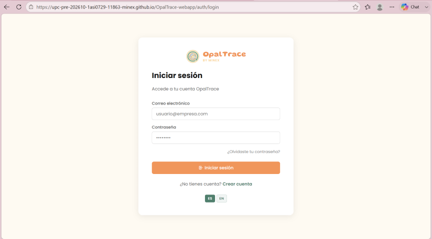

### 5.2.2.8. Team Collaboration Insights during Sprint

Durante el Sprint, el equipo trabajó de manera colaborativa en el desarrollo del frontend.

| Nombre | Actividad |
|--------|----------|
| Armestar Felipa, Adrian Andres     | Custody Chain & Logistics y Reporting & Analytics       |
| Baldeon Vivar, Santiago Armando    | Mineral Extraction & Offline Ops      |
| Philco Mota, Katty Yolanda         | Jewelry Inventory & Certification         |
| Vergraray Calderon, Rose Almendra  | Identity & Access Management, Subscriptions & Billing, Consumer Experience |
| Yi Torrejon, Ethan Raul            |  Refinery Processing        |

**Evidencia de colaboración:**

El equipo logró completar el Sprint cumpliendo todos los objetivos planteados y manteniendo una buena coordinación en el desarrollo, tal como se refleja en los analíticos de colaboración de GitHub. Como se puede observar en la gráfica de contribuciones, los integrantes roseal28, kattyph, Santibal11, Adrian5102 y MRYiEthan realizaron commits de manera constante a lo largo del sprint, cada uno liderando su bounded context asignado y colaborando en los aspectos transversales de i18n y accesibilidad.

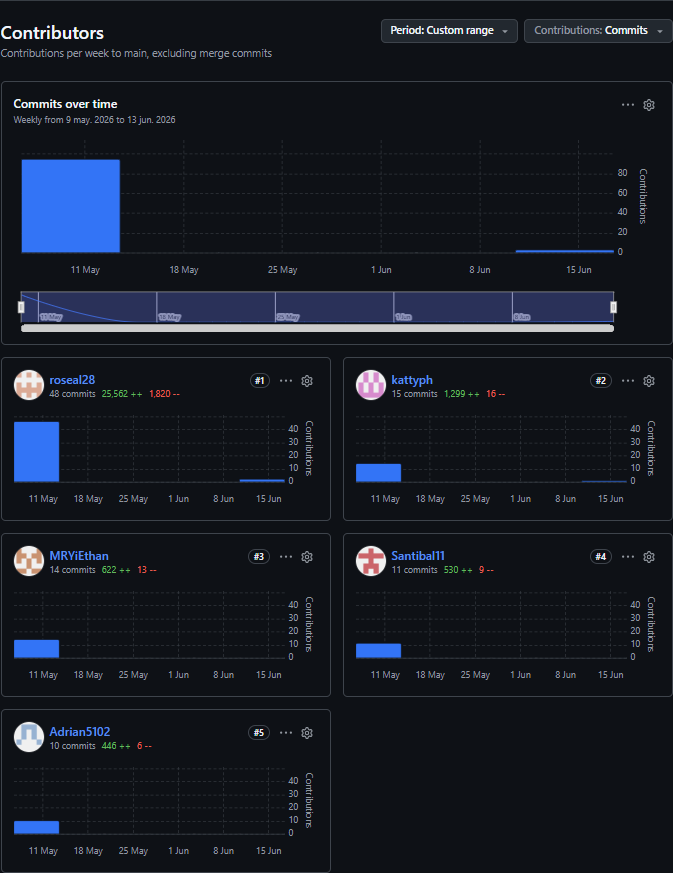

### 5.2.3. Sprint 3

### 5.2.3.1. Sprint Planning 3

<table>
  <tr>
    <th colspan="2">Sprint #</th>
    <th colspan="2">Sprint 3</th>
  </tr>
  <tr>
    <th colspan="4">Sprint Planning Background</th>
  </tr>
  <tr>
    <td colspan="2">Date</td>
    <td colspan="2">2026-06-10</td>
  </tr>
  <tr>
    <td colspan="2">Time</td>
    <td colspan="2">07:00 PM (GMT-5)</td>
  </tr>
  <tr>
    <td colspan="2">Location</td>
    <td colspan="2">Reunión virtual vía Discord</td>
  </tr>
  <tr>
    <td colspan="2">Prepared By</td>
    <td colspan="2">Vergaray Calderon, Rose Almendra</td>
  </tr>
  <tr>
    <td colspan="2">Attendees (to planning meeting)</td>
    <td colspan="2">Armestar Felipa, Adrian Andres / Baldeon Vivar, Santiago Armando / Philco Mota, Katty Yolanda / Vergaray Calderon, Rose Almendra / Yi Torrejon, Ethan Raul</td>
  </tr>
  <tr>
    <th colspan="4">Sprint 2 Review Summary</th>
  </tr>
  <tr>
    <td colspan="4">En el Sprint 2 se entregó el frontend completo de la aplicación web autenticada de OpalTrace, cubriendo los ocho bounded contexts (IAM, Subscriptions, Mineral Extraction, Custody Chain, Refinery Processing, Jewelry Inventory, Consumer Experience y Analytics) con Angular y json-server como capa mock. La aplicación fue desplegada exitosamente en GitHub Pages. Todas las User Stories comprometidas (US01–US30) fueron completadas al 100%, con un total de 116 Story Points entregados.</td>
  </tr>
  <tr>
    <th colspan="4">Sprint 2 Retrospective Summary</th>
  </tr>
  <tr>
    <td colspan="4"><b>Fortalezas:</b> Cobertura completa de los bounded contexts en el frontend. Uso consistente de Angular Signals, DDD por carpetas y GitFlow con feature branches por contexto. <b>Áreas de mejora:</b> Los datos mock de json-server no validan reglas de negocio reales, lo que generó discrepancias al integrar con datos de dominio. <b>Acuerdos para Sprint 3:</b> (1) Cada integrante implementa el backend de sus mismos bounded contexts del Sprint 2. (2) Usar Flyway para migraciones de base de datos desde el primer commit. (3) La rama develop centraliza la integración antes de cada merge al main.</td>
  </tr>
  <tr>
    <th colspan="4">Sprint Goal &amp; User Stories</th>
  </tr>
  <tr>
    <td colspan="2">Sprint 3 Goal</td>
    <td colspan="2">Our focus is on implementing the complete backend Web Services layer of OpalTrace using Spring Boot with Domain-Driven Design architecture, covering all bounded contexts: IAM with JWT security, Subscriptions, Mineral Extraction, Custody Chain, Refinery Processing, Jewelry Inventory, Consumer Experience, and Analytics. We believe it delivers a functional and secured REST API that allows the frontend to replace json-server mocks with real endpoints, enforcing business rules at the domain layer. This will be confirmed when all endpoints are documented via OpenAPI, secured with JWT role-based authorization, each bounded context has its domain, infrastructure (JPA + Flyway), and application layers fully implemented, and the API is reachable from the deployed frontend.</td>
  </tr>
  <tr>
    <td colspan="2">Sprint 3 Velocity</td>
    <td colspan="2">33 Story Points</td>
  </tr>
  <tr>
    <td colspan="2">Sum of Story Points</td>
    <td colspan="2">33 Story Points</td>
  </tr>
</table>

### 5.2.3.2. Aspect Leaders and Collaborators

El Sprint 3 abarca la construcción del backend completo de OpalTrace como Web Services REST con Spring Boot, siguiendo la arquitectura DDD por capa (`domain / application / infrastructure`). Cada integrante lidera los mismos bounded contexts que desarrolló en el frontend durante el Sprint 2.

**IAM & Subscriptions:** Comprende la implementación de seguridad JWT con Spring Security, registro y autenticación de usuarios empresariales y consumidores, gestión de roles, y los endpoints de suscripción con lógica de upgrade/downgrade y facturación.

**Mineral Extraction:** Comprende los endpoints REST para registro de lotes con validación de zona GPS, reporte y detección automática de anomalías, generación de QR con firma digital, y soporte de cola offline con sincronización.

**Refinery Processing & Consumer Experience:** Comprende los endpoints de recepción de lotes en refinería, división en sublotes con herencia de trazabilidad, registro de merma, y el servicio de verificación pública de autenticidad mediante QR sin autenticación.

**Jewelry Inventory:** Comprende los endpoints de recepción de material certificado OpalTrace, registro de material externo, flujo de certificación con validación de integridad, y generación de certificados PDF.

**Custody Chain & Analytics:** Comprende los endpoints de transferencia de custodia, actualización de ubicación GPS en tránsito, y el dashboard de analítica con métricas en tiempo real, indicadores de merma y reportes ESG.

| Team Member (Last Name, First Name) | GitHub Username | IAM | Subscriptions | Mineral Extraction | Custody Chain | Refinery Processing | Jewelry Inventory | Consumer Experience | Analytics |
|-------------------------------------|-----------------|:---:|:---:|:---:|:---:|:---:|:---:|:---:|:---:|
| Armestar Felipa, Adrian Andres | Adrian5102 | C | C | C | C | L | C | L | C |
| Baldeon Vivar, Santiago Armando | Santibal11 | C | C | C | L | C | C | C | L |
| Philco Mota, Katty Yolanda | kattyph | C | C | C | C | C | L | C | C |
| Vergaray Calderon, Rose Almendra | roseal28 | L | L | C | C | C | C | C | C |
| Yi Torrejon, Ethan Raul | MRYiEthan | C | C | L | C | C | C | C | C |

### 5.2.3.3. Sprint Backlog 3

El Sprint Backlog 3 contiene todas las tareas de desarrollo backend identificadas en el Sprint Planning, organizadas por Technical Story y bounded context. Cada tarea implementa las tres capas DDD: domain, infrastructure (JPA + Flyway) y application (services + REST controller).

URL del Board (Trello): [Enlace Trello Sprint 3](https://trello.com/b/8DovWpeI/sprint-baclog3)

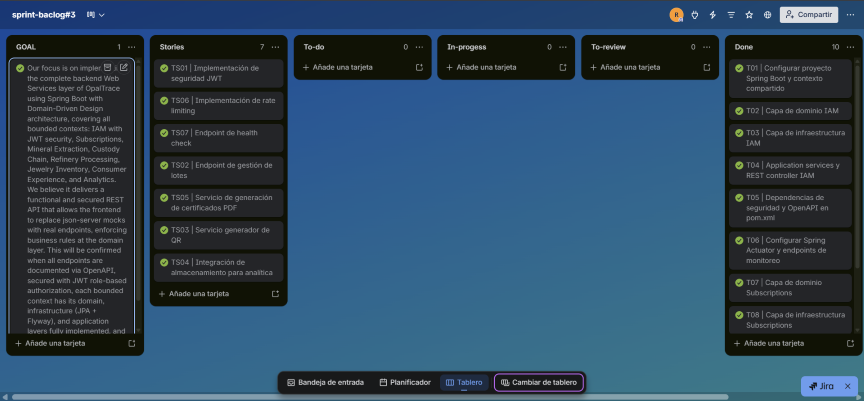

| TS ID | TS Title | Task ID | Task Title | Description | Est. (h) | Assigned To | Status |
|-------|----------|---------|------------|-------------|----------|-------------|--------|
| TS01 | Implementación de seguridad JWT | T01 | Configurar proyecto Spring Boot y contexto compartido | Inicializar proyecto Spring Boot con estructura DDD. Configurar spring profiles (dev/prod), shared bounded context con BaseEntity y excepciones comunes. Añadir dependencias de Spring Security, JWT, OpenAPI y Flyway al pom.xml. | 3 | Vergaray | Done |
| TS01 | Implementación de seguridad JWT | T02 | Capa de dominio IAM | Crear entidades de dominio `User`, `Role` y value objects. Definir interfaces de repositorio y eventos de dominio `UserRegistered` y `UserAuthenticated`. | 2 | Vergaray | Done |
| TS01 | Implementación de seguridad JWT | T03 | Capa de infraestructura IAM | Implementar JPA repositories, configurar Spring Security con JWT filter chain y crear scripts de migración Flyway para tablas de usuarios y roles. | 3 | Vergaray | Done |
| TS01 | Implementación de seguridad JWT | T04 | Application services y REST controller IAM | Implementar command handlers para registro y autenticación, generar y validar tokens JWT por rol y segmento, exponer endpoints `POST /api/v1/auth/sign-up` y `POST /api/v1/auth/sign-in`. Documentar con OpenAPI. | 3 | Vergaray | Done |
| TS06 | Implementación de rate limiting | T05 | Dependencias de seguridad y OpenAPI en pom.xml | Añadir dependencias faltantes para Spring Security, JJWT, SpringDoc OpenAPI y Evo Inflector (pluralización). Corregir nombre de clase principal en `OpaltracePlatformApplication`. | 2 | Vergaray | Done |
| TS07 | Endpoint de health check | T06 | Configurar Spring Actuator y endpoints de monitoreo | Habilitar Spring Boot Actuator con endpoints `/actuator/health` y `/actuator/info` para verificar operatividad del sistema y sus dependencias críticas. | 1 | Vergaray | Done |
| TS01 | Implementación de seguridad JWT | T07 | Capa de dominio Subscriptions | Crear entidades `Subscription` y `BillingRecord` con value objects para tier de plan y estado de pago. Definir reglas de negocio de upgrade y downgrade. | 2 | Vergaray | Done |
| TS01 | Implementación de seguridad JWT | T08 | Capa de infraestructura Subscriptions | Implementar JPA repositories y scripts Flyway para tablas de suscripciones y registros de facturación. | 2 | Vergaray | Done |
| TS01 | Implementación de seguridad JWT | T09 | Application services y REST controller Subscriptions | Implementar command handlers para suscripción, upgrade, downgrade y cancelación. Exponer endpoints `GET/POST /api/v1/subscriptions` y `GET /api/v1/billing-records`. Documentar con OpenAPI. | 3 | Vergaray | Done |
| TS02 | Endpoint de gestión de lotes | T10 | Capa de dominio Mineral Extraction | Crear entidades `MineralBatch`, `AnomalyReport` y value objects `GpsCoordinate` y `MineralType`. Definir eventos `MineralExtracted` y `AnomalyDetected`. | 3 | Yi Torrejon | Done |
| TS02 | Endpoint de gestión de lotes | T11 | Application services y REST controller Mineral Extraction | Implementar command handlers para registro de lote con validación GPS, reporte de anomalías y generación de QR. Exponer endpoints `POST /api/v1/batches`, `POST /api/v1/anomaly-reports` y `GET /api/v1/batches/{id}/qr`. Documentar con OpenAPI. | 4 | Yi Torrejon | Done |
| TS02 | Endpoint de gestión de lotes | T12 | Capa de infraestructura Mineral Extraction | Implementar JPA repositories y scripts Flyway para tablas de lotes minerales, coordenadas GPS y reportes de anomalías. | 3 | Yi Torrejon | Done |
| TS05 | Servicio de generación de certificados PDF | T13 | Capa de dominio Jewelry Inventory | Crear entidades `JewelryProduct`, `CertifiedMaterial` y `ExternalMaterial`. Definir eventos `CertificationGranted` y `CertificationRejected` con reglas de validación de integridad. | 3 | Philco Mota | Done |
| TS05 | Servicio de generación de certificados PDF | T14 | Capa de infraestructura Jewelry Inventory | Implementar JPA repositories y scripts Flyway para tablas de inventario de joyería, materiales certificados y registros de certificación. | 2 | Philco Mota | Done |
| TS05 | Servicio de generación de certificados PDF | T15 | Application services y REST controller Jewelry Inventory | Implementar command handlers para recepción de material, registro externo, flujo de certificación y generación de certificado PDF. Exponer endpoints `POST /api/v1/jewelry-products`, `POST /api/v1/certifications` y `GET /api/v1/certifications/{id}/pdf`. Documentar con OpenAPI. | 4 | Philco Mota | Done |
| TS02 | Endpoint de gestión de lotes | T16 | Capa de dominio Refinery Processing | Crear entidades `RefineryBatch`, `SubLot` y `ShrinkageRecord`. Definir eventos `BatchReceived` y `ChildBatchCreated` con reglas de herencia de trazabilidad. | 3 | Armestar Felipa | Done |
| TS02 | Endpoint de gestión de lotes | T17 | Capa de infraestructura Refinery Processing | Implementar JPA repositories y scripts Flyway para tablas de lotes de refinería, sublotes y registros de merma. | 2 | Armestar Felipa | Done |
| TS02 | Endpoint de gestión de lotes | T18 | Application services y REST controller Refinery Processing | Implementar command handlers para recepción, división en sublotes y registro de merma. Exponer endpoints `POST /api/v1/refinery-batches`, `POST /api/v1/refinery-batches/{id}/split` y `POST /api/v1/shrinkage-records`. Documentar con OpenAPI. | 3 | Armestar Felipa | Done |
| TS03 | Servicio generador de QR | T19 | Capa de dominio Consumer Experience | Crear entidades `VerificationResult` y `GeographicRoute`. Definir eventos `AuthenticityVerified` y `TraceabilityViewed`. | 2 | Armestar Felipa | Done |
| TS03 | Servicio generador de QR | T20 | Capa de infraestructura Consumer Experience | Implementar JPA repositories y scripts Flyway para tablas de resultados de verificación y rutas geográficas. | 2 | Armestar Felipa | Done |
| TS03 | Servicio generador de QR | T21 | Application services y REST controller Consumer Experience | Implementar servicio de verificación pública de autenticidad por QR (sin autenticación) y endpoint de recorrido geográfico. Exponer `GET /api/v1/verify/{certificateId}` y `GET /api/v1/verify/{certificateId}/route`. Documentar con OpenAPI. | 3 | Armestar Felipa | Done |
| TS02 | Endpoint de gestión de lotes | T22 | Capa de dominio Custody Chain | Crear entidades `CustodyTransfer` y `LocationUpdate`. Definir eventos `TransportStarted` y `LocationUpdated` con validación de estado del lote. | 3 | Baldeon Vivar | Done |
| TS02 | Endpoint de gestión de lotes | T23 | Capa de infraestructura Custody Chain | Implementar JPA repositories y scripts Flyway para tablas de transferencias de custodia y actualizaciones de ubicación. | 2 | Baldeon Vivar | Done |
| TS02 | Endpoint de gestión de lotes | T24 | Application services y REST controller Custody Chain | Implementar command handlers para aceptar custodia y registrar ubicación GPS. Exponer endpoints `POST /api/v1/custody-transfers` y `POST /api/v1/location-updates`. Documentar con OpenAPI. | 3 | Baldeon Vivar | Done |
| TS04 | Integración de almacenamiento para analítica | T25 | Capa de dominio Analytics | Crear entidades `OperationalMetrics`, `ShrinkageRecord` y `EsgReport`. Definir agregados de métricas por periodo y segmento. | 3 | Baldeon Vivar | Done |
| TS04 | Integración de almacenamiento para analítica | T26 | Capa de infraestructura Analytics | Implementar JPA repositories y scripts Flyway para tablas de métricas operativas y reportes ESG. | 2 | Baldeon Vivar | Done |
| TS04 | Integración de almacenamiento para analítica | T27 | Application services y REST controller Analytics | Implementar query handlers para métricas en tiempo real, merma operativa y reportes ESG. Exponer endpoints `GET /api/v1/analytics/metrics`, `GET /api/v1/analytics/shrinkage` y `GET /api/v1/analytics/esg`. Documentar con OpenAPI. | 3 | Baldeon Vivar | Done |

### 5.2.3.4. Development Evidence for Sprint Review

Durante este sprint, el equipo completó la implementación del backend completo de OpalTrace como Web Services REST con Spring Boot. El desarrollo cubrió todos los bounded contexts (IAM, Subscriptions, Mineral Extraction, Custody Chain, Refinery Processing, Jewelry Inventory, Consumer Experience y Analytics) siguiendo arquitectura DDD con capas domain, infrastructure y application. Todo el trabajo fue gestionado mediante GitFlow, con ramas feature/ individuales por bounded context fusionadas en develop mediante Pull Requests, resultando en 14 PRs integrados.

| Repository | Branch | Commit Id | Commit Message | Commit Message Body | Committed on |
|---|---|---|---|---|---|
| [OpalTrace-platform](https://github.com/upc-pre-202610-1asi0729-11863-minex/OpalTrace-platform) | main | a581464 | chore: initial commit | Setup inicial del proyecto con asignación de ramas por bounded context por integrante | 2026-06-15 |
| [OpalTrace-platform](https://github.com/upc-pre-202610-1asi0729-11863-minex/OpalTrace-platform) | main | f45c820 | chore: update opaltrace platform application file | Actualización del archivo principal de la aplicación Spring Boot | 2026-06-15 |
| [OpalTrace-platform](https://github.com/upc-pre-202610-1asi0729-11863-minex/OpalTrace-platform) | feature/iam | 221fc8b | chore: add spring profiles | Configuración de perfiles de Spring para entornos dev y prod | 2026-06-17 |
| [OpalTrace-platform](https://github.com/upc-pre-202610-1asi0729-11863-minex/OpalTrace-platform) | feature/iam | e07f8af | feat(shared): add shared bounded context | Implementación del contexto compartido con BaseEntity y excepciones comunes | 2026-06-17 |
| [OpalTrace-platform](https://github.com/upc-pre-202610-1asi0729-11863-minex/OpalTrace-platform) | feature/iam | 5255160 | feat(iam): add domain layer | Creación de entidades User, Role y value objects del bounded context IAM | 2026-06-17 |
| [OpalTrace-platform](https://github.com/upc-pre-202610-1asi0729-11863-minex/OpalTrace-platform) | feature/iam | 713bcf8 | feat(iam): add infrastructure layer | Implementación de JPA repositories y configuración de Spring Security con JWT filter chain | 2026-06-17 |
| [OpalTrace-platform](https://github.com/upc-pre-202610-1asi0729-11863-minex/OpalTrace-platform) | feature/iam | e9ef3fc | feat(iam): add flyway migration | Scripts de migración Flyway para tablas de usuarios y roles | 2026-06-17 |
| [OpalTrace-platform](https://github.com/upc-pre-202610-1asi0729-11863-minex/OpalTrace-platform) | feature/iam | 9eaaacd | feat(iam): add application services and REST controller | Command handlers de registro y autenticación con generación de JWT; endpoints POST /auth/sign-up y POST /auth/sign-in | 2026-06-17 |
| [OpalTrace-platform](https://github.com/upc-pre-202610-1asi0729-11863-minex/OpalTrace-platform) | develop | 23cbd1a | Merge pull request #1 from .../feature/iam | Integración del bounded context IAM a develop | 2026-06-17 |
| [OpalTrace-platform](https://github.com/upc-pre-202610-1asi0729-11863-minex/OpalTrace-platform) | feature/jewelry-inventory | 0da68fe | feat(jewelry-inventory): add domain layer | Creación de entidades JewelryProduct, CertifiedMaterial y ExternalMaterial con reglas de validación de integridad | 2026-06-18 |
| [OpalTrace-platform](https://github.com/upc-pre-202610-1asi0729-11863-minex/OpalTrace-platform) | feature/refinery-processing | 4338d02 | feat(refinery-processing): add domain layer | Creación de entidades RefineryBatch, SubLot y ShrinkageRecord con eventos BatchReceived y ChildBatchCreated | 2026-06-18 |
| [OpalTrace-platform](https://github.com/upc-pre-202610-1asi0729-11863-minex/OpalTrace-platform) | feature/jewelry-inventory | 6d865f5 | feat(jewelryinventory): add infrastructure layer and flyway migration | JPA repositories y scripts Flyway para tablas de inventario de joyería y materiales | 2026-06-18 |
| [OpalTrace-platform](https://github.com/upc-pre-202610-1asi0729-11863-minex/OpalTrace-platform) | feature/refinery-processing | ad99dc9 | feat(refinery-processing): add infrastructure layer and flyway migration | JPA repositories y scripts Flyway para tablas de lotes de refinería, sublotes y merma | 2026-06-18 |
| [OpalTrace-platform](https://github.com/upc-pre-202610-1asi0729-11863-minex/OpalTrace-platform) | feature/jewelry-inventory | 44ecf17 | feat(jewelryinventory): add application services and REST controller | Command handlers de recepción, certificación y PDF; endpoints /jewelry-products y /certifications | 2026-06-18 |
| [OpalTrace-platform](https://github.com/upc-pre-202610-1asi0729-11863-minex/OpalTrace-platform) | feature/jewelry-inventory | 3257c2c | feat(jewelryinventory): complete jewelry inventory | Completar el módulo jewelry inventory con validaciones de integridad y reglas de negocio de certificación | 2026-06-18 |
| [OpalTrace-platform](https://github.com/upc-pre-202610-1asi0729-11863-minex/OpalTrace-platform) | develop | 2ad06ec | Merge branch 'feature/jewelry-inventory' into develop | Integración del bounded context Jewelry Inventory a develop | 2026-06-18 |
| [OpalTrace-platform](https://github.com/upc-pre-202610-1asi0729-11863-minex/OpalTrace-platform) | feature/refinery-processing | e37d0e5 | feat(refinery-processing): add application services and REST controller | Command handlers de recepción, división en sublotes y registro de merma; endpoints /refinery-batches y /shrinkage-records | 2026-06-18 |
| [OpalTrace-platform](https://github.com/upc-pre-202610-1asi0729-11863-minex/OpalTrace-platform) | feature/consumer-experience | 4c7cfac | feat(consumer-experience): add domain layer | Creación de entidades VerificationResult y GeographicRoute con eventos AuthenticityVerified y TraceabilityViewed | 2026-06-18 |
| [OpalTrace-platform](https://github.com/upc-pre-202610-1asi0729-11863-minex/OpalTrace-platform) | feature/consumer-experience | 792a752 | feat(consumer-experience): add infrastructure layer and flyway migration | JPA repositories y scripts Flyway para tablas de resultados de verificación y rutas geográficas | 2026-06-18 |
| [OpalTrace-platform](https://github.com/upc-pre-202610-1asi0729-11863-minex/OpalTrace-platform) | feature/consumer-experience | 686abc9 | feat(consumer-experience): add application services and REST controller | Servicio público de verificación QR sin autenticación; endpoints GET /verify/{certificateId} y /verify/{certificateId}/route | 2026-06-18 |
| [OpalTrace-platform](https://github.com/upc-pre-202610-1asi0729-11863-minex/OpalTrace-platform) | feature/mineral-extraction | 3a9e706 | feat(mineral-extraction): add domain layer | Creación de entidades MineralBatch y AnomalyReport con value objects GpsCoordinate y MineralType | 2026-06-18 |
| [OpalTrace-platform](https://github.com/upc-pre-202610-1asi0729-11863-minex/OpalTrace-platform) | feature/mineral-extraction | 727ff82 | feat(mineral-extraction): add application services and REST controller | Command handlers de registro de lote con validación GPS, reportes de anomalías y generación de QR; endpoints /batches y /anomaly-reports | 2026-06-18 |
| [OpalTrace-platform](https://github.com/upc-pre-202610-1asi0729-11863-minex/OpalTrace-platform) | feature/mineral-extraction | a01c238 | feat(mineral-extraction): add infrastructure layer and flyway migration | JPA repositories y scripts Flyway para tablas de lotes minerales, coordenadas GPS y anomalías | 2026-06-18 |
| [OpalTrace-platform](https://github.com/upc-pre-202610-1asi0729-11863-minex/OpalTrace-platform) | develop | 9025da1 | Merge pull request #2 from .../feature/mineral-extraction | Integración del bounded context Mineral Extraction a develop | 2026-06-18 |
| [OpalTrace-platform](https://github.com/upc-pre-202610-1asi0729-11863-minex/OpalTrace-platform) | feature/custody-chain | ae2350e | feat(custody-chain): add domain layer | Creación de entidades CustodyTransfer y LocationUpdate con eventos TransportStarted y LocationUpdated | 2026-06-18 |
| [OpalTrace-platform](https://github.com/upc-pre-202610-1asi0729-11863-minex/OpalTrace-platform) | feature/custody-chain | 376c949 | feat(custody-chain): add infrastructure layer and flyway migration | JPA repositories y scripts Flyway para tablas de transferencias de custodia y actualizaciones de ubicación | 2026-06-18 |
| [OpalTrace-platform](https://github.com/upc-pre-202610-1asi0729-11863-minex/OpalTrace-platform) | feature/custody-chain | 1c441ca | feat(custody-chain): add application services and REST controller | Command handlers de transferencia de custodia y actualización GPS; endpoints /custody-transfers y /location-updates | 2026-06-18 |
| [OpalTrace-platform](https://github.com/upc-pre-202610-1asi0729-11863-minex/OpalTrace-platform) | develop | 0825194 | Merge pull request #3 from .../develop | Sincronización de develop con Jewelry Inventory y Mineral Extraction antes de integrar Refinery Processing | 2026-06-18 |
| [OpalTrace-platform](https://github.com/upc-pre-202610-1asi0729-11863-minex/OpalTrace-platform) | develop | 5fb1c23 | Merge pull request #4 from .../feature/refinery-processing | Integración del bounded context Refinery Processing a develop | 2026-06-18 |
| [OpalTrace-platform](https://github.com/upc-pre-202610-1asi0729-11863-minex/OpalTrace-platform) | feature/analytics | a78c409 | feat(analytics): add domain layer | Creación de entidades OperationalMetrics, ShrinkageRecord y EsgReport con agregados de métricas por periodo | 2026-06-18 |
| [OpalTrace-platform](https://github.com/upc-pre-202610-1asi0729-11863-minex/OpalTrace-platform) | feature/analytics | 794914a | feat(analytics): add infrastructure layer and flyway migration | JPA repositories y scripts Flyway para tablas de métricas operativas y reportes ESG | 2026-06-18 |
| [OpalTrace-platform](https://github.com/upc-pre-202610-1asi0729-11863-minex/OpalTrace-platform) | feature/analytics | a6f478f | feat(analytics): add application services and REST controller | Query handlers de métricas en tiempo real, merma y ESG; endpoints /analytics/metrics, /shrinkage y /esg | 2026-06-18 |
| [OpalTrace-platform](https://github.com/upc-pre-202610-1asi0729-11863-minex/OpalTrace-platform) | develop | bf04d8c | Merge pull request #5 from .../develop | Sincronización de develop tras integración de Refinery Processing | 2026-06-18 |
| [OpalTrace-platform](https://github.com/upc-pre-202610-1asi0729-11863-minex/OpalTrace-platform) | develop | 8167808 | Merge pull request #6 from .../feature/consumer-experience | Integración del bounded context Consumer Experience a develop | 2026-06-18 |
| [OpalTrace-platform](https://github.com/upc-pre-202610-1asi0729-11863-minex/OpalTrace-platform) | develop | 8349dbc | Merge pull request #7 from .../develop | Sincronización de develop tras integración de Consumer Experience | 2026-06-18 |
| [OpalTrace-platform](https://github.com/upc-pre-202610-1asi0729-11863-minex/OpalTrace-platform) | develop | f8f3fd1 | Merge pull request #8 from .../feature/analytics | Integración del bounded context Analytics a develop | 2026-06-18 |
| [OpalTrace-platform](https://github.com/upc-pre-202610-1asi0729-11863-minex/OpalTrace-platform) | develop | 677b28e | Merge pull request #9 from .../develop | Sincronización de develop tras integración de Analytics | 2026-06-18 |
| [OpalTrace-platform](https://github.com/upc-pre-202610-1asi0729-11863-minex/OpalTrace-platform) | develop | c1722a1 | Merge pull request #10 from .../feature/custody-chain | Integración del bounded context Custody Chain a develop | 2026-06-18 |
| [OpalTrace-platform](https://github.com/upc-pre-202610-1asi0729-11863-minex/OpalTrace-platform) | develop | cd79b0c | Merge pull request #11 from .../develop | Sincronización de develop tras integración de Custody Chain | 2026-06-18 |
| [OpalTrace-platform](https://github.com/upc-pre-202610-1asi0729-11863-minex/OpalTrace-platform) | feature/subscriptions | 5c6cac4 | feat(subscriptions): add domain layer | Creación de entidades Subscription y BillingRecord con reglas de negocio de upgrade y downgrade | 2026-06-18 |
| [OpalTrace-platform](https://github.com/upc-pre-202610-1asi0729-11863-minex/OpalTrace-platform) | feature/subscriptions | cfadd17 | feat(subscriptions): add infrastructure layer and flyway migration | JPA repositories y scripts Flyway para tablas de suscripciones y registros de facturación | 2026-06-18 |
| [OpalTrace-platform](https://github.com/upc-pre-202610-1asi0729-11863-minex/OpalTrace-platform) | feature/subscriptions | 7711e22 | feat(subscriptions): add application services and REST controller | Command handlers de suscripción, upgrade, downgrade y cancelación; endpoints /subscriptions y /billing-records | 2026-06-18 |
| [OpalTrace-platform](https://github.com/upc-pre-202610-1asi0729-11863-minex/OpalTrace-platform) | develop | 1c78ffa | Merge pull request #12 from .../feature/subscriptions | Integración del bounded context Subscriptions a develop | 2026-06-18 |
| [OpalTrace-platform](https://github.com/upc-pre-202610-1asi0729-11863-minex/OpalTrace-platform) | develop | 275c6ce | Merge pull request #13 from .../develop | Sincronización final de develop antes de correcciones y merge a main | 2026-06-18 |
| [OpalTrace-platform](https://github.com/upc-pre-202610-1asi0729-11863-minex/OpalTrace-platform) | develop | 81276bf | fix: rename class to match file name in OpaltracePlatformApplication | Corrección del nombre de clase principal para que coincida con el nombre del archivo | 2026-06-18 |
| [OpalTrace-platform](https://github.com/upc-pre-202610-1asi0729-11863-minex/OpalTrace-platform) | develop | 5543a46 | fix(pom): add missing dependencies for security, jwt, openapi and pluralize | Dependencias faltantes: Spring Security, JJWT, SpringDoc OpenAPI y Evo Inflector para pluralización de endpoints | 2026-06-18 |
| [OpalTrace-platform](https://github.com/upc-pre-202610-1asi0729-11863-minex/OpalTrace-platform) | main | d040fdc | Merge pull request #14 from .../develop | Integración final de todos los bounded contexts backend a main | 2026-06-18 |

### 5.2.3.5. Execution Evidence for Sprint Review

Durante el Sprint 3, el equipo completó la implementación del backend completo de OpalTrace como Web Services REST con Spring Boot, cubriendo los ocho bounded contexts bajo arquitectura DDD. Todos los endpoints quedan documentados mediante SpringDoc OpenAPI y accesibles vía Swagger UI. La seguridad JWT fue implementada en el bounded context IAM con Spring Security, protegiendo todos los endpoints según el rol y segmento del usuario. Las migraciones de base de datos fueron gestionadas con Flyway, garantizando un esquema relacional consistente y versionado. El sistema integra los eventos de dominio (`MineralExtracted`, `TransportStarted`, `BatchReceived`, `CertificationGranted`, `AuthenticityVerified`) a través de los command handlers de cada bounded context.

**Bounded contexts implementados:**

- IAM (autenticación, JWT, roles)
- Subscriptions (planes, facturación, upgrade/downgrade)
- Mineral Extraction (lotes, anomalías, generación de QR)
- Custody Chain (transferencias de custodia, ubicación GPS)
- Refinery Processing (recepción, sublotes, merma)
- Jewelry Inventory (material certificado, certificación, PDF)
- Consumer Experience (verificación pública QR)
- Analytics (métricas, merma operativa, ESG)

### 5.2.3.6. Services Documentation Evidence for Sprint Review

Durante el Sprint 3 se implementaron todos los Web Services REST del backend de OpalTrace. La documentación de los endpoints fue generada automáticamente mediante SpringDoc OpenAPI 3.0 y es accesible a través de Swagger UI en la ruta `/swagger-ui/index.html` del servidor desplegado.

Los endpoints implementados por bounded context son los siguientes:

| Bounded Context | Método | Endpoint | Descripción | Auth requerida |
|---|---|---|---|---|
| IAM | POST | /api/v1/authentication/sign-up | Registro de usuario empresarial o consumidor | No |
| IAM | POST | /api/v1/authentication/sign-in | Inicio de sesión y generación de JWT | No |
| Subscriptions | GET | /api/v1/subscriptions | Consulta del plan activo del usuario | Sí |
| Subscriptions | POST | /api/v1/subscriptions | Suscripción a un plan OpalTrace | Sí |
| Subscriptions | GET | /api/v1/billing-records | Historial de facturación del usuario | Sí |
| Mineral Extraction | POST | /api/v1/batches | Registro de lote con validación de zona GPS | Sí |
| Mineral Extraction | POST | /api/v1/anomaly-reports | Reporte de anomalía con bloqueo de lote | Sí |
| Custody Chain | POST | /api/v1/custody-transfers | Transferencia formal de custodia de lote | Sí |
| Custody Chain | POST | /api/v1/location-updates | Actualización de ubicación GPS en tránsito | Sí |
| Refinery Processing | POST | /api/v1/refinery-batches | Recepción de lote en refinería | Sí |
| Refinery Processing | POST | /api/v1/refinery-batches/{id}/split | División de lote en sublotes | Sí |
| Refinery Processing | POST | /api/v1/shrinkage-records | Registro de merma operativa | Sí |
| Jewelry Inventory | POST | /api/v1/jewelry-products | Recepción de material (certificado o externo) | Sí |
| Jewelry Inventory | POST | /api/v1/certifications | Flujo de certificación con validación de integridad | Sí |
| Consumer Experience | GET | /api/v1/verify/{certificateId} | Verificación pública de autenticidad por QR | No |
| Consumer Experience | GET | /api/v1/verify/{certificateId}/route | Recorrido geográfico del mineral | No |
| Analytics | GET | /api/v1/analytics/metrics | Métricas operativas en tiempo real | Sí |
| Analytics | GET | /api/v1/analytics/shrinkage | Indicadores de merma por periodo | Sí |
| Analytics | GET | /api/v1/analytics/esg | Reportes ESG exportables en PDF | Sí (Platinum) |

**Screenshot de Swagger UI:**

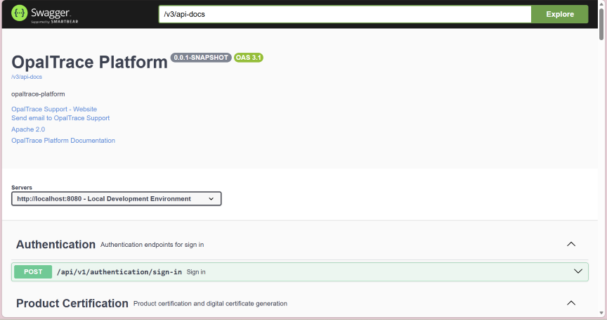
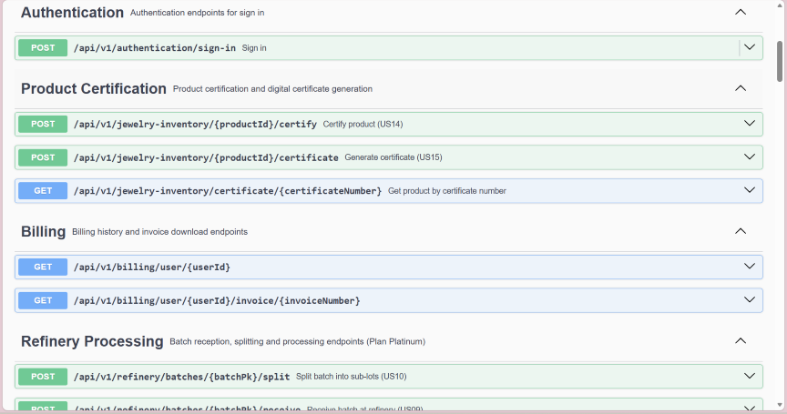
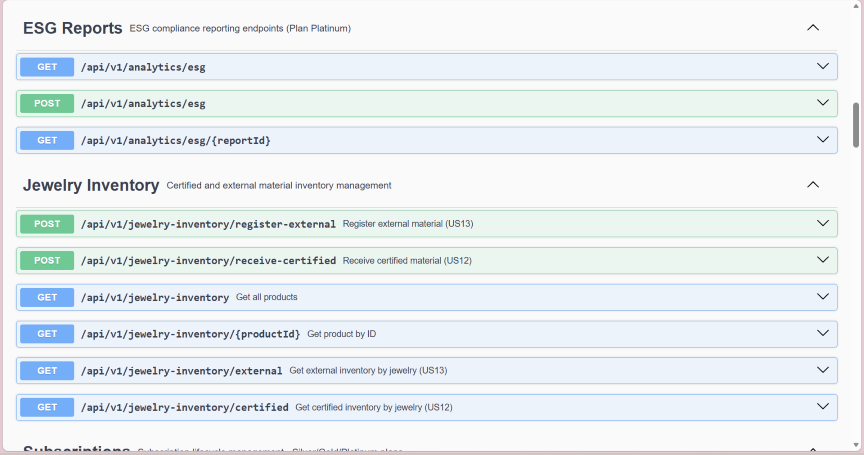
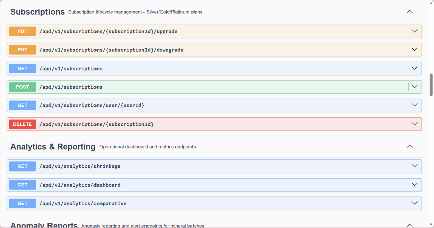
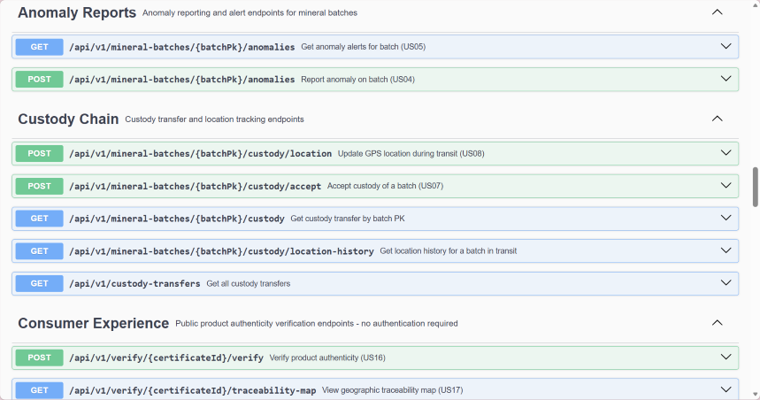
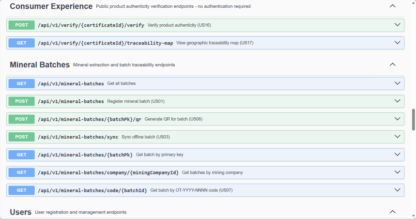
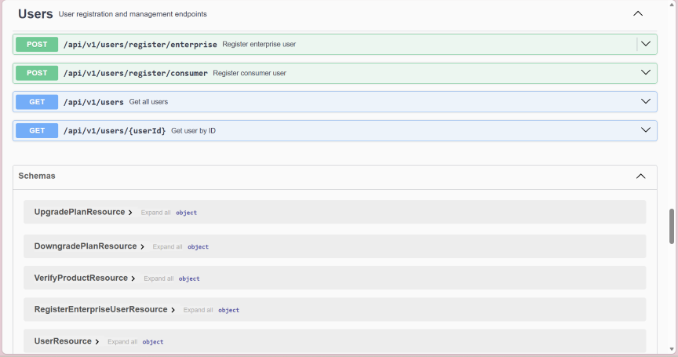

### 5.2.3.7. Software Deployment Evidence for Sprint Review

Durante este sprint se preparó el repositorio backend de OpalTrace para su despliegue. El código fuente fue centralizado en el repositorio `OpalTrace-backend` bajo la organización `upc-pre-202610-1asi0729-11863-minex` en GitHub. La integración de todos los bounded contexts se realizó mediante 14 Pull Requests gestionados con GitFlow, desde ramas `feature/` individuales hacia `develop` y finalmente hacia `main`.

**Repositorio backend:**

[OpalTrace-platform](https://github.com/upc-pre-202610-1asi0729-11863-minex/OpalTrace-platform)

**Actividades realizadas:**
- Configuración del proyecto Spring Boot con estructura DDD multi-módulo
- Integración de Flyway para versionado de esquema de base de datos
- Configuración de Spring Security con JWT para protección de endpoints
- Generación automática de documentación OpenAPI vía SpringDoc
- Resolución de dependencias faltantes en pom.xml (Spring Security, JJWT, SpringDoc, Evo Inflector)
- Integración de 14 Pull Requests mediante GitFlow hacia rama main

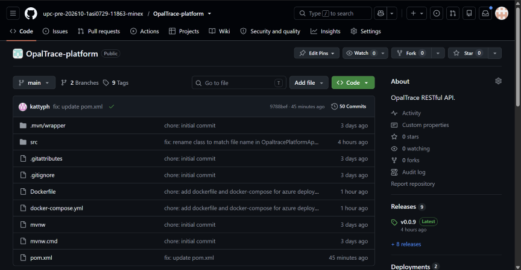

### 5.2.3.8. Team Collaboration Insights during Sprint

Durante el Sprint 3, el equipo trabajó de manera colaborativa en el desarrollo del backend, manteniendo la misma distribución de bounded contexts que en el Sprint 2 para garantizar continuidad y coherencia entre capas.

| Nombre | Bounded Context | Actividad principal |
|--------|----------------|---------------------|
| Armestar Felipa, Adrian Andres | Refinery Processing, Consumer Experience | Domain, infrastructure, Flyway migrations y REST controllers |
| Baldeon Vivar, Santiago Armando | Custody Chain, Analytics | Domain, infrastructure, Flyway migrations y REST controllers |
| Philco Mota, Katty Yolanda | Jewelry Inventory | Domain, infrastructure, Flyway migrations y REST controllers |
| Vergaray Calderon, Rose Almendra | IAM, Subscriptions, Shared | Configuración del proyecto, Spring Security + JWT, domain, infrastructure y REST controllers |
| Yi Torrejon, Ethan Raul | Mineral Extraction | Domain, infrastructure, Flyway migrations y REST controllers |

**Evidencia de colaboración:**

El equipo completó el Sprint 3 implementando el backend completo en un ciclo de desarrollo concentrado. La estrategia de asignar los mismos bounded contexts del Sprint 2 a cada integrante permitió reutilizar el conocimiento de dominio adquirido durante el frontend, reduciendo el tiempo de implementación y garantizando consistencia entre la capa de presentación y los servicios REST.

## 5.3. Validation Interviews

### 5.3.1. Diseño de Entrevistas

Para cada segmento objetivo se establecieron los elementos a incluir en la sesión de validación, considerando la interacción con el Landing Page y la aplicación web OpalTrace. Las sesiones siguen un orden estructurado: primero se evalúa el Landing Page y luego los user flows de la aplicación.

---

#### Segmento 1: Empresas Mineras

*User Flows a validar:*
- Registro de un nuevo lote de mineral (Fleet Operations)
- Monitoreo de flota y revisión de alertas de anomalía (Monitoring & Telemetry)
- Reporte de incidentes (Incident Management)
- Revisión de KPIs en Analytics

*Preguntas — Landing Page*
1. Al ver esta página por primera vez, ¿qué entiendes que hace esta plataforma?
2. ¿La información presentada te convence de que GoldCheck puede ayudarte en tu operación? ¿Por qué?
3. ¿Encuentras fácilmente cómo registrarte o contactar al equipo?

*Preguntas — Aplicación*
4. Intenta registrar un nuevo lote de mineral desde el dashboard de Fleet Operations. ¿Qué tan intuitivo te resultó el proceso?
5. Navega a la sección de monitoreo. ¿Las alertas de anomalía son claras y fáciles de interpretar?
6. Simula reportar un incidente. ¿El formulario recoge toda la información que necesitarías en un escenario real?
7. Revisa el dashboard de Analytics. ¿Los KPIs mostrados son los que usarías para tomar decisiones operativas?
8. ¿Hay alguna funcionalidad que esperabas encontrar y no encontraste?

---

#### Segmento 2: Joyerías

*User Flows a validar:*
- Registro de inventario de piezas (Jewelry Inventory & Certification)
- Certificación de piezas y generación de QR
- Consulta del historial de trazabilidad de un material

*Preguntas — Landing Page*
1. ¿Qué te transmite esta página sobre el producto? ¿Queda claro a quién va dirigido?
2. ¿La propuesta de valor para joyerías es suficientemente clara y convincente?
3. ¿El proceso para solicitar una demo o registrarse es sencillo de encontrar?

*Preguntas — Aplicación*
4. Intenta registrar una pieza en el inventario. ¿El proceso es claro y completo?
5. Genera el certificado QR de una pieza. ¿La información incluida en el certificado te parece suficiente para compartir con tus clientes?
6. Consulta el historial de trazabilidad de un material. ¿La información presentada es comprensible y confiable?
7. ¿Qué información adicional sobre el origen del material te gustaría ver en la plataforma?
8. ¿Qué le agregarías o cambiarías?

---

#### Segmento 3: Usuarios Consumidores

*User Flows a validar:*
- Escaneo de código QR de una joya
- Verificación de autenticidad y trazabilidad del mineral
- Consulta del origen ético del material (Consumer Traceability)

*Preguntas — Landing Page*
1. Al ver esta página, ¿entiendes de inmediato para qué sirve la plataforma?
2. ¿Te genera confianza la información presentada sobre la trazabilidad del oro?
3. ¿Encuentras fácilmente cómo verificar la autenticidad de una joya?

*Preguntas — Aplicación*
4. Escanea el código QR de una joya. ¿El proceso es sencillo e intuitivo?
5. Revisa la información de trazabilidad mostrada. ¿Es fácil de entender de dónde proviene el mineral?
6. ¿La información sobre la certificación libre de conflicto y los criterios ESG te genera confianza?
7. ¿Qué información adicional te gustaría ver al verificar una joya?
8. ¿Qué le agregarías o cambiarías?

---

#### Cierre (todos los segmentos)
- En una escala del 1 al 10, ¿qué tan probable es que uses o recomiendes OpalTrace?
- ¿Qué es lo que más te gustó de la plataforma?
- ¿Qué cambiarías o mejorarías con mayor urgencia?

### 5.3.2. Registro de Entrevistas

#### Segmento 1: Empresas Mineras

##### Entrevista 1:

- Nombres y Apellidos: Efraín Zelaya
- Edad: 42 años
- Ocupación: Ingeniero metalurgista
- Distrito: Huaura
- Tiempo: 0:00 - 8:00
- Link: [Link de las entrevistas](https://upcedupe-my.sharepoint.com/:v:/g/personal/u202416107_upc_edu_pe/IQALz-3qssjESZ1UptetozBUAcUGFsXLHQVL7K6GY0CA4uo?e=iBTSVT)
- Resumen: Efraín comprendió de inmediato el propósito de la plataforma al revisar el Landing Page, señalando que la propuesta de valor se alinea directamente con las carencias que enfrenta en su planta concentradora. Al navegar el módulo de registro de lotes, encontró el proceso intuitivo y comparable a las plantillas que ya utiliza, aunque destacó que la información capturada es más completa y confiable. Valoró positivamente el sistema de alertas de anomalía, que consideró muy superior al seguimiento por WhatsApp que aplica actualmente. Al revisar el dashboard de Analytics, identificó los KPIs como relevantes para la toma de decisiones operativas. Sugirió incorporar una modalidad de registro offline para zonas con conectividad limitada en minas remotas. Puntuó la plataforma con 8/10 y afirmó que la recomendaría a sus colegas del sector.

##### Entrevista 2:

- Nombres y Apellidos: Max Alonso Yapo Figueroa
- Edad: 31 años
- Ocupación: Ingeniero metalurgista – Jefe de Metalurgia y Operaciones
- Distrito: Arequipa
- Tiempo: 8:01 - 15:30
- Link: [Link de las entrevistas](https://upcedupe-my.sharepoint.com/:v:/g/personal/u202416107_upc_edu_pe/IQALz-3qssjESZ1UptetozBUAcUGFsXLHQVL7K6GY0CA4uo?e=iBTSVT)
- Resumen: Max reconoció de inmediato en el Landing Page la solución al problema de control de pesaje y trazabilidad que enfrenta en su operación. Durante la sesión de validación, probó el módulo de Fleet Operations y destacó que el registro de ubicación y tonelaje en tiempo real habría evitado los errores de acumulación que actualmente detecta con semanas de retraso. Al revisar el módulo de monitoreo, confirmó que las alertas de anomalía son claras y accionables. Consideró que el dashboard de Analytics complementa bien su flujo en Excel, ofreciendo la ventaja del dato en tiempo real sin duplicar trabajo. Sugirió evaluar la integración con balanzas existentes en planta. Puntuó la plataforma con 9/10, destacando que es exactamente lo que necesitaban para cerrar la brecha entre el dato operativo y la toma de decisiones.

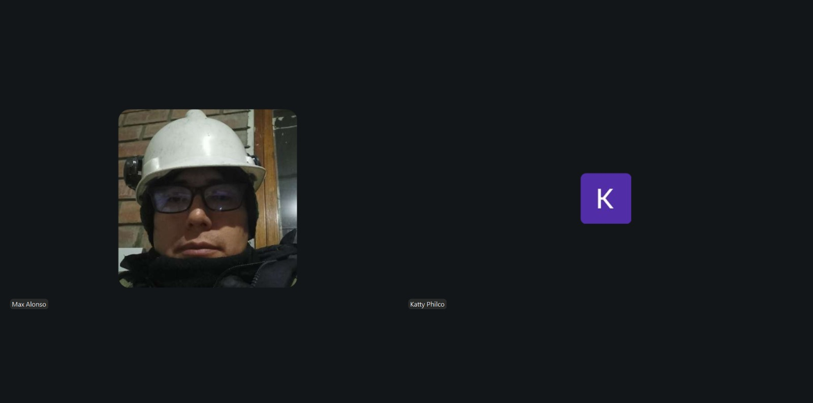

##### Entrevista 3:

- Nombres y Apellidos: Rick Boris Guill Ortiz
- Edad: 34 años
- Ocupación: Ingeniero de minas – Analista de control de proyectos mineros
- Distrito: Ate, Lima
- Tiempo: 15:31 - 23:00
- Link: [Link de las entrevistas](https://upcedupe-my.sharepoint.com/:v:/g/personal/u202416107_upc_edu_pe/IQALz-3qssjESZ1UptetozBUAcUGFsXLHQVL7K6GY0CA4uo?e=iBTSVT)
- Resumen: Rick validó que el Landing Page comunica con claridad el problema de trazabilidad y la solución propuesta, aunque indicó que podría ser más explícito en los beneficios para el rol de control de proyectos. Durante la prueba del módulo de reporte de incidentes, simuló un escenario que en su operación actual tarda hasta una semana en documentarse; con OpalTrace lo completó en menos de tres minutos. Consideró que el formulario recoge los campos esenciales aunque sugirió añadir la posibilidad de adjuntar evidencia fotográfica directamente desde el formulario. Al revisar Analytics, encontró los KPIs alineados con los indicadores que gestiona en Power BI y propuso una exportación de datos para análisis avanzado. Puntuó la plataforma con 8/10 y señaló que adoptaría OpalTrace como sistema de referencia para el control de proyectos.

---

#### Segmento 2: Joyerías

##### Entrevista 1:

- Nombres y Apellidos: Yesiliany Canchica Muñoz
- Edad: 21 años
- Ocupación: Secretaria de Joyería
- Distrito: Surquillo
- Tiempo: 23:01 - 29:00
- Link: [Link de las entrevistas](https://upcedupe-my.sharepoint.com/:v:/g/personal/u202416107_upc_edu_pe/IQALz-3qssjESZ1UptetozBUAcUGFsXLHQVL7K6GY0CA4uo?e=iBTSVT)
- Resumen: Yesiliany comprendió al ver el Landing Page que OpalTrace está dirigido a negocios como el suyo, aunque señaló que la propuesta de valor para joyerías podría destacarse con más visibilidad en la página principal. Al probar el módulo de inventario, encontró el proceso de registro de piezas más organizado que el sistema manual que utiliza actualmente. La generación del certificado QR fue la funcionalidad que más le impresionó: consideró que la información incluida, especialmente el origen y el quilataje certificado, es exactamente lo que sus clientes exigen cuando adquieren piezas de valor. Al consultar el historial de trazabilidad de un material, encontró la información comprensible y confiable. Sugirió añadir la posibilidad de exportar el certificado en PDF para imprimirlo y entregarlo físicamente al cliente. Puntuó la plataforma con 8/10.

##### Entrevista 2:

- Nombres y Apellidos: Dante Jhosué Javier Reyes
- Edad: 23 años
- Ocupación: Gestiona negocio de joyería familiar
- Distrito: Santiago de Surco
- Tiempo: 29:01 - 35:00
- Link: [Link de las entrevistas](https://upcedupe-my.sharepoint.com/:v:/g/personal/u202416107_upc_edu_pe/IQALz-3qssjESZ1UptetozBUAcUGFsXLHQVL7K6GY0CA4uo?e=iBTSVT)
- Resumen: Dante identificó de inmediato en el Landing Page la solución al problema que más le ha costado ventas: no poder demostrar el origen del material a sus clientes. Al probar el módulo de certificación QR, señaló que la información incluida en el certificado responde exactamente a las preguntas que le hacen sus clientes antes de decidir una compra. Al consultar el historial de trazabilidad de un material, encontró la cadena de información clara y suficientemente detallada para generar confianza. Destacó que poder compartir ese certificado directamente en el punto de venta cambiaría completamente la dinámica con sus clientes. Sugirió añadir la opción de compartir el certificado vía WhatsApp con un solo clic. Puntuó la plataforma con 9/10 y afirmó que la adoptaría en su negocio tan pronto esté disponible.

##### Entrevista 3:

- Nombres y Apellidos: Mauricio Julio Perez Lopez
- Edad: 23 años
- Ocupación: Especialista en comercialización de joyas
- Distrito: San Borja
- Tiempo: 35:01 - 42:00
- Link: [Link de las entrevistas](https://upcedupe-my.sharepoint.com/:v:/g/personal/u202416107_upc_edu_pe/IQALz-3qssjESZ1UptetozBUAcUGFsXLHQVL7K6GY0CA4uo?e=iBTSVT)
- Resumen: Mauricio, con su experiencia en validación de autenticidad, evaluó la plataforma con criterio técnico. Consideró que el Landing Page transmite profesionalismo y que la propuesta de valor es sólida y creíble para el sector. Al consultar el historial de trazabilidad de un material, destacó que la completitud de la cadena, desde la extracción hasta el inventario de la joyería, habría sido clave para prevenir el incidente que vivieron con un proveedor que entregó material falsificado. Encontró el proceso de registro de piezas claro y bien estructurado. Sugirió incorporar una alerta automática cuando la cadena de trazabilidad de un material presenta vacíos o saltos sin justificación. Señaló también que le gustaría ver integración con los sistemas de certificación que ya utilizan. Puntuó la plataforma con 8/10.

---

#### Segmento 3: Usuarios Consumidores

##### Entrevista 1:

- Nombres y Apellidos: Carla Gallardo Morales
- Edad: 19 años
- Ocupación: Estudiante universitaria
- Distrito: La Molina
- Tiempo: 42:01 - 48:00
- Link: [Link de las entrevistas](https://upcedupe-my.sharepoint.com/:v:/g/personal/u202416107_upc_edu_pe/IQALz-3qssjESZ1UptetozBUAcUGFsXLHQVL7K6GY0CA4uo?e=iBTSVT)
- Resumen: Carla entendió de inmediato al ver el Landing Page para qué sirve la plataforma, señalando que aborda directamente su principal preocupación: saber si lo que compra es auténtico y de origen ético. Le generó confianza la información sobre la trazabilidad del mineral presentada en la página. Al escanear el código QR de una joya, encontró el proceso sencillo e intuitivo, comparable a escanear un código en cualquier aplicación de su uso diario. La información de trazabilidad mostrada le resultó fácil de entender y le permitió ver claramente el origen del mineral. La sección de certificación ESG le generó confianza adicional en el origen libre de conflicto del material. Sugirió añadir información sobre el impacto ambiental de la extracción y el porcentaje de huella de carbono del proceso. Puntuó la plataforma con 9/10 y afirmó que la usaría activamente antes de cada compra de joyería.

##### Entrevista 2:

- Nombres y Apellidos: Mauricio Moquillaza
- Edad: 19 años
- Ocupación: Estudiante
- Distrito: Jesús María
- Tiempo: 48:01 - 55:00
- Link: [Link de las entrevistas](https://upcedupe-my.sharepoint.com/:v:/g/personal/u202416107_upc_edu_pe/IQALz-3qssjESZ1UptetozBUAcUGFsXLHQVL7K6GY0CA4uo?e=iBTSVT)
- Resumen: Mauricio, que se declara escéptico del marketing de marcas, valoró especialmente que el Landing Page ofrece información verificable en lugar de promesas genéricas. Al escanear el código QR y revisar la información de trazabilidad, encontró en OpalTrace exactamente el tipo de dato objetivo que no puede obtener del mercado actual: pureza del material, ubicación de extracción y cadena de custodia verificada. Consideró que la información presentada es fácil de entender incluso sin conocimiento técnico previo. Valoró la transparencia de la cadena de valor como un diferenciador real frente a otras marcas. Sugirió añadir la posibilidad de que otros consumidores puedan valorar o comentar cada etapa de la cadena de trazabilidad para aumentar la credibilidad colectiva. Puntuó la plataforma con 8/10.

##### Entrevista 3:

- Nombres y Apellidos: Oliver Galindo
- Edad: 20 años
- Ocupación: Estudiante
- Distrito: Comas
- Tiempo: 55:01 - 62:00
- Link: [Link de las entrevistas](https://upcedupe-my.sharepoint.com/:v:/g/personal/u202416107_upc_edu_pe/IQALz-3qssjESZ1UptetozBUAcUGFsXLHQVL7K6GY0CA4uo?e=iBTSVT)
- Resumen: Oliver encontró el Landing Page limpio y fácil de entender, señalando que comprendió el propósito de la plataforma en los primeros segundos sin necesidad de leer el contenido completo. Al escanear el código QR de una joya, destacó la simplicidad del proceso y la rapidez con la que accedió al historial completo del mineral. Como comprador orientado a la legalidad y la ética, la información sobre el origen responsable del material le resultó especialmente relevante y confiable. Señaló que tener acceso a esta información directamente en el punto de compra aumentaría significativamente su confianza al adquirir una pieza. Sugirió añadir una representación visual del recorrido del mineral en forma de mapa interactivo para hacer la experiencia más atractiva. Puntuó la plataforma con 8/10 y afirmó que la utilizaría en sus próximas compras de joyas para ocasiones especiales.

### 5.3.3. Evaluaciones según heurísticas

# UX Heuristics & Principles Evaluation
### Usability — Inclusive Design — Information Architecture

| Campo | Detalle |
|---|---|
| **CARRERA** | Ingeniería de Software |
| **CURSO** | 1ASI0729 Desarrollo de Aplicaciones Open Source |
| **SECCIÓN** | NRC 11863 |
| **PROFESORES** | Todos |
| **AUDITOR** | Los 5 Suyos (equipo evaluador) |
| **CLIENTE(S)** | Equipo MINEX — Plataforma OpalTrace |

---

## SITE o APP A EVALUAR

**OpalTrace — Plataforma de MINEX para trazabilidad y certificación de minerales responsables.**

- **Landing Page:** https://upc-pre-202610-1asi0729-11863-minex.github.io/OpalTrace-website/
- **Web Application:** https://upc-pre-202610-1asi0729-11863-minex.github.io/OpalTrace-webapp/

**Método de evaluación:** revisión heurística (expert walkthrough) de la Landing Page pública y de las tres interfaces internas de la Web Application, navegadas con las cuentas demo provistas por el equipo MINEX: Empresa Minera (rol Supervisor), Joyería (rol Admin) y Consumidor Final.

---

## TAREAS A EVALUAR

El alcance de esta evaluación incluye la revisión de la usabilidad de las siguientes tareas:

1. Registro de cuenta y selección de perfil (Empresa Minera / Joyería / Consumidor Final)
2. Inicio de sesión y recuperación de contraseña
3. Visualización del Dashboard operativo en los tres roles
4. Registro de un lote mineral con coordenadas GPS (Empresa Minera)
5. Aceptación de custodia y recepción de material vía escáner QR o ID manual (Minería y Joyería)
6. Reporte de anomalías (Empresa Minera)
7. Sincronización offline de registros (Empresa Minera)
8. Gestión de inventario certificado vs. externo (Joyería)
9. Certificación de producto (Joyería)
10. Verificación de autenticidad por código de certificado (Consumidor)
11. Visualización del historial de verificaciones (Consumidor)
12. Gestión de planes y suscripción en los tres roles
13. Flujo de actualización a plan Platinum (modal de funcionalidades bloqueadas)
14. Navegación de la Landing Page pública (Inicio, Nosotros, Contacto, Términos, Privacidad)

No están incluidas en esta versión de la evaluación las siguientes tareas:

1. Módulo de Refinería (bloqueado bajo plan Platinum, no accesible con las cuentas demo proporcionadas)
2. Reporte ESG exportable (bloqueado bajo plan Platinum)
3. Flujo de pago / checkout real de los planes de suscripción
4. Pruebas técnicas de accesibilidad con lector de pantalla o herramientas automáticas de contraste
5. Pruebas de compatibilidad entre múltiples navegadores o dispositivos físicos
6. Pruebas de carga, rendimiento o seguridad

---

## ESCALA DE SEVERIDAD

*(Rúbrica fija del curso — se mantiene en color estándar, no es contenido propio del equipo)*

Los errores se puntúan tomando en cuenta la siguiente escala de severidad:

| Nivel | Descripción |
|:---:|---|
| **1** | Problema superficial: puede ser fácilmente superado por el usuario o ocurre con muy poca frecuencia. No necesita ser arreglado a no ser que exista disponibilidad de tiempo. |
| **2** | Problema menor: puede ocurrir un poco más frecuentemente o es un poco más difícil de superar para el usuario. Se le debe asignar una prioridad baja de cara al siguiente release. |
| **3** | Problema mayor: ocurre frecuentemente o los usuarios no son capaces de resolverlo por su cuenta. Es importante que sea corregido y se le debe asignar una prioridad alta. |
| **4** | Problema muy grave: un error de gran impacto que impide al usuario continuar con el uso de la herramienta. Es imperativo que sea corregido antes del lanzamiento. |

---

## TABLA RESUMEN

| # | Problema | Severidad | Heurística / Principio violado |
|:---:|---|:---:|---|
| 1 | Acceso a verificación de consumidor contradice la Política de Privacidad publicada | **4** | *Information Architecture: Is it credible?* |
| 2 | Datos operativos idénticos entre cuentas de empresas distintas (Analíticas) | **3** | *Usability: Consistencia y estándares* |
| 3 | El registro de un lote no captura la evidencia que la Landing Page promete | **3** | *Usability: Coincidencia entre el sistema y el mundo real* |
| 4 | Estado vacío del Dashboard sin mensaje ni guía de acción | **2** | *Usability: Visibilidad del estado del sistema* |
| 5 | La etiqueta "Mis joyas" no corresponde al contenido que muestra | **2** | *Information Architecture: Is it findable?* |
| 6 | El campo "Género" en el registro viene precargado en "Masculino" | **2** | *Inclusive Design: Proporciona experiencias comparables* |
| 7 | El modal de actualización a Platinum no se adapta a la función que lo originó | **1** | *Usability: Reconocer antes que recordar* |
| 8 | Placeholders de ejemplo con año 2025 en una aplicación del ciclo 2026 | **1** | *Usability: Consistencia y estándares* |

---

## DESCRIPCIÓN DE PROBLEMAS

### PROBLEMA #1: Acceso a verificación de consumidor contradice la Política de Privacidad publicada

**Severidad:** 4
**Heurística violada:** *Information Architecture: Is it credible?*

**Problema:**

La Política de Privacidad publicada en la Landing Page establece textualmente que "el consumidor que accede al Journey Map público mediante QR no requiere registro. No se recopilan datos personales identificables en este acceso." Sin embargo, tanto el botón "Ingresar código" de la sección "Compradores Finales" en la Landing Page, como el acceso real a la pantalla "Verificar Autenticidad" dentro de la Web Application, exigen iniciar sesión con una cuenta registrada antes de poder ingresar un código de certificado. Esto contradice directamente lo declarado en el documento legal y obliga al segmento de usuario más amplio y menos comprometido —el comprador final ocasional que solo quiere validar una joya que acaba de comprar— a crear una cuenta y una contraseña antes de poder usar la función principal que se le promete en la Landing Page. Esto puede generar abandono inmediato del flujo y expone a la empresa a un riesgo de credibilidad e incluso de cumplimiento normativo, al publicar una promesa de privacidad que el producto no cumple.

*(Incluir aquí una captura de pantalla del botón "Ingresar código" en la Landing Page y otra del muro de login en "Verificar Autenticidad").*

**Recomendación:**

Permitir el acceso a la verificación de un certificado mediante código o QR sin necesidad de iniciar sesión, reservando el registro únicamente para quienes deseen guardar su historial de verificaciones o acceder a funciones adicionales (como "Mis joyas"). Alternativamente, si la decisión de producto es exigir registro, debe corregirse el texto de la Política de Privacidad para reflejar fielmente el comportamiento real del sistema.

 

### PROBLEMA #2: Datos operativos idénticos entre cuentas de empresas distintas (Analíticas)

**Severidad:** 3
**Heurística violada:** *Usability: Consistencia y estándares*

**Problema:**

La sección "Analíticas", visible tanto en la cuenta de Empresa Minera (Minas del Sur S.A.C.) como en la cuenta de Joyería (Joyería Elite S.A.C.), muestra exactamente los mismos valores en sus ocho indicadores: 24 lotes totales, 3 en tránsito, 2 anomalías activas, 4.2 h de tiempo promedio por etapa, 11 certificados, 94% de tasa de certificación, 1.8% de merma promedio y 7d 3h de ciclo total promedio, incluyendo un gráfico de barras "Lotes Certificados por Semana" con la misma distribución exacta día por día. Esto ocurre a pesar de que ambas cuentas, en su Dashboard principal, muestran 0 en todos sus indicadores (lotes activos, en tránsito, anomalías, certificados). La coincidencia exacta entre dos empresas distintas, sumada a la contradicción con el propio Dashboard de cada cuenta, indica que los datos de Analíticas no se están calculando a partir de la información real de cada cuenta, sino que corresponden a un conjunto de datos fijo o de ejemplo. Un usuario real que revise esta sección creería estar viendo el desempeño de su propia operación cuando en realidad observa cifras que no le pertenecen.

*(Incluir aquí capturas de "Analíticas" de ambas cuentas, una al lado de la otra).*

**Recomendación:**

Calcular los indicadores de Analíticas a partir de los datos reales asociados a cada cuenta o empresa, igual que se hace correctamente en el Dashboard principal. Si la sección aún no está conectada a datos reales por estar en desarrollo, debe mostrarse un estado claro de "Datos de ejemplo" o "Próximamente" en lugar de cifras que aparentan ser reales.

 

### PROBLEMA #3: El registro de un lote no captura la evidencia que la Landing Page promete

**Severidad:** 3
**Heurística violada:** *Usability: Coincidencia entre el sistema y el mundo real*

**Problema:**

En la sección "¿Cómo funciona OpalTrace?" de la Landing Page, la etapa "Creación de lote IoT" promete explícitamente "Registro fotográfico y sensorial" y "Firma digital del productor" como parte del proceso de creación de un lote. Sin embargo, el formulario real "Registrar Lote Mineral" dentro de la cuenta de Empresa Minera solo solicita dos datos: Tipo de Mineral (lista desplegable) y Peso en kg, además de coordenadas GPS autodetectadas. No existe ningún campo para adjuntar fotografías, capturar datos de sensores adicionales, ni para una firma digital del productor. Esta brecha entre lo que la empresa promete como diferenciador de su producto (trazabilidad con evidencia fotográfica y sensorial) y lo que el sistema realmente registra debilita el valor central de una plataforma cuyo objetivo es certificar el origen responsable de los minerales con evidencia verificable.

*(Incluir aquí captura del texto de la Landing Page junto a captura del formulario real "Registrar Lote Mineral").*

**Recomendación:**

Incorporar al formulario de registro de lote, como mínimo, la opción de adjuntar una o más fotografías de evidencia (similar al campo "Foto evidencia" ya existente en el formulario de "Reportar Nueva Anomalía"), de modo que el flujo de creación de lote sea coherente con lo prometido en la Landing Page.

 

### PROBLEMA #4: Estado vacío del Dashboard sin mensaje ni guía de acción

**Severidad:** 2
**Heurística violada:** *Usability: Visibilidad del estado del sistema*

**Problema:**

En el Dashboard principal de la cuenta de Empresa Minera, la tabla "Lotes recientes" no contiene ninguna fila cuando la cuenta no tiene lotes registrados, pero tampoco muestra ningún mensaje, ícono o texto que explique esta ausencia. Esto contrasta con otras pantallas de la misma aplicación que sí resuelven bien este mismo escenario: "Mis lotes" muestra un ícono junto al mensaje "No hay lotes que coincidan con los filtros seleccionados", el "Centro de Alertas" muestra "No hay alertas activas. Todos los lotes operan con normalidad", y la pantalla "Certificar Producto" de Joyería incluso indica el siguiente paso a seguir ("Sin lotes recibidos aún. Recepciona un lote primero."). Que la primera pantalla que ve un usuario nuevo —el Dashboard— sea precisamente la que no comunica su estado vacío, genera una primera impresión de que la aplicación no cargó correctamente o tiene un error, en lugar de transmitir que simplemente no hay datos todavía.

*(Incluir aquí captura del Dashboard con la tabla vacía sin mensaje).*

**Recomendación:**

Agregar al Dashboard el mismo patrón de estado vacío ya usado en el resto de la aplicación (ícono + mensaje y, de ser posible, un enlace directo a "Registrar lote"), manteniendo así la consistencia visual y de mensajes en toda la plataforma.

 

### PROBLEMA #5: La etiqueta "Mis joyas" no corresponde al contenido que muestra

**Severidad:** 2
**Heurística violada:** *Information Architecture: Is it findable?*

**Problema:**

En el menú lateral de la cuenta de Consumidor aparece la opción "Mis joyas" con un ícono de corazón, lo que sugiere una sección donde el usuario vería las joyas que posee o ha registrado como propias. Sin embargo, al ingresar, el título real de la pantalla es "Historial de Verificaciones" y la URL corresponde a la ruta /consumer/history. El contenido es, en efecto, un registro de las verificaciones de autenticidad realizadas, no una colección de joyas del usuario. Esta diferencia entre lo que promete la etiqueta del menú y lo que efectivamente se encuentra puede llevar a que el usuario no entienda qué información hay ahí guardada, o que no la encuentre si está buscando específicamente sus joyas verificadas como posesiones.

*(Incluir aquí captura del menú lateral junto a captura del título real de la pantalla "Historial de Verificaciones").*

**Recomendación:**

Renombrar la opción del menú a "Historial de verificaciones" para que coincida con el contenido real, o bien rediseñar la sección para que efectivamente funcione como una colección personal de joyas verificadas (mostrando, por ejemplo, una imagen o nombre de cada joya junto a su estado de verificación), si esa fue la intención original de la función.

 

### PROBLEMA #6: El campo "Género" en el registro viene precargado en "Masculino"

**Severidad:** 2
**Heurística violada:** *Inclusive Design: Proporciona experiencias comparables*

**Problema:**

En el paso "Datos" del formulario de registro de cuenta, el campo "Género" es una lista desplegable que aparece precargada con el valor "Masculino" en lugar de iniciar vacía o con una opción neutral seleccionada por defecto. Si un usuario no presta atención a este campo y completa el resto del formulario rápidamente, podría terminar registrado con un género que no corresponde al suyo. Más allá del caso individual, un valor por defecto no neutral en un campo de este tipo transmite un sesgo de diseño que no ofrece la misma experiencia de partida a todos los perfiles de usuario.

*(Incluir aquí captura del paso "Datos" del registro mostrando el campo "Género" precargado).*

**Recomendación:**

Iniciar el campo "Género" sin ninguna opción seleccionada (placeholder tipo "Selecciona una opción") y validar que el usuario elija explícitamente antes de continuar, en lugar de asumir un valor por defecto.

 

### PROBLEMA #7: El modal de actualización a Platinum no se adapta a la función que lo originó

**Severidad:** 1
**Heurística violada:** *Usability: Reconocer antes que recordar*

**Problema:**

Al hacer clic en cualquier función bloqueada bajo el plan Platinum (por ejemplo, "Reporte ESG" en la cuenta de Empresa Minera o "Material externo" en la cuenta de Joyería), se muestra siempre el mismo modal "Actualizar a Platinum" con la misma lista genérica de tres beneficios: "Procesamiento en refinería", "Reportes ESG exportables en PDF" y "Análisis comparativo avanzado". Esto significa que, por ejemplo, al intentar entrar a "Material externo" en Joyería —una función de recepción de inventario sin relación directa con refinería— el modal igualmente menciona "Procesamiento en refinería" como beneficio destacado, lo cual no es relevante para lo que el usuario intentaba hacer en ese momento.

*(Incluir aquí captura del modal "Actualizar a Platinum" disparado desde "Material externo").*

**Recomendación:**

Personalizar el contenido del modal según la función específica que el usuario intentó usar, destacando en primer lugar el beneficio directamente relacionado con esa función (por ejemplo, para "Material externo" destacar primero "Recepción de material externo con trazabilidad"), dejando los demás beneficios de Platinum como información secundaria.

 

### PROBLEMA #8: Placeholders de ejemplo con año 2025 en una aplicación del ciclo 2026

**Severidad:** 1
**Heurística violada:** *Usability: Consistencia y estándares*

**Problema:**

Varios campos de texto de ejemplo (placeholder) a lo largo de la aplicación muestran identificadores con el año 2025, como "OT-2025-0015" en "Cadena de custodia", "OT-2025-0013" en "Reportar Nueva Anomalía" y "CERT-2025-001" en "Verificar Autenticidad", mientras que el pie de página de la Landing Page indica "© 2026 MINEX". Si bien es un detalle menor que no afecta la funcionalidad, los ejemplos desactualizados pueden generar una pequeña duda sobre qué tan mantenida está la aplicación.

*(Incluir aquí captura de alguno de los campos con el placeholder "OT-2025-XXXX").*

**Recomendación:**

Actualizar los textos de ejemplo de todos los campos para reflejar el año vigente del sistema, idealmente generándolos de forma dinámica en vez de tenerlos escritos de forma fija en el código.

---

*Evaluación elaborada por Los 5 Suyos · 1ASI0729 Desarrollo de Aplicaciones Open Source · UPC 2026-10*

## 5.4. Video About-the-Product

El Video About-the-Product de OpalTrace presenta la plataforma desde la perspectiva de sus usuarios reales, combinando una demostración funcional de las principales características del sistema con testimonios auténticos recogidos durante las entrevistas. El objetivo del video es comunicar de forma clara y directa cómo OpalTrace transforma la trazabilidad minera, eliminando los registros manuales y proporcionando visibilidad total del recorrido del mineral desde su extracción hasta el consumidor final.

### Video

**Captura del Video:**

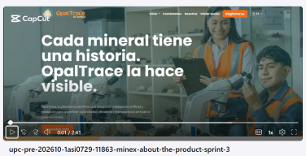

### Información del Video

| Atributo | Contenido |
|----------|-----------|
| **Duración** | 2:40 minutos |
| **Microsoft Stream** | https://upcedupe-my.sharepoint.com/:v:/g/personal/u202416107_upc_edu_pe/IQAv3p-OMTVPS5qYvRqD0xn7AQJjfRSCAxeCOPUFOMYAVho?e=wpmv29&nav=eyJyZWZlcnJhbEluZm8iOnsicmVmZXJyYWxBcHAiOiJTdHJlYW1XZWJBcHAiLCJyZWZlcnJhbFZpZXciOiJTaGFyZURpYWxvZy1MaW5rIiwicmVmZXJyYWxBcHBQbGF0Zm9ybSI6IldlYiIsInJlZmVycmFsTW9kZSI6InZpZXcifX0%3D |

### Resumen del Video

El video abre mostrando el problema: la falta de trazabilidad en la cadena minera peruana hace que los registros sean manuales, los datos se puedan alterar y nadie pueda responder con certeza de dónde viene el mineral ni si llegó completo.

A continuación se realiza un recorrido funcional por los módulos principales de OpalTrace: el registro digital del lote en el punto de extracción, la transferencia de custodia verificada mediante código QR en cada cambio de manos, el procesamiento en refinería con trazabilidad de cada etapa, la gestión de inventario en la joyería vinculada al mineral certificado, y la consulta del consumidor final que con un solo escaneo accede al recorrido completo del mineral desde la mina hasta la joya.

Luego se presentan los tres testimonios de usuarios reales validados, que refuerzan el impacto concreto de la plataforma en cada segmento: la eficiencia operativa para empresas mineras, la confianza verificable para joyerías y la decisión de compra informada para el consumidor.

El video cierra comunicando la propuesta de valor: trazabilidad end-to-end, cumplimiento normativo, certificación digital y planes flexibles Silver, Gold y Platinum, con una invitación directa a registrarse en la plataforma.

### Testimonios de Usuarios

El video incluye tres testimonios de usuarios reales que participaron en las entrevistas, proporcionando credibilidad y validación del impacto real del producto:

> *"Contar con información precisa sobre la ubicación del mineral y el tonelaje exacto en tiempo real es lo que más necesitamos. Los errores en esos datos afectan directamente el control del concentrado y la toma de decisiones en planta."*
> — **Max Alonso Yapo Figueroa**, Jefe de Metalurgia y Operaciones – Arequipa

> *"Siempre le explico al cliente el origen de las joyas, pero no tengo cómo demostrarlo. Una herramienta así me daría  la prueba que necesito para no perder esa venta."*
> — **Dante Javier Reyes**, Gerente de joyería – Santiago de Surco, Lima

> *"Me gustaría poder escanear algo y saber si esa joya viene de una fuente responsable. Con un QR yo misma podría verificarlo antes de comprar."*
> — **Carla Gallardo Morales**, Consumidora final – La Molina, Lima
